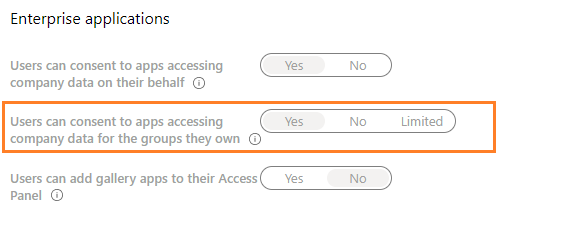

# Resource-specific consent (RSC) — Developer Preview

>[!NOTE]
>The resource-specific consent permissions are only available in the desktop client after Developer Preview has been enabled. See [How do I enable Developer Preview](../../resources/dev-preview/developer-preview-intro.md) for more information.

Resource-specific consent (RSC) is a Microsoft Teams and Graph API integration that enables your app to use API endpoints to manage specific teams within an organization. The resource-specific consent (RSC) permissions model enables *team owners* to grant consent for an application to access and/or modify a team's data. The granular, Teams-specific, RSC permissions define what an application can do within a specific team:

## Resource-specific permissions

|Application permission| Action |
| ----- | ----- |
|TeamSettings.Read.Group | Get the settings for this team.|
|TeamSettings.Edit.Group|Update the settings for this team.|
|ChannelSettings.Read.Group|Get the channel names, channel descriptions, and channel settings for this team​.|
|ChannelSettings.Edit.Group|Update the channel names, channel descriptions, and channel settings for this team.​|
|Channel.Create.Group|Create channels in this team.​|
|Channel.Delete.Group|Delete channels in this team.​|
|ChannelMessage.Read.Group |Get this team's channel messages.​|
|TeamsApp.Read.Group|Get a list of this team's installed apps.|
|TeamsTab.Read.Group|Get a list of this team's tabs.|
|TeamsTab.Create.Group|Create tabs in this team.​|
|TeamsTab.Edit.Group|Update this team's tabs.​|
|TeamsTab.Delete.Group|Delete this team's tabs.​|
|Member.Read.Group|Get this team's members.​|
|Owner.Read.Group|Get this team's owners.​|

>[!NOTE]
>Resource-specific permissions are only available to Teams apps installed on the Teams client and are currently not part of the Azure Active Directory portal.

## Enabling resource-specific consent in your application

The steps for enabling RSC in your application are as follows:

1. [Configure group owner consent settings in the Azure Active Directory portal](#configure-group-owner-consent-settings-in-the-azure-ad-portal).
1. [Register your app with Microsoft identity platform via the Azure AD portal](#register-your-app-with-microsoft-identity-platform-via-the-azure-ad-portal).
1. [Review your application permissions in the Azure AD portal](#review-your-application-permissions-in-the-azure-ad-portal)
1. [Obtain an access token from the Microsoft Identity platform](#obtain-an-access-token-from-the-microsoft-identity-platform).
1. [Update your Teams app manifest](#update-your-teams-app-manifest).
1. [Install your app directly in Teams](#install-your-app-directly-in-teams).
1. [Check your app for added RSC permissions](#check-your-app-for-added-rsc-permissions).

## Configure group owner consent settings in the Azure AD portal

You can enable or disable  [group owner consent](/azure/active-directory/manage-apps/configure-user-consent#configure-group-owner-consent-to-apps-accessing-group-data) directly within the Azure portal:

> [!div class="checklist"]
>
>- Sign in to the [Azure portal](https://portal.azure.com) as a [Global Administrator/Company Administrator](/azure/active-directory/users-groups-roles/directory-assign-admin-roles.md#global-administrator--company-administrator).  
 > - Select **Azure Active Directory** =>**Enterprise applications** =>**User settings**.
> - Enable, disable, or limit user consent with the control labeled **Users can consent to apps accessing company data for the groups they own** (This capability is enabled by default).



| Value | Description|
|--- | --- |
|Yes | Enable group-specific consent for all group owners.|
|No |Disable group-specific consent for all users.| 
|Limited | Enable group-specific consent for members of a selected group.|

To enable or disable group owner consent within the Azure portal using PowerShell, follow the steps outlined in [Configure group owner consent using PowerShell](/azure/active-directory/manage-apps/configure-user-consent#configure-group-owner-consent-using-powershell).

## Register your app with Microsoft identity platform via the Azure AD portal

The Azure Active Directory portal provides a central platform for you to register and configure your apps. Your app must be registered in the Azure AD portal to integrate with the Microsoft identity platform and call Graph APIs. *See* [Register an application with the Microsoft identity platform](/graph/auth-register-app-v2).

>[!WARNING]
>Do not register multiple Teams apps to the same Azure AD app id. The app id must be unique for each app. Attempts to install multiple apps to the same app id will fail.

## Review your application permissions in the Azure AD portal

Navigate to the **Home** => **App registrations** page and select your RSC app. Choose **API permissions** from the left nav bar and examine the list of configured permissions for your app. If your app will only make RSC Graph calls, delete all the permission on that page. If your app will also make non-RSC calls, keep those permissions as needed.

>[!IMPORTANT]
>The Azure AD portal cannot be used to request RSC permissions. RSC permissions are currently exclusive to Teams applications installed in the Teams client and are declared in the app manifest (JSON) file.

## Obtain an access token from the Microsoft identity platform

To make Graph API calls, you must obtain an access token for your app from the identity platform. Before your app can get a token from the Microsoft identity platform, it must be registered in the Azure AD portal. The access token contains information about your app and the permissions it has for the resources and APIs available through Microsoft Graph.

You'll need to have the following values from the Azure AD registration process to retrieve an access token from the identity platform:

- The **Application ID** assigned by the app registration portal. If your app supports single sign-on (SSO) you should use the same Application ID for your app and SSO.
- The  **Client secret/password** or a public/private key pair (**Certificate**). This is not required for native apps.
- A **Redirect URI** (or reply URL) for your app to receive responses from Azure AD.

 *See* [Get access on behalf of a user](/graph/auth-v2-user?view=graph-rest-1.0#3-get-a-token) and [Get access without a user](/graph/auth-v2-service)

## Update your Teams app manifest

The RSC permissions are declared in you app manifest (JSON) file.  Add a [webApplicationInfo](../../resources/schema/manifest-schema.md#webapplicationinfo) key to your app manifest with the following values:

> [!div class="checklist"]
>
> - **id**  — your Azure AD app id. *See* [Register your app in the Azure AD portal](resource-specific-consent.md#register-your-app-with-microsoft-identity-platform-via-the-azure-ad-portal).
> - **resource**  — any string. This field has no operation in RSC, but must be added and have a value to avoid an error response; any string will do.
> - **application permissions** — RSC permissions for  your app. *See* [Resource-specific Permissions](resource-specific-consent.md#resource-specific-permissions).

>
>[!IMPORTANT]
> Non-RSC permissions are stored in the Azure portal. Do not add them to the app manifest.
>

```json
"webApplicationInfo": {
    "id": "XXxxXXXXX-XxXX-xXXX-XXxx-XXXXXXXxxxXX",
    "resource": "https://RscBasedStoreApp",
    "applicationPermissions": [
      "TeamSettings.Read.Group",
      "ChannelMessage.Read.Group",
      "TeamSettings.Edit.Group",
      "ChannelSettings.Edit.Group",
      "Channel.Create.Group",
      "Channel.Delete.Group",
      "TeamsApp.Read.Group",
      "TeamsTab.Read.Group",
      "TeamsTab.Create.Group",
      "TeamsTab.Edit.Group",
      "TeamsTab.Delete.Group",
      "Member.Read.Group",
      "Owner.Read.Group"
    ]
  }
```

## Install your app directly in Teams

Once you've created your app you can [upload your app package](../../concepts/deploy-and-publish/apps-upload.md#upload-your-package-into-a-team-using-the-apps-tab) directly to a specific team.  To do so, the **Upload custom apps** policy setting must be enabled as part of the custom app setup policies. *See* [Custom app policy settings](/microsoftteams/teams-custom-app-policies-and-settings#custom-app-policy-and-settings).

## Check your app for added RSC permissions

>[!IMPORTANT]
>The RSC permissions are not attributed to a user. Calls are made with app permissions, not user delegated permissions. Thus, the app may be allowed to perform actions that the user cannot, such as creating a channel or deleting a tab. You should review the team owner's intent for your use case prior to making RSC API calls. *See* [Microsoft Teams API overview](/graph/teams-concept-overview).

Once the app has been installed to a team, you can use [Graph Explorer](https://developer.microsoft.com/graph/graph-explorer)  to view the permissions that have been granted to the app in a team:

> [!div class="checklist"]
>
>- Get the team's **groupId** from the Teams client.
> - In the Teams client, select **Teams** from the far left nav bar.
> - Select the team where the app is installed from the drop-down menu.
> - Select the **More options** icon (&#8943;).
> - Select **Get link to team**.
> - Copy and save the **groupId** value from the string.
> - Log into **Graph Explorer**.
> - Make a **GET** call to the following endpoint: `https://graph.microsoft.com/beta/groups/{teamGroupId}/permissionGrants`. The clientAppId field in the response will map to the appId specified in the Teams app manifest.

 

 > [!div class="nextstepaction"]
> [Test resource-specific consent permissions in Teams](test-resource-specific-consent.md)
