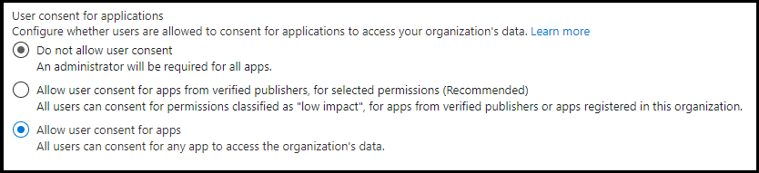

# Resource-specific consent (RSC)

Resource-specific consent (RSC) is a Microsoft Teams and Microsoft Graph API integration that enables your app to use API endpoints to manage specific resources—either teams or chats—within an organization. The resource-specific consent (RSC) permissions model enables *team owners* and *chat owners* to grant consent for an application to access and/or modify a team's data and a chat's data, respectively. The granular, Teams-specific, RSC permissions define what an application can do within a specific resource:

## Resource-specific permissions

|Application permission| Action |
| ----- | ----- |
|TeamSettings.Read.Group | Get this team's settings.|
|TeamSettings.ReadWrite.Group|Update this team's settings.|
|ChannelSettings.Read.Group|Get this team's channel names, channel descriptions, and channel settings​.|
|ChannelSettings.ReadWrite.Group|Update this team's channel names, channel descriptions, and channel settings.​|
|Channel.Create.Group|Create channels in this team.​|
|Channel.Delete.Group|Delete channels in this team.​|
|ChannelMessage.Read.Group |Get this team's channel messages.​|
|TeamsAppInstallation.Read.Group|Get a list of this team's installed apps.|
|TeamsTab.Read.Group|Get a list of this team's tabs.|
|TeamsTab.Create.Group|Create tabs in this team.​|
|TeamsTab.ReadWrite.Group|Update this team's tabs.​|
|TeamsTab.Delete.Group|Delete this team's tabs.​|
|TeamMember.Read.Group|Get this team's members.​|
| ChatSettings.Read.Chat         | Get this chat's settings.                                    |
| ChatSettings.ReadWrite.Chat    | Update this chat's settings.                          |
| ChatMessage.Read.Chat          | Get this chat's messages.                                    |
| ChatMember.Read.Chat           | Get this chat's members.                                     |
| Chat.Manage.Chat               | Manage this chat.                                             |
| TeamsTab.Read.Chat             | Get this chat's tabs.                                        |
| TeamsTab.Create.Chat           | Create tabs in this chat.                                     |
| TeamsTab.Delete.Chat           | Delete this chat's tabs.                                      |
| TeamsTab.ReadWrite.Chat        | Manage this chat's tabs.                                      |
| TeamsAppInstallation.Read.Chat | Get which apps are installed in this chat.                   |
| OnlineMeeting.ReadBasic.Chat   | Get basic properties—such as name, schedule, organizer, and join link—of a meeting associated with this chat. |

>[!NOTE]
>Resource-specific permissions are only available to Teams apps installed on the Teams client and are currently not part of the Azure Active Directory portal.

### See also
- [Teams resource-specific consent permissions](https://docs.microsoft.com/en-us/graph/permissions-reference#teams-resource-specific-consent-permissions)
- [Chat resource-specific consent permissions](https://docs.microsoft.com/en-us/graph/permissions-reference#chat-resource-specific-consent-permissions)

## Enable resource-specific consent in your application

The steps for enabling RSC in your application are as follows:

1. [Configure consent settings in the Azure Active Directory portal](#configure-consent-settings-in-the-azure-ad-portal).
    1. [Configure group owner consent settings for RSC in a team](#configure-group-owner-consent-settings-for-rsc-in-a-team).
    1. [Configure user consent settings for RSC in a chat](#configure-user-consent-settings-for-rsc-in-a-chat).
1. [Register your app with Microsoft identity platform via the Azure AD portal](#register-your-app-with-microsoft-identity-platform-via-the-azure-ad-portal).
1. [Review your application permissions in the Azure AD portal](#review-your-application-permissions-in-the-azure-ad-portal).
1. [Obtain an access token from the Microsoft Identity platform](#obtain-an-access-token-from-the-microsoft-identity-platform).
1. [Update your Teams app manifest](#update-your-teams-app-manifest).
1. [Install your app directly in Teams](#sideload-your-app-in-teams).
1. [Check your app for added RSC permissions](#check-your-app-for-added-rsc-permissions).
    1. [Check your app for added RSC permissions in a team](#check-your-app-for-added-rsc-permissions-in-a-team).
    1. [Check your app for added RSC permissions in a chat](#check-your-app-for-added-rsc-permissions-in-a-chat).

## Configure consent settings in the Azure AD portal

### Configure group owner consent settings for RSC in a team

You can enable or disable [group owner consent](/azure/active-directory/manage-apps/configure-user-consent-groups?tabs=azure-portal) directly within the Azure portal:

> [!div class="checklist"]
>
>- Sign in to the [Azure portal](https://portal.azure.com) as a [Global Administrator/Company Administrator](/azure/active-directory/roles/permissions-reference#global-administrator&preserve-view=true).  
 > - [Select](https://portal.azure.com/#blade/Microsoft_AAD_IAM/ConsentPoliciesMenuBlade/UserSettings) **Azure Active Directory** => **Enterprise applications** => **Consent and permissions** => **User consent settings**.
> - Enable, disable, or limit user consent with the control labeled **Group owner consent for apps accessing data** (The default is **Allow group owner consent for all group owners**). For a team owner to install an app using RSC, group owner consent must be enabled for that user.


To enable or disable group owner consent using PowerShell, follow the steps outlined in [Configure group owner consent using PowerShell](/azure/active-directory/manage-apps/configure-user-consent-groups?tabs=azure-powershell).

### Configure user consent settings for RSC in a chat

You can enable or disable [user consent](/azure/active-directory/manage-apps/configure-user-consent?tabs=azure-portal) directly within the Azure portal:

> [!div class="checklist"]
>
>- Sign in to the [Azure portal](https://portal.azure.com) as a [Global Administrator/Company Administrator](/azure/active-directory/roles/permissions-reference#global-administrator&preserve-view=true).  
 > - [Select](https://portal.azure.com/#blade/Microsoft_AAD_IAM/ConsentPoliciesMenuBlade/UserSettings) **Azure Active Directory** => **Enterprise applications** => **Consent and permissions** => **User consent settings**.
> - Enable, disable, or limit user consent with the control labeled **User consent for applications** (The default is **Allow user consent for apps**). For a chat member to install an app using RSC, user consent must be enabled for that user.



To enable or disable user consent using PowerShell, follow the steps outlined in [Configure user consent using PowerShell](/azure/active-directory/manage-apps/configure-user-consent?tabs=azure-powershell).


## Register your app with Microsoft identity platform via the Azure AD portal

The Azure Active Directory portal provides a central platform for you to register and configure your apps. Your app must be registered in the Azure AD portal to integrate with the Microsoft identity platform and call Microsoft Graph APIs. For more information, see [Register an application with the Microsoft identity platform](/graph/auth-register-app-v2).

>[!WARNING]
>Do not register multiple Teams apps to the same Azure AD app ID. The app ID must be unique for each app. Attempts to install multiple apps to the same app ID will fail.

## Review your application permissions in the Azure AD portal

Navigate to the **Home** => **App registrations** page and select your RSC app. Choose **API permissions** from the left nav bar and examine the list of configured permissions for your app. If your app will only make RSC Graph API calls, delete all the permission on that page. If your app will also make non-RSC calls, keep those permissions as needed.

>[!IMPORTANT]
>The Azure AD portal cannot be used to request RSC permissions. RSC permissions are currently exclusive to Teams applications installed in the Teams client and are declared in the app manifest (JSON) file.

## Obtain an access token from the Microsoft identity platform

To make Graph API calls, you must obtain an access token for your app from the identity platform. Before your app can get a token from the Microsoft identity platform, it must be registered in the Azure AD portal. The access token contains information about your app and the permissions it has for the resources and APIs available through Microsoft Graph.

You'll need to have the following values from the Azure AD registration process to retrieve an access token from the identity platform:

- The **Application ID** assigned by the app registration portal. If your app supports single sign-on (SSO) you should use the same Application ID for your app and SSO.
- The  **Client secret/password** or a public/private key pair (**Certificate**). This is not required for native apps.
- A **Redirect URI** (or reply URL) for your app to receive responses from Azure AD.

 *See* [Get access on behalf of a user](/graph/auth-v2-user?view=graph-rest-1.0#3-get-a-token&preserve-view=true) and [Get access without a user](/graph/auth-v2-service)

## Update your Teams app manifest

The RSC permissions are declared in your app manifest (JSON) file.  Add a [webApplicationInfo](../../resources/schema/manifest-schema.md#webapplicationinfo) key to your app manifest with the following values:

> [!div class="checklist"]
>
> - **id**  — your Azure AD app ID. For more information, see [Register your app in the Azure AD portal](resource-specific-consent.md#register-your-app-with-microsoft-identity-platform-via-the-azure-ad-portal).
> - **resource**  — any string. This field has no operation in RSC, but must be added and have a value to avoid an error response; any string will do.
> - **application permissions** — RSC permissions for  your app. For more information, see [Resource-specific Permissions](resource-specific-consent.md#resource-specific-permissions).

>
>[!IMPORTANT]
> Non-RSC permissions are stored in the Azure portal. Do not add them to the app manifest.
>

### Example for RSC in a team
```json
"webApplicationInfo": {
    "id": "XXxxXXXXX-XxXX-xXXX-XXxx-XXXXXXXxxxXX",
    "resource": "https://RscBasedStoreApp",
    "applicationPermissions": [
      "TeamSettings.Read.Group",
      "ChannelMessage.Read.Group",
      "TeamSettings.Edit.Group",
      "ChannelSettings.ReadWrite.Group",
      "Channel.Create.Group",
      "Channel.Delete.Group",
      "TeamsApp.Read.Group",
      "TeamsTab.Read.Group",
      "TeamsTab.Create.Group",
      "TeamsTab.ReadWrite.Group",
      "TeamsTab.Delete.Group",
      "Member.Read.Group",
      "Owner.Read.Group"
    ]
  }
```

### Example for RSC in a chat
```json
"webApplicationInfo": {
    "id": "XXxxXXXXX-XxXX-xXXX-XXxx-XXXXXXXxxxXX",
    "resource": "https://RscBasedStoreApp",
    "applicationPermissions": [
      "ChatSettings.Read.Chat",
      "ChatSettings.ReadWrite.Chat",
      "ChatMessage.Read.Chat",
      "ChatMember.Read.Chat",
      "Chat.Manage.Chat",
      "TeamsTab.Read.Chat",
      "TeamsTab.Create.Chat",
      "TeamsTab.Delete.Chat",
      "TeamsTab.ReadWrite.Chat",
      "TeamsAppInstallation.Read.Chat",
      "OnlineMeeting.ReadBasic.Chat"
    ]
  }
```

>[!NOTE]
>If the app is meant to support installation in both team and chat scopes, then both team and chat permissions can be specified in the same manifest under `applicationPermissions`.

## Sideload your app in Teams

If your Teams admin allows custom app uploads, you can [sideload your app](~/concepts/deploy-and-publish/apps-upload.md) directly to a specific team or chat.

## Check your app for added RSC permissions

>[!IMPORTANT]
>The RSC permissions are not attributed to a user. Calls are made with app permissions, not user delegated permissions. Thus, the app may be allowed to perform actions that the user cannot, such as deleting a tab. You should review the team owner's or chat owner's intent for your use case prior to making RSC API calls. For more information, see [Microsoft Teams API overview](/graph/teams-concept-overview).

Once the app has been installed to a resource, you can use [Graph Explorer](https://developer.microsoft.com/graph/graph-explorer)  to view the permissions that have been granted to the app in the resource:

### Check your app for added RSC permissions in a team

> [!div class="checklist"]
>
>- Get the team's **groupId** from the Teams client.
> - In the Teams client, select **Teams** from the far left nav bar.
> - Select the team where the app is installed from the drop-down menu.
> - Select the **More options** icon (&#8943;).
> - Select **Get link to team**.
> - Copy and save the **groupId** value from the string.
> - Log into **Graph Explorer**.
> - Make a **GET** call to the following endpoint: `https://graph.microsoft.com/beta/groups/{teamGroupId}/permissionGrants`. The `clientAppId` field in the response will map to the `webApplicationInfo.id` specified in the Teams app manifest.
  

#### See also
[Get the names and other details of apps installed in the specified team](https://docs.microsoft.com/en-us/graph/api/team-list-installedapps?view=graph-rest-1.0&tabs=http)

### Check your app for added RSC permissions in a chat

> [!div class="checklist"]
>
>- Get the chat thread ID from the Teams *web* client.
> - In the Teams web client, select **Chat** from the far left nav bar.
> - Select the chat where the app is installed from the drop-down menu.
> - Copy the web URL and save the chat thread ID from the string.

> - Log into **Graph Explorer**.
> - Make a **GET** call to the following endpoint: `https://graph.microsoft.com/beta/chats/{chatId}/permissionGrants`. The `clientAppId` field in the response will map to the `webApplicationInfo.id` specified in the Teams app manifest.

#### See also
[Get the names and other details of apps installed in the specified chat](https://docs.microsoft.com/en-us/graph/api/chat-list-installedapps?view=graph-rest-1.0&tabs=http#example-2-get-the-names-and-other-details-of-apps-installed-in-the-specified-chat)

## Code sample
| **Sample name** | **Description** | **.NET** |**Node.js** |
|-----------------|-----------------|----------------|----------------|
| Resource Specific Consent (RSC) | Use RSC to call Graph APIs. | [View](https://github.com/OfficeDev/Microsoft-Teams-Samples/tree/main/samples/graph-rsc/csharp)|[View](https://github.com/OfficeDev/Microsoft-Teams-Samples/tree/main/samples/graph-rsc/nodeJs)|


## See also
 
* [Test resource-specific consent permissions in Teams](test-resource-specific-consent.md)
* [Resource-specific consent in Microsoft Teams for admins](/MicrosoftTeams/resource-specific-consent)


