# UX guidelines for HTML widgets in Microsoft Teams

This guide provides UX guidance for partners building HTML widgets in Microsoft Teams. It covers principles and recommendations for creating focused, high-quality widget experiences that integrate naturally into the Teams chat conversation. The goal is not to enforce a single visual style, but to ensure that widgets feel intentional and work well in the Teams context.

## UX principles

Building a great widget for Teams means delivering a focused experience that surfaces the right information or action at the right time. HTML widgets should feel like a natural part of the Teams conversation — not an application embedded inside it.

:::row:::
  :::column:::
    :::image type="icon" source="images/icon-conversastion-bubble.png":::

    ### Complement the conversation

    - Widgets exist alongside agent-generated text in a chat thread and should always feel like a natural part of the conversation.
     - A widget may be display-only, interactive, or prompt the user for input.
     - Content should support the conversation, not feel like a separate or disconnected experience.
     - Design for the conversational context — a widget should provide value that is native to the moment, not simply replicate what already exists in your standalone application.
     
  :::column-end:::
  :::column:::

  
    :::image type="icon" source="images/icon-puzzle.png":::

    ### Surface capabilities, not full apps

   Avoid embedding your full application experience inside a widget. Instead, identify the single most valuable thing a user needs in this moment.

    - A widget should expose a focused, high-value capability — not your entire product.
    - Each widget should represent a single, focused interaction.

  :::column-end:::
:::row-end:::

:::row:::
  :::column:::
    :::image type="icon" source="images/icon-mouse.png":::

    ### Be transparent and predictable

     - Widget content should be clear and any interactions obvious.
     - Users should always understand what a widget is showing.
     - The expected outcome of any interaction should be obvious before the user acts.
    
  :::column-end:::

  
  :::column:::
    :::image type="icon" source="images/icon-arrow.png":::

    ### Scale to the task

    Match the visual footprint of your widget to what the user needs in the moment.
    
     - Widgets always appear inline in the chat.
     - Teams provides an expanded surface — a larger view that opens above the chat. If your widget contains rich content or a deeper workflow that would benefit from more space, add an expand icon to your widget's action area to enable this experience.

  
  :::column-end:::
:::row-end:::

:::row:::
  :::column:::
    :::image type="icon" source="images/icon-shield.png":::

    ### Preserve human control

    Trust matters, especially when widget actions affect data or trigger external workflows.
- Allow users to remain in control of their experience.
- Provide clear visibility into what the widget is doing and why.
- Confirm important or sensitive actions before they happen.
- Communicate the outcome transparently — what was created, changed, or sent.

    
  :::column-end:::
  :::column:::
  :::column-end:::
:::row-end:::

## Understanding the chat surface

HTML widgets render inline inside a Teams chat message. Understanding this context is essential before making design decisions.

When designing for Teams, follow these core principles:

- **Conversation-first:** The chat remains the primary interaction model. The widget supports it.
- **Progressive complexity:** Start lightweight. Move to the expanded surface only when needed.
- **Context preservation:** Users should not lose conversational context when interacting with a widget.
- **Clarity over duplication:** Widget content and agent body text should complement each other — not repeat the same information.

Keep in mind:

- The widget appears inside a chat thread, alongside the agent's text response and other messages
- Users are in a conversational mindset — they expect lightweight, focused interactions
- One or more widgets may appear in the same message, combined with optional body text in any order
- While your widget may also render in other host platforms, use this guidance to ensure it feels intentional and native in Teams.

> [!TIP]
> If your widget also renders in Microsoft 365 Copilot, refer to the [UX guidelines for MCP apps in declarative agents](https://learn.microsoft.com/en-us/microsoft-365/copilot/extensibility/plugin-mcp-apps-ui-guidelines) for Copilot-specific guidance.

## Widget anatomy

Many widgets follow a common pattern that helps users orient quickly — but not every widget needs all of these elements, and some widgets (such as maps, charts, or forms) may not follow this structure at all.

**Common elements**

| Element | Description | Notes |
|---|---|---|
| **Title** | Identifies the widget or what it represents | Gives users an immediate sense of what the widget is and what to expect, helping it stand out clearly within the conversation |
| **Body content** | The primary information, media, or interactive content | The core of most widgets — may be the only element present |
| **Actions** | Buttons, links, or other interactive elements that let the user take the next step | Optional. Interactive elements may appear throughout the widget, not only at the bottom — but when a widget includes a dedicated action area, it's typically placed at the bottom |

When a widget does follow this common pattern, content typically flows top to bottom:

1. Title (if applicable)
2. Primary content — key information, data, or media
3. Action area (if present) — placed at the bottom

## Widget requirements

The following requirements apply to all HTML widgets submitted to Teams. Widgets that don't meet these requirements may be rejected or require remediation before publishing.

### Theme support (light and dark mode)

Widgets must render correctly in both Teams light mode and dark mode.

- Test your widget in both themes before submission
- Use CSS variables or [Fluent 2](https://fluent2.microsoft.design/color) color tokens rather than hardcoded hex values so your widget adapts automatically to theme changes

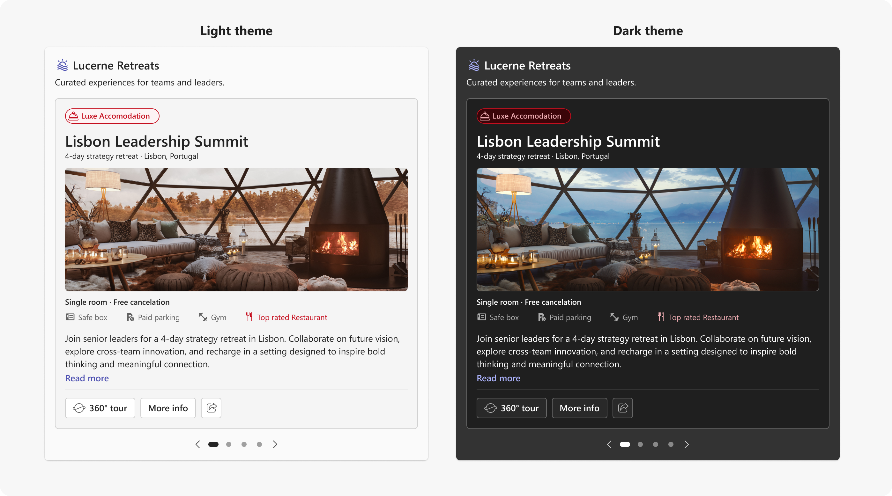

> [!NOTE]
> Theme adaptation is not required for content where color is meaningful and should not be altered, such as design documents, branded presentations, data visualizations, or media where color carries specific meaning. In these cases, render the content as-is.

### Responsive scaling

Widgets must adapt to the width of the chat container. Unlike Adaptive Cards, which support discrete size variants that partners can customize independently, HTML widgets use a single fluid layout that scales continuously across widths. Your design should hold up gracefully at any width rather than targeting specific sizes.

- Use flexible, fluid layouts rather than fixed pixel widths
- Avoid fixed pixel heights — allow the widget to grow vertically as content requires
- Test across a range of widths to ensure your layout holds up in common Teams contexts

The widths shown below represent the most common scenarios to test against: wide, standard desktop, mobile, and meeting chat or side-by-side view. These are not breakpoints or size slots — they are reference points for evaluating how your single fluid layout scales across the range of contexts where your widget may appear.

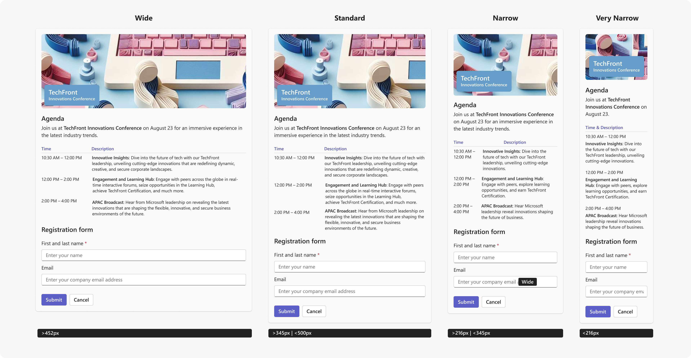

### Horizontal scrolling

Avoid horizontal scrolling for primary widget content. Layout should adapt to the narrow widths typical of chat containers.

> [!TIP]
> Horizontal scrolling may be used intentionally for specific content types such as wide data tables, media carousels, or timelines where horizontal navigation is a meaningful part of the experience. These cases should be intentional, not a result of fixed-width layouts.

 

### Feedback and confirmation

Widgets must communicate the outcome of user actions clearly.

- Confirm successful actions with a visible success state inside the widget
- Show a clear error state with a recovery option when an action fails
- Show a loading indicator when the widget is fetching or processing data internally
- Do not rely on the agent's body text alone to communicate widget state

> [!NOTE]
> Teams handles the widget-level loading and error states. The requirements above apply to state handling within your widget content.

 

## Minimum UX bar for submission

Widgets must meet all of the following requirements to be accepted by the Teams Store.

| Requirement |
|:---|
| ✅ Renders correctly in both Teams light mode and dark mode (exceptions apply for content where color is meaningful) |
| ✅ Scales responsively to the chat container width without horizontal scrolling (exceptions apply for intentional horizontal scroll patterns) |
| ✅ Provides visible feedback for loading, success, and error states within the widget |
| ✅ Delivers a focused, single-purpose experience |
| ✅ Limits primary actions to two buttons — additional actions placed in overflow |
| ✅ Content and body text complement each other without duplication |
| ✅ No placeholder, test, or broken content is visible |

> [!WARNING]
> Widgets that don't meet these requirements may be rejected or require remediation before they can be published.

 

## Strongly recommended

The following guidance is strongly recommended to help your widget feel at home in Teams. Partners may deviate for legitimate brand or design reasons, but should do so intentionally.

### Visual design

#### Colors and theming

Use [Fluent 2](https://fluent2.microsoft.design/color) color tokens for backgrounds, borders, and text. This ensures your widget responds correctly to Teams themes without additional work.

- Use your brand color sparingly — as an accent for primary actions and key elements, not as a dominant background color
- Never rely on color alone to convey meaning — always pair color with a label, icon, or other indicator

##### Container colors

Use container color tokens to establish hierarchy and communicate status within your widget. Start with Default for your outer card surface, then nest containers inside it to group related content or surface status meaning.

<table>
<tr>
<th>Style</th>
<th></th>
<th>Token</th>
<th>Use for</th>
</tr>
<tr>
<td>Default</td>
<td></td>
<td><code>colorNeutralCardBackground</code> <code>colorNeutralStroke2</code></td>
<td><strong>Outer card surface</strong> — apply this token to your widget's base container to match the Teams-native card background</td>
</tr>
<tr>
<td>Emphasis</td>
<td></td>
<td><code>colorNeutralBackground3</code> <code>colorNeutralStroke1</code></td>
<td>Grouped or secondary content areas — the most common inner container</td>
</tr>
<tr>
<td>Accent</td>
<td></td>
<td><code>colorBrandBackground2</code> <code>colorBrandStroke2</code></td>
<td>Brand-accented highlights and callouts</td>
</tr>
<tr>
<td>Good</td>
<td></td>
<td><code>colorPaletteLightGreenBackground1</code> <code>colorStatusSuccessBorder1</code></td>
<td>Confirmations and successful outcomes</td>
</tr>
<tr>
<td>Warning</td>
<td></td>
<td><code>colorPaletteMarigoldBackground1</code> <code>colorPaletteMarigoldBorder1</code></td>
<td>Cautions and time-sensitive alerts</td>
</tr>
<tr>
<td>Attention</td>
<td></td>
<td><code>colorStatusDangerBackground1</code> <code>colorStatusDangerBorder1</code></td>
<td>Errors, failures, and critical alerts</td>
</tr>
</table>

 

Unlike Adaptive Cards, HTML widgets don't automatically inherit a card background. Apply `colorNeutralCardBackground` to your outer container to match the Teams-native card surface. Inside it, use Emphasis containers to group or separate content, and Good, Warning, or Attention containers when specific content areas carry status meaning.

 

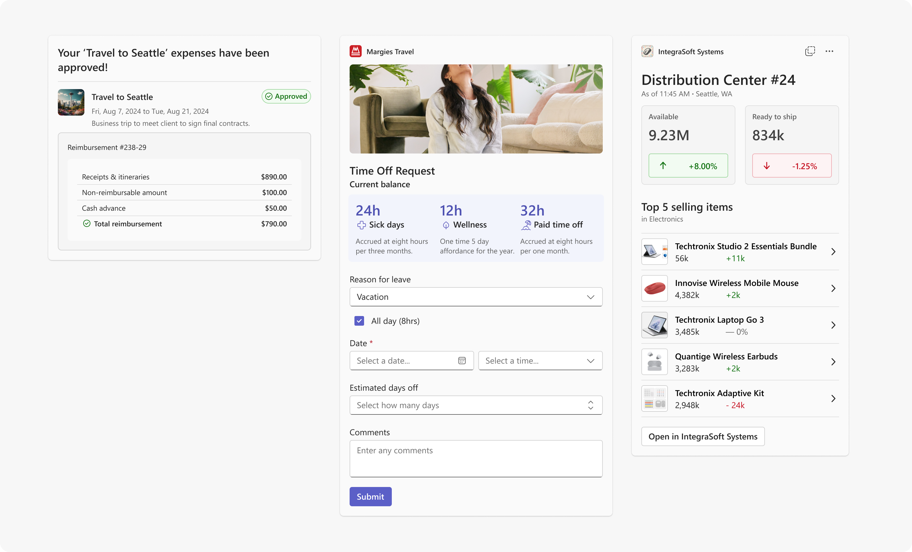

##### Text colors

Use text color tokens to create hierarchy and communicate meaning in widget content. Pair status text colors with a matching container or icon — never rely on color alone.

<table>
<tr>
<th>Style</th>
<th></th>
<th>Token</th>
<th>Use for</th>
</tr>
  
<tr>
<td>Default</td>
<td></td>
<td><code>colorNeutralForeground1</code></td>
<td><strong>Primary text</strong> — titles, key values</td>
</tr>
  
<tr>
<td>Subtle</td>
<td></td>
<td><code>colorNeutralForeground3</code></td>
<td>Secondary text — supporting details, metadata</td>
</tr>

<tr>
<td>Accent</td>
<td></td>
<td><code>colorBrandForeground2</code></td>
<td>Teams brand-accented text and inline links</td>
</tr>

<tr>
  <td>Good</td>
<td></td>
<td><code>colorStatusSuccessForeground1</code></td>
<td>Success labels and status indicators</td>
</tr>

<tr>
<td>Warning</td>
<td></td>
<td><code>colorPaletteMarigoldForeground2</code></td>
<td>Warning labels and status indicators</td>
</tr>

<tr>
<td>Attention</td>
<td></td>
<td><code>colorStatusDangerForeground3</code></td>
<td>Error labels and status indicators</td>
</tr>

</table>

 

> [!NOTE]
> **Overlay text** tokens are static colors for text rendered on top of images or background media. Unlike other text tokens, these do not adapt to theme changes — choose dark or light based on the luminosity of the underlying image.

<table>
<tr>
<th>Style</th>
<th></th>
<th>Token</th>
<th>Use for</th>
</tr>
<tr>
<td>Overlay dark</td>
<td></td>
<td><code>colorNeutralForeground1Static</code></td>
<td>Text on light or mid-tone images</td>
</tr>
<tr>
<td>Overlay light</td>
<td></td>
<td><code>colorNeutralForegroundStaticInverted</code></td>
<td>Text on dark images</td>
</tr>
</table>

 
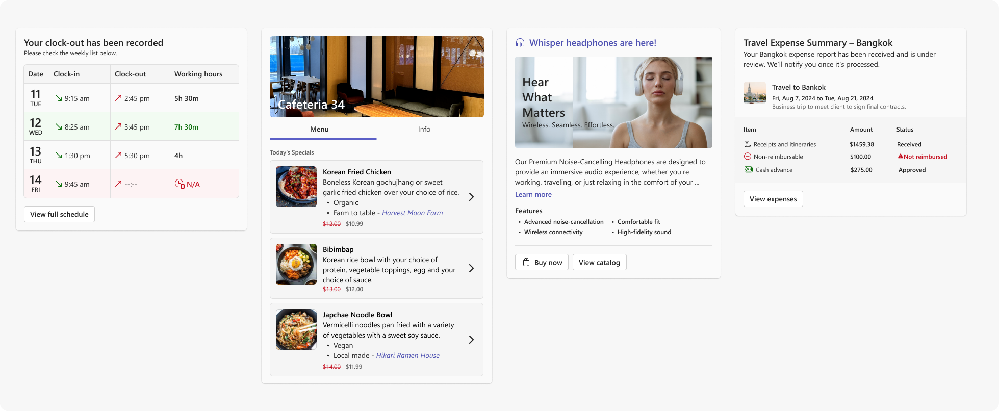

#### Typography

Use the following base text styles to create clear visual hierarchy in your widget. These styles align with the Teams design system and cover the most common text roles in a widget.

| Style | Fluent token | Size / Weight | Use for |
|---|---|---|---|
| **Header** | — * | 18px / 600 | Widget or card title |
| **Label** | `Body1Strong` | 14px / 600 | Section headers, status labels |
| **Body** | `Body1` | 14px / 400 | Primary content, descriptions |
| **Caption Label** | `Caption1Strong` | 12px / 600 | Small labels, field values |
| **Caption** | `Caption1` | 12px / 400 | Supporting details, timestamps |
| **Caption Subtle Label** | `Caption1Strong` + `ColorNeutralForeground3` | 12px / 600 | Subtle section labels, metadata keys |
| **Caption Subtle** | `Caption1` + `ColorNeutralForeground3` | 12px / 400 | De-emphasized text, secondary metadata |

\* _Header is a custom size not included in the Fluent UI React v9 type ramp. Use 18px / 600 directly._

- Use a maximum of three distinct text sizes in a single widget to maintain visual hierarchy
- Allow text blocks to wrap by default — avoid truncating body content unless space is genuinely constrained

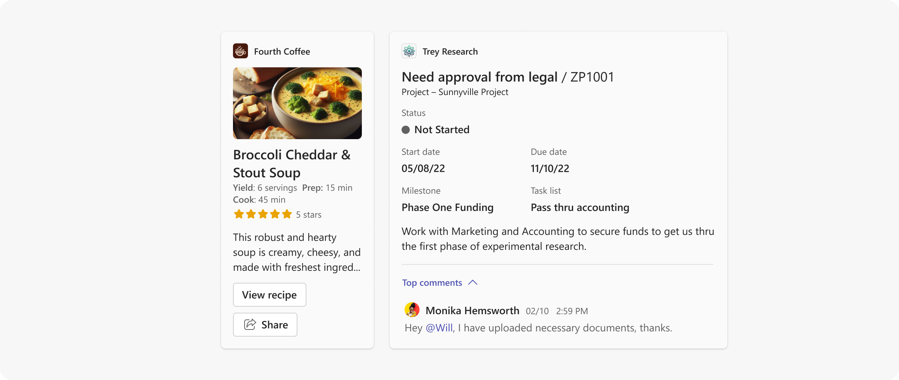

> [!TIP]
> If you are building with React, use [Fluent UI React v9 typography tokens](https://react.fluentui.dev/?path=/docs/theme-typography--docs) rather than hardcoded pixel values. Tokens adapt automatically to theme changes and stay in sync with the Fluent design system.

 [Typography](https://fluent2.microsoft.design/typography)

 

#### Containers and borders

Use containers to group related content and create visual hierarchy within your widget.

- Apply border radius values consistent with [Fluent 2 shapes](https://fluent2.microsoft.design/shapes#corner-radius) to keep containers feeling native to Teams
- Add a border when you need extra separation or emphasis between content areas — use the border token paired with your container color
- Use full-width (edge-to-edge) backgrounds sparingly — they work well for hero images or strong section dividers
- Avoid deep nesting — limit container nesting to a maximum of two levels

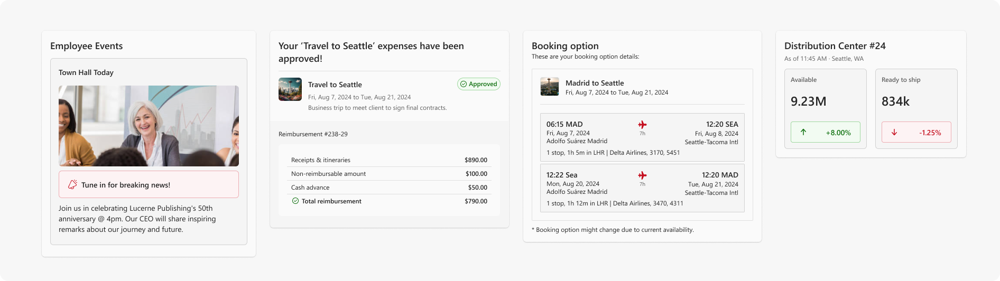

 [Shapes and corner radius](https://fluent2.microsoft.design/shapes#corner-radius)

 

#### Spacing

The recommended global padding for a widget is 16px (`spacingHorizontalL` / `spacingVerticalL`) on all sides.

The following are commonly used spacing values for widget layouts. These map to Fluent UI React v9 spacing tokens — swap `Vertical` for `Horizontal` for horizontal spacing equivalents.

| Name | Token | Size | Common use |
|---|---|---|---|
| Extra Small | `spacingVerticalXS` | 4px | Between an icon and its label, inside a badge |
| Small | `spacingVerticalS` | 8px | Between buttons or tightly grouped elements |
| Medium | `spacingVerticalM` | 12px | Vertical rhythm between text blocks and inputs |
| Large | `spacingVerticalL` | 16px | Standard internal padding for cards and containers |
| Extra Large | `spacingVerticalXL` | 20px | Separation between distinct content sections |
| Extra Extra Large | `spacingVerticalXXL` | 24px | Global card padding, generous breathing room |

The following examples show how spacing tokens apply in real widget layouts.

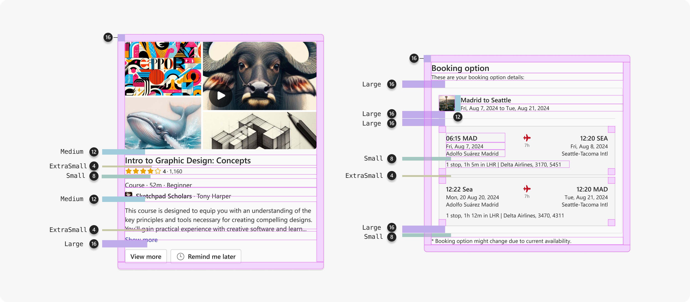

For the full spacing scale, see  [Fluent 2 > Spacing](https://fluent2.microsoft.design/layout).

#### Iconography

Use [Fluent 2 icons](https://fluent2.microsoft.design/iconography) rather than custom or third-party icon sets where possible. Fluent icons are recognized by Teams users and scale correctly at standard sizes.

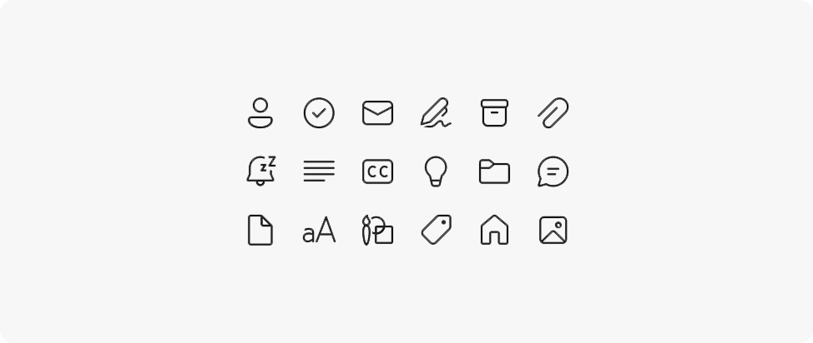

 [Iconography](https://fluent2.microsoft.design/iconography)

### Actions

Actions allow users to take the next step without leaving the conversation.

- **Limit to two primary actions** — use a primary button for the most important action and a secondary button for an alternative
- **Use overflow for additional actions** — place additional actions in an overflow menu (`•••`) rather than adding more buttons
- **Label actions clearly** — Use outcome-oriented labels such as "Reserve now" or "Approve" rather than vague labels like "OK"
- **Disable, don't hide** — if an action is not available in the current state, disable the control rather than hiding it

> [!TIP]
> If you are building with React, [Fluent 2 button components](https://fluent2.microsoft.design/components/web/react/core/button/usage) implement the correct Teams-aligned button styles and states out of the box.

 [Button](https://fluent2.microsoft.design/components/web/react/core/button/usage)

### Content and layout

- **Be concise:** A widget should be glanceable. Users should understand the key information without scrolling within the widget
- **Show summaries, not systems:** Surface the most relevant data for the current context rather than full data tables, dashboards, or navigation trees
- **Avoid internal scrolling:** If content requires scrolling, consider whether it belongs in the expanded surface instead
- **Avoid deep navigation:** Tabs, drill-down menus, and multi-level navigation are not appropriate for the inline widget
- **Don't duplicate content:** Widget content and agent body text should complement each other — do not repeat the same information in both

  

### Progressive disclosure

Not all information needs to be visible at once. Use progressive disclosure to keep widgets concise while allowing users to access more detail when needed.

- Use show/hide toggles to reveal secondary or supporting information inline — such as expanding a summary row to show full details, or revealing additional fields on demand
- Use scrolling within a defined container for longer content lists — ensure the container has a clear label and is keyboard accessible
- Transition to the expanded surface for content that requires significant vertical space or multi-step interaction

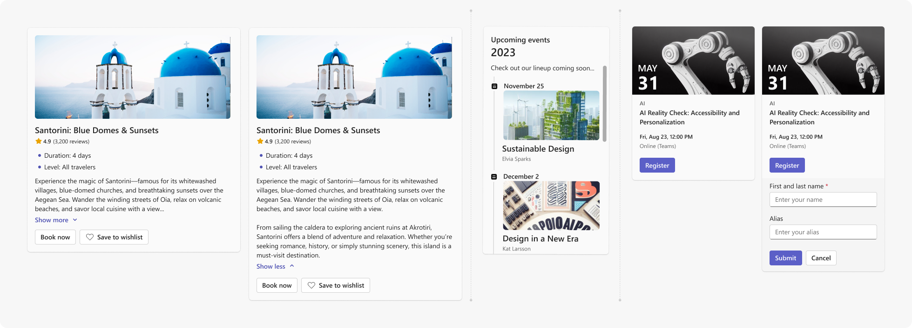

### Input gathering

If your widget includes a form or input fields:

- Label all fields clearly — use visible labels, not placeholder text alone
- Indicate required fields
- Validate input inline and surface error messages adjacent to the relevant field
- Keep forms short — if a form requires more than four or five fields, consider moving it to the expanded surface

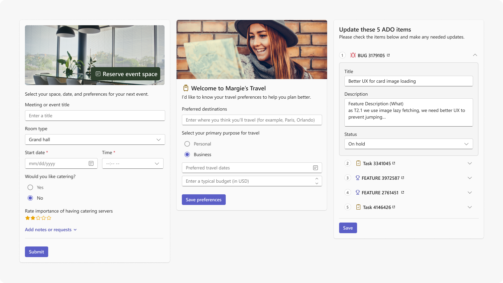

## Expanded surface

The expanded surface opens as a modal above the chat when the user taps an expand button. Use it for content or workflows that require more space than the inline widget can reasonably provide.

### When to use the expanded surface

- Multi-step forms or configuration flows
- Rich media that benefits from a larger canvas
- Detailed data tables or comparison views
- Iterative workflows with persistent state

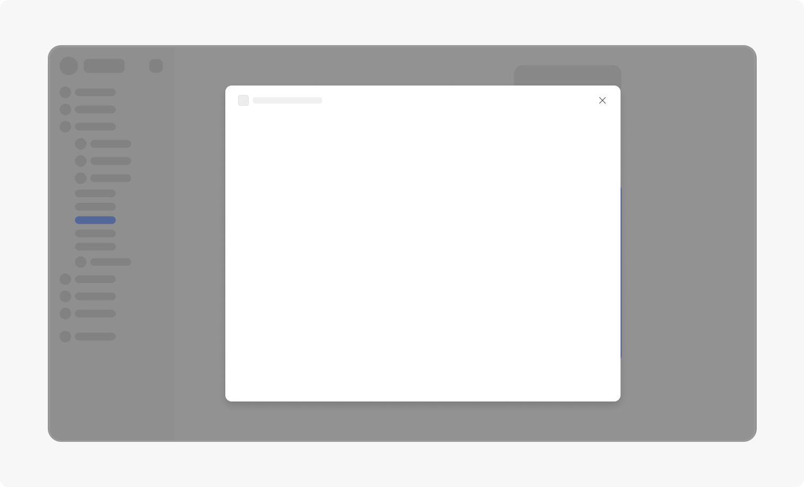

### Interaction guidelines

- **Use expansion intentionally** — not every widget needs an expanded view. Reserve it for content that genuinely benefits from more space
- **Don't replicate your full application** — the expanded surface is a focused workspace for a specific task, not a product shell. Avoid global navigation, settings panels, or unrelated features
- **Scope to one task** — the expanded surface should support a single coherent workflow
- **Preserve context** — the chat remains visible when the expanded surface is open. Design the expanded content to work alongside the conversation

## Best practices

:::row:::
  :::column:::
    ### ✅ Do
    - Keep widgets lightweight and action-oriented
    - Support up to two primary actions
    - Use the expanded surface for deep navigation or multi-step workflows
    - Use [Fluent 2](https://fluent2.microsoft.design/) components, spacing, typography, and tokens
    - Show loading indicators, success confirmations, and error states with recovery options
    - Allow text to wrap by default
    - Use outcome-oriented action labels such as "Reserve now" or "Approve request"
  :::column-end:::
  :::column:::
    ### ❌ Don't
    - Don't embed a full application experience inside a widget
    - Don't recreate Teams chat capabilities such as prompt input or retry controls
    - Don't hardcode colors — use Fluent 2 tokens or CSS variables
    - Don't make widgets taller than the viewport
    - Don't repeat the same information in both the widget and the agent's body text
    - Avoid vague action labels like "OK" or "Click here" — use outcome-oriented labels where possible
  :::column-end:::
:::row-end:::

## Nice to have

The following items are optional but contribute to a higher-quality widget experience.

- **Use Fluent 2 components**: [Fluent 2](https://fluent2.microsoft.design/) components implement Teams-aligned visual patterns and interactions out of the box. If building with React, [Fluent UI React v9](https://react.fluentui.dev/) is the recommended implementation.
- **Support layout patterns**: Consider established layout patterns — hero (image at top, content below), article (text-heavy, hierarchical), form (input-focused), or list (repeating items) — and choose the pattern that fits your content type.
- **Charts and data visualization**: Ensure axis labels and data points are clearly readable at widget width. Consider transitioning to the expanded surface for complex charts.
- **Media elements**: For inline video or rich media, provide a clear play control and a static thumbnail. Autoplay is not recommended.
- **Illustrations**: Use illustrations sparingly and purposefully. Avoid decorative illustrations that add height without adding value.

## Related content

- [HTML widgets overview for Microsoft Teams](#)
- [Accessibility guidelines for HTML widgets in Microsoft Teams](#)
- [Teams store validation guidelines](#)
- [Fluent 2 design system](https://fluent2.microsoft.design/)
- [Fluent UI React v9](https://react.fluentui.dev/)
- [Fluent 2 color tokens](https://fluent2.microsoft.design/color)
- [Fluent 2 typography](https://fluent2.microsoft.design/typography)
- [Fluent 2 iconography](https://fluent2.microsoft.design/iconography)
