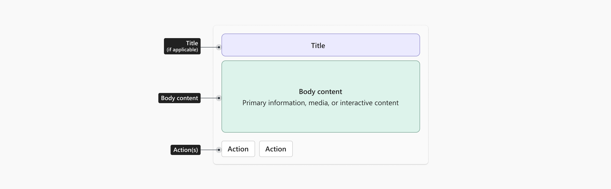

# UX guidelines for HTML widgets in Microsoft Teams

This guide provides UX guidance for partners building HTML widgets in Microsoft Teams. It covers principles and recommendations for creating focused, high-quality widget experiences that integrate naturally into the Teams chat conversation. The goal is not to enforce a single visual style, but to ensure that widgets feel intentional and work well in the Teams context.

## UX principles

Building a great widget for Teams means delivering a focused experience that surfaces the right information or action at the right time. HTML widgets should feel like a natural part of the Teams conversation — not an application embedded inside it.

<table>

  <tr>
<td width="50%" valign="top">

  
### Complement the conversation
  
- Widgets exist alongside agent-generated text in a chat thread and should always feel like a natural part of the conversation.
- A widget may be display-only, interactive, or prompt the user for input.
- Content should support the conversation, not feel like a separate or disconnected experience.
</td>

    
<td width="50%" valign="top">

  
### Surface capabilities, not full apps
  
Avoid embedding your full application experience inside a widget. Instead, identify the single most valuable thing a user needs in this moment.
- A widget should expose a focused, high-value capability — not your entire product.
- Each widget should represent a single, focused interaction.
</td>
</tr>

<tr>
<td width="50%" valign="top">

  
### Be transparent and predictable

- Widget content should be clear and any interactions obvious.
- Users should always understand what a widget is showing.
- The expected outcome of any interaction should be obvious before the user acts.
</td>

<td width="50%" valign="top">

  
### Scale to the task

Match the visual footprint of your widget to what the user needs in the moment.
- Widgets always appear inline in the chat.
- If your widget contains rich content or a deeper workflow that would benefit from more space, consider building in an expand function to open the widget in a larger view.
</td>
</tr>

<tr>
<td width="50%" valign="top">

  
### Preserve human control

Trust matters, especially when widget actions affect data or trigger external workflows.
- Allow users to remain in control of their experience.
- Make it clear what the widget is doing.
- Confirm important actions before they happen.
- Always communicate the expected outcome.
</td>
<td width="50%" valign="top">
</td>
</tr>
</table>

## Understanding the chat surface

HTML widgets render inline inside a Teams chat message. Understanding this context is essential before making design decisions.

When designing for Teams, follow these core principles:

- **Conversation-first:** The chat remains the primary interaction model. The widget supports it.
- **Progressive complexity:** Start lightweight. Move to the expanded surface only when needed.
- **Context preservation:** Users should not lose conversational context when interacting with a widget.
- **Clarity over duplication:** Widget content and agent body text should complement each other — not repeat the same information.

Keep in mind:

- The widget appears inside a chat thread, alongside the agent's text response and other messages
- Users are in a conversational mindset — they expect lightweight, focused interactions
- One or more widgets may appear in the same message, combined with optional body text in any order
- The same widget may render across multiple platforms — Teams, ChatGPT, Claude, and others

## Widget anatomy

A well-structured widget follows a predictable layout that helps users orient quickly.

| Element | Description | Required |
|---|---|---|
| **Title** | Identifies the widget or what it represents| Gives users an immediate sense of what the widget is and what to expect, helping it stand out clearly within the conversation. |
| **Body content** | The primary information, media, or interactive content| The core of most widgets — may be the only element present |
| **Actions** | Buttons, links, or other interactive elements that let the user take the next step | Optional. Interactive elements may appear throughout the widget, not only at the bottom — but when a widget includes a dedicated action area, it's typically placed at the bottom

When a widget does follow this common pattern, content typically flows top to bottom:

Title (if applicable)
Primary content — key information, data, or media
Secondary content — supporting details, metadata
Action area (if present) — placed at the bottom

## Required

The following requirements apply to all HTML widgets submitted to Teams. Widgets that don't meet these requirements may be rejected or require remediation before publishing.

### Theme support (light and dark mode)

Widgets must render correctly in both Teams light mode and dark mode.

- Test your widget in both themes before submission
- Use CSS variables or [Fluent 2](https://fluent2.microsoft.design/color) color tokens rather than hardcoded hex values so your widget adapts automatically to theme changes

> [!NOTE]
> Theme adaptation is not required for content where color is meaningful and should not be altered, such as design documents, branded presentations, data visualizations, or media where color carries specific meaning. In these cases, render the content as-is.

### Responsive scaling

Widgets must adapt to the width of the chat container. See [Responsive layout](https://fluent2.microsoft.design/color) in the Adaptive Cards documentation for guidance on building flexible layouts.

- Use flexible, fluid layouts rather than fixed pixel widths
- Avoid fixed pixel heights — allow the widget to grow vertically as content requires
- Test at multiple viewport widths representative of Teams chat on desktop and mobile

### Horizontal scrolling

Avoid horizontal scrolling for primary widget content. Layout should adapt to the narrow widths typical of chat containers.

> [!NOTE]
> Horizontal scrolling may be used intentionally for specific content types such as wide data tables, media carousels, or timelines where horizontal navigation is a meaningful part of the experience. These cases should be intentional, not a result of fixed-width layouts.

### Feedback and confirmation

Widgets must communicate the outcome of user actions clearly.

- Confirm successful actions with a visible success state inside the widget
- Show a clear error state with a recovery option when an action fails
- Show a loading indicator when the widget is fetching or processing data internally
- Do not rely on the agent's body text alone to communicate widget state

> [!NOTE]
> Teams handles the widget-level loading and error states. The requirements above apply to state handling within your widget content.

## Strongly recommended

The following guidance is strongly recommended to help your widget feel at home in Teams. Partners may deviate for legitimate brand or design reasons, but should do so intentionally.

### Visual design

#### Colors and theming

Use [Fluent 2](https://fluent2.microsoft.design/color) color tokens for backgrounds, borders, and text. This ensures your widget responds correctly to Teams themes without additional work.

- Use your brand color sparingly — as an accent for primary actions and key elements, not as a dominant background color
- Never rely on color alone to convey meaning — always pair color with a label, icon, or other indicator

[Fluent 2 > Color](https://fluent2.microsoft.design/color)

#### Typography

Map your widget's text styles to the following recommended values, which align with Teams Adaptive Card host configuration styles.

| Style | Size | Weight | Use for |
|---|---|---|---|
| Title | 16px | Semibold | Widget or entity title |
| Subtitle | 14px | Semibold | Section headers, secondary titles |
| Body | 14px | Regular | Primary content and descriptions |
| Caption / metadata | 12px | Regular | Supporting details, timestamps, labels |

- Use a maximum of three distinct text sizes in a single widget to maintain visual hierarchy
- Allow text blocks to wrap by default — avoid truncating body content unless space is genuinely constrained

[Fluent 2 > Typography](https://fluent2.microsoft.design/typography)

#### Containers and borders

- Use subtle background fills to group related content
- Use border radius values consistent with [Fluent 2 shapes](https://fluent2.microsoft.design/shapes#corner-radius) for containers and images
- Avoid deep nesting — limit container and column nesting to a maximum of two levels

[Fluent 2 > Shapes](https://fluent2.microsoft.design/shapes#corner-radius)

#### Spacing

- Use 16px internal padding on all sides as a baseline for widget content
- Use 8px spacing between related elements and 16px between distinct content sections
- Give content room to breathe — overcrowded widgets feel lower quality and are harder to scan

#### Iconography

Use [Fluent 2 icons](https://fluent2.microsoft.design/iconography) rather than custom or third-party icon sets where possible. Fluent icons are recognized by Teams users and scale correctly at standard sizes.

[Fluent 2 > Iconography](https://fluent2.microsoft.design/iconography)

### Actions

Actions allow users to take the next step without leaving the conversation.

- **Limit to two primary actions** — use a primary button for the most important action and a secondary button for an alternative
- **Use overflow for additional actions** — place additional actions in an overflow menu (`•••`) rather than adding more buttons
- **Label actions clearly** — use outcome-oriented labels such as "Reserve now" rather than "Submit" or "OK"
- **Disable, don't hide** — if an action is not available in the current state, disable the control rather than hiding it

> [!TIP]
> If you are building with React, [Fluent 2 button components](https://fluent2.microsoft.design/components/web/react/core/button/usage) implement the correct Teams-aligned button styles and states out of the box.

[Fluent 2 > Button](https://fluent2.microsoft.design/components/web/react/core/button/usage)

### Content and layout

- **Be concise:** A widget should be glanceable. Users should understand the key information without scrolling within the widget
- **Show summaries, not systems:** Surface the most relevant data for the current context rather than full data tables, dashboards, or navigation trees
- **Avoid internal scrolling:** If content requires scrolling, consider whether it belongs in the expanded surface instead
- **Avoid deep navigation:** Tabs, drill-down menus, and multi-level navigation are not appropriate for the inline widget
- **Don't duplicate content:** Widget content and agent body text should complement each other — do not repeat the same information in both

### Progressive disclosure

Not all information needs to be visible at once. Use progressive disclosure to keep widgets concise while allowing users to access more detail when needed.

- Use show/hide toggles for secondary or supporting information
- Use scrolling within a defined container for longer content lists — ensure the container has a clear label and is keyboard accessible
- Transition to the expanded surface for content that requires significant vertical space or multi-step interaction

### Input gathering

If your widget includes a form or input fields:

- Label all fields clearly — use visible labels, not placeholder text alone
- Indicate required fields
- Validate input inline and surface error messages adjacent to the relevant field
- Keep forms short — if a form requires more than four or five fields, consider moving it to the expanded surface

## Expanded surface

The expanded surface opens as a modal above the chat when the user taps an expand button. Use it for content or workflows that require more space than the inline widget can reasonably provide.

### When to use the expanded surface

- Multi-step forms or configuration flows
- Rich media that benefits from a larger canvas
- Detailed data tables or comparison views
- Iterative workflows with persistent state

### Interaction guidelines

- **Use expansion intentionally** — not every widget needs an expanded view. Reserve it for content that genuinely benefits from more space
- **Don't replicate your full application** — the expanded surface is a focused workspace for a specific task, not a product shell. Avoid global navigation, settings panels, or unrelated features
- **Scope to one task** — the expanded surface should support a single coherent workflow
- **Preserve context** — the chat remains visible when the expanded surface is open. Design the expanded content to work alongside the conversation

## Best practices

<table>
<tr>
<th align="left">✅ Do</th>
<th align="left">❌ Don't</th>
</tr>
<tr>
<td>
- Keep widgets lightweight and action-oriented
- Support up to two primary actions
- Use the expanded surface for deep navigation or multi-step workflows
- Use [Fluent 2](https://fluent2.microsoft.design/) components, spacing, typography, and tokens
- Show loading indicators, success confirmations, and error states with recovery options
- Allow text to wrap by default
- Use outcome-oriented action labels such as "Reserve now" or "Approve request"
</td>
<td>
- Don't embed a full application experience inside a widget
- Don't recreate Teams chat capabilities such as prompt input or retry controls
- Don't use multiple tabs or nested navigation — use separate messages or the expanded surface instead
- Don't hardcode colors — use Fluent 2 tokens or CSS variables
- Don't make widgets taller than the viewport
- Don't repeat the same information in both the widget and the agent's body text
- Don't use generic action labels like "Submit" or "OK"
</td>
</tr>
</table>

## Nice to have

The following items are optional but contribute to a higher-quality widget experience.

- **Use Fluent 2 components**: [Fluent 2](https://fluent2.microsoft.design/) components implement Teams-aligned visual patterns and interactions out of the box. If building with React, [Fluent UI React v9](https://react.fluentui.dev/) is the recommended implementation.
- **Support layout patterns**: Consider established layout patterns — hero (image at top, content below), article (text-heavy, hierarchical), form (input-focused), or list (repeating items) — and choose the pattern that fits your content type.
- **Charts and data visualization**: Ensure axis labels and data points are clearly readable at widget width. Consider transitioning to the expanded surface for complex charts.
- **Media elements**: For inline video or rich media, provide a clear play control and a static thumbnail. Autoplay is not recommended.
- **Illustrations**: Use illustrations sparingly and purposefully. Avoid decorative illustrations that add height without adding value.

## Minimum UX bar for submission

Widgets must meet all of the following requirements to be accepted.

| Requirement |
|:---|
| ✅ Renders correctly in both Teams light mode and dark mode (exceptions apply for content where color is meaningful) |
| ✅ Scales responsively to the chat container width without horizontal scrolling (exceptions apply for intentional horizontal scroll patterns) |
| ✅ Provides visible feedback for loading, success, and error states within the widget |
| ✅ Does not embed a full application experience or replicate Teams chat capabilities |
| ✅ Limits primary actions to two buttons — additional actions placed in overflow |
| ✅ Content and body text complement each other without duplication |
| ✅ No placeholder, test, or broken content is visible |

> [!WARNING]
> Widgets that don't meet these requirements may be rejected or require remediation before they can be published.

## Related content

- [HTML widgets overview for Microsoft Teams](#)
- [Accessibility guidelines for HTML widgets in Microsoft Teams](#)
- [Teams store validation guidelines](#)
- [Fluent 2 design system](https://fluent2.microsoft.design/)
- [Fluent UI React v9](https://react.fluentui.dev/)
- [Fluent 2 color tokens](https://fluent2.microsoft.design/color)
- [Fluent 2 typography](https://fluent2.microsoft.design/typography)
- [Fluent 2 iconography](https://fluent2.microsoft.design/iconography)
