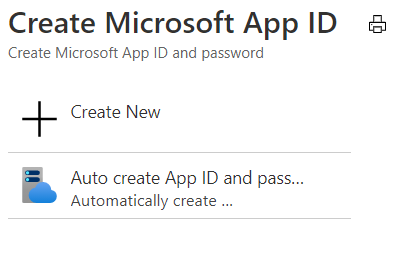
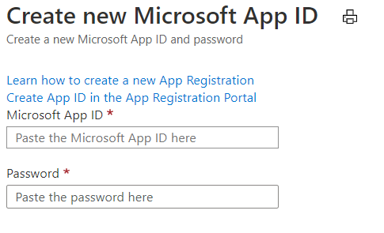
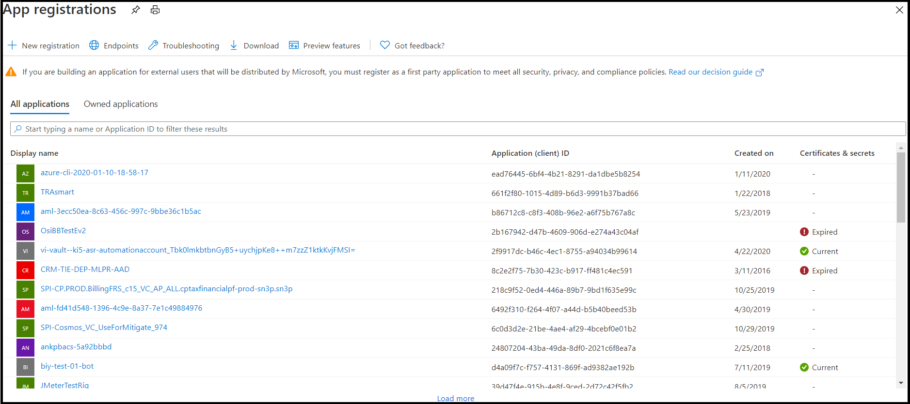

1. In the [Azure portal](https://ms.portal.azure.com/#home), under Azure services, select **Create a resource**.
1. In the search box enter "bot". And in the drop-down list, select **Bot Channels Registration**.
1. Select the **Create** button.
1. In the **Bot Channel Registration** blade, provide the requested information about your bot.
1. Leave the **Messaging endpoint** box empty for now, you will enter the required URL after deploying the bot. The following picture shows an example of the registration settings:

    

1. Click **Microsoft App ID and password** and then **Create New**.

    
        

1. Click **Create App ID in the App Registration Portal** link.

   
   
1. In the displayed **App registration** window, click the **New registration** tab in the upper left.
1. Enter the name of the bot application you are registering, we used *BotTeamsAuth* (you need to select your own unique name).
1. For the **Supported account types** select *Accounts in any organizational directory (Any Azure AD directory - Multitenant) and personal Microsoft accounts (e.g. Skype, Xbox)*.
1. Click the **Register** button. Once completed, Azure displays the *Overview* page for the application.
1. Copy and save to a file the **Application (client) ID** value.
1. In the left panel, click **Certificate and secrets**.
    1. Under *Client secrets*, click **New client secret**.
    1. Add a description to identify this secret from others you might need to create for this app.
    1. Set *Expires* to your selection.
    1. Click **Add**.
    1. Copy the client secret and save it to a file.
1. Go back to the **Bot Channel Registration** window and copy the *App ID* and the *Client secret* in the **Microsoft App ID** and **Password** boxes, respectively.
1. Click **OK**.
1. Finally, click **Create**.

After Azure has created the registration resource it will be included in the resource group list.  

Once your bot channels registration is created, you'll need to enable the Teams channel.

1. In the [Azure portal](https://ms.portal.azure.com/#home), under Azure services, select the **Bot Channel Registration** you just created.
1. In the left panel, click **Channels**.
1. Click the Microsoft Teams icon, then choose **Save**.
