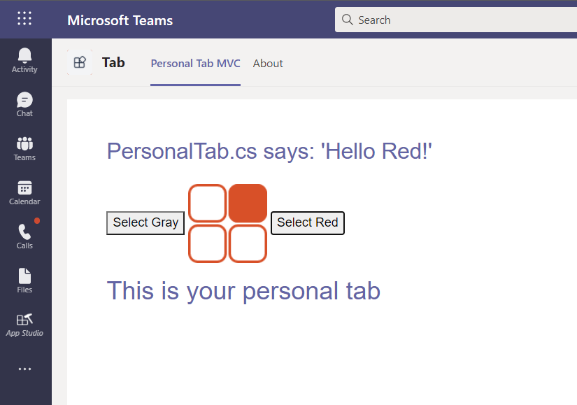

## Upload your tab with App Studio

>[!NOTE]
> We use **App Studio** to edit your `manifest.json` file and upload the completed package to Teams. You can also manually edit `manifest.json`. If you do, ensure that you build the solution again to create the `Tab.zip` file to upload.

**To upload your tab with App Studio**

1. Go to Microsoft Teams. If you use the [web based version](https://teams.microsoft.com), you can inspect your front-end code using your browser's [developer tools](~/tabs/how-to/developer-tools.md).

1. Go to **App Studio** and select the **Manifest editor** tab.

1. Select **Import an existing app** in the **Manifest editor** to begin updating the app package for your tab. The source code comes with its own partially complete manifest. The name of your app package is `tab.zip`. It's available from the following path:

    ```bash
    /bin/Debug/netcoreapp2.2/tab.zip
    ```

1. Upload `tab.zip` to **App Studio**.

### Update your app package with Manifest editor

After you've uploaded your app package into App Studio, you must configure it.

Select the tile for your newly imported tab in the right panel of the Manifest editor welcome page.

There's a list of steps in the left-hand side of the Manifest editor, and on the right, a list of properties that must have values for each of those steps. Much of the information has been provided by your `manifest.json` but there are fields that you must update.

#### Details: App details

In the **App details** section:

1. Under **Identification**, select **Generate** to generate a new App Id for your app.

1. Under **Developer information**, update the **Website** with your **ngrok** HTTPS URL.

1. Under **App URLs**, update the **Privacy statement** to `https://<yourngrokurl>/privacy` and **Terms of use** to `https://<yourngrokurl>/tou`>.

#### Capabilities: Tabs

In the **Tabs** section:

1. Under **Add a personal tab**, select **Add**. A pop-up dialog box appears.

1. Enter a name for the personal tab in **Name**.

1. Enter the **Entity ID**.

1. Update **Content URL** with `https://<yourngrokurl>/personalTab`.

    Leave the **Website URL** field blank.

1. Select **Save**.

#### Finish: Domains and permissions

In the **Domains and permissions** section, the **Domains from your tabs** field must contain your ngrok URL without the HTTPS prefix `<yourngrokurl>.ngrok.io/`.

##### Finish: Test and distribute

>[!IMPORTANT]
> On the right, in **Description**, you see the following warning:
>
> &#9888; **The 'validDomains' array cannot contain a tunneling site...**
>
>This warning can be ignored while testing your tab.

1. In the **Test and Distribute** section, select **Install**.

1. In the pop-up dialog box, select **Add** and your tab is displayed with two options.

1. From the options in the tab, choose either **Select Gray** or **Select Red**. The tab is displayed according to the color you selected.
 
    

## View your personal tab

1. In the navigation bar located at the far left of the Teams app, select the ellipses &#x25CF;&#x25CF;&#x25CF;. A list of personal apps is shown.

1. Select your tab from the list to view it.
