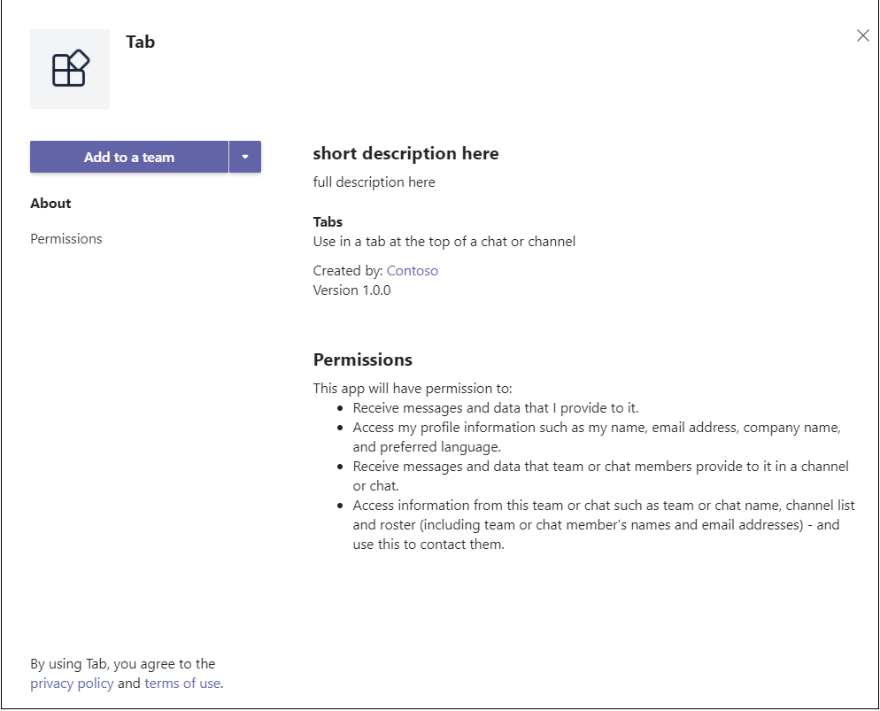

### _Layout.cshtml

For your tab to display in Teams, you must include the **Microsoft Teams JavaScript client library** and include a call to `microsoftTeams.initialize()` after your page loads. This is how your tab and the Teams client communicate:

Go to the **Shared** folder, open **_Layout.cshtml**, and add the following to the `<head>` tag:

```html
<script src="https://ajax.aspnetcdn.com/ajax/jQuery/jquery-3.4.1.min.js"></script>
<script src="https://statics.teams.cdn.office.net/sdk/v1.6.0/js/MicrosoftTeams.min.js"></script>
```

>[!IMPORTANT]
> Do not copy and paste the `<script src="...">` URLs from this page, as they may not represent the latest version. To get the latest version of TeamJS, always go to [Microsoft Teams JavaScript API](https://www.npmjs.com/package/@microsoft/teams-js).

### Tab.cshtml

**To update the embedded script**

1. In Visual Studio, open **Tab.cshtml** to update the embedded `<script>`.

1. At the top of the script, call `microsoftTeams.initialize()`.

1. Update the `websiteUrl` and `contentUrl` values in each function with the HTTPS ngrok URL to your tab.

    Your code should now look like the following with **y8rCgT2b** replaced with your ngrok URL:

    ```javascript
        microsoftTeams.initialize();
    
        let saveGray = () => {
            microsoftTeams.settings.registerOnSaveHandler(function (saveEvent) {
                microsoftTeams.settings.setSettings({
                    websiteUrl: `https://y8rCgT2b.ngrok.io`,
                    contentUrl: `https://y8rCgT2b.ngrok.io/gray/`,
                    entityId: "grayIconTab",
                    suggestedDisplayName: "MyNewTab"
                });
                saveEvent.notifySuccess();
            });
        }

        let saveRed = () => {
            microsoftTeams.settings.registerOnSaveHandler(function (saveEvent) {
                microsoftTeams.settings.setSettings({
                    websiteUrl: `https://y8rCgT2b.ngrok.io`,
                    contentUrl: `https://y8rCgT2b.ngrok.io/red/`,
                    entityId: "redIconTab",
                    suggestedDisplayName: "MyNewTab"
                });
                saveEvent.notifySuccess();
            });
        }
    ```

1. Make sure to save the updated **Tab.cshtml**.

## Build and run your application

In Visual Studio, press **F5** or choose **Start Debugging** from the **Debug** menu. Verify that **ngrok** is running and working properly by opening your browser and going to your content page via the ngrok HTTPS URL that was provided in your command prompt window.

> [!TIP]
> You need to have both your application in Visual Studio and ngrok running. If you need to stop running your application in Visual Studio to work on it **keep ngrok running**. It will continue to listen and will resume routing your application's request when it restarts in Visual Studio. If you have to restart the ngrok service, it will return a new URL and you will have to update your application with the new URL.

## Upload your tab

>[!Note]
> App Studio can be used to edit your `manifest.json` file and upload the completed package to Teams. You can also manually edit the `manifest.json` file if you prefer. If you do, be sure to build the solution again to create the `tab.zip` file to upload.

**To upload your tab**

1. Go to Microsoft Teams. If you use the [web based version](https://teams.microsoft.com) you can inspect your front-end code using your browser's [developer tools](~/tabs/how-to/developer-tools.md).

1. Go to **App Studio** and select the **Manifest editor** tab.

1. Select **Import an existing app** in the Manifest editor to begin updating the app package for your tab. The source code comes with its own partially complete manifest. The name of your app package is `tab.zip`. It is available here:

    ```bash
    /bin/Debug/netcoreapp2.2/tab.zip
    ```

1. Upload `tab.zip` to App Studio.

### Update your app package with Manifest editor

After you have uploaded your app package into App Studio, you must finish configuring it.

Select the tile for your newly imported tab in the right panel of the Manifest editor welcome page.

There is a list of steps in the left-hand side of the Manifest editor, and on the right, a list of properties that must have values for each of those steps. Much of the information has been provided by your `manifest.json` but there are a few fields that you must update:

#### Details: App details

In the **App details** section:

1. Under **Identification**, select **Generate** to replace the placeholder ID with the required GUID for your tab.

1. Under **Developer information**, update **Website** with your **ngrok** HTTPS URL.

1. Under **App URLs**, update the **Privacy statement** to `https://<yourngrokurl>/privacy` and **Terms of use** to `https://<yourngrokurl>/tou`>.

#### Capabilities: Tabs

In the **Tabs** section:

1. Under **Team tab**, select **Add**.

1. In the **Team tab** pop-up window, update the **Configuration URL** to `https://<yourngrokurl>/tab`.

1. Ensure the **Can update configuration?**, **Team**, and **Group chat** checkboxes are selected and select **Save**.

#### Finish: Domains and permissions

In the **Domains and permissions** section, **Domains from your tabs** must contain your ngrok URL without the HTTPS prefix `<yourngrokurl>.ngrok.io/`.

#### Finish: Test and distribute

>[!IMPORTANT]
> On the right, in **Description**, you see the following warning:
>
> &#9888; "**The 'validDomains' array cannot contain a tunneling site...**"
>
> This warning can be ignored while testing your tab.

1. In the **Test and Distribute** section, select **Install**.

1. In the pop-up dialog box, select **Add to a team** or from the drop-down, select **Add to a chat**.

1. Choose the team or chat where you want the tab to be displayed and select **Set up a tab**.

1. In the next pop-up dialog box, choose either **Select Gray** or **Select Red**, and select **Save**.

1. To view your tab, go to the team where you installed the tab, and select it from the tab bar. The page that you chose during configuration is displayed.

    

