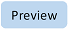

# TeamsJS capability support across Microsoft 365

TeamsJS v2.0 introduces the ability for certain types of Teams apps to run across the Microsoft 365 ecosystem. Currently, other Microsoft 365 application hosts (including Microsoft 365 app and Outlook) for Teams apps support a subset of the application types and capabilities you can build for the Teams platform. This support will expand over time. For a summary of host support for Teams apps, see [Extend Teams apps across Microsoft 365](../../m365-apps/overview.md).

This article details the level of support of Teams JavaScript client (TeamsJS) library capabilities across various Microsoft 365 host applications.

 
<table border>
    <thead>
        <tr>
            <th></th>
            <th colspan=3>Web</th>
            <th colspan=3>Desktop</th>
            <th colspan=6>Mobile</th>
        </tr>
        <tr>
            <th></th>
            <th colspan=3></th>
            <th colspan=3>Windows</th>
            <th colspan=3>Android</th>
            <th colspan=3>iOS</th>
        </tr>
        <tr>
            <td></td>
            <td><image alt="Teams" src="./images/teams-thumb.png"/></td>
            <td><image alt="Microsoft 365 app" src="./images/microsoft365-thumb.png"/></td>
            <td><image alt="Outlook" src="./images/outlook-thumb.png"/></td>
            <td><image alt="Teams" src="./images/teams-thumb.png"/></td>
            <td><image alt="Microsoft 365 app" src="./images/microsoft365-thumb.png"/></td>
            <td><image alt="Outlook" src="./images/outlook-thumb.png"/></td>
            <td><image alt="Teams" src="./images/teams-thumb.png"/></td>
            <td><image alt="Microsoft 365 app" src="./images/microsoft365-thumb.png"/></td>
            <td><image alt="Outlook" src="./images/outlook-thumb.png"/></td>
            <td><image alt="Teams" src="./images/teams-thumb.png"/></td>
            <td><image alt="Microsoft 365 app" src="./images/microsoft365-thumb.png"/></td>
            <td><image alt="Outlook" src="./images/outlook-thumb.png"/></td>
        </tr>
    </thead>
    <tbody>
        <tr>
            <th><a href="#app">app</a></th>
            <td>&#x2713;</td>
            <td>&#x2713;</td>
            <td>&#x2713;</td>
            <td>&#x2713;</td>
            <td>&#x2713;</td>
            <td></td>
            <td>&#x2713;</td>
            <td></td>
            <td></td>
            <td>&#x2713;</td>
            <td></td>
            <td></td>
        </tr>
        <tr>
            <th><a href="#appInstallDialog">appInstallDialog</a></th>
            <td>&#x2713;</td>
            <td>&#x2713;</td>
            <td></td>
            <td>&#x2713;</td>
            <td>&#x2713;</td>
            <td></td>
            <td>&#x2713;</td>
            <td></td>
            <td></td>
            <td>&#x2713;</td>
            <td></td>
            <td></td>
        </tr>
        <tr>
            <th><a href="#call">call</a></th>
            <td>&#x2713;</td>
            <td></td>
            <td>&#x2713;</td>
            <td>&#x2713;</td>
            <td></td>
            <td></td>
            <td>&#x2713;</td>
            <td></td>
            <td></td>
            <td>&#x2713;</td>
            <td></td>
            <td></td>
        </tr>
        <tr>
            <th><a href="#chat">chat</a></th>
            <td>&#x2713;</td>
            <td></td>
            <td>&#x2713;</td>
            <td>&#x2713;</td>
            <td></td>
            <td></td>
            <td>&#x2713;</td>
            <td></td>
            <td></td>
            <td>&#x2713;</td>
            <td></td>
            <td></td>
        </tr>
        <tr>
            <th><a href="#dialog">dialog</a></th>
            <td>&#x2713;</td>
            <td>&#x2713;</td>
            <td>&#x2713;</td>
            <td>&#x2713;</td>
            <td>&#x2713;</td>
            <td></td>
            <td>&#x2713;</td>
            <td></td>
            <td></td>
            <td>&#x2713;</td>
            <td></td>
            <td></td>
        </tr>
        <tr>
            <th><a href="#geoLocation">geoLocation</a></th>
            <td></td>
            <td>&#x2713;</td>
            <td></td>
            <td></td>
            <td>&#x2713;</td>
            <td></td>
            <td></td>
            <td></td>
            <td></td>
            <td></td>
            <td></td>
            <td></td>
        </tr>
        <tr>
            <th><a href="#menus">menus</a></th>
            <td>&#x2713;</td>
            <td></td>
            <td></td>
            <td>&#x2713;</td>
            <td></td>
            <td></td>
            <td>&#x2713;</td>
            <td></td>
            <td></td>
            <td>&#x2713;</td>
            <td></td>
            <td></td>
        </tr>
        <tr>
            <th><a href="#monetization">monetization</a></th>
            <td>&#x2713;</td>
            <td></td>
            <td></td>
            <td>&#x2713;</td>
            <td></td>
            <td></td>
            <td>&#x2713;</td>
            <td></td>
            <td></td>
            <td>&#x2713;</td>
            <td></td>
            <td></td>
        </tr>
        <tr>
            <th><a href="#pages">pages</a></th>
            <td>&#x2713;</td>
            <td>&#x2713;</td>
            <td>&#x2713;</td>
            <td>&#x2713;</td>
            <td>&#x2713;</td>
            <td>&#x2713;</td>
            <td>&#x2713;</td>
            <td>&#x2713;</td>
            <td></td>
            <td></td>
            <td></td>
            <td></td>
        </tr>
        <tr>
            <th><a href="#people">people</a></th>
            <td>&#x2713;</td>
            <td></td>
            <td>&#x2713;</td>
            <td>&#x2713;</td>
            <td></td>
            <td></td>
            <td>?</td>
            <td></td>
            <td></td>
            <td>?</td>
            <td></td>
            <td></td>
        </tr>
        <tr>
            <th><a href="#sharing">sharing</a></th>
            <td>&#x2713;</td>
            <td></td>
            <td></td>
            <td>&#x2713;</td>
            <td></td>
            <td></td>
            <td>?</td>
            <td></td>
            <td></td>
            <td>?</td>
            <td></td>
            <td></td>
        </tr>
        <tr>
            <th><a href="#stageView">stageView</a></th>
            <td>&#x2713;</td>
            <td></td>
            <td></td>
            <td>&#x2713;</td>
            <td></td>
            <td></td>
            <td>?</td>
            <td></td>
            <td></td>
            <td>?</td>
            <td></td>
            <td></td>
        </tr>
        <tr>
            <th><a href="#tasks">tasks</a></th>
            <td>&#x2713;</td>
            <td></td>
            <td></td>
            <td>&#x2713;</td>
            <td></td>
            <td></td>
            <td>&#x2713;</td>
            <td></td>
            <td></td>
            <td>&#x2713;</td>
            <td></td>
            <td></td>
        </tr>
        <tr>
            <th><a href="#teamsCore">teamsCore</a></th>
            <td>&#x2713;</td>
            <td></td>
            <td></td>
            <td>&#x2713;</td>
            <td></td>
            <td></td>
            <td>?</td>
            <td></td>
            <td></td>
            <td>?</td>
            <td></td>
            <td></td>
        </tr>
        <tr>
            <th><a href="#video">video</a></th>
            <td>&#x2713;</td>
            <td></td>
            <td></td>
            <td>&#x2713;</td>
            <td></td>
            <td></td>
            <td>?</td>
            <td></td>
            <td></td>
            <td>?</td>
            <td></td>
            <td></td>
        </tr>
        <tr>
            <th><a href="#webStorage">webStorage</a></th>
            <td></td>
            <td></td>
            <td></td>
            <td>&#x2713;</td>
            <td></td>
            <td></td>
            <td>&#x2713;</td>
            <td></td>
            <td></td>
            <td>&#x2713;</td>
            <td></td>
            <td></td>
        </tr>
    </tbody>
</table>

## `app` 

[Reference](https://learn.microsoft.com/javascript/api/@microsoft/teams-js/app) | [Sample](https://github.com/vikramtha/microsoft-teams-library-js/blob/vikramtha/teamsjs-cc-app/apps/teamsjs-cc-app/tabs/src/components/capabilities/App.tsx)

Namespace to interact with app initialization and lifecycle. 

## Functions

 
<table border>
    <thead>
        <tr>
            <th></th>
            <th colspan=3>Web</th>
            <th colspan=3>Desktop</th>
            <th colspan=6>Mobile</th>
        </tr>
        <tr>
            <th></th>
            <th colspan=3></th>
            <th colspan=3>Windows</th>
            <th colspan=3>Android</th>
            <th colspan=3>iOS</th>
        </tr>
        <tr>
            <td></td>
            <td><image alt="Teams" src="./images/teams-thumb.png"/></td>
            <td><image alt="Microsoft 365 app" src="./images/microsoft365-thumb.png"/></td>
            <td><image alt="Outlook" src="./images/outlook-thumb.png"/></td>
            <td><image alt="Teams" src="./images/teams-thumb.png"/></td>
            <td><image alt="Microsoft 365 app" src="./images/microsoft365-thumb.png"/></td>
            <td><image alt="Outlook" src="./images/outlook-thumb.png"/></td>
            <td><image alt="Teams" src="./images/teams-thumb.png"/></td>
            <td><image alt="Microsoft 365 app" src="./images/microsoft365-thumb.png"/></td>
            <td><image alt="Outlook" src="./images/outlook-thumb.png"/></td>
            <td><image alt="Teams" src="./images/teams-thumb.png"/></td>
            <td><image alt="Microsoft 365 app" src="./images/microsoft365-thumb.png"/></td>
            <td><image alt="Outlook" src="./images/outlook-thumb.png"/></td>
        </tr>
    </thead>
    <tbody>
        <tr>
            <th>getContext</th>
            <td>&#x2713;</td>
            <td>&#x2713;</td>
            <td>&#x2713;</td>
            <td>&#x2713;</td>
            <td>&#x2713;</td>
            <td>&#x2713;</td>
            <td>&#x2713;</td>
            <td>&#x2713;</td>
            <td>&#x2713;</td>
            <td>&#x2713;</td>
            <td></td>
            <td></td>
        </tr>
    </tbody>
</table>

## `dialog`

[Reference](https://learn.microsoft.com/javascript/api/@microsoft/teams-js/dialog) | Sample

This group of capabilities enables apps to show modal dialogs. There are two primary types of dialogs: URL-based dialogs and Adaptive Card dialogs. Both types of dialogs are shown on top of your app, preventing interaction with your app while they are displayed.

- URL-based dialogs allow you to specify a URL from which the contents will be shown inside the dialog. For URL dialogs, use the functions and interfaces in the url namespace.
- Adaptive Card-based dialogs allow you to provide JSON describing an Adaptive Card that will be shown inside the dialog. For Adaptive Card dialogs, use the functions and interfaces in the adaptiveCard namespace.

 
<table border>
    <thead>
        <tr>
            <th></th>
            <th colspan=3>Web</th>
            <th colspan=3>Desktop</th>
            <th colspan=6>Mobile</th>
        </tr>
        <tr>
            <th></th>
            <th colspan=3></th>
            <th colspan=3>Windows</th>
            <th colspan=3>Android</th>
            <th colspan=3>iOS</th>
        </tr>
        <tr>
            <td></td>
            <td><image alt="Teams" src="./images/teams-thumb.png"/></td>
            <td><image alt="Microsoft 365 app" src="./images/microsoft365-thumb.png"/></td>
            <td><image alt="Outlook" src="./images/outlook-thumb.png"/></td>
            <td><image alt="Teams" src="./images/teams-thumb.png"/></td>
            <td><image alt="Microsoft 365 app" src="./images/microsoft365-thumb.png"/></td>
            <td><image alt="Outlook" src="./images/outlook-thumb.png"/></td>
            <td><image alt="Teams" src="./images/teams-thumb.png"/></td>
            <td><image alt="Microsoft 365 app" src="./images/microsoft365-thumb.png"/></td>
            <td><image alt="Outlook" src="./images/outlook-thumb.png"/></td>
            <td><image alt="Teams" src="./images/teams-thumb.png"/></td>
            <td><image alt="Microsoft 365 app" src="./images/microsoft365-thumb.png"/></td>
            <td><image alt="Outlook" src="./images/outlook-thumb.png"/></td>
        </tr>
    </thead>
    <tbody>
        <tr>
            <th><a href="#dialogadaptivecard">dialog.adaptiveCard</a> </th>
            <td></td>
            <td></td>
            <td></td>
            <td></td>
            <td></td>
            <td></td>
            <td></td>
            <td></td>
            <td></td>
            <td></td>
            <td></td>
            <td></td>
        </tr>
        <tr>
            <th><a href="#dialogurl">dialog.url</a></th>
            <td>&#x2713;</td>
            <td>&#x2713;</td>
            <td>&#x2713;</td>
            <td>&#x2713;</td>
            <td>&#x2713;</td>
            <td></td>
            <td>?</td>
            <td></td>
            <td></td>
            <td>?</td>
            <td></td>
            <td></td>
        </tr>
    </tbody>
</table>

### `dialog.adaptiveCard`

[Reference](https://learn.microsoft.com/javascript/api/@microsoft/teams-js/dialog.adaptivecard) | [Sample](https://github.com/vikramtha/microsoft-teams-library-js/blob/vikramtha/teamsjs-cc-app/apps/teamsjs-cc-app/tabs/src/components/capabilities/Dialog.AdaptiveCard.tsx)

> [!IMPORTANT]
> This namespace is in preview and subject to change based on feedback. Please do not use in production.

Subcapability for interacting with adaptive card dialogs.

### `dialog.url`

Subcapability for interacting with URL-based dialogs.

[Reference](https://learn.microsoft.com/javascript/api/@microsoft/teams-js/dialog.url) | [Sample](https://github.com/vikramtha/microsoft-teams-library-js/blob/vikramtha/teamsjs-cc-app/apps/teamsjs-cc-app/tabs/src/components/capabilities/Dialog.tsx)

## `pages`

[Reference](https://learn.microsoft.com/javascript/api/@microsoft/teams-js/pages) | [Sample](https://github.com/vikramtha/microsoft-teams-library-js/blob/vikramtha/teamsjs-cc-app/apps/teamsjs-cc-app/tabs/src/components/capabilities/Pages.tsx)

Navigation-specific part of the TeamsJS library.

 
<table border>
    <thead>
        <tr>
            <th></th>
            <th colspan=3>Web</th>
            <th colspan=3>Desktop</th>
            <th colspan=6>Mobile</th>
        </tr>
        <tr>
            <th></th>
            <th colspan=3></th>
            <th colspan=3>Windows</th>
            <th colspan=3>Android</th>
            <th colspan=3>iOS</th>
        </tr>
        <tr>
            <td></td>
            <td><image alt="Teams" src="./images/teams-thumb.png"/></td>
            <td><image alt="Microsoft 365 app" src="./images/microsoft365-thumb.png"/></td>
            <td><image alt="Outlook" src="./images/outlook-thumb.png"/></td>
            <td><image alt="Teams" src="./images/teams-thumb.png"/></td>
            <td><image alt="Microsoft 365 app" src="./images/microsoft365-thumb.png"/></td>
            <td><image alt="Outlook" src="./images/outlook-thumb.png"/></td>
            <td><image alt="Teams" src="./images/teams-thumb.png"/></td>
            <td><image alt="Microsoft 365 app" src="./images/microsoft365-thumb.png"/></td>
            <td><image alt="Outlook" src="./images/outlook-thumb.png"/></td>
            <td><image alt="Teams" src="./images/teams-thumb.png"/></td>
            <td><image alt="Microsoft 365 app" src="./images/microsoft365-thumb.png"/></td>
            <td><image alt="Outlook" src="./images/outlook-thumb.png"/></td>
        </tr>
    </thead>
    <tbody>
        <tr>
            <th><a href="pagescurrentapp">pages.currentApp</a></th>
            <td></td>
            <td>&#x2713;</td>
            <td>&#x2713;</td>
            <td></td>
            <td>&#x2713;</td>
            <td>&#x2713;</td>
            <td></td>
            <td></td>
            <td></td>
            <td></td>
            <td></td>
            <td></td>
        </tr>
        <tr>
            <th><a href="pagestab">pages.tab</a></th>
            <td>&#x2713;</td>
            <td>&#x2713;</td>
            <td>&#x2713;</td>
            <td>&#x2713;</td>
            <td>&#x2713;</td>
            <td></td>
            <td>&#x2713;</td>
            <td></td>
            <td></td>
            <td>&#x2713;</td>
            <td></td>
            <td></td>
        </tr>
    </tbody>
</table>

### `pages.currentApp`

[Reference](https://learn.microsoft.com/en-us/javascript/api/@microsoft/teams-js/pages.currentapp?view=msteams-client-js-latest) | [Sample](https://github.com/vikramtha/microsoft-teams-library-js/blob/vikramtha/teamsjs-cc-app/apps/teamsjs-cc-app/tabs/src/components/capabilities/Pages.Current.tsx)

Provides functions for navigating without needing to specify your application ID.

### `pages.tab`

[Reference](https://learn.microsoft.com/en-us/javascript/api/@microsoft/teams-js/pages.currentapp?view=msteams-client-js-latest) | [Sample](https://github.com/vikramtha/microsoft-teams-library-js/blob/vikramtha/teamsjs-cc-app/apps/teamsjs-cc-app/tabs/src/components/capabilities/Pages.Current.tsx)

Provides APIs for querying and navigating between contextual tabs of an application. Unlike personal tabs, contextual tabs are pages associated with a specific context, such as channel or chat.

## `tasks`

[Reference](https://learn.microsoft.com/javascript/api/@microsoft/teams-js/tasks) | Sample

> [!CAUTION]
> This namespace is slated for deprecation. It is currently supported for backwards compability purposes. For new apps, please use the [dialog](#dialog) capability.

Earlier version of the capability for providing modal dialog (task module) support, prior to TeamsJS v2.8.0.

## Code sample

| Sample name           | Description | Source|
:---------------------|:--------------|:---------|
| TeamsJS Capability Checker| Sample application to demonstrate the capabilities of Teams JS SDK v2 in Microsoft Teams apps extended across Outlook and Microsoft 365. | [TypeScript](https://github.com/vikramtha/microsoft-teams-library-js/tree/vikramtha/teamsjs-cc-app/apps/teamsjs-cc-app)

## Next step

> [!div class="nextstepaction"]
> 

## See also

* [Extend Teams apps across Microsoft 365](../../m365-apps/overview.md)
* [Extend a Teams personal tab across Microsoft 365 app](../../m365-apps/extend-m365-teams-personal-tab.md)
* [Teams JavaScript client library overview](./using-teams-client-library.md)
* [TeamsJS API Reference](/javascript/api/@microsoft/teams-js)
