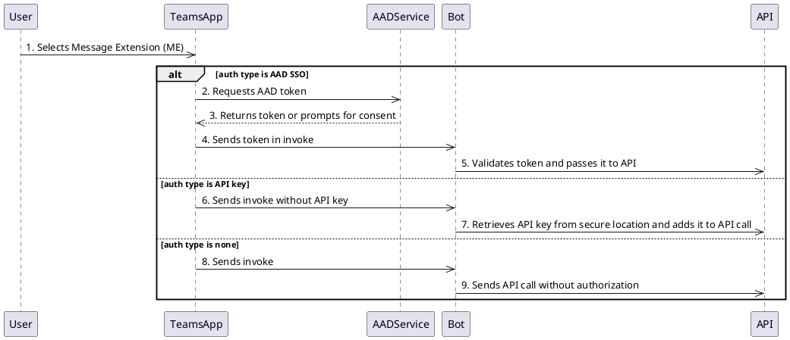
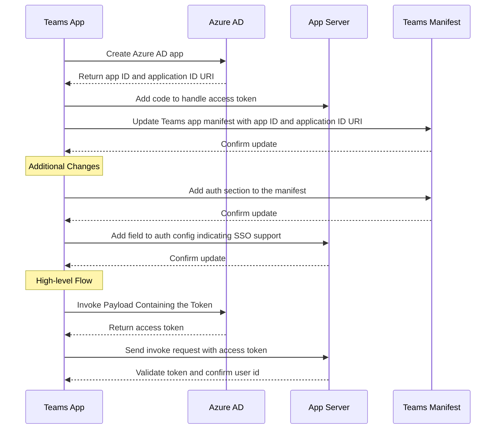

# Build API-based message extension

> [!NOTE]
> API-based message extensions only support search commands.

API-based message extensions are a type of Teams app that integrates your chat functionality directly into Teams, enhancing your app's usability and offering a seamless user experience.

Before you get started, ensure that you meet the following requirements:
</br>
<details>
<summary id="OAD" >1. OpenAPI Description (OAD)</summary>

Users must not enter a parameter for a header or cookie. If you need to pass headers, a default value for the header can be set in the specification. This simplifies the user experience and reduces the risk of errors.

* The `auth` property must not be specified.
* JSON and YAML are the supported formats.
* OpenAPI versions 2.0 and 3.0.x are supported.
* Teams doesn't support the `oneOf`, `anyOf`, `allOf`, and `not` (swagger.io) constructs.
* Constructing arrays for the request isn't supported, however, nested objects within a JSON request body are supported.
* The request body, if present, must be application/Json to ensure compatibility with a wide range of APIs.
* Define an HTTPS protocol server URL for the `servers.url` property.
* Only single parameter search is supported.
* Only one required parameter without a default value is allowed.
* Only POST and GET HTTP methods are supported.
* OpenAPI Description document must have an `operationId`.
* The operation must not have a required Header or Cookie parameters without default values.
* A command must have exactly one parameter.
* Ensure that there are no remote references in the OpenAPI Description document.
* A required parameter with a default value is considered optional.

</details>

</br>

<details><summary>2. App manifest</summary>

* Set the app manifest version to `devPreview`.
* Set `composeExtensions.composeExtensionType` to `apiBased`.
* Define `composeExtensions.apiSpecificationFile` as the relative path to the OpenAPI Description file within the folder.
* Define `apiSpecificationFile` as the relative path to the OpenAPI description document.
* Define `apiResponseRenderingTemplateFile` as the relative path to the response rendering template.
* Each command must have a link to the response rendering template.
* Full description must not exceed 128 characters.
* A command must have exactly one parameter.
* Add a new optional property `authorization` under the `composeExtensions` node. This property should be null for bot-based ME and specified only for API ME.
* Define the type of authentication your application uses by setting the `authType` property under the `authorization` node. The possible values for this property are `none`, `apiSecretServiceAuth`, `microsoftEntra`, and `userAuth`.
* Depending on the type of authentication your application uses, you might need to add a corresponding configuration object under the `authorization` node. For example, if your application uses AAD SSO, you would add a `microsoftEntraConfiguration` object with a `supportsSingleSignOn` property set to `true`.
* If your application uses API key based authentication, you would add an `apiSecretServiceAuthConfiguration` object with an `apiSecretRegistrationId` property. This property should contain the reference ID returned when you submitted the API key through the portal.

</details>

</br>

<details><summary>3. Response rendering template</summary>

> [!NOTE]
> Teams supports Adaptive Cards up to version 1.5, and  the Adaptive Cards Designer supports up to version 1.6.

* Use tools such as Fiddler or Postman to call the API and ensure that the request and the response are valid.
* Get a sample response for validating the response rendering template.
* You can use [Adaptive Card Designer](https://adaptivecards.io/designer/) to bind the API response to the response rendering template and preview the Adaptive Card. Insert the template in the **CARD PAYLOAD EDITOR** and insert the sample response entry in the **SAMPLE DATA EDITOR**.

  :::image type="content" source="../assets/images/Copilot/api-me-sbs-adaptive-card-designer.png" alt-text="Screenshots shows the Adaptive Card designer with the Adaptive Card template and the sample data.":::

* Define the schema reference URL in the `$schema` property.
* A `jsonPath` is recommended for arrays or when the data for the Adaptive Card isn't the root object. For example, if your data is nested under `productDetails`, your JSON path would be `productDetails`.
* Define `jsonPath` as the path to the relevant data/array in API response. If the path points to an array, then each entry in the array binds with the Adaptive Card template and return as separate results. *[Optional]*
* The supported values for `responseLayout` are `list` and `grid`.

If the root object of the OpenAPI schema contains well-known array property name, then Teams Toolkit uses the array property as root element to generate an Adaptive Card, and the array property name is used as `JsonPath` property for response rendering template. For example, if the property name contains `result`, `data`, `items`, `root`, `matches`, `queries`, `list`, or `output` and the type is `array`, then it's used as root element.

The following is a JSON example for a list of products to create a card result for each entry:

```json
{
   "version": "1.0",
   "title": "All Products",
   "warehouse": {
      "products": [
        {
          "id": "1",
          "name": "Product 1",
          "price": "$10"
        },
        {
          "id": "2",
          "name": "Product 2",
          "price": "$20"
        }
      ]
   }
}
```

The array of results is under `products`, nested under `warehouse`, so the JSON path is `warehouse.products`.

</details>
</br>

<details><summary>4. API message extension</summary>

API-based message extensions are a potent tool that enhances your Teams app's functionality by integrating with external APIs. This enhances the capabilities of your app and provides a richer user experience. To implement message extension from an API, you need to follow these guidelines:

* The `Commands.id` property in app manifest must match the corresponding `operationId` in the OpenAPI Description. For example, if the operation ID is `getProduct`, the command ID must be `getProduct`.
* If a required parameter is without a default value, the command `parameters.name` in the app manifest must match the `parameters.name` in the OpenAPI Description document.
* If there's no required parameter, the command `parameters.name` in the app manifest must match the optional `parameters.name` in the OpenAPI Description.
* A command can't have more than one parameter.
* A response rendering template must be defined per command, which is used to convert responses from an API. The command section of the manifest must point to this template file under `composeExtensions.commands.apiResponseRenderingTemplateFile` within the app manifest. Each command points to a different response rendering template file.
* You can use [Teams Store app validation](https://dev.teams.microsoft.com/validation) tool to validate the app package, which includes the app manifest and the OpenAPI description document.

</details>

## Authentication

You can implement authentication in API-based search message extensions to provide secure and seamless access to applications. To enable authentication for your message extension, update your app manifest with the `none`, `apiSecretServiceAuth`, and `microsoftEntra` authentication methods. For more information, see [composeExtensions](../resources/schema/manifest-schema.md#composeextensions)



# [API service auth](#tab/api-service-auth)

API secret service authentication is a secure method for your app to authenticate with API. You can authorize incoming requests to your service by configuring a static API key. The API key is stored securely and added to the API call by the bot. Add an `apiSecretServiceAuthConfiguration` object with an `apiSecretRegistrationId` property, which contains the reference ID returned when you submitted the API key through the Developer portal for Teams.

```json
"composeExtensions": [
    {
      "composeExtensionType": "apiBased",
      "authorization": {
        "authType": "apiSecretServiceAuth ",
        "apiSecretServiceAuthConfiguration": {
            "apiSecretRegistrationId": "96270b0f-7298-40cc-b333-152f84321813"
        }
      },
```

### Register an API Key

API key registration allows you to secure their APIs that are behind an auth and use in message extensions. You can register an API key and specify the domain, tenant, and app that can access the APIs, and provide the secrets that are needed to authenticate the API calls.  You can then paste the API key ID in the simplified messaging extension UI to enable the authentication.

To register an API Key, follow these steps:

1. Go to **Tools** > **API Key Registration**.

1. Select **New API Key**.

1. In the **Register an API key** page, update the following:

   1. **Description**: Description of the API Key.
   1. **Add Domain**: The domain where you host the API.

1. Under **Set a target tenant**, select the following:
   1. If you want to use the API key to call the APIs for a specific tenant, select **Home tenant**.
   1. If you want to use the API key to call the APIs for any tenant, select **Any tenant**.

1. Under **Set a Teams app**, select the following:
   1. If you want the app that matches the given teams App ID to use the API key, select **Existing Teams app**.
   1. If you want the app that matches any teams App ID to use the API key, select **Any Teams app**.

1. Select **+ Add Secret** and enter the OpenAI API secret key.

1. Select **Save**. An **API key registration ID** is generated.

# [Microsoft Entra ID](#tab/microsoft-entra-id)

You can use the `microsoftEntra` authentication method to authenticate once and gain access to multiple systems without being prompted to log in again.

## Add single sign-on (SSO) in Microsoft Teams Apps using Microsoft Entra ID

### Prerequisites

Before you start, ensure you have the following:

* An Azure account with an active subscription.
* A Teams app project.
* Basic familiarity with Azure AD and Teams app development.

### Implementation Steps

1. **Configure App with Azure AD**: Create an Azure AD app to generate an app ID and application ID URI. This is used to configure scopes and authorize trusted client applications for generating access tokens. You can follow the steps outlined in the [Azure AD app creation guide](/azure/active-directory/develop/quickstart-register-app).

1. **Add Code to Handle Access Tokens**: Add the code to handle access tokens. This token should be sent to your app's server code in the Authorization header. Ensure to validate the access token when it's received. Here's an example of how to handle access tokens:

   ```javascript
   // Handle access token
   app.use((req, res, next) => {
   const authHeader = req.headers.authorization;
   const token = authHeader && authHeader.split(' ')[1];
   
   if (token == null) return res.sendStatus(401);
   
   jwt.verify(token, process.env.ACCESS_TOKEN_SECRET, (err, user) => {
      if (err) return res.sendStatus(403);
      req.user = user;
      next();
   });
   });
   ```

1. **Update app manifest**: Update your Teams client app manifest with the app ID and application ID URI generated on Azure AD. This allows Teams to request access tokens on behalf of your app. The "webApplicationInfo" section in the manifest file is where you specify this information.

   ```json
    "webApplicationInfo": {
      "id": "{Azure AD AppId}",
      "resource": "api://subdomain.example.com/botId-{guid}"
    }
   ```

1. **Add SSO Support to the Plugin**: Add the following auth section to the plugin part of the manifest. This indicates that the plugin supports SSO.

   ```json
    "authorization": {
      "authType": "microsoftEntra",
      "microsoftEntraConfiguration": {
        "supportsSingleSignOn": true,
    
      }
    },
   ```

1. **Validate the Token**: Before the token is sent to the plugin, validate that the resource URI and the domain the request is sent to be the same. Also, confirm the user ID in the token is the same as the one used for SMBA auth.

1. **Send Invoke Request with Access Token**: The client sends an invoke request with the access token. An invoke request is a type of HTTP request that is used to trigger actions on the server. Here's an example payload that contains the access token.

   ```json
    {
      "name": "composeExtension/query",
      "value": {
        "commandId": "insertWiki",
        "parameters": [
          {
            "name": "searchKeyword",
            "value": "lakers"
          }
        ],
        "authentication": {
          "token": "…"
        },
        "queryOptions": {
          "skip": 0,
          "count": 25
        }
      }
    }
   ```

### Limitations

This flow is valid only for consenting to a limited set of user-level APIs, such as email, profile, offline_access, and OpenId. It isn't used for other Graph scopes such as User.Read or Mail.Read. If you need to access other Graph scopes, you need to implement additional consent flows.



This sequence diagram represents the flow of creating an Azure AD app, handling the access token, updating the Teams app manifest, and making additional changes to support SSO in Teams. It also includes the high-level flow of invoking a payload containing the token.

# [None](#tab/none)

---

## Create an API-based message extension

You can create an API-based message extension using Developer Portal for Teams, Visual Studio Code, Teams Toolkit command line interface (CLI), or Visual Studio.

# [Developer Portal for Teams](#tab/developer-portal-for-teams)

To create an API-based message extension using Developer Portal for Teams, follow these steps:

1. Go to **[Teams Developer Portal](https://dev.teams.microsoft.com/home)**.
1. Go to **Apps**.
1. Select **+ New apps**.
1. Enter a name of the app and select the **Manifest version** as **Latest prerelease (devPreview)**.

1. Select **Add**.

   :::image type="content" source="../assets/images/Copilot/api-based-me-tdp-manifest-version.png" alt-text="Screenshot shows the app name and the manifest version selected as Latest prerelease (devPreview) in Developer Portal.":::

1. In the left pane, under **Configure**, update the following **Basic information**:

   1. Full name
   1. Short description
   1. Long description
   1. Developer or company name
   1. Website (must be a valid HTTPS URL)
   1. Privacy policy
   1. Terms of use

1. Select **Save**.

1. Select **App features**.
1. Select **Messaging extension**.

   :::image type="content" source="../assets/images/Copilot/api-based-me-tdp-app-feature.png" alt-text="Screenshot shows the message extension option in Teams Developer Portal.":::

1. Under **Message extension type**, select **API**.

   1. If you get a disclaimer, which reads **Bot message extension is already in use by users. Would you like to change message extension type to API?**. Select **Yes, change**.

1. Under **OpenAPI spec**, select **Upload now**.

   :::image type="content" source="../assets/images/Copilot/api-based-me-tdp-upload.png" alt-text="Screenshot shows the Upload now option in Teams Developer Portal.":::

1. Select the OpenAPI Description document in the JSON or YAML format and select **Open**.

1. Select **Save**. A pop-up appears with the message **API spec saved successfully**.
1. Select **Got it**.

   :::image type="content" source="../assets/images/Copilot/api-based-me-tdp-api-saved.png" alt-text="Screenshot shows an example of the API spec saved successfully message and Got it button.":::

**Add commands**

> [!NOTE]
> Message extensions built from an API only support a single parameter.

You can add commands and parameters to your message extension, to add commands:

1. Under **Message extension type**, select **Add**.

   :::image type="content" source="../assets/images/Copilot/api-based-me-tdp-add-commands.png" alt-text="Screenshot shows the add option to add commands in Teams Developer Portal.":::

   An **Add command** pop-up appears with a list of all the available APIs from the OpenAPI Description document.

1. Select an API from the list and select **Next**.

   :::image type="content" source="../assets/images/Copilot/api-based-me-tdp-commands-api-list.png" alt-text="Screenshot shows the list of APIs from the OpenAPI Description Document in the Add a command pop-up window.":::

   A **Command details** appears.

1. Under **Command details**, go to **Adaptive card template** and select **Upload now**.

    :::image type="content" source="../assets/images/Copilot/api-based-me-tdp-adaptive-card-template.png" alt-text="Screenshot shows the Upload now option to add the adaptive Card template in for the command.":::

   > [!NOTE]
   > If you have more than one API, ensure that you upload the **Adaptive card template** for each API.

1. Select the Adaptive Card template file in JSON format and select **Open**.

   The following attributes are updated automatically from the Adaptive Card template:
   * Command Type
   * Command ID
   * Command title
   * Parameter name
   * Parameter description

   :::image type="content" source="../assets/images/Copilot/api-based-me-tdp-command-details.png" alt-text="Screenshot shows the fields available in the command details page.":::

1. Under **Details**, update the **Command description**.

   1. If you want to launch a command using a trigger in Microsoft 365 chat, turn on the **Automatically run the command when a user opens the extension** toggle.

1. Select **Add**. The command is added successfully.

1. Select **Save**.

An API-based message extension is created.

:::image type="content" source="../assets/images/Copilot/api-based-me-tdp-plugin-copilot.png" alt-text="Screenshot shows the plugin for copilot app created in the app features page in Teams Developer Portal.":::

**Add the API key to your message extension**

1. Under App features, select the message extension that you've created.

1. Under **Authentication**, select **API Key** and add the **API key registration ID** you've created earlier.

1. Select **Save**.

To test your API-based message extension created in the Developer Portal for Teams, you can use the following methods:

* **Preview in Teams**: In Developer Portal, open your message extension and select **Preview in Teams** in the upper-right corner. You're redirected to Teams, where you can add the app to Teams to preview the app.

* **Download app package**: On the message extension page, select **App package** from the left pane and then, in the upper-left corner of the window, select **Download app package**. The app package is downloaded to your local machine in a .zip file. You can upload the app package to teams and test the message extension.

# [Visual Studio Code](#tab/visual-studio-code)

> [!NOTE]
> Teams Toolkit support for API-based message extension is available only in Teams Toolkit pre-release version. Before you get started, ensure that you've installed a [Teams Toolkit pre-release version](../toolkit/install-Teams-Toolkit.md#install-a-pre-release-version)

To build am API-based message extension using Teams Toolkit for Visual Studio Code, follow these steps:

1. Open **Visual Studio Code**.
1. From the left pane, Select **Teams Toolkit**.
1. Select **Create a New App**.
1. Select **Message Extension**.

   :::image type="content" source="../assets/images/Copilot/api-based-me-ttk-plugin-copilot.png" alt-text="Screenshot shows the message extension option in Team Toolkit.":::

1. Select **Custom Search Results**.

1. Select one of the following options:
    1. To build from the beginning, select **Start with a new API**.
    1. If you already have an OpenAPI description document, select **Start with an OpenAPI Description Document**.

     :::image type="content" source="../assets/images/Copilot/api-based-me-ttk-plugin-copilot-options.png" alt-text="Screenshot shows the options to create a search based message extension.":::

1. Based on the options selected in **step 6**, select the following:

   # [New API](#tab/new-api)

   1. Select a programming language.

       :::image type="content" source="../assets/images/Copilot/api-based-me-ttk-plugin-programming language.png" alt-text="Screenshot shows the programming language options.":::

   1. Select **Default folder**.

   1. Enter the name of your app and select **Enter**. Teams Toolkit creates a new plugin with API from Azure functions.
   1. To get started, you must update the source code in the following files:

        |File  |Contents |
        |---------|---------|
        |`repair/function.json`    |A configuration file that defines the function’s trigger and other settings. For more information, see [Azure Functions](/azure/azure-functions/functions-bindings-http-webhook-trigger?tabs=python-v2%2Cisolated-process%2Cnodejs-v4%2Cfunctionsv2&pivots=programming-language-csharp)        |
        |`repair/index.ts`     | The main file of a function in Azure Functions.        |
        |`appPackage/apiSpecificationFiles/repair.yml`     |  A file that describes the structure and behavior of the repair API.       |
        |`appPackage/responseTemplates/repair.json`     |  A generated Adaptive Card that used to render API response.       |
        |`repairsData.json`    |  The data source for the repair API.       |

   # [OpenAPI Description](#tab/openapi-specification)

   1. Enter or browse the OpenAPI Description document location.

      :::image type="content" source="../assets/images/Copilot/api-based-me-ttk-plugin-copilot-openapi-spec-location.png" alt-text="Screenshot shows the option to select OpenAPI Description document location.":::

   1. From the API list, select the GET API and select **OK**.

      > [!NOTE]
      > GET and POST APIs are supported for API based message extensions.

   1. Select **Default folder**.
   1. Enter the name of your app and select **Enter**. Teams Toolkit scaffolds the OpenAPI Description document and created an API-based message extension.

    ---

1. From the left pane, select **Teams Toolkit**.
1. Under **ACCOUNTS**, sign in with your [Microsoft 365 account](/microsoftteams/platform/toolkit/accounts) and Azure account if you haven't already.

   :::image type="content" source="../assets/images/Copilot/api-based-me-ttk-accounts.png" alt-text="Screenshot shows the Microsoft 365 and Azure sign in option in Teams Toolkit.":::

1. From the left pane, Select **Run and Debug (Ctrl+Shift+D)**.
1. From the launch configuration dropdown, select `Preview in Teams (Edge)` or `Preview in Teams (Chrome)`. Teams Toolkit launches Teams web client in a browser window.
1. Go to a chat message and select the **Actions and apps** icon. In the flyout menu, search for your app.
1. Select your message extension from the list and enter a search command in the search box.
1. Select an item from the list. The item unfurls into an Adaptive Card in the message compose area.

   :::image type="content" source="../assets/images/Copilot/api-based-me-ttk-invoke-teams.png" alt-text="Screenshot shows that a message extension app is invoked from the plus icon in the chat and the app is displayed in the message extension flyout menu.":::

1. Select **Send**. Teams sends the search result as an Adaptive Card in the chat message.

:::image type="content" source="../assets/images/Copilot/api-based-me-ttk-sbs-result.png" alt-text="Screenshot shows the Adaptive Card with the search results in the chat message in Teams.":::

# [Teams Toolkit CLI](#tab/teams-toolkit-cli)

To create an API-based message extension using Teams Toolkit CLI, follow these steps:

1. Go to **Command Prompt**.

1. Enter the following command:

   ```
   npm install -g @microsoft/teamsfx-cli@beta
   ```

1. Type `teamsfx new` in the terminal

1. Select **Message Extension**.

   :::image type="content" source="../assets/images/Copilot/api-based-me-CLI-new-project-me.png" alt-text="Screenshot shows Teams capabilities as options in the CLI interface.":::

1. Select **Custom Search Results**.

1. Select **Start from an OpenAPI Description Document**.

1. Enter a valid URL or local path of your OpenAPI Description document.

1. Select the APIs from the list and select **Enter**.

   :::image type="content" source="../assets/images/Copilot/api-based-me-CLI-API-options-me.png" alt-text="Screenshot shows the list of API extracted from the OprnOpenAPI Description document in the command prompt.":::

1. Enter the location for your project and select **Enter**.

1. Enter the name of your application and select **Enter**.

   :::image type="content" source="../assets/images/Copilot/api-based-CLI-project-done-me.png" alt-text="Screenshot shows the message that the project is created in the required project folder.":::

1. Go to the folder path where your project is created and enter the following command to provision your app in Azure:

   ```teamsfx provision --env dev```
   Teams Toolkit CLI opens a browser window and requests you to sign in to your Microsoft Account.

1. Sign in to your Microsoft account. Teams Toolkit CLI executes validation and provisions your app on Azure.

   :::image type="content" source="../assets/images/Copilot/api-based-CLI-provision-me.png" alt-text="Screenshot shows the sign in request and the provision stages in the command prompt window.":::

1. In the command prompt window, enter the following command to preview your app in Teams:

   ```Preview the app: teamsfx preview --env dev```

 A new browser window with Teams web client opens. You can add your app to Teams.

# [Visual Studio](#tab/visual-studio)

Before you get started, ensure that you install Visual Studio Enterprise 2022 Preview version 17.9.0 Preview 1.0 and install the **Microsoft Teams development tools** under **ASP.NET and web development** workload.

To create an API-based message extension using Teams Toolkit for Visual Studio, follow these steps:

1. Open **Visual Studio**.
1. Go to **File** > **New** > **Project...** or **New Project**.

1. Search for **Teams** and select **Microsoft Teams App**.

   :::image type="content" source="../assets/images/Copilot/api-based-me-vs-teams.png" alt-text="Screenshot shows the Microsoft Teams app option in Visual Studio.":::

1. Enter the **Project name** and **Location**.
1. Select **Create**.

   :::image type="content" source="../assets/images/Copilot/api-based-me-vs-new-app.png" alt-text="Screenshot shows the project name, Location, and Create option in Visual Studio.":::

1. Select **Search Results from API**.

1. Select any of the following options:
   * If you want to start without an API, select **Start with a new API**.
   * If you have an existing OpenAPI Description document, select **Start with an OpenAPI Description**.

1. Select **Next**.

   :::image type="content" source="../assets/images/Copilot/api-based-me-vs-create-project.png" alt-text="Screenshot shows the Search results from API, New API, OpenAPI Description Document, and Create options in Visual Studio to create a new Project.":::

1. Based on the options selected in **step 7**, select the following:

   # [New API](#tab/new-api2)

   1. To get started, you must update the source code in the following files:

      |File  |Contents |
      |---------|---------|
      |`repair.cs` | The main file of a function in Azure Functions. Defines an Azure Function that retrieves and filters repair records based on a query parameter from an HTTP GET request, and returns the results as a JSON response.|
      |`RepairData.cs`|The data source for the repair API. Contains a method that returns a hardcoded list of car repair tasks. |
      |`Models/RepairModel.cs`|Defines a data model that represents a repair task with properties such as ID, Title, Description, AssignedTo, Date, and Image.|
      |`appPackage/apiSpecificationFiles/repair.yml` |  A file that describes the structure and behavior of the repair API.|
      |`appPackage/responseTemplates/repair.json` |  A generated Adaptive Card that used to render API response.|

   1. After you've updated the source code, in the debug dropdown menu, select **Dev Tunnels (no active tunnel)** > **Create a Tunnel...**.

      :::image type="content" source="../assets/images/Copilot/bot-based-VS-dev-tunnel.png" alt-text="Screenshot shows the create a tunnel option in Visual Studio.":::

   1. Select the account to create the tunnel. The supported account types are Azure, Microsoft Account (MSA), and GitHub.
      1. **Name**: Enter a name for the tunnel.
      1. **Tunnel Type**: Select **Persistent** or **Temporary**.
      1. **Access**: Select **Public**.
      1. Select **OK**. Visual Studio displays a confirmation message that a tunnel is created.

       The tunnel you've created is listed under **Dev Tunnels**.

   1. Go to **Solution Explorer** and select your project.
   1. Right-click the menu and select **Teams Toolkit** > **Prepare Teams App Dependencies**.

      If prompted, sign in with a Microsoft 365 account. A message appears that the app is successfully prepared.

   1. Select the **F5** key or select **Debug** > **Start Debugging**. Visual Studio launches a Teams web client.

   # [OpenAPI Description](#tab/openapi-specification2)

   1. Enter OpenAPI specification URL or select **Browse..** to upload a file from your local machine.
   1. Select the dropdown and select the APIs from the list.
   1. Select **Create**. The project is scaffolded and you can find API specification, manifest, and response template files in the **appPackage** folder.
   1. Go to **Solution Explorer** and select your project.
   1. Right-click the menu and select **Teams Toolkit** > **Provision in the Cloud**.

      :::image type="content" source="../assets/images/Copilot/api-based-VS-provision-cloud.png" alt-text="Screenshot shows the Provision in the Cloud option under Teams Toolkit in Visual Studio.":::

      If prompted, sign in with a Microsoft 365 account. A message appears that the app is successfully prepared.

   1. Right-click your project and select **Teams Toolkit** > **Preview in** > **Teams**.
   1. Select the **manifest.json** file and select **Open**. Visual Studio launches a Teams web client.

    ---

1. Go to a chat and select **Actions and apps**.

1. From the message extension fly-out menu, enter the name of your message extension in the search box.
1. Select the message extension and enter your search query.

   :::image type="content" source="../assets/images/Copilot/api-based-me-vs-invoke-app.png" alt-text="Screenshot shows an example of message extension flyout menu invoked from the Plus icon and MyTeamsApp entered in the search filed. The app is displayed in the search results.":::

1. Select an item from the list. The item unfurls into an Adaptive Card in the message compose area.

1. Select **Send**. Teams sends the search result as an Adaptive Card in the chat message.

   :::image type="content" source="../assets/images/Copilot/api-based-me-vs-adaptive-card-chat.png" alt-text="Screenshot shows an example of Adaptive Card sent to the user's chat in Microsoft Teams.":::

---

## Step-by-step guides

To build an API-based message extension, follow these step-by-step guides:

* [For beginners](../sbs-api-me-ttk.yml): Build an API-based message extension using Teams Toolkit.
* [For advanced users](../sbs-api-based-message-extensions.yml): Build an API-based message extension from the ground up.
