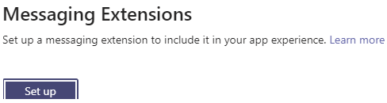
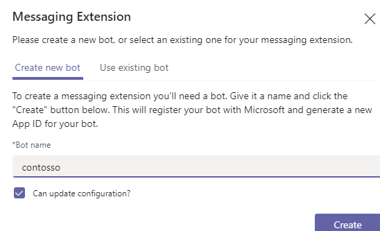

# Define messaging extension action commands

[!include[v4-to-v3-SDK-pointer](~/includes/v4-to-v3-pointer-me.md)]

Action commands allow you present your users with a modal popup called a task module in Teams to collect or display information, then process their interaction and send information back to Teams. Before creating the action command you need to decide:

1. Where can the [action command be triggered from?](#choose-action-command-invoke-locations)
1. How is the [task module created?](#choose-how-to-build-your-task-module)
1. Will the [final message or card be sent](#choose-how-the-final-message-is-sent) to the channel from a bot, or inserted into the compose message area for the user to submit?

## Choose action command invoke locations

By specifying the `context` in your app manifest, the action command is invoked from one or more of the following locations:

* The buttons at the bottom of the compose message area.
* By @mentioning your app in the command box. You can not respond with a bot message inserted directly into the conversation if your messaging extension is invoked from the command box.
* Directly from an existing message through the overflow menu on a message. The initial invoke to your bot includes a JSON object containing the message from which it was invoked, which you can process before presenting them with a task module.

## Choose how to build your task module

In addition to choosing where your command is invoked from, you must also choose how to populate the form in the task module for your users. You have three options for creating the form that is rendered inside the task module:

* **Static list of parameters** - This is the simplest option. You can define a list of parameters input fields in your app manifest the Teams client renders. You can not control the formatting with this option.
* **Adaptive card** - You can choose to use an adaptive card, which provides greater control over the UI, but still limits you on the available controls and formatting options.
* **Embedded web view** - If you need complete control over the UI and controls, you can choose to embed a custom web view in the task module.

If you choose to create your task module with a static list of parameters, the first call to your messaging extension will be when a user submits the task module. When using an embedded web view or an adaptive card, your messaging extension will need to handle an initial invoke event from the user, create the task module, and return it back to the client.

## Choose how the final message is sent

In most cases, your action command results in a card inserted into the compose message box. Your user can then decide to send it into the channel or chat. The message in this case comes from the user, and your bot can not edit or update the card further.

If your messaging extension is triggered from the compose box or directly from a message, your web service can insert the final response directly into the channel or chat. In this case, the adaptive card comes from the bot, the bot will be able to update it, and the bot can also reply to the conversation thread if needed. You will need to add the `bot` object to your app manifest using the same Id and defining the appropriate scopes.

## Add the action command to your app manifest

Now that you have decided how users interacts with your action command, it is time to add it to your app manifest. To do this you'll add a new `composeExtension` object to the top level of your app manifest JSON. You can either do so with the help of App Studio, or manually.

### Create an action command using App Studio

The prerequisite to create a search command is that you must already create a messaging extension. For information on how to create a messaging extension, see [created a messaging extension](~/messaging-extensions/how-to/create-messaging-extension.md).

1. Open **App Studio** from the Microsoft Teams client, and select the **Manifest Editor** tab.
1. If you already created your app package in **App Studio**, choose it from the list. If you have not created an app package, import an existing one.
1. After importing an app package, select **Messaging extensions** under **Capabilities**. You get a pop-up window to set up the messaging extension.
1. Select **Set up** in the window to include the messaging extension in your app experience. The following screenshot displays the messaging extension set up window: 

    

1. To create a messaging extension, you need a Microsoft registered bot. You can either use an existing bot or create a new bot. Select **Create new bot** option, give a name for the new bot, and select **Create**.The following screenshot displays bot creation for messaging extension:

    

1. Select **Add** in the **Command section** of the messaging extensions page.
1. Choose **Allow users to trigger actions in external services while inside of Teams**. The following screenshot displays the action command parameter selection:
    

1. If you want to use a static set of parameters to create your task module, select that option. Otherwise, choose to **Fetch a dynamic set of parameters from your bot**.
1. Add a **Command Id** and a **Title**.
1. Select where you want your action command to be triggered from.
1. If you are using parameters for your task module, add the first one.The following screenshot displays the task module parameter selection:
    

1. Select **Save**
1. If you need to add more parameters, select the **Add** button in the **Parameters** section to add them.

### Create an action command manually

To manually add your action-based messaging extension command to your app manifest, you must  add the follow parameters to your `composeExtension.commands` array of objects.

| Property name | Purpose | Required? | Minimum manifest version |
|---|---|---|---|
| `id` | This property is an unique ID that you assign to this command. The user request includes this ID. | Yes | 1.0 |
| `title` | This property is a command name. This value appears in the UI. | Yes | 1.0 |
| `type` | This property must be an `action` | No | 1.4 |
| `fetchTask` | This property is set to `true` for an adaptive card or embedded web view for your task module, and`false` for a static list of parameters or when loading the web view by a `taskInfo` | No | 1.4 |
| `context` | This property is an optional array of values that defines where the messaging extension is invoked from. The possible values are `message`, `compose`, or `commandBox`. Default is `["compose", "commandBox"]`. | No | 1.5 |

If you are using a static list of parameters, you must add them as well.

| Property name | Purpose | Is required? | Minimum manifest version |
|---|---|---|---|
| `parameters` | Static list of parameters for the command. Only use when `fetchTask` is `false` | No | 1.0 |
| `parameter.name` | This property describes the name of the parameter. This is sent to your service in the user request. | Yes | 1.0 |
| `parameter.description` | This property describes the parameter’s purposes or example of the value that should be provided. This value appears in the UI. | Yes | 1.0 |
| `parameter.title` | This property is a short user-friendly parameter title or label. | Yes | 1.0 |
| `parameter.inputType` | This property is set to the type of input required. The possible values include `text`, `textarea`, `number`, `date`, `time`, `toggle`. The default value is set to `text` | No | 1.4 |

If you are using an embedded web view, you can optionally add the `taskInfo` object to fetch your web view without calling your bot directly. If you choose to use this option, the behavior is similar to using a static list of parameters in that the first interaction with your bot is  [responding to the task module submit action](~/messaging-extensions/how-to/action-commands/respond-to-task-module-submit.md). If you are using a `taskInfo` object, you must set the `fetchTask` parameter to `false`.

| Property name | Purpose | Is required? | Minimum manifest version |
|---|---|---|---|
|`taskInfo`|Specify the task module to preload when using a messaging extension command| No | 1.4 |
|`taskInfo.title`|Initial task module title|No | 1.4 |
|`taskInfo.width`|Task module width - either a number in pixels or default layout such as 'large', 'medium', or 'small'|No | 1.4 |
|`taskInfo.height`|Task module height - either a number in pixels or default layout such as 'large', 'medium', or 'small'|No | 1.4 |
|`taskInfo.url`|Initial web view URL|No | 1.4 |

#### App manifest example

The following section is an example of a `composeExtensions` object defining two action commands. It is not an example of the complete manifest. For the complete app manifest schema see [app manifest schema](~/resources/schema/manifest-schema.md).

```json
...
"composeExtensions": [
  {
    "botId": "12a3c29f-1fc5-4d97-a142-12bb662b7b23",
    "canUpdateConfiguration": true,
    "commands": [
      {
        "id": "addTodo",
        "description": "Create a To Do item",
        "title": "Create To Do",
        "type": "action",
        "context": ["commandBox", "message", "compose"],
        "fetchTask": true,
        "parameters": [
          {
            "name": "Name",
            "description": "To Do Title",
            "title": "Title",
            "inputType": "text"
          },
          {
            "name": "Description",
            "description": "Description of the task",
            "title": "Description",
            "inputType": "textarea"
          },
          {
            "name": "Date",
            "description": "Due date for the task",
            "title": "Date",
            "inputType": "date"
          }
        ]
      },
      {
        "id": "reassignTodo",
        "description": "Reassign a todo item",
        "title": "Reassign a todo item",
        "type": "action",
        "fetchTask": true,
      }
    ]
  }
]
...
```

## Code sample

| Sample Name           | Description | .NET    | Node.js   |   
|:---------------------|:--------------|:---------|:--------|
|Messaging extension with action-based commands| Describes how to define action commands, create task module, and  respond to task module submit action  |[View](https://github.com/microsoft/BotBuilder-Samples/tree/master/samples/csharp_dotnetcore/51.teams-messaging-extensions-action)|[View](https://github.com/microsoft/BotBuilder-Samples/tree/master/samples/javascript_nodejs/51.teams-messaging-extensions-action) | 
|Messaging extension with search-based commands   |  Describes how to define search commands and respond to searches        |[View](https://github.com/microsoft/BotBuilder-Samples/tree/master/samples/csharp_dotnetcore/50.teams-messaging-extensions-search)|[View](https://github.com/microsoft/BotBuilder-Samples/tree/master/samples/javascript_nodejs/50.teams-messaging-extensions-search)|

## Next steps

If you are using either an adaptive card or an embedded web view without a `taskInfo` object, you want to:

> [!div class="nextstepaction"]
> [Create and respond with a task module](~/messaging-extensions/how-to/action-commands/create-task-module.md)

If you are using the parameters or an embedded web view with a `taskInfo` object, the next step for you is to:

> [!div class="nextstepaction"]
> [Respond to task module submit](~/messaging-extensions/how-to/action-commands/respond-to-task-module-submit.md)

