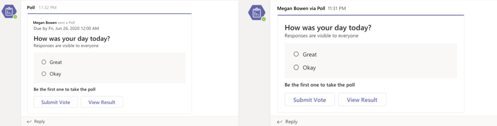

# Respond to the task module submit action

[!include[v4-to-v3-SDK-pointer](~/includes/v4-to-v3-pointer-me.md)]

After a user submits the task module, your web service receives a `composeExtension/submitAction` invoke message with the command ID and parameter values. Your app has five seconds to respond to the invoke, otherwise the user receives an error message *Unable to reach the app*, and any reply to the invoke is ignored by the Teams client.

You have the following options for responding:

* No response - Use the submit action to trigger a process in an external system, and not provide any feedback to the user. This is useful for long-running processes, and you can choose to provide feedback alternately for example, with a [proactive message](~/bots/how-to/conversations/send-proactive-messages.md).
* [Another task module](#respond-with-another-task-module) - You can respond with an additional task module as part of a multi-step interaction.
* [Card response](#respond-with-a-card-inserted-into-the-compose-message-area) - You can respond with a card that the user can interact with or insert into a message.
* [Adaptive Card from bot](#bot-response-with-adaptive-card) - Insert an Adaptive Card directly into the conversation.
* [Request the user authenticate](~/messaging-extensions/how-to/add-authentication.md)
* [Request the user provide additional configuration](~/messaging-extensions/how-to/add-configuration-page.md)

For authentication or configuration, after the user completes the flow the original invoke is resent to your web service. The following table shows which types of responses are available based on the invoke location `commandContext` of the messaging extension: 

|Response Type | compose | command bar | message |
|--------------|:-------------:|:-------------:|:---------:|
|Card response | x | x | x |
|Another task module | x | x | x |
|Bot with Adaptive Card | x |  | x |
| No response | x | x | x |

## The submitAction invoke event

Examples of receiving the invoke message are as follows:

# [C#/.NET](#tab/dotnet)

```csharp
protected override async Task<MessagingExtensionActionResponse> OnTeamsMessagingExtensionSubmitActionAsync(
  ITurnContext<IInvokeActivity> turnContext, MessagingExtensionAction action, CancellationToken cancellationToken) {
  //code to handle the submit action
}
```

# [JavaScript/Node.js](#tab/javascript)

```javascript
class TeamsMessagingExtensionsActionPreview extends TeamsActivityHandler {
  constructor() {
  handleTeamsMessagingExtensionSubmitAction(context, action) {
  
  //code to handle the submit action
    }
  }
}
```

# [JSON](#tab/json)

This is an example of the JSON object you receive. The `commandContext` parameter indicates where your messaging extension was triggered from. The `data` object contains the fields on the form as parameters, and the values the user submitted. The JSON object here is shortened to highlight the most relevant fields.

```json
{
  "name": "composeExtension/submitAction",
  "imdisplayname": "Bob Smith",
  "serviceUrl": "https://smba.trafficmanager.net/amer/",
  "value": {
    "commandId": "giveKudos",
    "commandContext": "compose",
    "context": {
      "theme": "default"
    },
    "data": {
      "id": "submitButton",
      "formField1": "formField1_value",
      "formField2": "formField2_value",
      "formField3": "formField3_value"
    }
  },
  "conversation": {
    "id": "19:7705841b240044b297123ad7f9c99217@thread.skype"
  }
}
```

* * *

## Respond with a card inserted into the compose message area

The most common way to respond to the `composeExtension/submitAction` request is with a card inserted into the compose message area. The user submits the card to the conversation. For more information on using cards, see [cards and card actions](~/task-modules-and-cards/cards/cards-actions.md).

# [C#/.NET](#tab/dotnet)

```csharp
protected override async Task<MessagingExtensionActionResponse> OnTeamsMessagingExtensionSubmitActionAsync(
  ITurnContext<IInvokeActivity> turnContext, MessagingExtensionAction action, CancellationToken cancellationToken)
{
    var response = new MessagingExtensionActionResponse
    {
        ComposeExtension = new MessagingExtensionResult
        {
            AttachmentLayout = "list",
            Type = "result",
        },
    };
    var createCardData = ((JObject)action.Data).ToObject<CreateCardData>();
var card = new HeroCard
{
     Title = createCardData.Title,
     Subtitle = createCardData.Subtitle,
     Text = createCardData.Text,
};
    var attachments = new List<MessagingExtensionAttachment>();
    attachments.Add(new MessagingExtensionAttachment
    {
        Content = card,
        ContentType = HeroCard.ContentType,
        Preview = card.ToAttachment(),
    });
    response.ComposeExtension.Attachments = attachments;
    return response;
}
```

# [JavaScript/Node.js](#tab/javascript)

```javascript
class TeamsMessagingExtensionsActionPreview extends TeamsActivityHandler {
  handleTeamsMessagingExtensionSubmitAction(context, action) {
    const data = action.data;
    const heroCard = CardFactory.heroCard(data.title, data.text);
    heroCard.content.subtitle = data.subTitle;
    const attachment = { contentType: heroCard.contentType, content: heroCard.content, preview: heroCard };

    return {
      composeExtension: {
        type: 'result',
        attachmentLayout: 'list',
        attachments: [
          attachment
        ]
      }
    }
  }
}
```

# [JSON](#tab/json)

```json
{
  "composeExtension": {
    "attachmentLayout": "list",
    "type": "result",
    "attachments": [
      {
        "preview": {
          "contentType": "application/vnd.microsoft.card.hero",
          "content": {
            "title": "formField1_value",
            "subtitle": "formField2_value",
            "text": "formField3_value"
          }
        },
        "contentType": "application/vnd.microsoft.card.hero",
        "content": {
          "title": "formField1_value",
          "subtitle": "formField2_value",
          "text": "formField3_value"
        }
      }
    ]
  }
}
```

* * *

## Respond with another task module

You can choose to respond to the `submitAction` event with an additional task module. This is useful when:

* You need to collect large amounts of information.
* If you need to dynamically change what information you are collecting based on user input.
* If you need to validate the information submitted by the user and potentially resend the form with an error message if something is wrong. 

The method for response is the same as [responding to the initial `fetchTask` event](~/messaging-extensions/how-to/action-commands/create-task-module.md). If you are using the Bot Framework SDK the same event triggers for both submit actions. This means you must add logic that determines the correct response.

## Bot response with Adaptive Card

> [!NOTE]
> This flow requires that you add the `bot` object to your app manifest, and that you have the necessary scope defined for the bot. Use the same ID as your messaging extension for your bot.

You can also respond to the submit action by inserting a message with an Adaptive Card into the channel with a bot. Your user can preview the message before submitting it. This is very useful in scenarios where you gather information from your users before creating an adaptive card response, or when you update the card after someone interacts with it. The following scenario shows how the app Polly uses this flow to configure a poll without including the configuration steps in the channel conversation:

1. The user selects the messaging extension to trigger the task module.
1. The user configures the poll with the task module.
1. After submitting the task module the app uses the information provided to build the poll as an Adaptive Card and sends it as a `botMessagePreview` response to the client.
1. The user can then preview the adaptive card message before the bot inserts it into the channel. If the app is not already a member of the channel, select `Send` to add it.
   *  The user can also choose to `Edit` the message, which returns them to the original task module.
1. Interacting with the adaptive card changes the message before sending it.
1. After the user selects `Send` the bot posts the message to the channel.

### Respond to initial submit action

To enable this flow your task module should respond to the initial `composeExtension/submitAction` message with a preview of the card that the bot sends to the channel. The user gets  the opportunity to verify the card before sending, and also attempt to install your bot in the conversation if it is not already installed.

# [C#/.NET](#tab/dotnet)

```csharp
protected override async Task<MessagingExtensionActionResponse> OnTeamsMessagingExtensionSubmitActionAsync(
  ITurnContext<IInvokeActivity> turnContext, MessagingExtensionAction action, CancellationToken cancellationToken)
{
  dynamic createCardData = ((JObject) action.Data).ToObject(typeof(JObject));
  var response = new MessagingExtensionActionResponse
  {
    ComposeExtension = new MessagingExtensionResult
    {
      Type = "botMessagePreview",
      ActivityPreview = MessageFactory.Attachment(new Attachment
      {
        Content = new AdaptiveCard("1.0")
        {
          Body = new List<AdaptiveElement>()
          {
            new AdaptiveTextBlock() { Text = "FormField1 value was:", Size = AdaptiveTextSize.Large },
            new AdaptiveTextBlock() { Text = Data["FormField1"] as string }
          },
          Height = AdaptiveHeight.Auto,
          Actions = new List<AdaptiveAction>()
          {
            new AdaptiveSubmitAction
            {
              Type = AdaptiveSubmitAction.TypeName,
              Title = "Submit",
              Data = new JObject { { "submitLocation", "messagingExtensionFetchTask" } },
            },
          }
        },
        ContentType = AdaptiveCard.ContentType
      }) as Activity
    }
  };

  return response;
}
```

# [JavaScript/Node.js](#tab/javascript)

```javascript
class TeamsMessagingExtensionsActionPreview extends TeamsActivityHandler {
  handleTeamsMessagingExtensionSubmitAction(context, action) {
    const submittedData = action.data;
    const adaptiveCard = CardFactory.adaptiveCard({
      actions: [
        { type: 'Action.Submit', title: 'Submit', data: { submitLocation: 'messagingExtensionSubmit' } }
      ],
      body: [
          { text: 'Adaptive Card from Task Module', type: 'TextBlock', weight: 'bolder' },
          { text: `${ submittedData.Question }`, type: 'TextBlock', id: 'Question' },
          { id: 'Answer', placeholder: 'Answer here...', type: 'Input.Text' },
        {
          choices: [
            { title: submittedData.Option1, value: submittedData.Option1 },
            { title: submittedData.Option2, value: submittedData.Option2 },
            { title: submittedData.Option3, value: submittedData.Option3 }
          ],
          id: 'Choices',
          isMultiSelect: submittedData.MultiSelect,
          style: 'expanded',
          type: 'Input.ChoiceSet'
        }
      ],
      type: 'AdaptiveCard',
      version: '1.0'
    });
    return {
      composeExtension: {
        activityPreview: MessageFactory.attachment(adaptiveCard, null, null, InputHints.ExpectingInput),
        type: 'botMessagePreview'
      }
    };
  }
}
```

# [JSON](#tab/json)

>[!Note]
>The `activityPreview` must contain a `message` activity with exactly 1 adaptive card attachment. The `<< Card Payload >>` value is a placeholder for the card you wish to send.

```json
{
  "composeExtension": {
    "type": "botMessagePreview",
    "activityPreview": {
      "type": "message",
      "attachments":  [
        {
          "contentType": "application/vnd.microsoft.card.adaptive",
          "content": << Card Payload >>
        }
      ]
    }
  }
}
```

* * *

### The botMessagePreview send and edit events

Your message extension must respond now to two new varieties of the `composeExtension/submitAction` invoke, where `value.botMessagePreviewAction = "send"`and `value.botMessagePreviewAction = "edit"`.

# [C#/.NET](#tab/dotnet)

```csharp
protected override async Task<MessagingExtensionActionResponse> OnTeamsMessagingExtensionBotMessagePreviewEditAsync(
  ITurnContext<IInvokeActivity> turnContext, MessagingExtensionAction action, CancellationToken cancellationToken)
{
  //handle the event
}

protected override async Task<MessagingExtensionActionResponse> OnTeamsMessagingExtensionBotMessagePreviewSendAsync(
  ITurnContext<IInvokeActivity> turnContext, MessagingExtensionAction action, CancellationToken cancellationToken)
{
  //handle the event
}

```

# [JavaScript/Node.js](#tab/javascript)

```javascript
class TeamsMessagingExtensionsActionPreview extends TeamsActivityHandler {
  handleTeamsMessagingExtensionBotMessagePreviewEdit(context, action) {

    //handle the event
  }
  
  handleTeamsMessagingExtensionBotMessagePreviewSend(context, action) {

    //handle the event
  }
}

```

# [JSON](#tab/json)

```json
{
  "name": "composeExtension/submitAction",
  "type": "invoke",
  "conversation": { "id": "19:c366b75791784100b6e8b515fd55b063@thread.skype" },
  "imdisplayname": "Pranav Smith",
  ...
  "value": {
    "botMessagePreviewAction": "edit | send",
    "botActivityPreview": [
      {
        "type": "message/card",
        "attachments": [
          {
            "content":
              {
                "type": "AdaptiveCard",
                "body": [{<<card payload>>}]
              },
            "contentType" : "application/vnd.microsoft.card.adaptive"
          }
        ],
        "context": { "theme": "default" }
      }
    ],
  }
}
```

* * *

### Respond to botMessagePreview edit

If the user edits the card before sending by selecting the **Edit** button, you receive a `composeExtension/submitAction` invoke with `value.botMessagePreviewAction = edit`. You should typically respond by returning the task module you sent in response to the initial `composeExtension/fetchTask` invoke that began the interaction. This allows the user to start the process over by re-entering the original information. Use the available information to pre-populate the task module so the user does not have to fill out all of the information from scratch.

See [responding to the initial `fetchTask` event](~/messaging-extensions/how-to/action-commands/create-task-module.md).

### Respond to botMessagePreview send

After the user selects the **Send** button, you receive a `composeExtension/submitAction` invoke with `value.botMessagePreviewAction = send`. Your web service has to create and send a proactive message with the Adaptive Card to the conversation, and also reply to the invoke.

# [C#/.NET](#tab/dotnet)

```csharp
protected override async Task<MessagingExtensionActionResponse> OnTeamsMessagingExtensionBotMessagePreviewSendAsync(
  ITurnContext<IInvokeActivity> turnContext, MessagingExtensionAction action, CancellationToken cancellationToken)
{
  var activityPreview = action.BotActivityPreview[0];
  var attachmentContent = activityPreview.Attachments[0].Content;
  var previewedCard = JsonConvert.DeserializeObject<AdaptiveCard>(attachmentContent.ToString(),
          new JsonSerializerSettings { NullValueHandling = NullValueHandling.Ignore });
  
  previewedCard.Version = "1.0";

  var responseActivity = Activity.CreateMessageActivity();
  Attachment attachment = new Attachment()
  {
    ContentType = AdaptiveCard.ContentType,
    Content = previewedCard
  };
  responseActivity.Attachments.Add(attachment);
  
  // Attribute the message to the user on whose behalf the bot is posting
  responseActivity.ChannelData = new {
    OnBehalfOf = new []
    {
      new
      {
        ItemId = 0,
        MentionType = "person",
        Mri = turnContext.Activity.From.Id,
        DisplayName = turnContext.Activity.From.Name
      }  
    }
  };
  
  await turnContext.SendActivityAsync(responseActivity);

  return new MessagingExtensionActionResponse();
}
```

# [JavaScript/Node.js](#tab/javascript)

```javascript
class TeamsMessagingExtensionsActionPreview extends TeamsActivityHandler {
    async handleTeamsMessagingExtensionBotMessagePreviewSend(context, action) {
      // The data has been returned to the bot in the action structure.
      const activityPreview = action.botActivityPreview[0];
      const attachmentContent = activityPreview.attachments[0].content;
      const userText = attachmentContent.body[1].text;
      const choiceSet = attachmentContent.body[3];

      const submitData = {
        MultiSelect: choiceSet.isMultiSelect ? 'true' : 'false',
        Option1: choiceSet.choices[0].title,
        Option2: choiceSet.choices[1].title,
        Option3: choiceSet.choices[2].title,
        Question: userText
      };

      const adaptiveCard = CardFactory.adaptiveCard({
        actions: [
          { type: 'Action.Submit', title: 'Submit', data: { submitLocation: 'messagingExtensionSubmit' } }
        ],
        body: [
          { text: 'Adaptive Card from Task Module', type: 'TextBlock', weight: 'bolder' },
          { text: `${ submitData.Question }`, type: 'TextBlock', id: 'Question' },
          { id: 'Answer', placeholder: 'Answer here...', type: 'Input.Text' },
          {
            choices: [
                { title: submitData.Option1, value: submitData.Option1 },
                { title: submitData.Option2, value: submitData.Option2 },
                { title: submitData.Option3, value: submitData.Option3 }
            ],
            id: 'Choices',
            isMultiSelect: submitData.MultiSelect,
            style: 'expanded',
            type: 'Input.ChoiceSet'
          }
        ],
        type: 'AdaptiveCard',
        version: '1.0'
      });
      const responseActivity = { type: 'message', attachments: [adaptiveCard], channelData: {
          onBehalfOf: [
              { itemId: 0, mentionType: 'person', mri: context.activity.from.id, displayname: context.activity.from.name }
          ]
      }};

      await context.sendActivity(responseActivity);
    }
}
```

# [JSON](#tab/json)

You receive a new `composeExtension/submitAction` message similar to the following:

```json
{
  "name": "composeExtension/submitAction",
  "type": "invoke",
  "conversation": { "id": "19:c366b75791784100b6e8b515fd55b063@thread.skype" },
  "imdisplayname": "Pranav Smith",
  ...
  "value": {
    "botMessagePreviewAction": "send",
    "botActivityPreview": [
      {
        "type": "message/card",
        "attachments": [
          {
            "content":
              {
                "type": "AdaptiveCard",
                "body": [{<<card payload>>}]
              },
            "contentType" : "application/vnd.microsoft.card.adaptive"
          }
        ],
        "context": { "theme": "default" }
      }
    ],
  }
}
```

* * *

### User attribution for bots messages 

In scenarios where a bot sends messages on behalf of a user, attributing the message to that user can help with engagement and showcase a more natural interaction flow. This feature allows you to attribute a message from your bot to a user on whose behalf it was sent.

In the following image, on the left is a card message sent by a bot *without* user attribution and on the right is a card sent by a bot *with* user attribution.



To use the user attribution in teams, you must  add the `OnBehalfOf` mention entity to `ChannelData` in your `Activity` payload that is sent to Teams.

# [C#/.NET](#tab/dotnet-1)

```csharp
    OnBehalfOf = new []
    {
      new
      {
        ItemId = 0,
        MentionType = "person",
        Mri = turnContext.Activity.From.Id,
        DisplayName = turnContext.Activity.From.Name
      }  
    }

```

# [JSON](#tab/json-1)

```json
{
    "text": "Hello World!",
    "ChannelData": {
        "OnBehalfOf": [{
            "itemid": 0,
            "mentionType": "person",
            "mri": "29:orgid:89e6508d-6c0f-4ffe-9f6a-b58416d965ae",
            "displayName": "Sowrabh N R S"
        }]
    }
}
```

* * *

The following section is a description of the entities in the `OnBehalfOf` of Array:

#### Details of  `OnBehalfOf` entity schema

|Field|Type|Description|
|:---|:---|:---|
|`itemId`|Integer|Should be 0|
|`mentionType`|String|Should be "person"|
|`mri`|String|Message resource identifier​ (MRI) of the person on whose behalf the message is sent. Message sender name would appear as "\<user\> via \<bot name\>".|
|`displayName`|String|Name of the person. Used as fallback in case name resolution is unavailable.|
  
## Next Steps

Add a search command

> [!div class="nextstepaction"]
> [Define search commands](~/messaging-extensions/how-to/search-commands/define-search-command.md)

> [!div class="nextstepaction"]
> !include[messaging-extension-learn-more](~/includes/messaging-extensions/learn-more.md)]
