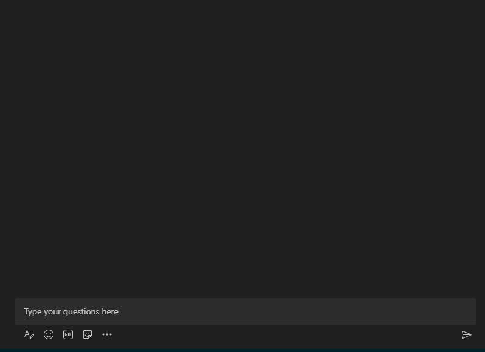

# Build message extensions

Message extensions enable users to engage with your web service through buttons and forms within the Microsoft Teams client. Users can search or initiate actions in an external system from the compose message area, the command box, or directly from a message. You can return the results of these interactions to the Teams client as a richly formatted card.

> [!IMPORTANT]
> Message extensions are available in [Government Community Cloud (GCC), GCC High, Department of Defense (DoD)](../concepts/cloud-overview.md#teams-app-capabilities), and [Teams operated by 21Vianet](../concepts/sovereign-cloud.md) environments.

This article provides an overview of message extensions, use cases, functionality, action and search commands, and link unfurling.

The following image displays the locations from where users can invoke message extensions:

> [!NOTE]
>
> * You can't @mention message extensions in the compose box.
> * Teams doesn't support message extension options for group chats with external users.

# [Desktop](#tab/desktop)

:::image type="content" source="../assets/images/messaging-extension-invoke-locations.png" alt-text="Screenshot shows the message extensions invoke location on Teams desktop.":::

# [Mobile](#tab/mobile)

:::image type="content" source="../assets/images/messaging-extension-invoke-location-mobile.png" alt-text="Screenshot shows the message extensions invoke location on Teams mobile.":::

---

## Scenarios where message extensions are used

|Scenario|Example|
|:-----------------|:-----------------|
|You need an external system to perform an action and return the result to your conversation.|Reserve a resource and allow the channel to know the reserved time slot.|
|You need to search for something in an external system and share the results with the conversation.|Search for a work item in Azure DevOps and share it with the group as an Adaptive Card.|
|You want to complete a complex task involving multiple steps or large amounts of information in an external system and share the results with a conversation.|Create a bug in your tracking system based on a Teams message, assign that bug, and send a card to the conversation thread with the bug's details.|

## Understand how message extensions work

A message extension is composed of a web service that you host and an app manifest that defines the location where your web service is invoked within the Teams client. The web service uses the Bot Framework's messaging schema and secure communication protocol, so you must register your web service as a bot in the Bot Framework.

> [!NOTE]
> Although you can manually create the web service, use the [Bot Framework SDK](https://github.com/microsoft/botframework-sdk) to work with the protocol.

In the app manifest (previously called the Teams app manifest), you define a single message extension with up to 10 different commands. Each command defines a type, such as action or search, and the locations in the client where the message extension is invoked. The invoke locations include the compose message area, command bar, and message. When you invoke the message extension, the web service receives an HTTPS message with a JSON payload that contains all the relevant information. Respond with a JSON payload to inform the Teams client of the next interaction to enable.

## Message extension command types

There are two types of message extension commands: action commands and search commands. The message extension command type defines the UI elements and interaction flows available to your web service. Both command types provide interactions for authentication and configuration.

### Action commands

Use action commands to present users with a modal pop-up to collect or display information. When the user submits the form, your web service responds by inserting a message into the conversation directly or into the compose message area. Later, the user can submit the message. For more complex workflows, you can link multiple forms together.

Trigger action commands from the compose message area, the command box, or a message. When you invoke the command from a message, the initial JSON payload sent to your bot includes the entire message from which it was invoked. The following image displays the message extension action command dialog (referred to as task module in TeamsJS v1.x):

:::image type="content" source="../assets/images/task-module.png" alt-text="Message extension action command dialog":::

### Search commands

Search commands allow you to search an external system for information. To use search commands, enter a query manually into the search box or insert a link to a monitored domain in the compose message area, then embed the search results into a message. In a simple search command flow, the initial invoke message includes the search string submitted by the user. You respond with a list of cards and card previews. The Teams client renders a list of card previews for the user. When the user selects a card from the list, the full-size card is inserted into the compose message area.

You trigger the cards from the compose message area or the command box, but not from a message. You can't trigger them from a message.
The following image displays the message extension search command dialog:

:::image type="content" source="../assets/images/search-extension.png" alt-text="Message extension search command":::

> [!NOTE]
> For more information on cards, see [what are cards](../task-modules-and-cards/what-are-cards.md).

## Link unfurling

> [!NOTE]
> Link unfurling is supported only for bot-based message extensions.

When you paste a URL in the compose message area, Teams invokes a web service. This functionality is known as link unfurling. You can subscribe to receive an invoke message when URLs containing a specific domain are pasted into the compose message area. Your web service can **unfurl** the URL into a detailed card, providing more information than the standard website preview card. You can add buttons to allow the users to immediately take action without leaving the Teams client.
The following images display link unfurling feature when a link is pasted in a message extension:

:::image type="content" source="../assets/images/messaging-extension/unfurl-link.png" alt-text="unfurl link":::

## Build message extensions

To build a message extension, use one of the following methods:

* **Build message extensions using API (API-based)**: Create a message extension from an existing API. This method requires an OpenAPI Description (OAD) document.

* **Build message extensions using Bot Framework (Bot-based)**: Create a new message extension from a bot if you want a one-on-one conversational experience.

[!INCLUDE [bot-based-me-note](../includes/messaging-extensions/bot-based-me-note.md)]

The following table helps you select a message extension type to get started:

:::row:::
    :::column:::
**API-based message extension** 

* Simpler and faster to create and maintain.
* Message extension uses an API.
* No extra code or resource is required for bot logic.
* Ideal for scenarios where the message extension only needs to communicate with a web service and doesn't need any complex logic or state management.
* Traffic is privatized as they don’t depend on Azure bot infrastructure.
* Supports search commands.

    :::column-end:::
    :::column:::

**Bot-based message extension** 

* More flexible.
* Message extension uses a Bot Framework.
* Can use the full capabilities of a bot.
* Ideal for scenarios where the message extension needs to communicate with multiple services, manage complex logic or user interactions, or maintain state across sessions.
* Supports action commands, search commands, and link unfurling.

    :::column-end:::
:::row-end:::

 

:::image type="content" source="../assets/images/Copilot/api-bot-based-message-extension-decision-tree.png" alt-text="Screenshot shows the decision tree, which helps the user to choose between API based and bot based message extension.":::

**Select an option to start building a message extension:**

:::row:::
    :::column span="4":::
        &nbsp;&nbsp;&nbsp;&nbsp;&nbsp;&nbsp; :::image type="content" source="../assets/images/Copilot/build-message-extension-api-tile.png" alt-text="Screenshot shows the OpenAPI icon tile." link="api-based-overview.md" border="false":::
    :::column-end:::
    :::column span="4":::
        &nbsp;&nbsp;&nbsp;&nbsp;&nbsp;&nbsp;:::image type="content" source="../assets/images/Copilot/build-message-extension-bot-tile.png" alt-text="Screenshot shows the Bot Framework tile." link="build-bot-based-message-extension.md" border="false":::
    :::column-end:::
:::row-end:::

## Code sample

| **Sample name** | **Description** | **.NET** | **Node.js** | **Python** |
|------------|-------------|----------------|------------|------------|
| Message extension with action-based commands | This sample demonstrates how to create Action-Based Message Extensions for Microsoft Teams, enabling users to interactively generate content. It features bots, message extensions, and seamless integration with user inputs for enhanced functionality. | [View](https://github.com/OfficeDev/Microsoft-Teams-Samples/tree/main/samples/TeamsSDK/Archived/msgext-action/csharp) | [View](https://github.com/OfficeDev/Microsoft-Teams-Samples/tree/main/samples/TeamsSDK/Archived/msgext-action/nodejs) | [View](https://github.com/OfficeDev/Microsoft-Teams-Samples/tree/main/samples/TeamsSDK/Archived/msgext-action/python) |
| Message extension with search-based commands | This sample demonstrates how to create a Message Extension in Microsoft Teams that allows users to perform searches and retrieve results. | [View](https://github.com/OfficeDev/Microsoft-Teams-Samples/tree/main/samples/TeamsSDK/bot-message-extensions/dotnet/bot-message-extensions)|[View](https://github.com/OfficeDev/Microsoft-Teams-Samples/tree/main/samples/TeamsSDK/bot-message-extensions/nodejs/bot-message-extensions)|[View](https://github.com/OfficeDev/Microsoft-Teams-Samples/tree/main/samples/TeamsSDK/bot-message-extensions/python/bot-message-extensions) |
|Message extension action preview| This sample app illustrates how to use action previews in Teams Message Extensions, allowing users to create cards from input in a Task Module. It showcases bot interactions that enhance user engagement by attributing messages to users. |[View](https://github.com/OfficeDev/Microsoft-Teams-Samples/tree/main/samples/TeamsSDK/Archived/msgext-action-preview/csharp)|[View](https://github.com/OfficeDev/Microsoft-Teams-Samples/tree/main/samples/TeamsSDK/Archived/msgext-action-preview/nodejs) |NA|
|Message extension action for task scheduling|This sample demonstrates a Message Extension that allows users to schedule tasks and receive reminder cards in Microsoft Teams.|[View](https://github.com/OfficeDev/Microsoft-Teams-Samples/tree/main/samples/TeamsSDK/Archived/msgext-message-reminder/csharp)|[View](https://github.com/OfficeDev/Microsoft-Teams-Samples/tree/main/samples/TeamsSDK/Archived/msgext-message-reminder/nodejs)| NA |
| Northwind inventory message extension| This sample implements a Teams message extension that you can use as a plugin for Microsoft 365 Copilot. The message extension allows users to query the Northwind Database. | NA |[View](https://github.com/OfficeDev/Microsoft-Teams-Samples/tree/main/samples/TeamsSDK/Archived/msgext-copilot-handoff/ts) |NA |
