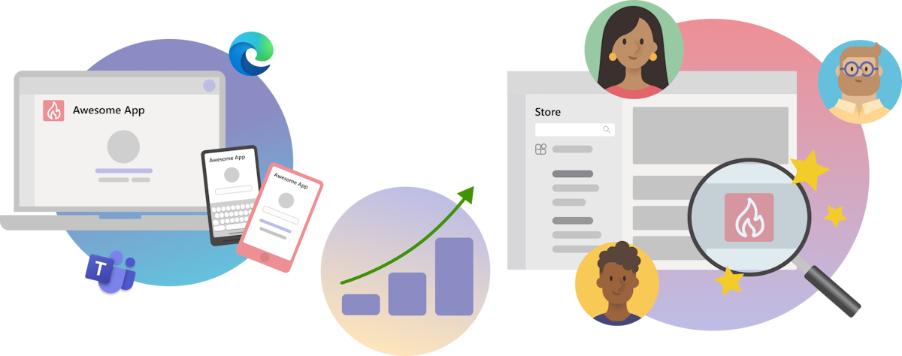
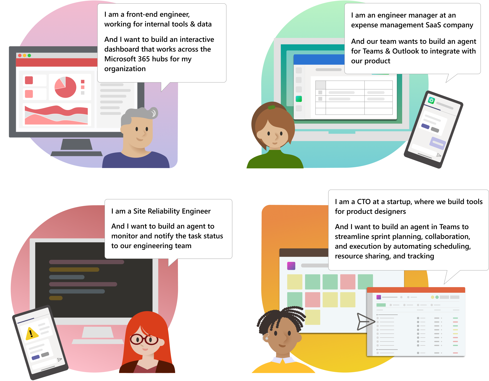
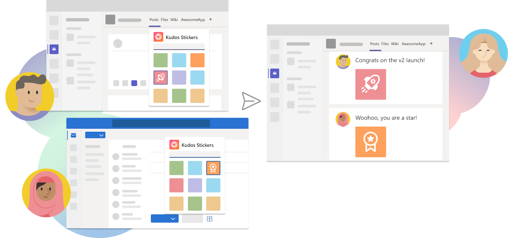
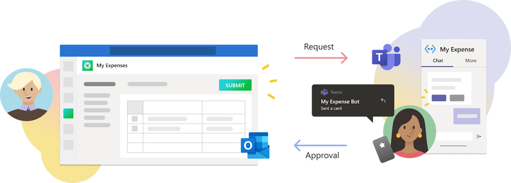
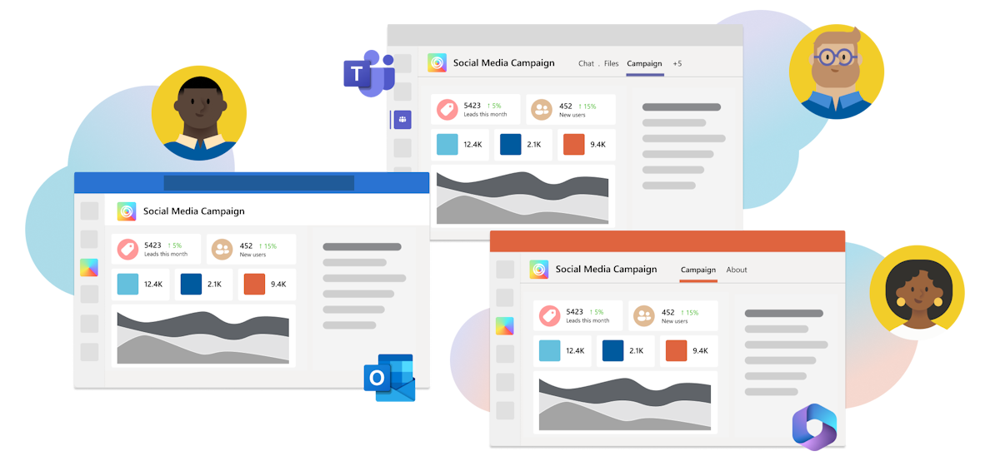

# Customizable Teams Applications

Microsoft Teams provides a range of apps developed by both Microsoft and third-party services. These applications can be extended to work with both Outlook and Microsoft 365. A Teams app can exist as:

* Tabs
* Bots
* Message Extensions
* Any combination of these capabilities

These apps can offer personal or shared experiences. A personal app allows communication one-on-one, while a shared app facilitates multi-user collaboration.

## Achieving Organizational Goals through Teams Apps

Apps play a crucial role in an organization's communication and collaboration efforts. They foster concise communication, provide integration with essential services, and ensure access on the go. This is why organizations are increasingly adopting app use.

Apps can be used for various purposes like connecting with customers, delivering services, and sharing information. However, their utility goes beyond this. They provide a shared workplace for collaboration, helping to create a cohesive business environment that caters to both external and internal demands.

The following diagram elucidates the reasons for building a Teams App:

Here is a breakdown of development options, business opportunities, customer benefits and internal workflows achieved through developing apps:

| Development Options | Business Opportunities | Customer Benefits | Internal Workflows |
| --- | --- | --- | ---
| * Desktop App   * Web App   * Mobile App | * Increase user engagement   * Make your app discoverable on Microsoft Teams Store | * 24/7 accessibility   * Secure customer data   * Seamless communication  | * Automate repetitive tasks   * Simplify tasks with bots, such as Q&A and helpdesk |

Teams allows you to tailor your apps to meet your needs. Whether building a completely new app for Teams or integrating an existing one, you can take full advantage of the Teams platform's benefits.

Here are some real-world developer personas and app scenarios for better understanding:

All these scenarios can be fulfilled with Teams apps, enhancing collaboration within your Teams across Microsoft 365.

## Advantages of Developing Apps with Microsoft Teams Platform

Teams apps improve productivity by bringing key information, common tools, and established processes to your collaborative workspace. These apps can be customized to fulfill specific requirements. Whether you're creating something new or integrating an existing app, Teams platform benefits can be leveraged for your unique business needs.

Teams is especially suited for app creation due to the following benefits:

* **Promotes Communication and Collaboration**: Successful Teams apps gather information from other systems, promote discussions about it, and initiate actions. All these tasks can be performed within the Teams client with the additional feature of pushing information to a particular audience based on events or actions in an external system.

* **Caters to Social Interactions**: Teams acts as a social platform. Social-oriented custom apps can extend your company culture into your collaboration space. These apps enable sending polls, sharing feedback, connecting, and communicating.

    

* **Aids in Routine Business Processes**: Tasks such as creating and sharing a sales call report, tracking project timelines, reserving resources, submitting help desk requests or expense reports are repetitive. These tasks can be effectively handled by Teams apps.

    

* **Offers Personal Apps with Tabs and Bots**: Personalized bots in Teams facilitate one-on-one conversations. These conversations take place solely between the bot and the user. For example, a shared bot that notifies all users can bolster user engagement in a multi-user design tool app. Moreover, a chat bot can replace emails and phone correspondences with IT or HR departments.

* **Integration of Pre-existing Apps**: If you already have a web app, SharePoint site (or SPFx extension), PowerApp, or other web-based application, it's possible to integrate it with Teams. This helps to increase your user base and engagement.

    

* **Leverages the Teams Store Advantage**: You can get your app on Teams Store to improve its availability and utilize it as a marketing tool. If you own a startup, Teams platform can help to promote your products. The Teams Store also allows larger audiences to discover your app.

* **Supports Building Once and Running Everywhere**: Teams allows you to extend your app across Microsoft 365 through a single codebase. This delivers cross-platform apps without users leaving their work context. This also benefits administrators through a consolidated management and deployment workflow.

    This can be achieved by using the latest app manifest and Teams JavaScript client library versions. Personal tabs and message extension apps can run in other Microsoft 365 experiences along with Teams. It allows reaching users on platforms like Outlook and Microsoft 365 app, thereby extending your app's reach and streamlining your development and distribution processes.

## Next Steps
> [!div class="nextstepaction"]
> [From Ideas to a Teams App](overview-story.md)