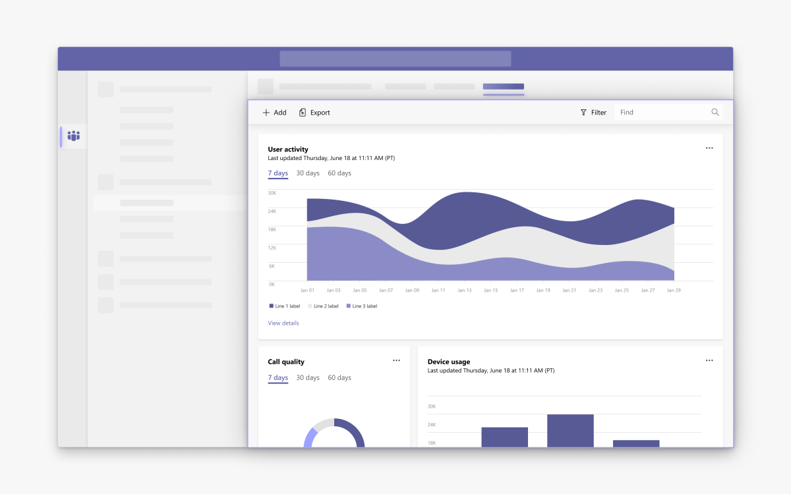
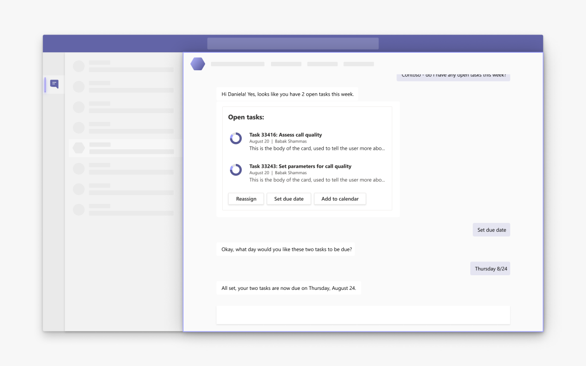
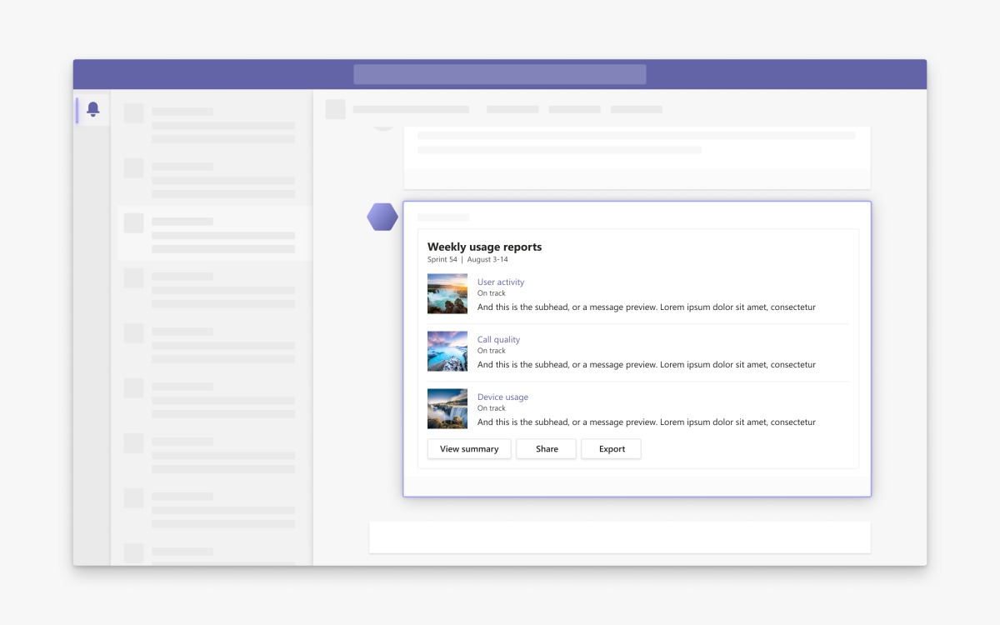

# What are Microsoft Teams apps?

Microsoft Teams apps bring key information, common tools, and trusted processes to where people increasingly gather, learn, and work.

Apps are how you extend Teams to fit your needs. You can create something brand new for Teams or simply integrate features in your favorite apps and services.

 

> [!VIDEO https://www.microsoft.com/en-us/videoplayer/embed/RE4AUyE]

## What can Teams apps do?

People discover and use Teams apps through a set of core capabilities that include tabs, messaging extensions, bots, and connectors. Your app can use one or a combination of capabilities. You can specify your app's scope for only personal workspaces or expand it to group chats and team channel activities.

Some apps are simple (send notifications), while others are complex (view patient records). When planning your app, remember that Teams is a collaboration hub. The best Teams apps help people express themselves and work better together.

:::row:::
   :::column span="1":::
      
   :::column-end:::
   :::column span="1":::
   :::column-end:::
:::row-end:::

### Get information more conveniently

Sometimes you just need to make things easier to find. Display an important webpage in a [tab](tabs/what-are-tabs.md), which provides a full-screen web experience for static and dynamic content in Teams.

:::row:::
   :::column span="1":::
      
   :::column-end:::
   :::column span="1":::
   :::column-end:::
:::row-end:::

### Collaborate on everything in one place

A core benefit of Teams apps is pulling information somewhere outside Teams into a conversation. For example, an app that uses [messaging extensions](messaging-extensions/what-are-messaging-extensions.md) allows people to share rich, easily digestible content from an essential tool or system without leaving the chat.

:::row:::
   :::column span="1":::
      
   :::column-end:::
   :::column span="1":::
   :::column-end:::
:::row-end:::

### Turn words into actions

Conversations often result in the need to do something (create an order, review my code, etc.). A [bot](bots/what-are-bots.md) can kick off these kinds of workflows right inside Teams.

:::row:::
   :::column span="1":::
      
   :::column-end:::
   :::column span="1":::
   :::column-end:::
:::row-end:::

### Send reminders people notice

Sick of sending reminders through email? Do it through Teams instead! With [connectors](webhooks-and-connectors/what-are-webhooks-and-connectors.md), you can use incoming webhooks to send notifications to channels that also display in a user's Activity feed.

:::image type="content" source="assets/images/overview-graph.png" alt-text="Conceptual representation of the Microsoft Graph REST API for Teams." border="false":::

### Utilize Teams data

The [Microsoft Graph REST API for Teams](graph-api/rsc/resource-specific-consent.md) provides access to information about teams, channels, users, and messages that can help you create or enhance features for your app.

## Get started

:::row:::
    :::column span="":::
    :::column-end:::
    :::column span="":::

      

      :::image type="content" source="assets/images/overview-cta-build.png" alt-text="<alt text>" border="false":::
      
        <h3>Off and running</h3>

        Get to know your way around the platform by creating a basic Teams app.

        > [!div class="nextstepaction"]
        > [Build your first app now](build-your-first-app/build-and-run.md)

      

    :::column-end:::
    :::column span="":::
    :::column-end:::
:::row-end:::

:::row:::
   :::column span="":::

      

      :::image type="content" source="assets/images/overview-cta-integrate.png" alt-text="<alt text>" border="false":::
      
        <h3>Bring it together</h3>

        Incorporate your favorite web apps and services into Teams for a seamless user experience.

        > [!div class="nextstepaction"]
        > [Integrate an app or service](samples/integrating-web-apps.md)

      

   :::column-end:::

   :::column span="":::

   :::column-end:::

   :::column span="":::

      

        :::image type="content" source="assets/images/overview-cta-plan.png" alt-text="<alt text>" border="false":::
      
        <h3>Take your time</h3>

        Walk through how to plan, design, build, and publish a Teams app from scratch.

        > [!div class="nextstepaction"]
        > [Start planning your app](planning-your-app/planning-overview.md)

      

   :::column-end:::
:::row-end:::

## Next steps

Get help at any point while creating your Teams app.

1. [Planning your app](planning-your-app/planning-overview.md)
1. [Designing your app](designing-your-app/designing-overview.md)
1. [Building your app](concepts/build-and-test/prepare-your-o365-tenant.md)
1. [Publishing your app](concepts/deploy-and-publish/overview.md)

Did you know you can also create a Teams app without writing code? Try [importing your Power App or other custom Microsoft business app](samples/importing-custom-microsoft-apps.md).

## Resources

Already familiar with developing Teams apps? See the following resources and tools.

* [Adding a Share to Teams button to your website](concepts/build-and-test/share-to-teams.md)
* [Fluent UI (link isn't final)](https://fluentsite.z22.web.core.windows.net/)
