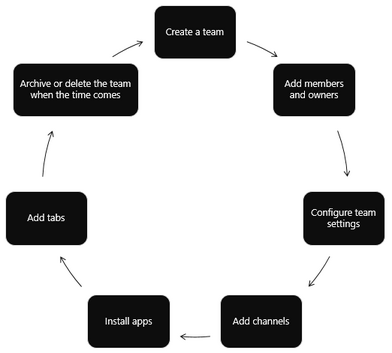

# Resource specific consent (RSC) — Microsoft Teams Graph API

When the Teams and Graph API integration was first introduced it enabled developers to use API endpoints to manage your teams' lifecycles using a broad (non-granular) permissions model that required a global admin's approval.



The resource specific consent (RSC) permissions model enables team owners to grant consent for an application to access and/or modify team data. As part of the RSC implementation new more granular Teams-specific permissions have been created to define what an application can do:

|Application Permission| Action |
| ----- | ----- |
|TeamSettings.Read.Group | Get the settings for this team.|
|TeamSettings.Edit.Group|Update the settings for this team.|
|ChannelSettings.Read.Group|Get the channel names, channel descriptions, and channel settings for this team​|
|ChannelSettings.Edit.Group|Update the channel names, channel descriptions, and channel settings for this team​|
|Channel.Create.Group|Create channels in this team.​|
|Channel.Delete.Group|Delete channels in this team.​|
|ChannelMessage.Read.Group |Get this team's channel messages.​|
|TeamsApp.Read.Group|Get a list of this team's installed apps|
|TeamsTab.Read.Group|Get a list of this team's tabs|
|TeamsTab.Create.Group|Create tabs in this team.​|
|TeamsTab.Edit.Group|Update this team's tabs.​|
|TeamsTab.Delete.Group|Delete this team's tabs.​|
|Member.Read.Group|Get this team's members.​|
|Owner.Read.Group|Get this team's owners.​|
|Member.ReadWrite.Group|Add and remove members from this team. (fast follow)​|
|Owner.ReadWrite.Group|Add and remove owners from this team. (fast follow)​|
|File.Read.Group|Open a file,get all text, and close the file in this team|
|File.Create.Group|Create or open a file in this team. Note: if file already exists, its contents will be overwritten|
|File.Edit.Group|Update the name of a specified file in this team|
|File.Delete.Group|Delete a specified file in this team.|

>[!NOTE]
>Resource Specific Permissions are only available to Teams apps installed on the Teams client and are currently not part of Azure AD.

## Steps for configuring RSC in a tenant

### 1. Ensure that the Tenant admin has configured [group owner consent](azure/active-directory/manage-apps/configure-user-consent#configure-group-owner-consent-to-apps-accessing-group-data) settings in Azure Active Directory (Azure AD)

- **Disable or enable group owner consent from the Azure portal**  

  - Sign in to the [Azure portal](https://portal.azure.com) as a [Global Administrator/Company Administrator](/azure/active-directory/users-groups-roles/directory-assign-admin-roles.md#global-administrator--company-administrator).  
  - Select **Azure Active Directory** =>**Enterprise applications** => **User settings**.
  - Enable, disable, or limit user consent with the control labeled **Users can consent to apps accessing company data for the groups they own** (This capability is enabled by default)


| value | Description|
|--- | --- |
|Yes | Enable group-specific consent for all group owners.|
|No |Disable group-specific consent for all users.| |Limited | Enable group-specific consent for members of a selected group.|

 - **Disable or enable group owner consent using PowerShell**. Please follow the steps outlined in our [Configure group owner consent using PowerShell](/azure/active-directory/manage-apps/configure-user-consent#configure-group-owner-consent-using-powershell) documentation.

### 2. [Register your app using the Azure portal](/graph/auth-register-app-v2)

>[!WARNING]
>Do not register multiple Teams app to the same Azure AD app id. The app id must be unique for each app. Attempts to install multiple apps to the same app id will fail.

### 3. Check the API permissions in Azure portal

Navigate to the **Home** => **App registrations** page and select your RSC app. Choose **API permissions** from the left nav bar and examine the list of configured permissions for your app. If you app will only make RSC Graph calls, delete all the permission on that page. If you app will also make non-RSC calls keep those permssions as needed.

>[!IMPORTANT]
>The Azure portal cannot be used to request RSC permissions. RSC permissions are currently exclusive to Teams applications installed in the Teams client and are declared in the app manifest (JSON) file.

### 4. [Get an access token from the Microsoft Identity platform](/graph/auth-v2-user?view=graph-rest-1.0#3-get-a-token)

>[!NOTE]
>Before your app can get a token from the Microsoft identity platform, it must be registered in the Azure portal. You'll need to have the following values from the registration process:

- The **Application ID** assigned by the app registration portal. If your app supports single sign-on (SSO) you should use the same Application ID for your app and SSO.
- The  **Client secret/password** or a public/private key pair (**Certificate**). This is not required for native apps.
- A **Redirect URI** (or reply URL) for your app to receive responses from Azure AD.

### 5. Update your Teams [app manifest](sharepoint/dev/spfx/web-parts/guidance/creating-team-manifest-manually-for-webpart#create-a-microsoft-teams-app-manifest) to link to your Azure application ID.

Add a [webApplicationInfo](../resources/schema/manifest-schema#webapplicationinfo.md) key to your app manifest and provide your app's Azure application ID, resource URL for acquiring an auth token, and permissions:

```json
"webApplicationInfo": { 

        "id": "8ab552d6-7db1-4b65-9d87-8931b3d5b081", 

"resource": "https://AkjRscBasedStoreApp", 

        "applicationPermissions": [ 

    "TeamSettings.Read.Group", 

   "ChannelMessage.Read.Group", 

  "TeamSettings.Edit.Group", 

  "ChannelSettings.Edit.Group", 

  "Channel.Create.Group", 

  "Channel.Delete.Group", 

  "TeamsApp.Read.Group", 

  "TeamsTab.Read.Group", 

  "TeamsTab.Create.Group", 

  "TeamsTab.Edit.Group", 

  "TeamsTab.Delete.Group", 

  "Member.Read.Group", 

  "Member.ReadWrite.Group", 

  "File.Read.Group", 

  "File.Create.Group", 

  "File.Edit.Group", 

  "File.Delete.Group" 

        ] 

    } 
```

>[!NOTE]
>Non-RSC permissions are stored in the Azure portal. Do not add them to the app manifest.

### **6. Make a Graph REST API call

>[!IMPORTANT]
Graph RSC API calls are not attributed to a user. Calls are made with app permissions not user delegated permissions. Thus, the app may be allowed to perform actions that the user cannot,  such as creating a channel or deleting a tab. You should review the team owner's intent for your use case prior to making RSC API calls. *See* [Microsoft Teams API overview](graph/teams-concept-overview).

