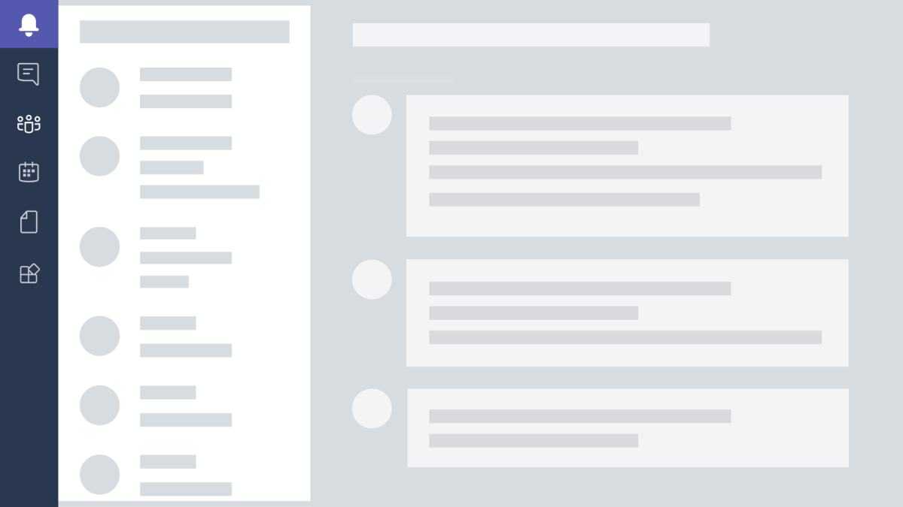

<ul id="cardtypes-8" class="cardsG panelContent" style="display: flex; list-style-type: none; margin-left: 0px; padding-right: 0px !important; background-color: #eef2f5">
                            <li style="list-style: none">
                                

                                    

                                        

                                            

                                                <h3 class="">Lorem ipsum dolor sit amet</h3>
                                                
If someone uses your app every day, this is where they will pin it. This area hosts Activity, Chats, Teams, Meetings, Files, and Apps. It’s also the place users will go to change their settings and send us feedback.

                                            

                                        

                                    

                                

                            </li>
                            <li style="list-style: none">
                                

                                    

                                        

        
                                        

                                    

                                

                            </li>
                        </ul>

<ul class="cardsG panelContent" style="display: flex">
<li>

  

    

      

        
If someone uses your app every day, this is where they will pin it. This area hosts Activity, Chats, Teams, Meetings, Files, and Apps. It’s also the place users will go to change their settings and send us feedback.

      

    

  

</li>
<li>

  

    

        
    

  

</li>
</ul>
