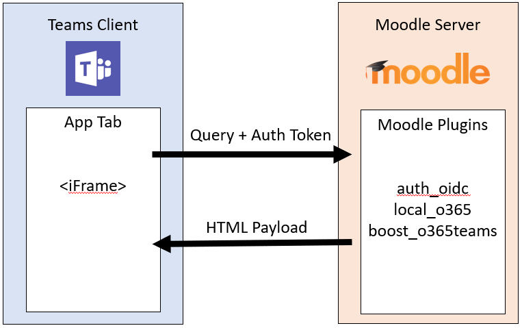
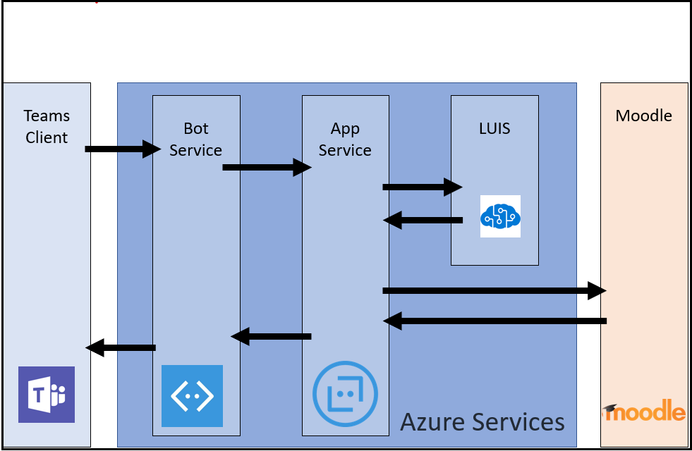

# Install Moodle LMS

In this article, you'll learn how to install the Moodle LMS.

> [!NOTE]
> To help IT admins to easily set-up Moodle and Teams integration, open-source Microsoft 365 Moodle Plugins is updated for the following:
>
> * Auto-registration of your Moodle server with [Microsoft Azure Active Directory (Azure AD)](https://azure.microsoft.com/services/active-directory/).
>
> * One-click deployment of your Moodle Assistant bot to Azure.
>
> * Auto-provisioning of teams and auto-synchronization of team enrollments for all or select Moodle courses.
>
> * Auto-installation of the Moodle tab and the Moodle assistant bot into each synchronized team.
>
> To learn more about the functionality this integration provides, see [Microsoft Teams and Moodle](https://education.microsoft.com/resource/3dffb3a8).

## Prerequisites

Following are the prerequisites to install Moodle:

* Moodle administrator credentials.

* Azure AD administrator credentials.

* An Azure subscription where you can create new resources.

## 1. Install the Microsoft 365 Moodle Plugins

Moodle integration in Microsoft Teams is powered by the open source [Microsoft 365 Moodle plugins set](https://moodle.org/plugins/browse.php?list=set&id=72).

### Requisite applications and plugins

Ensure to install and download the following before proceeding with the Microsoft 365 Moodle plugins installation:

1. Ensure to install a [current stable version of Moodle](https://download.moodle.org/releases/latest/).

1. Download and save the Moodle [OpenID Connect](https://moodle.org/plugins/auth_oidc) and the [Microsoft 365 Integration](https://moodle.org/plugins/local_o365) plugins to your local computer.

    > [!NOTE]
    > Installing the OpenID Connect and Microsoft 365 Integration plugins are required for the Teams integration.
    >
    > In addition, the [Microsoft 365 Teams Theme](https://moodle.org/plugins/theme_boost_o365teams) plugin is highly recommended.

### Microsoft 365 Moodle plugins

1. Download the plugins, extract them, and upload to their corresponding folders. For example, extract the OpenID Connect plugin (auth_oidc) to a folder called **oidc**, and upload to the **auth** folder of your Moodle document root.

1. Sign in to your Moodle server as an administrator and select **Site administration**.

1. After the detection of new plugins to be installed, Moodle should redirect you to the install new plugins page. If this doesn't happen, in the **Site administration** page, select **Notifications** in the **General** tab, this should trigger the installation of the plugins.

1. After the plugins are install, go to the **Plugins** tab in the **Site administrator** page, select **Authentication** section link, and enable **OpenID Connect**. It's OK to leave the plugin configuration blank - they'll be filled in later.

1. In the **Site administrator** page, scroll down to the **Local plugins** section and select the **Microsoft 365 Integration** link.

    > [!IMPORTANT]
    >
    > * Keep your Microsoft 365 Moodle Plugins configuration page open in a separate browser tab as you need to return to this set of pages throughout the process.  
    >
    > * If you do not have an existing Moodle site, go to the [Moodle on Azure](https://github.com/azure/moodle) repo, and quickly deploy a Moodle instance and customize it to your needs.

## 2. Configure the connection between the Microsoft 365 plugins and Azure AD

You must configure the connection between the Microsoft 365 plugins and Azure AD.

### Requisites

Register Moodle as an application in your Azure AD, using the PowerShell script. The script provisions the following:

* A new Azure AD application for your Microsoft 365 tenant, which is used by the Microsoft 365 Moodle Plugins.
* The app for your Microsoft 365 tenant, set up the required reply URLs and permissions for the provisioned app, and returns the `AppID` and `Key`.

Use the generated `AppID` and `Key` in your Microsoft 365 Moodle Plugins setup page to configure your Moodle server site with Azure AD.

> [!IMPORTANT]
>
> * For more information on registering your Moodle instance manually, see [Register your Moodle instance as an application](https://docs.moodle.org/400/en/Microsoft_365#Azure_App_Creation_and_Configuration).

### The Moodle tab for Microsoft Teams information flow

1. From the Microsoft 365 Integration plugins page, select the **Setup** tab.

1. Select the **Download PowerShell Script** button and save it as a ZIP folder to your local computer.

1. Prepare the PowerShell script from the ZIP file as follows:

    1. Download and extract the `Moodle-AzureAD-Powershell.zip` file.
    1. Open the extracted folder.
    1. Right-click on the `Moodle-AzureAD-Script.ps1` file and select **Properties**.
    1. Under the **General** tab of the Properties window, select the `Unblock` checkbox next to the **Security** attribute located at the bottom of the window.
    1. Select **OK**.
    1. Copy the directory path to the extracted folder.

1. Run PowerShell as an administrator:

    1. Select Start.
    1. Type PowerShell.
    1. Right-click on **Windows PowerShell**.
    1. Select **Run as Administrator**.

1. Go to the unzipped directory by typing `cd .../.../Moodle-AzureAD-Powershell` where `.../...` is the path to the directory.

1. Execute the PowerShell script:

    1. Enter `Set-ExecutionPolicy -ExecutionPolicy RemoteSigned -Scope CurrentUser`.
    1. Enter `./Moodle-AzureAD-Script.ps1`.
    1. Sign in to your Microsoft 365 administrator account in the pop-up window.
    1. Enter the name of the Azure AD Application, for example, Moodle or Moodle plugins.
    1. Enter the URL for your Moodle server.
    1. Copy the **Application ID (`AppID`)** and **Application Key(`Key`)** generated by the script and save them.

1. Next you must add the `AppID` and `Key` to the Microsoft 365 Moodle Plugins. Return to the plugins administration page, Site administration > Plugins > Microsoft 365 Integration.

1. On the **Setup** tab, add the `AppID` and `Key` you copied previously, and then select **Save changes**. After the page refreshes, you can see a new section **Choose connection method**.

1. In the **Choose connection method**, select the checkbox labeled **Default**, and then select **Save changes** again.

1. After the page refreshes you can see another new section **Admin consent & additional information**.
    1. Select **Provide Admin Consent** link, enter your Microsoft 365 Global Administrator credentials, then **Accept** to grant the permissions.
    1. Next to the **Azure AD Tenant** field, select the **Detect** button.
    1. Next to the **OneDrive for Business URL**, select the **Detect** button.
    1. After the fields populate, select the **Save changes** button again.

1. Select the **Update** button to verify the installation, and then select **Save changes**.

1. Synchronize users between your Moodle server and Azure AD. To get started:

    > [!NOTE]
    > Depending on your environment, you can select different options during this stage.

    1. Switch to the **Sync Settings tab**.

    1. In the **Sync users with Azure AD** section, select the checkboxes that apply to your environment. You must select the following:  

        ✔ Create accounts in Moodle for users in Azure AD.

        ✔ Update all accounts in Moodle for users in Azure AD.

    1. In the **User Creation Restriction** section, you can set up a filter to limit the Azure AD users that is synced to Moodle.

1. To validate [cron](https://docs.moodle.org/400/en/Cron) jobs and run them manually for the first run, select the **Scheduled tasks management page** link in the **Sync users with Azure AD** section. This takes you to the **Scheduled Tasks** page.

    1. Scroll down and find the **Sync users with Azure AD** job and select **Run now**.
    1. If you select to create Groups based on existing courses, you can also run the **Create user groups in Microsoft 365** job.

    > [!NOTE]
    >
    > The Moodle [Cron](https://docs.moodle.org/310/en/Cron) runs according to the task schedule. The default schedule is once a day. However, the cron must run more frequently to keep everything in sync.

1. Return to the plugins administration page, **Site administration > Plugins > Microsoft 365 Integration**, and select the **Teams Settings** page.

1. On the **Teams Settings** page, configure the required settings to enable the Teams app integration by clicking the **Check Moodle settings** link will update all required configurations for the Teams integration to work.

## 3. Deploy the Moodle Assistant Bot to Azure

The free Moodle assistant bot for Microsoft Teams helps teachers and students answer questions about their courses, assignments, grades, and other information in Moodle. The bot also sends Moodle notifications to students and teachers within Teams. The bot is an open-source project maintained by Microsoft, and is available on [GitHub](https://github.com/microsoft/Moodle-Teams-Bot).

> [!NOTE]
>
> * Deploy resources to your Azure subscription. All resources were configured using the **free** tier. Depending on the usage of your bot, you may have to scale these resources.
>
> * To use the Moodle tab without the bot, skip to [4](#4-deploy-your-microsoft-teams-app).

### Moodle bot information flow

To install the bot, you must register it on the [Microsoft Identity Platform](https://identity.microsoft.com/Landing). This allows your bot to authenticate against your Microsoft endpoints.

To register your bot:

1. Go to the plugins administration page, and then select **Plugins**. Under **Microsoft 365 Integration**, select the **Teams Settings** tab.

1. Select the **Microsoft Application Registration Portal** link and sign in with your Microsoft ID.

1. Enter a name for your app, such as MoodleBot and select the **Create** button.

1. Copy the **Application ID** and paste it into the **Bot Application ID** field on the **Team Settings** page.

1. Select the **Generate New Password** button. Copy the generated password and paste it into the **Bot Application Password** field on the **Team Settings** page.

1. Scroll to the bottom of the form and select **Save Changes**.

After generating your application ID and password, deploy your bot to Azure:

> [!div class="checklist"]
>
> * Select **Deploy to Azure** and complete the form with the necessary information, such as the Bot Application ID, Bot Application Password, and the Moodle Secret on the **Teams Settings** page. The Azure information is on the **Setup** page.
> * After completing the form, select the checkbox to agree to the terms and conditions.
> * Select **Purchase**. All Azure resources are deployed to the free tier.

After the resources have completed deploying to Azure, you must configure the Microsoft 365 Moodle plugins with a messaging endpoint. You must get the endpoint from your bot in Azure:

1. Sign in to the [Microsoft Azure portal](https://portal.azure.com).

1. In the left pane, select **Resource groups** and select the resource group you used or created, while deploying your bot.

1. Select the **WebApp Bot** resource from the list of resources in the group.

1. Copy the **Messaging Endpoint** from the **Overview** section.

1. In Moodle, open the **Team Settings** page of your Microsoft 365 Moodle Plugins.

1. In the **Bot Endpoint** field paste the URL you copied and change the word *messages* to *webhook*. The URL must appear as follows: `https://botname.azurewebsites.net/api/webhook`

1. Select **Save Changes**.

1. After saving the changes, go back to the **Team Settings** tab, select the **Download manifest file** button, and save the app manifest package to your computer for further use.

## 4. Deploy your Microsoft Teams app

After your bot is deployed to Azure and configured to talk to your Moodle server, you must deploy your Microsoft Teams app. To do this you must load the app manifest file that you downloaded from the Microsoft 365 Moodle Plugins Team Settings page in the previous step.

Before you install the app, you must ensure to enable external apps and uploading of apps. For more information, see [Prepare your Microsoft 365 tenant](../concepts/build-and-test/prepare-your-o365-tenant.md).

To deploy your app:

1. Open **Microsoft Teams**.

1. Select the **Apps** icon on the lower-left area of the navigation bar.

1. Select the **Manage your apps** link in the navigation menu.

1. Select **Upload an app** and select **Submit an app to your org**.

   > [!NOTE]
   > If you are logged in as a global administrator, you must have the option of uploading the app to your organization's app catalog, otherwise you can only load the app for a team in which you are a member.

4. Select the `manifest.zip` package you downloaded previously and select **Save**. If you haven't downloaded the app manifest package, you can download from the **Team Settings** tab of the plugins configuration page in Moodle.

Now that you have the app installed, you can add the tab to any channel that you have access to. To do so, go to the channel, select the **plus** (➕) symbol and select your app from the list. Follow the prompts to finish adding your Moodle course tab to a channel.

## 5. Allow automatic creation of Moodle tabs in Microsoft Teams

Although the Moodle tabs are created manually in Microsoft Teams, you can decide to create them automatically when teams are created from course synchronization. To do this, you must configure the ID of the uploaded Microsoft Teams app in Moodle.

To allow automatic creation of Moodle tabs:

1. In Moodle, open the **Teams Moodle app** tab from your Microsoft 365 Moodle Plugins configuration page.

1. If the Azure app has the recommendated permission, for the **Moodle app ID** setting, it should show an **Automatically detected value**, copy this value to the setting.

1. If the automatically detected value doesn't present, follow the instruction on the page to find the Moodle app ID and fill in the setting.

When a Moodle course is synced, Teams automatically installs the Moodle app in the team, creates a Moodle tab in the General channel of Teams, and configures it to contain the course page for the Moodle course from which it's synced. You can now start working with your Moodle courses directly from Teams.

> [!NOTE]
> To share any feature requests or feedback with us, visit our [User Voice page](https://support.microsoft.com/en-us/office/uservoice-pages-430e1a78-e016-472a-a10f-dc2a3df3450a).

## See also

* [Integrate web apps](~/samples/integrate-web-apps-overview.md)
* [Moodle](https://moodle.org/)
* [Moodle documentation](https://docs.moodle.org/400/en/Installing_plugins)
* [Microsoft 365 and Moodle integration page on Moodle Docs](https://docs.moodle.org/400/en/Microsoft_365)
