# App Templates for Microsoft Teams

App templates are production-ready apps for Microsoft Teams that are community driven, open-source, and available on GitHub. Each contains detailed instructions for deploying and installing that app for your organization, providing a ready-to-use app that you can install and begin using immediately. The complete source code is available as well, so you can explore it in detail, or fork the code and alter it to meet your specific needs.

**&#9734; Indicates newly released app templates.**

### Key benefits

* **Plug and play experience:** All app templates include deployments scripts that will allow you to host all necessary services in Microsoft Azure. No coding is required to deploy the apps.
* **Production-ready code:** The app templates conform to recommended best practices around security and infrastructure, and all community submitted changes to them are reviewed to ensure continued conformance.
* **Customizable and extensible:** While all app templates are ready to deploy as they are, we provide the entire code base and deployment scripts so that you can easily customize or extend them to fit your unique needs.
* **Detailed documentation & support:** All app templates are accompanied by end-to-end documentation on solution architecture, deployment, and configuration steps. The repositories are monitored as well, so please report any issues you encounter by raising an Issue on GitHub.

## Appointment Manager &#9734;

Appointment Manager is a Teams app template to help businesses create, manage, and conduct virtual appointments with consumers through Teams. New appointment requests from consumers are visible in Teams channels, where they can quickly be assigned and reassigned to staff in a team. Appointment requests can be viewed at team or personal levels through custom tabs. Every appointment is associated with a Teams online meeting, hence the staff and consumers can easily join the meeting at the scheduled time.

The app template integrates with Microsoft Bookings for easy appointment management. Scheduled appointments automatically appear on assigned staff members' calendars, and consumers receive customizable email notifications and reminders with embedded meeting links.

[Get it on GitHub](https://github.com/OfficeDev/microsoft-teams-apps-appointment-manager)

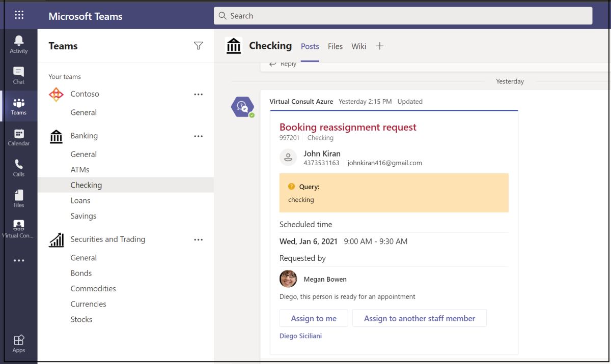
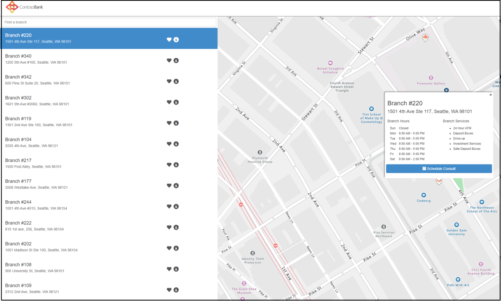

## Ask Away

Ask Away is a [Microsoft Teams bot](../bots/what-are-bots.md) that enables users to conduct Q&A (Question and Answer) sessions within Teams. Using the Ask Away bot, team members can submit and up-vote questions shared by colleagues allowing Q&A hosts to easily gather top-of-mind questions within a channel or chat. The bot can be used to conduct a real-time Q&A session in a Teams meeting and allows attendees to submit questions live via chat.

[Get it on GitHub](https://github.com/OfficeDev/microsoft-teams-apps-askaway)

:::row:::
  :::column span="2":::
    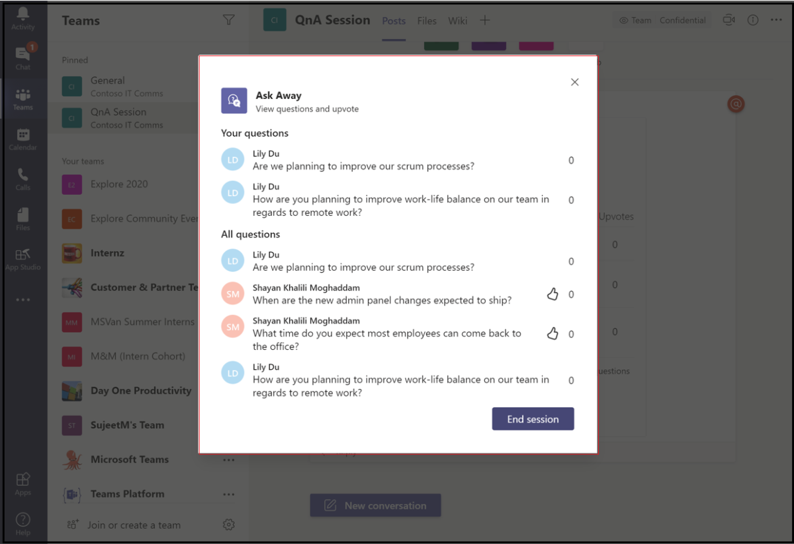  
:::column-end:::
:::row-end:::

## Associate Insights

Associate Insights is a [Power Apps](/powerapps/maker/canvas-apps/embed-teams-app) template that empowers firstline workers to directly capture and submit customer opinion, sentiment, and perception. Firstline workers are often the first company representative to engage with customers in a one-to-one point-of contact. The collected data can be shared and used collaboratively by business teams, e.g., via a Power BI Teams tab, for product improvement and enhancing the customer experience.

[Get it on GitHub](https://github.com/OfficeDev/microsoft-teams-apps-associateinsights)

:::row:::
  :::column span="2":::
      
:::column-end:::
:::row-end:::
:::row:::
:::column span="2":::
    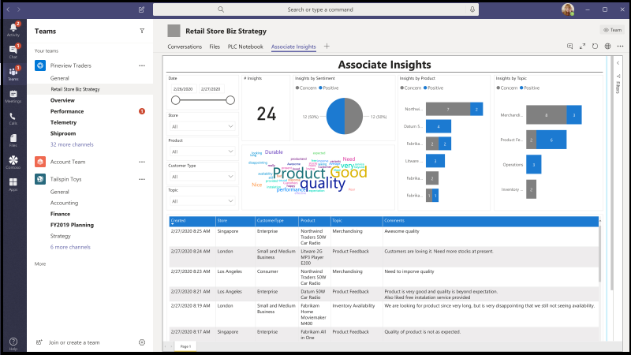
:::column-end:::
:::row-end:::

## Attendance

The Attendance app is a [Power Apps](/powerapps/maker/canvas-apps/embed-teams-app) tab that can be pinned in a team. It is designed to record presence, typically in settings such as learning and training environments. Users can mark or edit attendance for up to 30 days in the past and view summarized attendance reports for an entire group or individual attendees.

[Get it on GitHub](https://github.com/OfficeDev/microsoft-teams-apps-attendance)

## Book-a-room

Book-a-room is a [Microsoft Teams bot](../bots/what-are-bots.md) that lets users quickly find and reserve a meeting room for 30 (default), 60, or 90 minutes starting from the current  time. The Book-a-room bot scopes to personal or 1:1 conversations.

[Get it on GitHub](https://github.com/OfficeDev/microsoft-teams-apps-bookaroom)

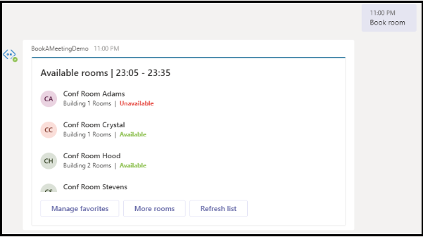

## Building Access

Building Access is a Microsoft [Power Platform](https://powerapps.microsoft.com/blog/now-in-preview-customize-teams-with-built-in-power-platform-capabilities/)-based app that supports the administration of building occupancy thresholds and social distancing norms by enabling facilities directors to manage, track, and report employee on-site presence. The app, built using Microsoft [Power Apps](/powerapps/powerapps-overview), and [Power Automate](/power-automate/getting-started), deeply integrates with Microsoft Teams and enables organizations to determine building readiness, establish eligibility criteria for on-site access, and gather insights for future planning.

[Get it on GitHub](https://github.com/OfficeDev/microsoft-teams-apps-buildingaccess)

:::row:::
   :::column span="":::
     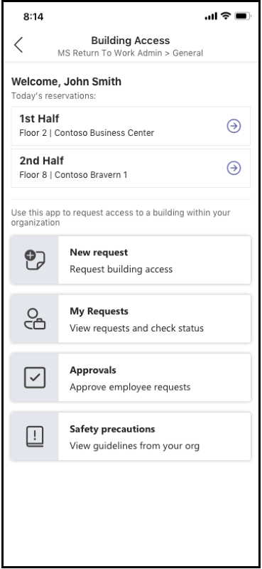
   :::column-end:::
   :::column span="":::
      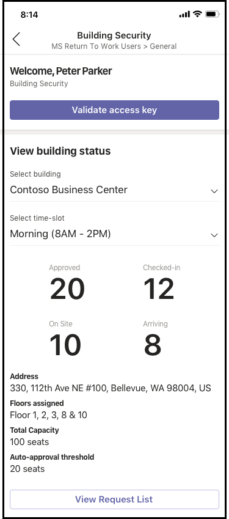
   :::column-end:::
:::row-end:::

## Celebrations

Celebrations is a Teams app that helps team members celebrate each others' birthdays, anniversaries, and other recurring events. It remembers special occasions of all the team members and sends a friendly message in all the teams selected at the time of event creation, to make the team members feel special on their day.

The app provides an easy interface for all the team members to personally add and view their events and also allows the user to select the teams in which the events gets shared.

[Get it on GitHub](https://github.com/OfficeDev/microsoft-teams-celebrations-app)

## Checklist

Checklist is a custom Microsoft Teams [messaging extension](../messaging-extensions/what-are-messaging-extensions.md) app that enables you to collaborate with your team by creating a shared checklist in a chat or channel. The app is supported across all Teams platform clients —  desktop, browser, iOS, and Android — and is ready for deployment as part of your Microsoft 365 subscription.  

[Get it on GitHub](https://github.com/OfficeDev/microsoft-teams-checklist-app )

:::row:::
:::column span="2":::
      
:::column-end:::
:::row-end:::

## Classroom Drop-in &#9734;

Classroom Drop-in is a Microsoft [Power Platform](https://powerapps.microsoft.com/blog/now-in-preview-customize-teams-with-built-in-power-platform-capabilities/)-based app that enables system leaders to find class teams (virtual classrooms) and add themselves or others to these class teams for a specified drop-in period, as needed. The app built using Microsoft [Power Apps](/powerapps/powerapps-overview) and [Power Automate](/power-automate/getting-started), deeply integrates with Microsoft Teams to ensure educational institutes can optimize their operations in a hybrid learning environment by providing access to relevant stakeholders for class teams per business requirements.

[Get it on GitHub](https://github.com/OfficeDev/microsoft-teams-apps-classroom-dropin)

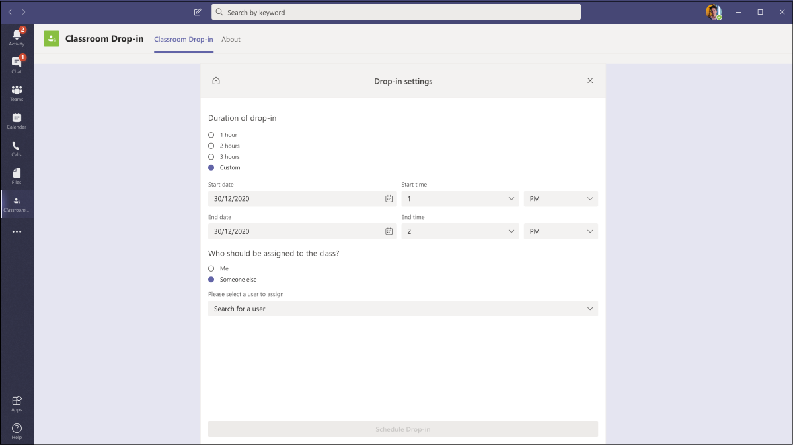

## Company Communicator

The Company Communicator app enables corporate teams to create and send messages intended for multiple teams or large number of employees over chat allowing organization to reach employees right where they collaborate. Utilize this template for multiple scenarios such as new initiative announcements, employee onboarding, modern learning and development or organization-wide broadcasts.

The app provides an easy interface for designated users to create, preview, collaborate and send messages.

It provides a foundation to build custom targeted communication capabilities such as custom telemetry on how many users acknowledged or interacted with a message.

[Get it on GitHub](https://github.com/OfficeDev/microsoft-teams-company-communicator-app)

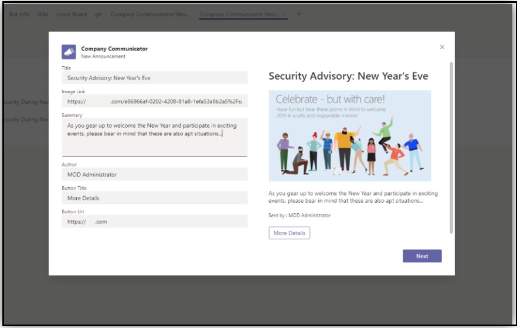

## Contact Group Lookup

The Contact Group Lookup app provides a convenient and useful approach to creating, accessing, and managing your organization's contact groups (formerly known as distribution lists or communication groups). Users can quickly view and chat with group members, view member status, and create a group chat with selected members in the contact group, all within the Teams environment.

[Get it on GitHub](https://github.com/OfficeDev/microsoft-teams-app-contactgrouplookup)

:::row:::
:::column span="2":::
    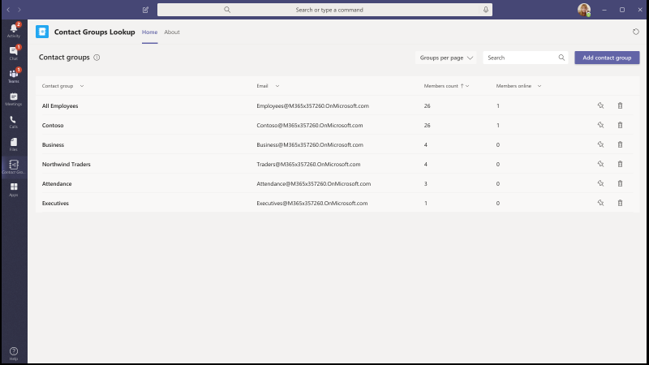  
:::column-end:::
:::row-end:::
:::row:::
:::column span="2":::
    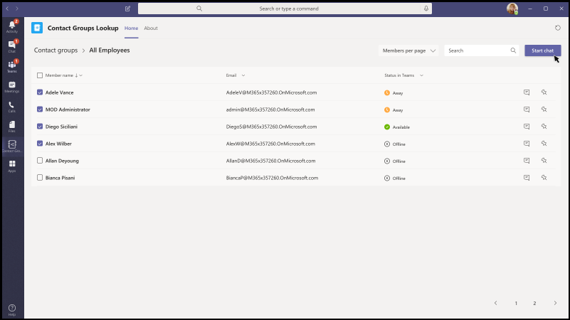
:::column-end:::
:::row-end:::

## Co-worker Appreciation &#9734;

Using the co-worker appreciation template in Microsoft Teams, users can recognize their colleagues' achievements within the Teams’ context. When co-workers select to reward a colleague, recipients and other team members are tagged in a channel conversation and they receive a notification about the channel's award details. The awards are recorded in the Teams app, which is secure, portable, and easily shareable. This can be considered as the PowerApps based version of the Open Badges app template, with a leaderboard.

[Get it on GitHub](https://github.com/OfficeDev/microsoft-teams-apps-coworker-appreciation)

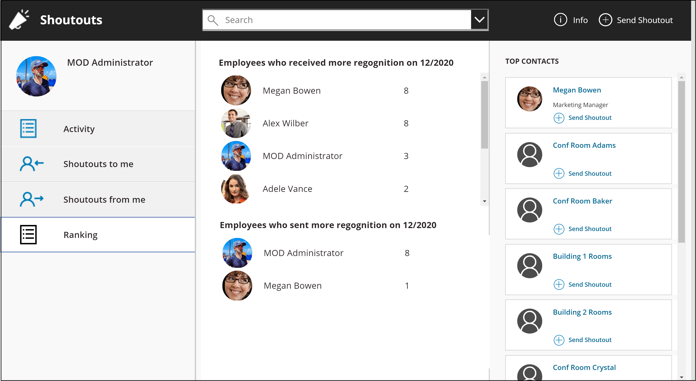

## CrowdSourcer

CrowdSourcer is a [Microsoft Teams bot](../bots/what-are-bots.md) that gives teams queried information sourced collaboratively from group members. It's a great way to answer frequently asked questions while enabling participants to actively engage in and contribute to a fun and helpful information resource.

[Get it on Github](https://github.com/OfficeDev/microsoft-teams-crowdsourcer-app)

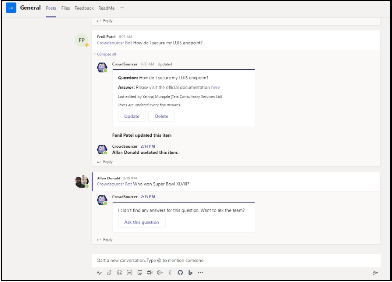

## Custom Stickers

Self-expression is core to a healthy team culture. This app template is a [messaging extension](~/messaging-extensions/what-are-messaging-extensions.md) that enables your users to use custom stickers and GIFs within Microsoft Teams. This template provides an easy web-based configuration experience where anyone with configuration access can upload the GIFs/stickers/images they want their end-users to have, allowing your entire team to use any set of stickers you chose.

This app also enables easy sharing of images/GIFs/stickers across teams without needing access to SharePoint sites or individual channels as storage and sharing mechanisms. For example, product teams can easily share product images and GIFs to social media, marketing and sales teams programmatically. One can also extend this app by triggering a notification flow to specific teams/individuals when new images/GIFs are made available.

[Get it on GitHub](https://github.com/OfficeDev/microsoft-teams-stickers-app)

## Employee Ideas &#9734;

The Employee Ideas app is the PowerApps version of the Azure based Great Ideas app template. The app enables the Teams users to set up and configure an idea campaign. An idea campaign is a category for grouping ideas around common themes.

Teams users can also perform following activities:
* Configure a standard submission form that employees need to submit for each idea. 
* Review and manage the ideas and list of campaigns.
* Modify and delete campaigns.
* Review leader boards of ideas.
* Vote for and share prioritized ideas.
* Submit ideas for a campaign.
* View other team member's idea.
* Vote on most liked ideas.
* Review the performance of their ideas compared with others within a campaign.

[Get it on GitHub](https://github.com/OfficeDev/microsoft-teams-apps-employeeideas)

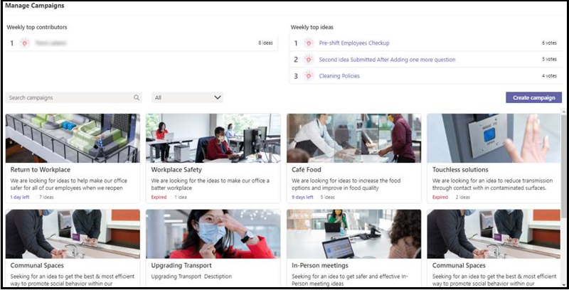 

## E-Prescriptions 

E-Prescriptions is a [Power Apps](/powerapps/maker/canvas-apps/embed-teams-app)-based app that enhances telemedicine and virtual care by automating the process of issuing e-prescriptions to patients. Medical professionals can quickly review appointments, generate e-prescriptions, and send emails with e-prescription attachments to patients directly within the Teams platform.

[Get it on GitHub](https://github.com/OfficeDev/microsoft-teams-apps-eprescription) 

:::row:::
:::column span="2":::
      
:::column-end:::
:::row-end:::
:::row:::
:::column span="2":::
    
:::column-end:::
:::row-end:::

## Employee Training 

Employee training is a Microsoft Teams app that enables organizers to easily publish,  track, and promote learning and training events for your organization.  With the app, event planners can send reminders and notifications to event registrants and employees can indicate interest in upcoming events, stay updated on current events, and share event details with colleagues via the Teams messaging extension.

[Get it on GitHub](https://github.com/OfficeDev/microsoft-teams-apps-employeetraining)

:::row:::
:::column span="2":::
    **View employee training events**
    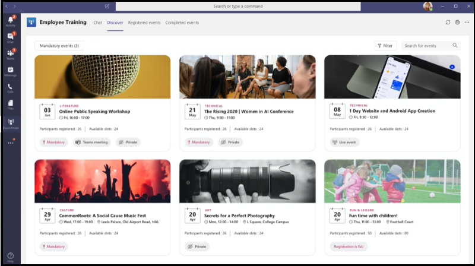  
:::column-end:::
:::row-end:::
:::row:::
:::column span="2":::
    **Create employee training event**
    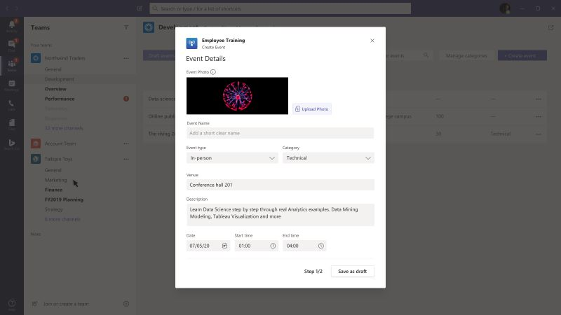
:::column-end:::
:::row-end:::

## Expert Finder

Expert Finder is a [Microsoft Teams bot](../bots/what-are-bots.md) that identifies specific organization members based on their skills, interests, and education attributes. Members find experts within an organization  that match a keyword search of Azure Active Directory user profiles.

[Get it on GitHub](https://github.com/OfficeDev/microsoft-teams-apps-expertfinder)

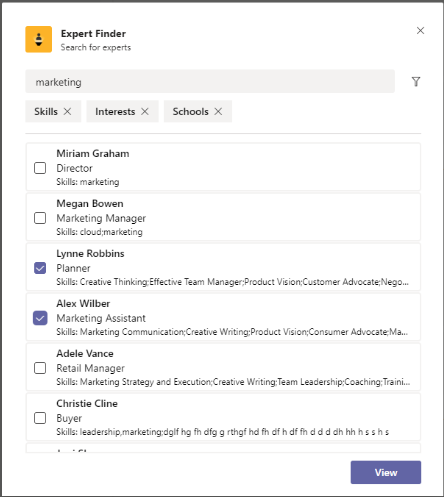

## FAQ Plus

Conversational Q&A bots are an easy way to provide answers to frequently asked questions by users. However, most bots fail to engage with users in meaningful way because there is no human in the loop when the bot fails. FAQ bot is a friendly Q&A bot that brings a human in the loop when it is unable to help. One can ask the bot a question and the bot responds with an answer if it is contained in the knowledge base. If not, the bot allows the user to submit a query which then gets posted to a pre-configured team of experts who help to provide support by acting upon the notifications from within the team itself.

> [!NOTE]
> The latest release of **FAQ Plus** supports improved Q&A resolutions by enabling a team of experts to complete the following:
>
> &#x2714; Add new Q&As directly to the knowledge base using message extensions.
>
> &#x2714; Edit and delete Q&A pairs added by a bot.
>
> &#x2714; Track the revision history of Q&As.
>
> &#x2714; Configure an answer with additional details to display as an [adaptive card](../task-modules-and-cards/cards/cards-reference.md#adaptive-card).
>
[Get it on GitHub](https://github.com/OfficeDev/microsoft-teams-apps-faqplusv2)

## Get Support App &#9734;

The Get Support app can be used by organizations that are using Microsoft Teams, to enable any set of users to request assistance from supervisors. This app includes various features, such as:
-   Requesting assistance on different categories from a Power App
-   Notifications sent to requestors informing them of who has been assigned 
-   Notifications sent to assigned supervisors informing them of who needs assistance 
-   Analyzing escalations and patterns in SharePoint and PowerBI

[Get it on GitHub](https://github.com/OfficeDev/microsoft-teams-app-get-support/)

## Goal Tracker

The Goal Tracker app is a comprehensive solution for your organization to support establishing goals, observing progress, and acknowledging success within Microsoft Teams. The app enables users to set, track, and update objectives on a professional, personal, and team level. Team members also receive timely reminders and status updates to remain focused and stay on track.

[Get it on GitHub](https://github.com/OfficeDev/microsoft-teams-app-goaltracker)

:::row:::
  :::column span="2":::
    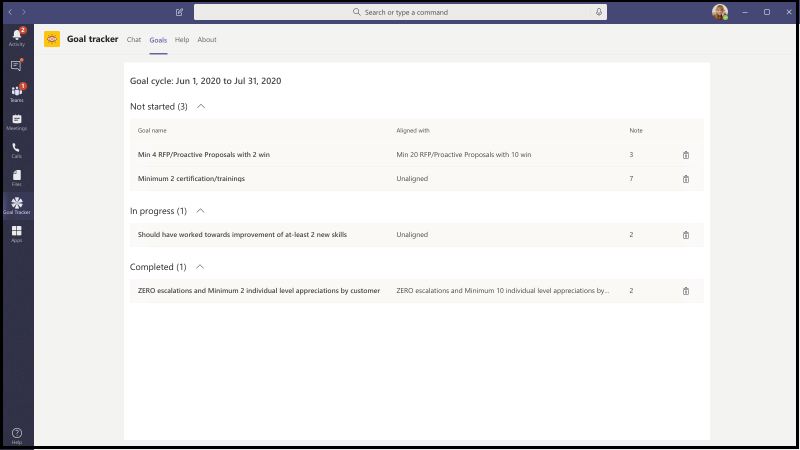  
:::column-end:::
:::row-end:::
:::row:::
:::column span="2":::
    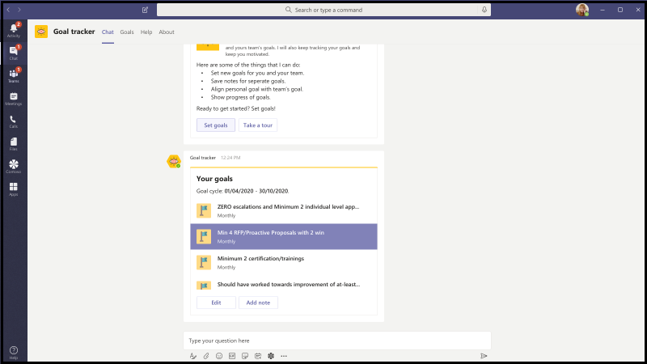
:::column-end:::
:::row-end:::

## Great Ideas

The Great Ideas app supports and empowers innovation and creativity within your organization. The app enables your employees to share ideas with colleagues and leadership, discover new submissions, spotlight contributions for peer consideration, and cast their vote for the best proposals within Microsoft Teams.

[Get it on GitHub](https://github.com/OfficeDev/microsoft-teams-apps-greatideas)

:::row:::
  :::column span="2":::
    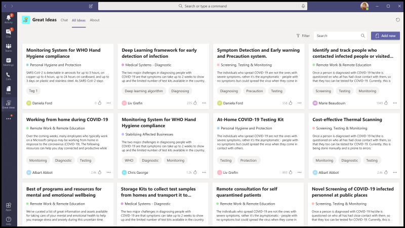  
:::column-end:::
:::row-end:::
:::row:::
:::column span="2":::
    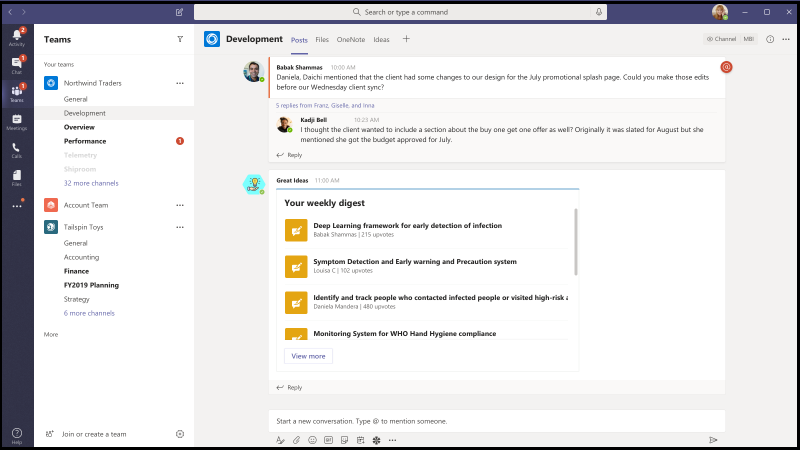
:::column-end:::
:::row-end:::

## Group Activities

Group Activities is a Microsoft Teams app that makes it easy for team owners to quickly create activity groups and manage collaboration workflows within the context of Microsoft Teams. Activity authors are enabled to create activities, randomly distribute team members in groups, and optionally have the bot send reminders until activities are complete.

[Get it on GitHub](https://github.com/OfficeDev/microsoft-teams-apps-groupactivities)

:::row:::
  :::column span="2":::
    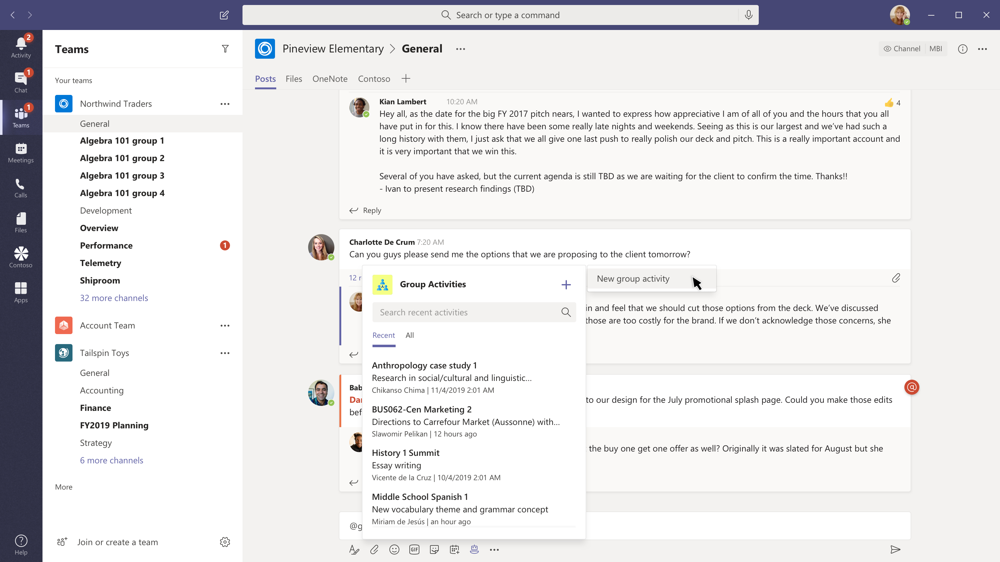  
:::column-end:::
:::row-end:::
:::row:::
:::column span="2":::
    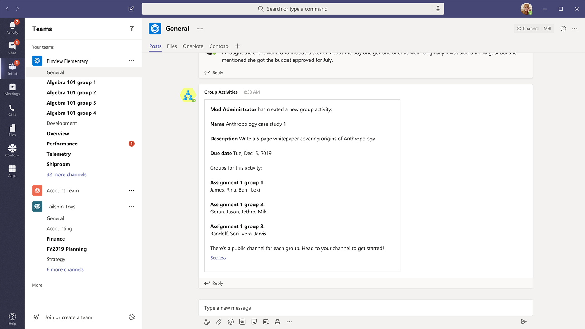
:::column-end:::
:::row-end:::

## Grow Your Skills

The Grow Your Skills app supports professional growth and development by enabling employees to contribute to supplemental projects for your organization while simultaneously learning new skills. Employees can use the app to locate opportunities that meet their interests, enjoy meaningful collaboration with peers, and acquire new levels of expertise and capabilities, all within the Teams environment.

[Get it on GitHub](https://github.com/OfficeDev/microsoft-teams-apps-growyourskills)

:::row:::
  :::column span="2":::
    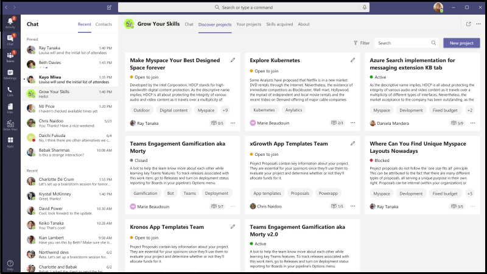  
:::column-end:::
:::row-end:::
:::row:::
:::column span="2":::
    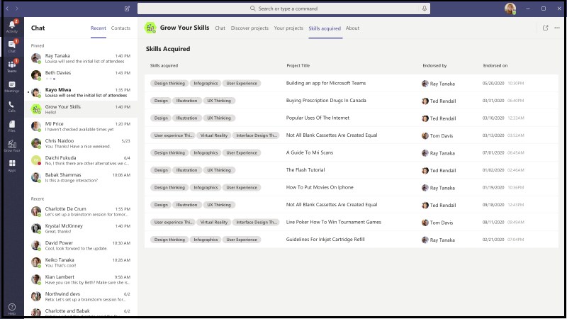
:::column-end:::
:::row-end:::

## HR Support

HR Support bot is a friendly Q&A bot that brings a support professional/expert from the HR team in the loop when it is unable to help. One can ask the bot a question and the bot responds with an answer if it is contained in the knowledge base. If not, the bot allows the user to submit a query which then gets posted in a pre-configured team of experts who are help to provide support by acting upon the notifications from within their team itself. Additionally, the bot suggests links to recommended HR policies/questions by searching for pre-configured tags in the question. These tiles can also be found in the associated tab as a quick reference. HR Support works well for light weight QnA and to provide quick support when launching new projects/initiatives in the organization.

[Get it on GitHub](https://github.com/OfficeDev/microsoft-teams-hrsupport-app)

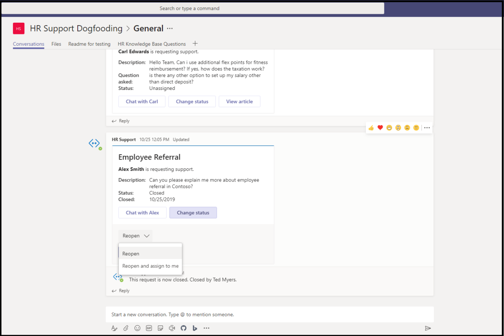

## Icebreaker

Icebreaker is a [Microsoft Teams bot](../bots/what-are-bots.md) that helps your team get closer by pairing two random team members up every week to meet. The bot makes scheduling easy by automatically suggesting free times that work for both members. Strengthen personal connections and build a tightly knit community with this app.

In addition to encouraging personal connections across your entire team, the Icebreaker app can help cultivate interest-based communities within your organization. For example, you can use this app for a DevOps interest group to help ideas and best practices organically spread across your organization.

[Get it on GitHub](https://github.com/OfficeDev/microsoft-teams-icebreaker-app)

## Incentives

Incentives is a [Power Apps](/powerapps/maker/canvas-apps/embed-teams-app) template that manages and tracks incentivized employee participation in designated activities such as trainings and change management initiatives. Admins use the app to establish designated activities, assign points for completion, and specify required eligibility point levels for rewards. Employees use the app to view their accumulated points and, upon reaching eligibility, request and claim redeemable rewards.

[Get it on GitHub](https://github.com/OfficeDev/microsoft-teams-apps-incentives)

## Incident Reporter

Incident Reporter is a [Microsoft Teams bot](../bots/what-are-bots.md)  that optimizes the management of incidents in your organization. The bot facilitates automated incident data collection, customized incident reports, relevant stakeholder notifications, and end-to-end incident tracking.

[Get it on GitHub](https://github.com/OfficeDev/microsoft-teams-apps-incidentreport)

:::row:::
  :::column span="2":::
    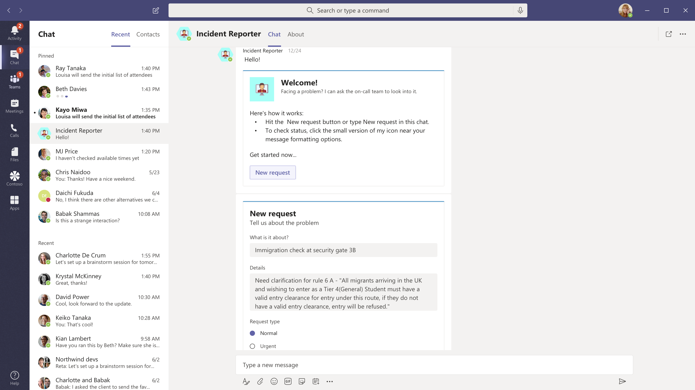  
:::column-end:::
:::row-end:::
:::row:::
:::column span="2":::
    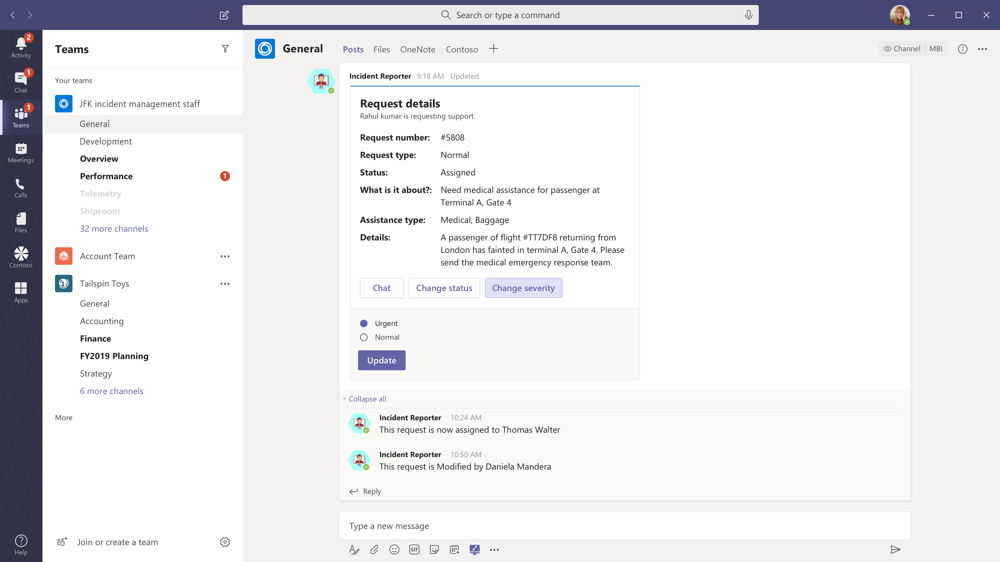
:::column-end:::
:::row-end:::

## Inspection &#9734;

 Inspection is a Microsoft Teams app that enables front line workers to inspect anything from  locations to assets and equipments. For example, a retail store, manufacturing plant, or vehicles and machines. There are two apps in this solution, each intended for different types of users.

The app empowers the front line workers to inspect an asset or area, to manage quality of products and services, or maintain safety at workplace. It facilitates communication between team members to address issues found during inspection. The app provides simple reports for managers to expedite issue resolution and highlight trends.

[Get it on GitHub](https://github.com/OfficeDev/microsoft-teams-apps-inspection)

 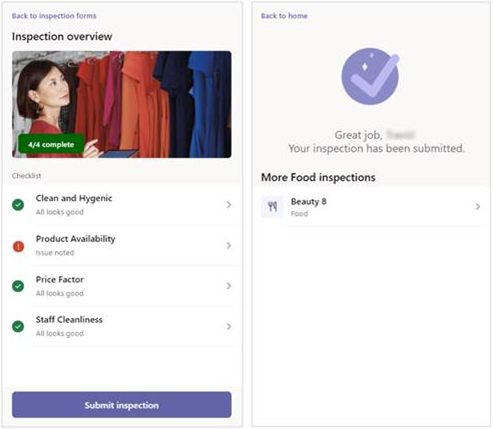  

## Issue Reporting &#9734;

The Issue Reporting app empowers the employees and managers to raise and manage issues. It consists of two apps, Issue reporting app for reporting issues and Manage Issues app for managing issues.

The team managers use the Manage Issues app to configure the app experience, including the channel in which Microsoft Teams messages and Planner tasks are created by the app. Managers also use the app to create template forms to collect details when a user reports an issue. For example, review, edit, or delete issue template forms. The app can also be used to review team issues, report on issue history, and efficiently manage issue resolution.

The employees use the Issue reporting app to log issues and details required to resolve them. The app is also used to modify and resolve existing issues and get a high-level view of individual or team issues.

[Get it on GitHub](https://github.com/OfficeDev/microsoft-teams-apps-issuereporting)

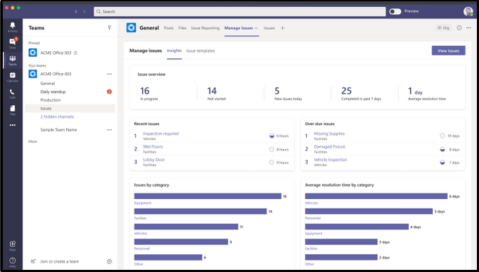  

## New Employee Onboarding 

New Employee Onboarding is an integrated Microsoft Teams and [SharePoint New Employee Onboarding Solution](https://lookbook.microsoft.com/details/75e60a32-9849-4ed4-b83e-b2b08983ad19) that enables your organization to provide a consistent, high-quality onboarding experience for employees on their new-hire journey. The app can be used by human resource teams and hiring managers to provide relevant information throughout the orientation and induction process and by new hires to share feedback, provide introductions, and complete onboarding tasks.

[Get it on GitHub](https://github.com/OfficeDev/microsoft-teams-apps-newemployeeonboarding)

:::row:::
  :::column span="2":::
    **New employee welcome card**
    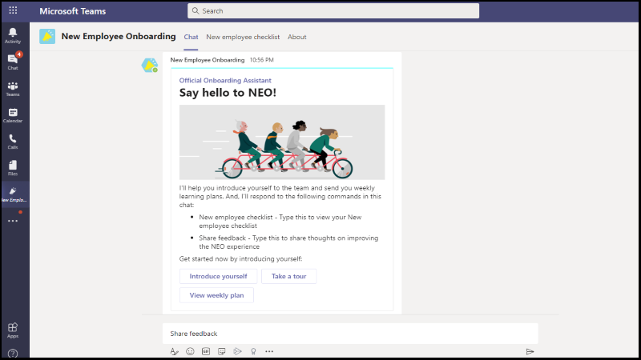
:::column-end:::
:::row-end:::
:::row:::
:::column span="2":::
    **New employee checklist**
    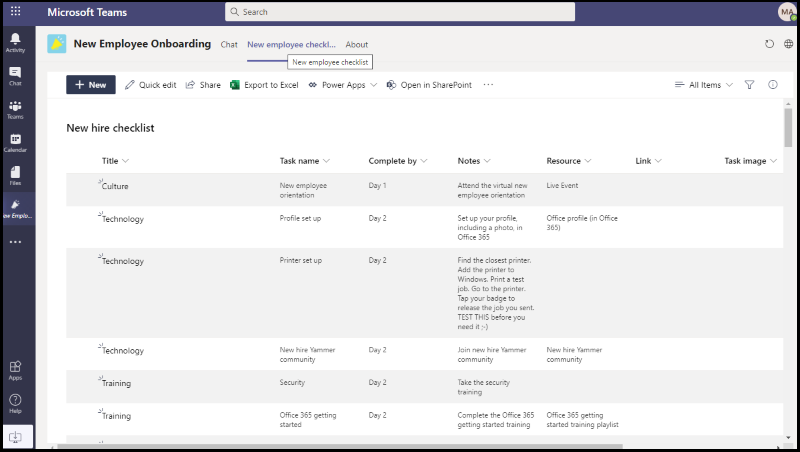  
:::column-end:::
:::row-end:::

## Open Badges

Open Badges is a Microsoft Teams app that enables individuals to earn digital learning credential badges within the Teams context and share them everywhere. Using capabilities from the third-party digital badge issuing authority, [Badgr](https://badgr.org/), awarded badges are recorded in a recipient's Badgr profile and available to build and share a rich picture of lifetime learning journeys.

[Get it on GitHub](https://github.com/OfficeDev/microsoft-teams-apps-openbadges)

:::row:::
  :::column span="2":::
    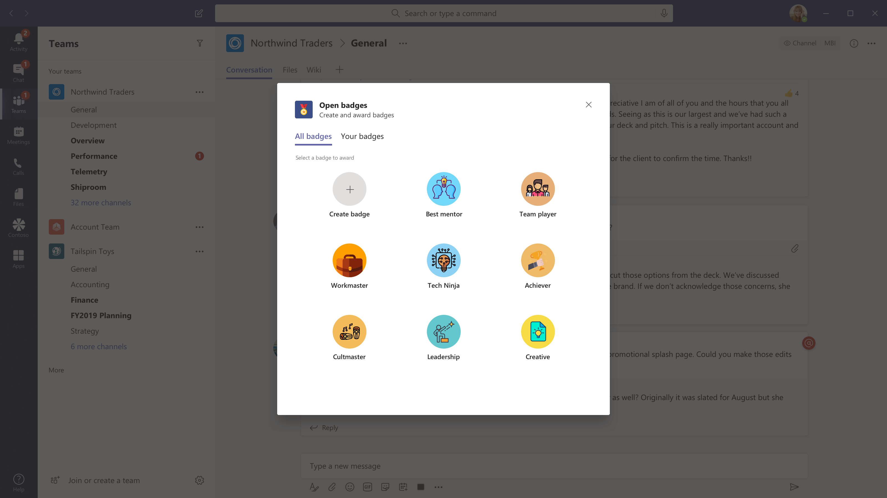  
:::column-end:::
:::row-end:::
:::row:::
:::column span="2":::
    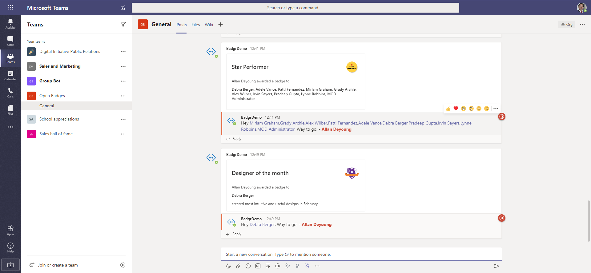
:::column-end:::
:::row-end:::

## Poll 

Poll is a custom Microsoft Teams [messaging extension](../messaging-extensions/what-are-messaging-extensions.md) app that enables you to quickly create and send polls in a chat or a channel to gather team opinions and preferences. The app is supported across all Teams platform clients — desktop, browser, iOS, and Android  — and is ready for deployment as part of your Microsoft 365 subscription.

[Get it on GitHub](https://github.com/OfficeDev/microsoft-teams-poll-app)

:::row:::
  :::column span="1":::
    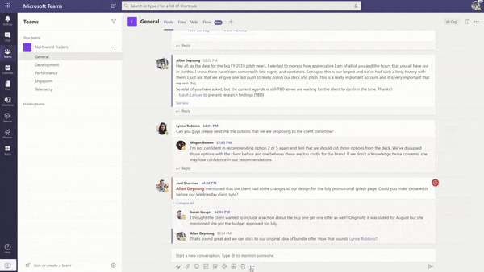  
:::column-end:::
:::row-end:::

## Quick Responses

Quick Responses is a Microsoft Teams app that delivers a robust solution for effectively answering users' commonly asked questions (FAQs). Instead of answering each query manually and  continuously repeating information, the app will build a library of responses for an interactive user experience via Teams [messaging extensions](../messaging-extensions/what-are-messaging-extensions.md).

[Get it on GitHub](https://github.com/OfficeDev/microsoft-teams-apps-quickresponses)

## Rapid Assist &#9734;

Rapid Assist is a Microsoft [Power Platform](https://powerapps.microsoft.com/blog/now-in-preview-customize-teams-with-built-in-power-platform-capabilities/) based app that allows customer facing associates to rapidly connect with the experts to get quick answers, search for information, follow up open requests, and allow experts to receive notifications to quickly get on a call to help answer questions. The app built using Microsoft [Power Apps](/powerapps/powerapps-overview) and [Power Automate](/power-automate/getting-started), deeply integrates with Microsoft Teams to enable organizations to easily connect frontline workers with corporate liaisons to resolve customer queries and deliver a great customer experience. 

[Get it on GitHub](https://github.com/OfficeDev/microsoft-teams-apps-rapid-assist)

:::row:::
   :::column span="":::
     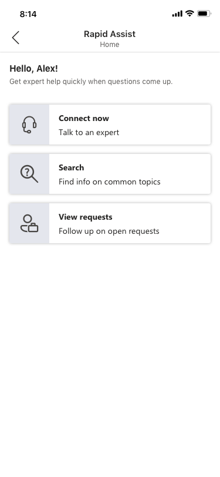
   :::column-end:::
   :::column span="":::
      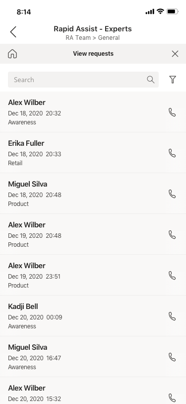
   :::column-end:::
:::row-end:::

## Reflect 

Reflect is a custom Microsoft Teams [messaging extension](../messaging-extensions/what-are-messaging-extensions.md) app that provides a safe and inclusive resource for your team members to share the state of their emotional well-being with colleagues and/or group leaders directly within Teams. The app is available in channel, group, meeting, and 1:1 chats and the check-in response can be set to public, private-to-sender, or fully anonymous.

[Get it on GitHub](https://github.com/OfficeDev/Microsoft-Teams-App-Reflect)

:::row:::
    :::column:::
    **Well-being poll**
    
    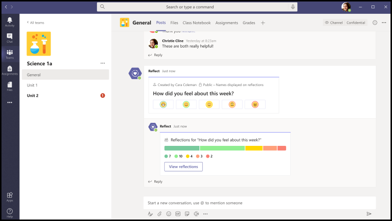
    :::column-end:::
:::row-end:::

## Remote Support

Remote Support is a [Microsoft Teams bot](../bots/what-are-bots.md) that provides a focused interface between support requesters throughout your organization and the internal support team.  End-users can submit, edit, or withdraw requests for support and the support team can respond, manage, and update requests all within the Teams platform.

[Get it on GitHub](https://github.com/OfficeDev/microsoft-teams-apps-remotesupport)

:::row:::
  :::column span="2":::
      
:::column-end:::
:::row-end:::
:::row:::
:::column span="2":::
    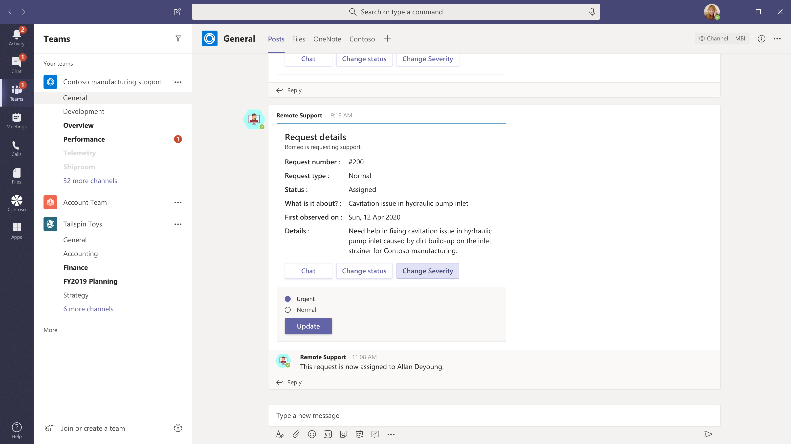
:::column-end:::
:::row-end:::

## Request-a-team

Request-a-team is a Microsoft Teams app that optimizes new team creation for your enterprise organization. The app supports standardization and best practices when creating new team instances through the integration of a wizard-guided request form, an embedded approval process, a request status dashboard, and automated team builds.

[Get it on GitHub](https://github.com/OfficeDev/microsoft-teams-apps-requestateam)

:::row:::
  :::column span="2":::
    
:::column-end:::
:::row-end:::
:::row:::
:::column span="2":::
    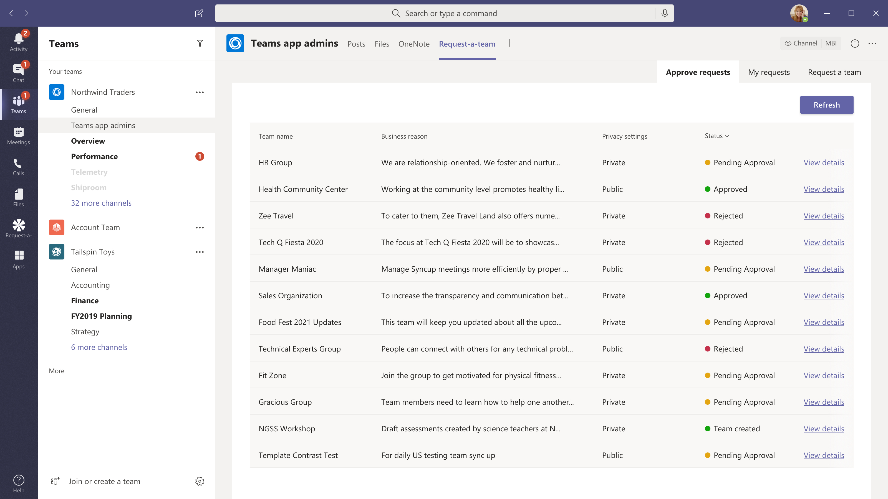
:::column-end:::
:::row-end:::

## Scrums for Channels

Scrums for Channels is a scrum assistant app that enables users to schedule and run scrums in channels within Microsoft Teams. The app is great for remote teams and teams comprised of members from varied geographical locations and time zones to share daily updates and ensure participation in scrum stand-up meetings.

[Get it on GitHub](https://github.com/OfficeDev/microsoft-teams-apps-scrumsforchannels)

> [!NOTE]
> To conduct scrum meetings in a group chat, please see our [Scrums for Group Chat](#scrums-for-group-chat) app template.

:::row:::
  :::column span="2":::
    
:::column-end:::
:::row-end:::
:::row:::
:::column span="2":::
    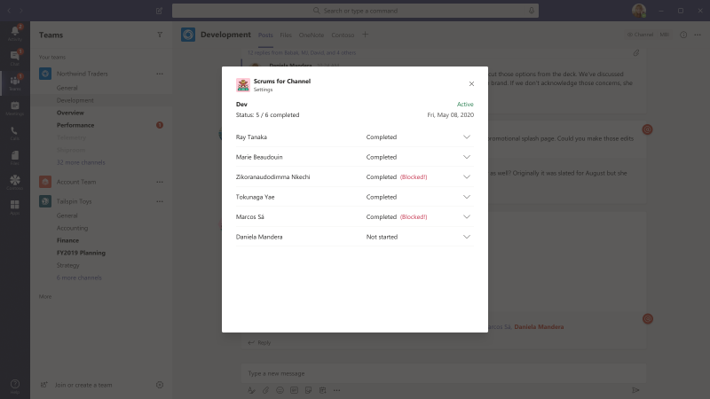
:::column-end:::
:::row-end:::

## Scrums for Group Chat

> [!NOTE]
> The Scrums Status app template has been updated and is now Scrums for Group Chat.

Scrums for Group Chat is a supportive scrum assistant that enables group chat members to run asynchronous stand-up meetings and easily share their daily updates. It allows all members of the group chat to contribute to the scrum and view the updates made by others in the running scrum.

[Get it on GitHub](https://github.com/OfficeDev/microsoft-teams-apps-scrumsforgroupchat)

## Share Now 

The Share Now app promotes the positive exchange of information between colleagues by enabling your users to easily share content within the Teams environment. Users engage the app to share items of interest with team members, discover new shared content, set preferences, and bookmark favorites for later reading.

[Get it on GitHub](https://github.com/OfficeDev/microsoft-teams-apps-sharenow)

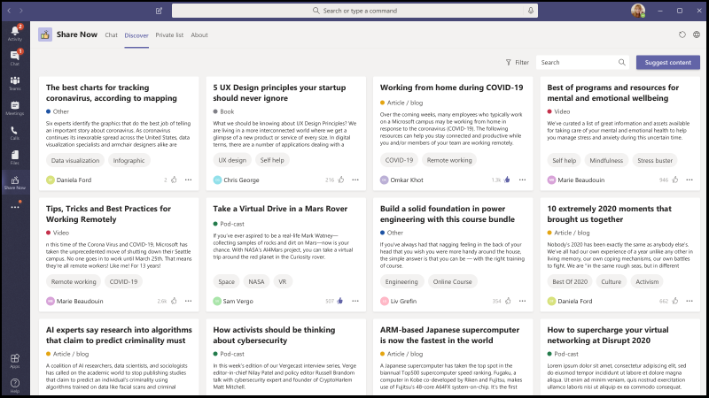

## SharePoint List Search

Collaboration in Microsoft Teams quite often references information contained within items in a SharePoint list. Simply pasting a link to the item in question forces everyone to switch context away from the conversation, find the needed information, then return to Teams to continue the conversation. As the conversation continues typically people will have to switch back to the reference item multiple times to verify new comments and refresh their memories of the information contained within the item. This context switching creates a barrier to smooth collaboration, and is a recipe for things falling through the cracks.

To help alleviate this pain, we are happy to bring to you the List Search app template. Millions of users use SharePoint to power some of the core workflows in their organizations. However, collaborating around lists can be especially tedious. Using the List Search app template in Microsoft Teams, users can insert information from SharePoint list items directly within a chat conversation to alleviate the context-switching caused when simply inserting a link into a chat. The information is inserted as an easy-to-read auto-formatted card, helping your users stay engaged in the conversation.

[Get it on GitHub](https://github.com/OfficeDev/microsoft-teams-list-search-app)

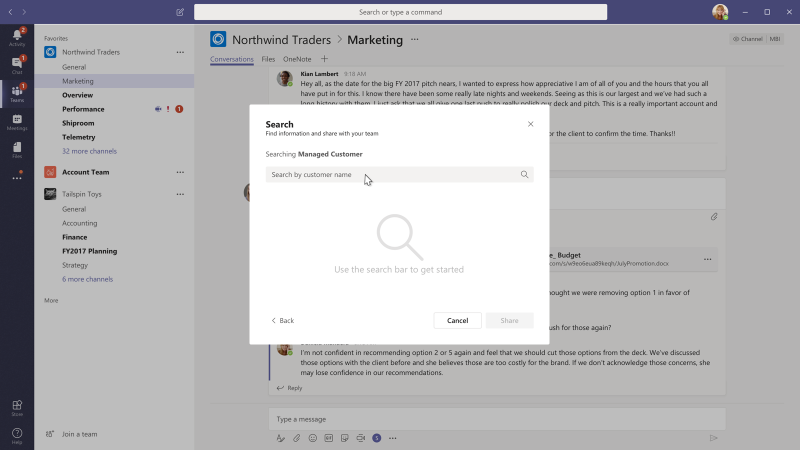

## Staff Check-ins

Staff Check-ins is a [Power Apps](/powerapps/powerapps-overview)-based app that enables oversight communication between your business and field personnel. Staff can easily provide time-critical information and status updates on either a scheduled or ad-hoc basis directly from Teams. The app supports real-time location, photos, and notes as well as reminder notifications and automated workflows.

[Get it on GitHub](https://github.com/OfficeDev/microsoft-teams-apps-staffcheckins)

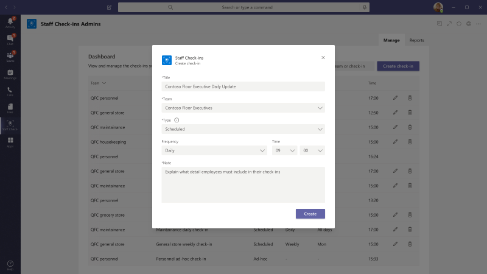

## Survey

Survey is a custom Microsoft Teams [messaging extension](../messaging-extensions/what-are-messaging-extensions.md) app that enables you to create a survey in a chat or a channel to gather data and gain actionable insight.  The app is supported across all Teams platform clients — desktop, browser, iOS, and Android — and is ready for deployment as part of your Microsoft 365 subscription.  

[Get it on GitHub](https://github.com/OfficeDev/Microsoft-Teams-Survey-app)

:::row:::
  :::column span="2":::
    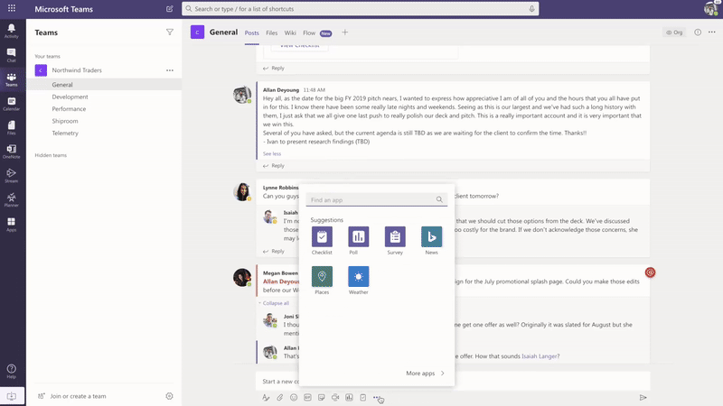
:::column-end:::
:::row-end:::

## Virtual Rounding &#9734;

Hospital and emergency room providers make dozens, and often hundreds of “rounds” per day. These quick check-ins on patients are intended to provide a status check on how the patient is doing and ensure that the patient’s concerns are addressed. While rounding is an essential practice to ensure patients are being monitored by multiple types of providers, they represent a huge drain on PPE, because for each visit, from each provider, a new mask, and new set of gloves must be used. With this app templates, medical workers can easily conduct rounds virtually, through a Microsoft Teams meeting between the provider and the patient.

The Virtual Rounding solution is also referenced in the Microsoft Health and Life Sciences [blog post](https://aka.ms/teamsvirtualrounding).

[Get it on GitHub](https://github.com/SmartterHealth/Virtual-Rounding)

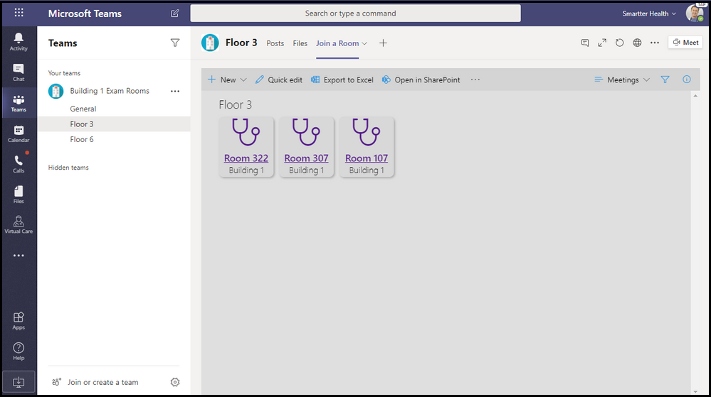

## Visitor Management

The Visitor Management app enables your organization and employees to easily and efficiently manage the on-site visitor process, directly from Microsoft Teams. The app enables employees to create visitor requests, centrally track a request status through the visitor dashboard, and receive real-time notifications when a visitor arrives.

[Get it on GitHub](https://github.com/OfficeDev/microsoft-teams-app-visitormanagement)

:::row:::
  :::column span="2":::
    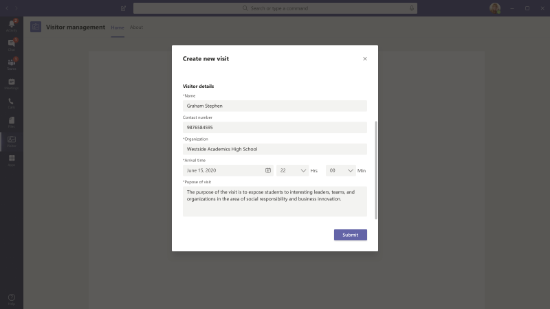
:::column-end:::
:::row-end:::
:::row:::
:::column span="2":::
    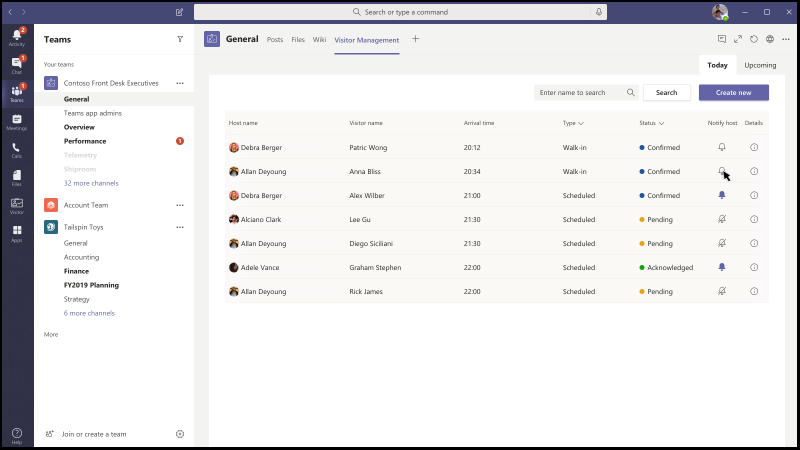
:::column-end:::
:::row-end:::

## Workplace Awards

Workplace Awards is a Teams app template that provides a positive framework to foster recognition and encourage the culture of employee appreciation in the modern workplace. The app enables you to setup and manage an employee rewards and recognition (R&R) program where employees can easily nominate and endorse colleagues and your R&R leader can view submitted nominations, grant awards, and announce recipients.

[Get it on GitHub](https://github.com/OfficeDev/microsoft-teams-apps-workplaceawards)

:::row:::
  :::column span="2":::
    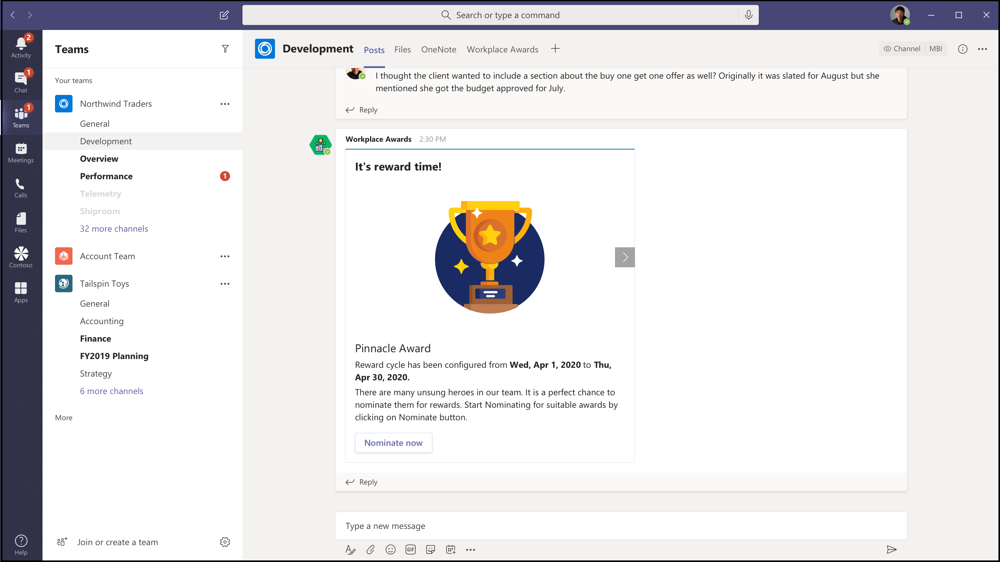
:::column-end:::
:::row-end:::
:::row:::
:::column span="2":::
    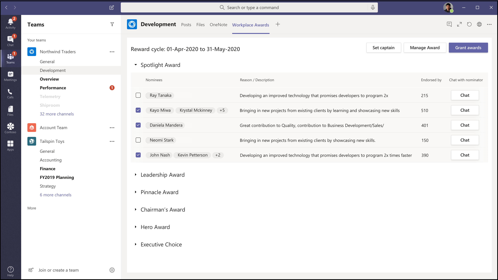
:::column-end:::
:::row-end:::

Have an idea for an app template you'd like to see? [Please let us know](https://forms.office.com/Pages/ResponsePage.aspx?id=v4j5cvGGr0GRqy180BHbR2_7qFm_lcZAr4eqEhnLsZ9UMVZGT1lCT0FXUDdZMUM0RkpBS1BESTAwWC4u).
