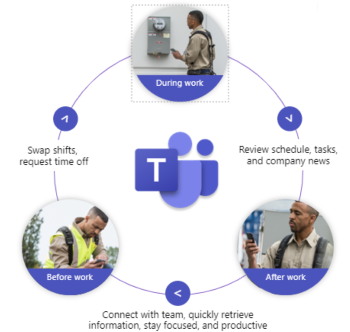
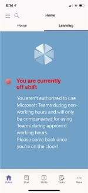
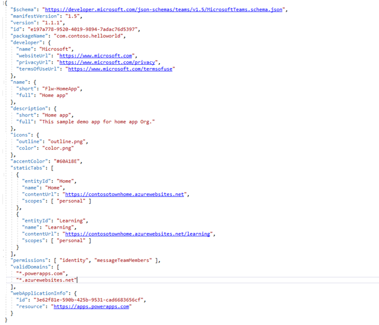

# Home mobile app experience

Home app is a branded Microsoft Teams experience for firstline workers that consolidates key information on a single platform via a robust landing page pinned to a mobile device. Home facilitates a hub app experience and can be further enhanced with the SharePoint Framework in Teams, Microsoft Graph APIs, Power Apps, or web app technologies to manage employee information, notifications, and messages.

> [!NOTE]
> Home is designed and built as a mobile application and is currently not optimized for desktop clients.

## Shift status information management

A key feature of the Home app is on/off shift management. This allows your organization to not only manage information that employees can access while they are working but also while they are off work and adjust availability as schedules change. Additionally, you can enable employees to choose whether or not to receive notifications while enabling an override for disabled notifications for urgent messages.

## Shift scenarios

### On-Shift

> [!div class="checklist"]
>
> * Employees can view their current shift schedule and assigned tasks under the Home app tab.
> * Employees can access learning and training materials from the Learning tab.
> * Employees can see the latest company-wide announcements.
> * Team members, on the same shift, can chat and communicate using Teams chat.
> * Employees can communicate and greet new team members using Teams 1:1 chat.
> * Employees can access other apps, such as PayStubs and Rewards, through the Home app.

### Off-shift

> [!div class="checklist"]
>
> * Employees can view their upcoming shift schedule but cannot view and access tasks.|
> * Employees will not have access to the Learning tab.

## Solution overview

##  Prerequisites

1. **Azure Active Directory (Azure AD) subscription** with the following resources:

    * [Azure Service](https://azure.microsoft.com/services/app-service/)

    * [Azure App Service Plan](/azure/app-service/overview)

    * [Application Insights](/azure/azure-monitor/app/app-insights-overview)

2. **[Microsoft Teams Shifts](/microsoftteams/expand-teams-across-your-org/shifts/manage-the-shifts-app-for-your-organization-in-teams) enabled in Teams**. Users must be a member of a team to access Shifts information.
3. **[Microsoft Teams Tasks](/microsoftteams/manage-tasks-app) app enabled in Teams**. Users must be a member of a team to access Tasks information.
4. **[OAuth 2.0 identity provider](../concepts/authentication/configure-identity-provider.md) configured for Teams**. This is required to access user profile information from Azure AD and Microsoft Graph.
5. **Installation of relevant custom apps**.  

> [!NOTE]
> The Home app source code includes:
>
> * Microsoft Graph API integration.
> * Placeholder deeplinks for custom app integration.  These placeholders can be replaced to tailor Home to meet your organization's needs.  Each custom app must be created separately and installed into Microsoft Teams as a standalone installation.
> * Two sample web app templates — PayStub and Rewards.
>

## Authentication and Single Sign-on (SSO)

The Home app authentication flow is based on user profile information stored in Azure AD and accessed using Microsoft Graph.  

The Teams [Single Sign-on API](../tabs/how-to/authentication/auth-aad-sso.md) is currently supported in Teams Developer Preview and will be available to the general public soon.

> [!div class="nextstepaction"]
> [Learn more about authentication for Microsoft Tabs and SSO in Teams](../tabs/how-to/authentication/auth-flow-tab.md)

## Add capabilities

1. Home app is an ASP.NET Core MVC application.
1. **Access employee shifts** using [Microsoft Teams Shifts Graph API integration](/graph/api/schedule-list-shifts?view=graph-rest-1.0&tabs=http).
1. **Display employee tasks** using [Microsoft Planner Tasks Graph API integration](/graph/api/planneruser-list-tasks?view=graph-rest-1.0&tabs=http).
1. **Customize Home** to create a tailored experience. For example:

    * The announcement feature of Home can be integrated with the Teams  [Company Communicator](../samples/app-templates.md#company-communicator) app template to share your company information and notifications within the Home app.
    * [Create Power Apps](/learn/modules/get-started-with-powerapps/5-powerapps-create-first) and deeplink to your Home app.
    * Build a [SharePoint Framework](https://techcommunity.microsoft.com/t5/microsoft-sharepoint-blog/sharepoint-and-teams-better-together/ba-p/189593) app in Teams and deeplink features such as [News](https://support.microsoft.com/office/add-team-site-news-in-a-teams-channel-743607c0-9510-414b-8aab-1ae9ef5d3f49) to your Home app.

1. **Retrieve a list of team members in the same shift** by using the Microsoft Graph List Members API. 
1. **Enhance the user chat experience** by creating deep links to private chats within the Home app.
1. **[Call  Microsoft Graph photo API](/graph/api/profilephoto-get?view=graph-rest-1.0)** to display a team member’s user profile picture.  
1. **Get user profile information** using the [Microsoft Graph Get User API](/graph/api/user-get?view=graph-rest-1.0&tabs=http).

## Add Home app to Teams

### Create a Teams App Manifest

Apps in Teams are defined by an app manifest JSON file that is  bundled with required icons into an [app package](../concepts/build-and-test/apps-package.md) . You'll need an app package to upload and install your app in Teams, and to publish to either your organization's catalog or to [AppSource](https://appsource.microsoft.com).

### Register your Home app with Azure AD

1. Sign in to the [Azure portal](https://portal.azure.com).
1. If your account gives you access to more than one tenant, select your account in the upper right corner. Set your portal session to your desired Azure AD tenant.
1. Under **Azure services** on the **Home** page, select **App registrations**.
1. Select **New registration** from the top navigation bar. You will be taken to the **Register an application** page.
1. Enter a meaningful application display name in the Name field. 
1. Specify who can use the application, as follows:   
&emsp;&emsp;&emsp; `Accounts in any organizational directory (Any Azure Ad directory – Multitenant) and personal Microsoft accounts.`

1. Under **Redirect URI** select **Public client/native (mobile & desktop)** and enter the destination URI that will be accepted when returning authentication responses (tokens) after successfully authenticating users.  
1. Select the **Register** button. You’ll be taken to the app's **Overview** page. Copy the **Application (client) ID**; you’ll need it later.
1. Verify that **Supported account types** is set to **Multiple organizations**.  

### Add Microsoft Graph API permissions

You'll need to add additional permissions to use Microsoft Graph notifications as follows:  

1. On the Overview page, Choose **API permissions** -> **Add a permission**.

1. Select **Microsoft Graph** -> **Delegated permissions**.

1. Select **Group** -> **Group.Read.All** (Allows application to read shifts, tasks of logged in user).

1. Select **Group** -> **Group.ReadWrite.All** (Allows application to read/write shifts, tasks of logged in user).

1. Select **User** -> **User.ReadWrite.All** (Allows application to read/write user data).

## Publish your Home app to your Azure subscription using Visual Studio  

### Create a local copy of your Home app project

1. If your Home app solution is in a GitHub repository, download it to your local environment and navigate to the project dirctory.

1. If you have a a local copy of your Home project, navigate to the project directory.

### Open the project in Visual Studio

1. In the Visual Studio **Solution Explorer**, right-click the project and choose **Publish** (or use the **Build** -> **Publish** menu item).  

1. In the **Publish** dialog, select **Azure**.

1. Choose **Azure App Service (Windows)** and select the **Next** button. 

1. Sign in with your Azure account, if necessary, and select **Create a new Azure App Service**.

1. In the **Create Azure App Service (Windows)** dialog, the **App Name**, **Resource Group**, and **App Service Plan** entry fields are populated. You can keep these names or change them.

1. Complete the necessary app setting values: **Azure client Id** (App id), **SharePoint client Id**, **List Id**, **Deep Link** URL and all required app Ids which needed to establish a deep link. 

1. When ready, select **Create**.

> [!div class="nextstepaction"]
> [Learn about Microsoft Graph shift resource and Microsoft Teams](/graph/api/resources/shift?view=graph-rest-1.0)