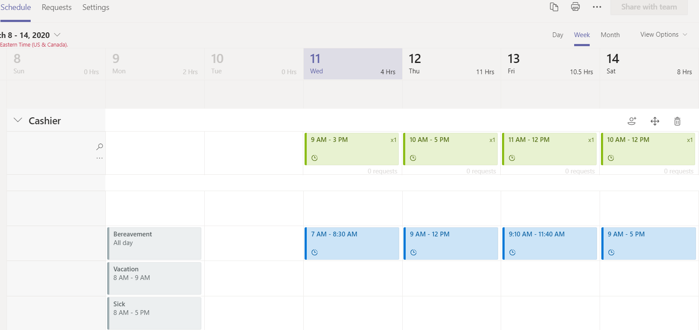

# Production-ready Shifts Connectors  

Teams Shifts Workforce management (WFM) connectors are production-ready and community-driven integrations, useful for Firstline Workers. They offer a seamless experience and quick process for the digital transformation of Firstline Workers with Teams Shifts.

Each connector provides detailed guidance for deployment and integration to your organization. You can explore in detail and customize to meet your specific needs.

This document gives an overview of key benefits of Teams Shifts WFM connectors.

## Key benefits of Teams Shifts WFM connectors

Following are the key benefits of Teams Shifts WFM connectors:

* **Plug and play experience:** All Shifts WFM connectors include ARM Azure deployment scripts that allow you to host all necessary services in Microsoft Azure. No coding is required to deploy the apps.

* **Production-ready code:** All Shifts connectors conform to the recommended security and infrastructure best practices and all community-submitted changes are reviewed to ensure continued conformance.

* **Customizable and extensible:** While all Shifts WFM connectors are ready to deploy for immediate use, with the entire code base and deployment scripts readily available. You can easily customize or extend them to fit your unique needs.

* **Detailed documentation & support:** All Shifts WFM connectors are accompanied by end-to-end documentation for solution architecture, deployment, and configuration steps. The connector repositories are monitored, so that you can report any issues, challenges or difficulties you encounter.

* **Seamless integration:** The integration between WFM solutions and Teams Shifts allows Firstline Workers to use the Teams Shifts app to view or manage their schedules and shift times, and use all the other rich collaboration features provided in Teams right from their mobile device or desktop without having to switch context to another app.  

Open shifts view in Teams:

The shifts view in Teams is shown in the following image:

For more information on Teams Shifts Workforce management (WFM) connectors, see [Shifts connectors](/microsoft-365/frontline/shifts-connectors).

## See also

[Integrate web apps](~/samples/integrate-web-apps-overview.md)
