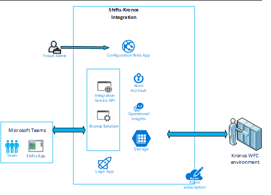

# Microsoft Teams Shifts connectors for workforce management (WFM) systems

Teams Shifts connectors are production-ready, open-source, community-driven integrations that provide a seamless experience for firstline workers onboarding from your WFM system to Teams Shifts. Each connector provides detailed instructions for deploying and installing to your organization and the complete source code is available in our GitHub repo where it can be explored in detail and/or forked and tailored to meet your specific needs.

## Key benefits

> [!div class="checklist"]
>
> * **Plug and play experience.** All Shifts connectors include ARM Azure deployment scripts that will allow you to host all necessary services in Microsoft Azure. No coding is required to deploy the apps.
> * **Production-ready code.** Shifts connectors conform to the security and infrastructure recommended best practices and all community-submitted changes are reviewed to ensure continued conformance.
> * **Customizable and extensible.**  While all connectors are ready to deploy for immediate use, we provide the entire code base and deployment scripts so that you can easily customize or extend them to fit your unique needs.
> * **Detailed documentation & support.**  All Shifts connectors are accompanied by end-to-end documentation including solution architecture and configuration/deployment steps. The connector repositories are monitored so please report any challenges or difficulties you encounter by raising an issue on GitHub.

## Kronos-to-Teams Shifts connector

This connector enhances the onboarding experience from the Kronos WFM system to Teams. The integration allows firstline workers to view/manage their schedules and shift times and use all of the rich collaboration features provided by Teams from their mobile device or desktop without ever having to leave the Teams environment.

[Get it on GitHub]( https://aka.ms/KronosShiftsConnector)

