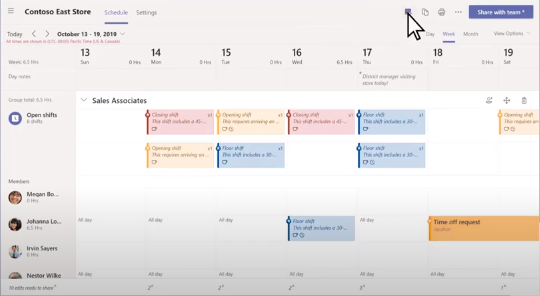

# Microsoft Teams Shifts WFM connectors  

## Teams Shifts workforce management connectors (WFM) for firstline workers 

Teams Shifts WFM connectors are production-ready, open-source, community-driven integrations that offer a seamless experience and quick process for the digital transformation of firstline workers with Teams Shifts. 

Each connector provides detailed guidance for deployment and integration to your organization and the complete source code is available in our GitHub repo where it can be explored in detail and/or forked and tailored to meet your specific needs.

## Key benefits: Teams Shifts WFM connectors

* **Plug and play experience.** All Shifts WFM connectors include ARM Azure deployment scripts that allow you to host all necessary services in Microsoft Azure. No coding is required to deploy the apps.

* **Production-ready code.** All  Shifts connectors conform to recommended security and infrastructure best practices and all community-submitted changes are reviewed to ensure continued conformance.

* **Customizable and extensible.**  While all Shifts WFM connectors are ready to deploy for immediate use, we provide the entire code base and deployment scripts so that you can easily customize or extend them to fit your unique needs.

* **Detailed documentation & support.**  All Shifts WFM connectors are accompanied by end-to-end documentation for solution architecture, deployment, and configuration steps. The connector repositories are monitored, so please report any issues, challenges or difficulties you encounter through the repo's GitHub Issues tracker.

## Kronos-to-Teams Shifts connector

The integration between Kronos and Teams Shifts allows firstline workers to use the Teams Shifts app to view/manage their schedules and shift times, and use all the other rich collaboration features provided in Teams right from their mobile device or desktop without having to switch context to another app. With the open-source code, you can now integrate Kronos Workforce Central Version 8.1 with Teams Shifts (desktop/mobile Teams app) for the following firstline worker and manager scenarios:

1. View schedule.

1. Publish open shifts.

1. Swap shifts.

1. Request time off.

1. Offer shifts.

[Get it on GitHub]( https://aka.ms/KronosShiftsConnector)

**Open shifts view in Teams**  

