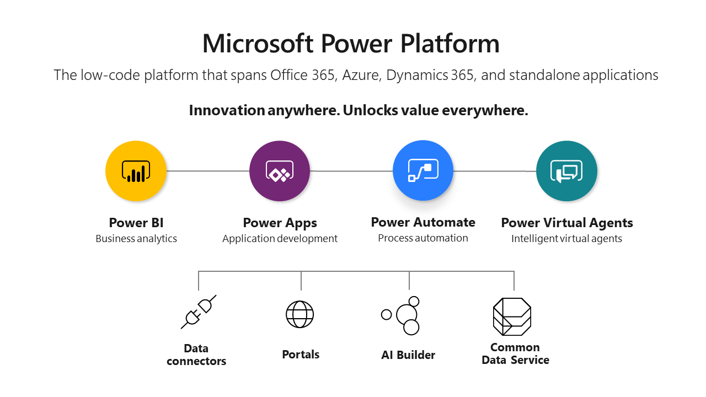

# Create low-code and no-code custom apps for Microsoft Teams

Microsoft Teams is both extensible and customizable meaning you can build custom applications for Teams to meet the distinct needs of your users. Low-code development platforms allow citizen developers to quickly build custom apps and professional developers to accelerate app development and deployment. Low-code is an intuitive software development approach that requires little to no coding in order to build applications and processes. Users with little or no coding knowledge or software development experience can create applications with minimal or no additional code required. Most platforms consist of a visual interface, connectors to back-end services, and a built in app lifecycle manager to build, debug, deploy and maintain applications. Microsoft has several innovative possibilities for quickly building great Teams-compatible apps with low-code attributes:

1. [Microsoft Power Platform](/power-platform) integrations including [Virtual assistant for Teams](virtual-assistant.md) and [Power Virtual Agents for Teams ](add-power-virtual-agents-bot-to-teams.md)
1. [Teams app templates](app-templates.md)
1. Teams Toolkit for [Visual Studio Toolkit Code](visual-studio-code-overview.md) and [Visual Studio](visual-studio-overview.md)

## Teams and Power Platform

The Power Platform enables you to build solutions, automate processes, analyze data,  and create virtual agents within a unified and integrated application platform.

### Power BI &plus; Teams &equals; key reports

You can [collaborate in Teams with Power BI](power-bi/collaborate-share/service-collaborate-microsoft-teams) and [embed interactive reports in Teams channels and chats](power-bi/collaborate-share/service-embed-report-microsoft-teams). The [Power BI tab for Microsoft Teams](https://powerbi.microsoft.com/en-us/blog/announcing-new-power-bi-tab-for-microsoft-teams/) adds support for reports in the Teams workspace:

1. Create an app in [workspaces](power-bi/collaborate-share/service-create-the-new-workspaces) 
1. [Create a template app in Power BI](connect-data/service-template-apps-create)  
1. [Publish your app in Power BI](power-bi/collaborate-share/service-create-distribute-apps)

#### Power BI Learn modules

[Power BI for App Makers](/learn/browse/?expanded=power-platform&products=power-bi&roles=maker)

[Power BI for Developers](/learn/browse/?expanded=power-platform&products=power-bi&roles=developer)

---

### Power Automate &plus;  Teams &equals; automated workflows

With the [Power Automate app in Teams](power-automate/flows-teams), you can [create flows to automate repetitive work tasks](https://flow.microsoft.com/connectors/shared_teams/microsoft-teams/) without leaving Teams

[Get started with Power Automate](power-automate/getting-started)
[Trigger a flow from any message in Microsoft Teams](power-automate/trigger-flow-teams-message)
[Use adaptive cards within Power Automate](power-automate/create-adaptive-cards)

#### Power Automate Learn modules

[Power Automate for App Makers](/learn/browse/?expanded=power-platform&products=power-automate&roles=maker)

[Power Automate for Developers](/learn/browse/?expanded=power-platform&products=power-automate&roles=developer)

---

### Power Apps &plus; Teams &equals; rapid solutions

Using [Power Apps](owerapps/powerapps-overview), you can quickly build custom business apps that connect to your business data and are tailored to your business needs.
[Embed an app in Microsoft Teams](power-platform/admin/embed-app-teams). Power Apps [apps](powerapps/maker/) provide an intuitive canvas environment to create an app using the drag-and-drop method to add elements to your application

### Power Apps Learn modules

[Power Apps for app makers](/learn/browse/?products=power-apps&roles=maker)

[Power Apps for app developers](/learn/browse/?products=power-apps)

### Power Virtual Agents &plus; Teams &equals; adaptable AI

https://techcommunity.microsoft.com/t5/microsoft-teams-blog/teams-is-shaping-the-future-of-work-with-low-code-features-to/ba-p/1507180

allowing citizen developers to start building apps and professional developers to accelerate app development and deployment.

#### Power Virtual Agents Learn modules

[Power Virtual Agents for App Makers and Developers](s/learn/browse/?products=power-virtual-agents&expanded=power-platform&roles=maker)

#### Project Oakdale

Project Oakdale is a new low-code data platform for coming soon to Microsoft Teams. It will will allow developers to create Teams Power Platform solutions directly within Teams. *See* our [Teams Blog Microsoft Project Oakdale page](https://powerapps.microsoft.com/en-us/blog/introducing-project-oakdale-a-new-low-code-data-platform-for-microsoft-teams) for more information.

## Teams app templates

 

App templates are production-ready apps for Microsoft Teams that are community driven, open-source, and available on GitHub. Each contains detailed instructions for deploying and installing that app for your organization, providing a ready-to-use app that you can install and begin using immediately. The complete source code is available as well, so you can explore it in detail, or fork the code and alter it to meet your specific needs.

## Teams Toolkit

