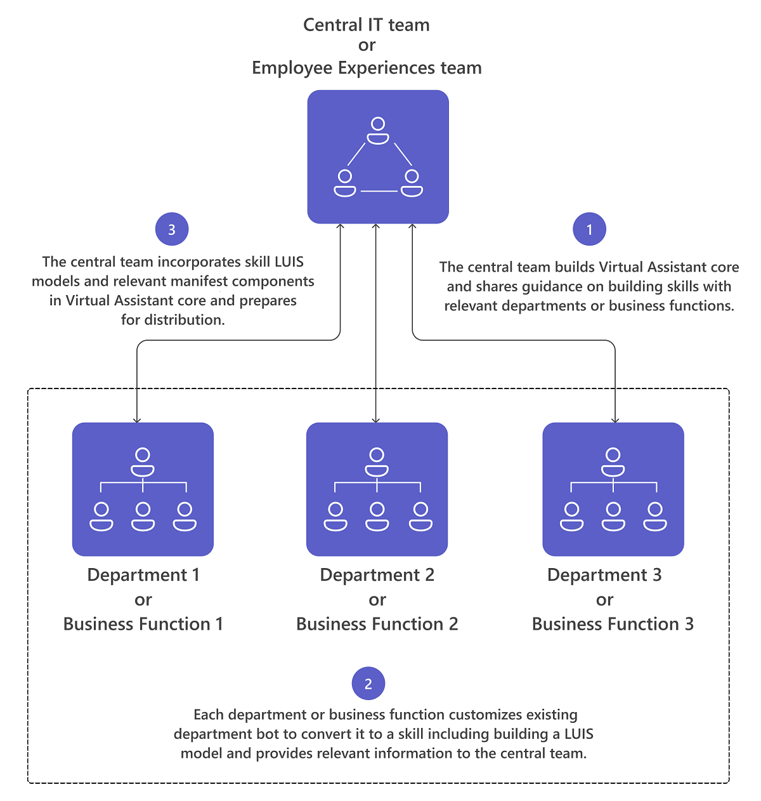

# Virtual Assistant for Microsoft Teams

Virtual Assistant is a Microsoft open-source template that enables you to create a robust conversational solution while maintaining full control of user experience, organizational branding, and necessary data. The [Virtual Assistant core template](https://microsoft.github.io/botframework-solutions/overview/virtual-assistant-template) is the basic building block that brings together the Microsoft technologies required to build a Virtual Assistant, including the [Bot Framework SDK](https://github.com/microsoft/botframework-sdk), [Language Understanding (LUIS)](https://www.luis.ai/), [QnA Maker](https://www.qnamaker.ai/), as well as essential capabilities including  skills registration, linked accounts, basic conversational intent to offer end users a range of seamless interactions and experiences. In addition, the template capabilities include rich examples of reusable conversational [skills](https://microsoft.github.io/botframework-solutions/overview/skills).  Individual skills can be integrated in a Virtual Assistant solution to enable multiple scenarios. Using the Bot Framework SDK, Skills are presented in source code form enabling you to customize and extend as required. See [What is a Bot Framework Skill](https://microsoft.github.io/botframework-solutions/overview/skills/).


Text message activities are routed to associated skills by the Virtual Assistant core using a [dispatch](/azure/bot-service/bot-builder-tutorial-dispatch?view=azure-bot-service-4.0&tabs=cs) model. Skills are bots

## Implementation considerations

The decision to add a Virtual Assistant can include many determinants and differ for each organization. Here are the factors that support implementing a Virtual Assistant for your organization:

- A central team manages all employee experiences and has the capability to build a Virtual Assistant experience and manage updates to the core experience including the addition of new skills.
- Multiple applications exist across business functions and/or the number is expected to grow in the future.
- Existing applications are customizable, owned by the organization, and can be converted into skills for a Virtual Assistant.
- The central employee-experiences team is able to influence customizations to existing apps and provide necessary guidance for integrating existing applications as skills in Virtual Assistant experience



## Create a Teams-focused Virtual Assistant

Microsoft has published a [Visual Studio template](https://marketplace.visualstudio.com/items?itemName=BotBuilder.VirtualAssistantTemplate) for building Virtual Assistants and skills. With the Visual Studio template, you can create a Virtual Assistant, powered by a text-based experience with support for limited rich cards with actions. We have enhanced the Visual Studio base template to include Microsoft Teams platform capabilities and power great Teams app experiences. A few of the capabilities include support for rich adaptive cards, task modules, teams/group chats and messaging extensions. *See also*, [Tutorial: Extend Your Virtual Assistant to Microsoft Teams](https://microsoft.github.io/botframework-solutions/clients-and-channels/tutorials/enable-teams/1-intro/).


### Add adaptive cards to your Virtual Assistant

To dispatch requests properly, your Virtual Assistant needs to identify the correct LUIS model and corresponding skill associated with it. However, the dispatching mechanism cannot be used for card action activities since the LUIS model associated with a skill may not be trained for card action texts since these are fixed, pre-defined keywords, not utterances from a user.

We have resolved this by embedding skill information in the card action payload. Every skill should embed `skillId` in the  `value` field of card actions. This is the best way to ensure that each card action activity carries the relevant skill information and Virtual Assistant can utilize this information for dispatching.

Below is a card action data sample. **By providing `skillId` in the constructor we ensure that skill information is always present in card actions.**

```csharp
    public class CardActionData
    {
        public CardActionData(string skillId)
        {
            this.SkillId = skillId;
        }

        [JsonProperty("skillId")]
        public string SkillId { get; set; }
    }

    ...
    var button = new CardAction
    {
        Type = ActionTypes.MessageBack,
        Title = "Card action button",
        Text = "card action button text",
        Value = new CardActionData(<SkillId>),
    };
```

**Next, we introduce `SkillCardActionData` class in the Virtual Assistant template to extract `skillId` from the card action payload.**

```csharp
    // Skill Card action data should contain skillId parameter
    // This class is used to deserialize it and get skillId 
    public class SkillCardActionData
    {
        /// <summary>
        /// Gets the ID of the skil that should handle this card
        /// </summary>
        [JsonProperty("skillId")]
        public string SkillId { get; set; }
    }
```

Below is a **code snippet to extract  `skillId` from card action data**. We implemented it as an  extension method in the [Activity](https://github.com/microsoft/botframework-sdk/blob/master/specs/botframework-activity/botframework-activity.md) class.

```csharp
    public static class ActivityExtensions
    {
        // Fetches skillId from CardAction data if present
        public static string GetSkillId(this Activity activity)
        {
            string skillId = string.Empty;

            try
            {
                if (activity.Type.Equals(ActivityTypes.Message) && activity.Value != null)
                {
                    var data = JsonConvert.DeserializeObject<SkillCardActionData>(activity.Value.ToString());
                    skillId = data.SkillId;
                }
                else if (activity.Type.Equals(ActivityTypes.Invoke) && activity.Value != null)
                {
                    var data = JsonConvert.DeserializeObject<SkillCardActionData>(JObject.Parse(activity.Value.ToString()).SelectToken("data").ToString());
                    skillId = data.SkillId;
                }
            }
            catch
            {
                // If not able to retrive skillId, empty skillId should be returned
            }

            return skillId;
        }
    }
```

### Handle interruptions gracefully

Virtual Assistant can handle interruptions in cases where a user tries to invoke a skill while another skill is currently active. we have introduced `TeamsSkillDialog` and `TeamsSwitchSkillDialog`, based on Bot Framework's [SkillDialog](https://github.com/microsoft/botframework-solutions/blob/5b46d73e220bbb4fba86c48be532e495535ca78a/sdk/csharp/libraries/microsoft.bot.solutions/Skills/SkillDialog.cs) and [SwitchSkillDialog](https://github.com/microsoft/botframework-solutions/blob/6d40fa8ae05f96b0c5e0464e01361a9e1deb696c/sdk/csharp/libraries/microsoft.bot.solutions/Skills/Dialogs/SwitchSkillDialog.cs), to enable users to switch a skill experience from card actions. To handle this request the Virtual Assistant prompts the user with a confirmation message to switch skills.


### Handling task module requests

To add task module capabilities to a Virtual Assistant, two additional methods are included in the Virtual Assistant activity handler: `OnTeamsTaskModuleFetchAsync` and `OnTeamsTaskModuleSubmitAsync`. These methods listen to task module-related activities from Virtual Assistant, identify the skill associated with the request, and forward the request to the identified skill. 

Request forwarding is done via the  [SkillHttpClient](/dotnet/api/microsoft.bot.builder.integration.aspnet.core.skills.skillhttpclient?view=botbuilder-dotnet-stable), `PostActivityAsync` method. It returns the response as `InvokeResponse` which is parsed and converted to `TaskModuleResponse` and sent back to Virtual Assistant.

```csharp
    public static TaskModuleResponse GetTaskModuleRespose(this InvokeResponse invokeResponse)
    {
        if (invokeResponse.Body != null)
        {
            return new TaskModuleResponse()
            {
                Task = GetTask(invokeResponse.Body),
            };
        }

        return null;
    }

    private static TaskModuleResponseBase GetTask(object invokeResponseBody)
        {
            JObject resposeBody = (JObject)JToken.FromObject(invokeResponseBody);
            var task = resposeBody.GetValue("task");
            var taskType = task.SelectToken("type").ToString();

            return taskType switch
            {
                "continue" => new TaskModuleContinueResponse()
                {
                    Type = taskType,
                    Value = task.SelectToken("value").ToObject<TaskModuleTaskInfo>(),
                },
                "message" => new TaskModuleMessageResponse()
                {
                    Type = taskType,
                    Value = task.SelectToken("value").ToString(),
                },
                _ => null,
            };
        }
```

A similar approach is followed for card action dispatching and task module responses. Task module fetch and submit action data is updated to include `skillId`. 
Activity Extension method `GetSkillId` extracts `skillId` from the payload which provides details about the skill that needs to be invoked.

Below is a code snippet for `OnTeamsTaskModuleFetchAsync` and `OnTeamsTaskModuleSubmitAsync` methods.

```csharp
    // Invoked when a "task/fetch" event is received to invoke task module.
    protected override async Task<TaskModuleResponse> OnTeamsTaskModuleFetchAsync(ITurnContext<IInvokeActivity> turnContext, TaskModuleRequest taskModuleRequest, CancellationToken cancellationToken)
    {
        try
        {
            string skillId = (turnContext.Activity as Activity).GetSkillId();
            var skill = _skillsConfig.Skills.Where(s => s.Value.AppId == skillId).FirstOrDefault().Value;

            // Forward request to correct skill
            var invokeResponse = await _skillHttpClient.PostActivityAsync(this._appId, skill, _skillsConfig.SkillHostEndpoint, turnContext.Activity as Activity, cancellationToken);

            return invokeResponse.GetTaskModuleRespose();
        }
        catch (Exception exception)
        {
            await turnContext.SendActivityAsync(_templateEngine.GenerateActivityForLocale("ErrorMessage"));
            _telemetryClient.TrackException(exception);

            return null;
        }
    }

    // Invoked when a 'task/submit' invoke activity is received for task module submit actions.
    protected override async Task<TaskModuleResponse> OnTeamsTaskModuleSubmitAsync(ITurnContext<IInvokeActivity> turnContext, TaskModuleRequest taskModuleRequest, CancellationToken cancellationToken)
    {
        try
        {
            string skillId = (turnContext.Activity as Activity).GetSkillId();
            var skill = _skillsConfig.Skills.Where(s => s.Value.AppId == skillId).FirstOrDefault().Value;

            // Forward request to correct skill
            var invokeResponse = await _skillHttpClient.PostActivityAsync(this._appId, skill, _skillsConfig.SkillHostEndpoint, turnContext.Activity as Activity, cancellationToken).ConfigureAwait(false);

            return invokeResponse.GetTaskModuleRespose();
        }
        catch (Exception exception)
        {
            await turnContext.SendActivityAsync(_templateEngine.GenerateActivityForLocale("ErrorMessage"));
            _telemetryClient.TrackException(exception);

            return null;
        }
    }
```

Additionally, all skill domains must be included in the `validDomains` section in Virtual Assistant's manifest file so that task modules invoked via a skill render properly.

### Handling collaborative app scopes

Teams apps can exist in multiple scopes including 1:1 chat, group chat, and channels. The core Virtual Assistant template is designed for 1:1 chats. As part of the onboarding experience Virtual Assistant  prompts users for name and maintains user state. Since that onboarding experience is not suited for group chat/channel scopes it has been removed.

Skills should handle activities in multiple scopes (1:1 chat, group chat, and channel conversation). If any of these scopes are not supported, skills should respond with an appropriate message.

The following  processing functions have been added to Virtual Assistant core:

- Virtual Assistant can be invoked without any text message from a group chat or channel.
- Articulations are cleaned (i.e.,  remove @mentions) prior to it being sent to the dispatch module so that the dispatch output is unaffected.

```csharp
    if (innerDc.Context.Activity.Conversation?.IsGroup == true)
    {
        // Remove bot atmentions for teams/groupchat scope
        innerDc.Context.Activity.RemoveRecipientMention();

        // If bot is invoked without any text, reply with FirstPromptMessage
        if (string.IsNullOrWhiteSpace(innerDc.Context.Activity.Text))
        {
            await innerDc.Context.SendActivityAsync(_templateEngine.GenerateActivityForLocale("FirstPromptMessage"));
            return EndOfTurn;
        }
    }
```

### Handling messaging extensions

The commands for a messaging extension are declared in your app manifest file. The messaging extension user interface is powered by those commands. For a Virtual Assistant to power a messaging extension command (as an attached skill), a Virtual Assistant's own manifest must contain those commands. The commands from an individual skill's manifest should be added to the Virtual Assistant's manifest as well. The command ID provides information about an associated skill by appending the skill's app ID via a separator (`:`).

Below is a snippet from a skill's manifest file.

```json
 "composeExtensions": [
    {
        "botId": "<Skil_App_Id>",
        "commands": [
            {
                "id": "searchQuery",
                "context": [ "compose", "commandBox" ],
                "description": "Test command to run query",
    ....
```

And, below is the corresponding Virtual Assistant manifest file code snippet.

```json
 "composeExtensions": [
    {
        "botId": "<VA_App_Id>",
        "commands": [
            {
                "id": "searchQuery:<skill_id>",
                "context": [ "compose", "commandBox" ],
                "description": "Test command to run query",
    ....
```

Once the commands are invoked by a user, the Virtual Assistant can identify an associated skill by parsing the command ID, update the activity by removing the extra suffix (`:<skill_id>`) from the command ID,  and forward it to the corresponding skill. The code for a skill doesn't need to handle the extra suffix, thus, conflicts between command IDs across skills are avoided. With this approach, all the search and action commands of a skill within all contexts ("compose", "commandBox" and "message") can be powered by a Virtual Assistant.

```csharp
    const string MessagingExtensionCommandIdSeparator = ":";

    // Invoked when a 'composeExtension/submitAction' invoke activity is received for a messaging extension action command
    protected override async Task<MessagingExtensionActionResponse> OnTeamsMessagingExtensionSubmitActionAsync(ITurnContext<IInvokeActivity> turnContext, MessagingExtensionAction action, CancellationToken cancellationToken)
    {
        return await ForwardMessagingExtensionActionCommandActivityToSkill(turnContext, action, cancellationToken);
    }

    // Forwards invoke activity to right skill for messaging extension action commands.
    private async Task<MessagingExtensionActionResponse> ForwardMessagingExtensionActionCommandActivityToSkill(ITurnContext<IInvokeActivity> turnContext, MessagingExtensionAction action, CancellationToken cancellationToken)
    {
        var skillId = ExtractSkillIdFromMessagingExtensionActionCommand(turnContext, action);
        var skill = _skillsConfig.Skills.Where(s => s.Value.AppId == skillId).FirstOrDefault().Value;
        var invokeResponse = await _skillHttpClient.PostActivityAsync(this._appId, skill, _skillsConfig.SkillHostEndpoint, turnContext.Activity as Activity, cancellationToken).ConfigureAwait(false);

        return invokeResponse.GetMessagingExtensionActionResponse();
    }

    // Extracts skill Id from messaging extension command and updates activity value
    private string ExtractSkillIdFromMessagingExtensionActionCommand(ITurnContext<IInvokeActivity> turnContext, MessagingExtensionAction action)
    {
        var commandArray = action.CommandId.Split(MessagingExtensionCommandIdSeparator);
        var skillId = commandArray.Last();

        // Update activity value by removing skill id before forwarding to the skill.
        var activityValue = JsonConvert.DeserializeObject<MessagingExtensionAction>(turnContext.Activity.Value.ToString());
        activityValue.CommandId = string.Join(MessagingExtensionCommandIdSeparator, commandArray, 0 commandArray.Length - 1);
        turnContext.Activity.Value = activityValue;

        return skillId;
    }
```

Some messaging extension activities do not include the command ID. For example, `composeExtension/selectItem` contains only the value of the invoke tap action. To identify the associated skill, `skillId`  is attached to each item card while forming a response for `OnTeamsMessagingExtensionQueryAsync`. (This is similar to the approach for [adding adaptive  cards to your Virtual Assistant](#add-adaptive-cards-to-your-virtual-assistant).

```csharp
    // Invoked when a 'composeExtension/selectItem' invoke activity is received for compose extension query command.
    protected override async Task<MessagingExtensionResponse> OnTeamsMessagingExtensionSelectItemAsync(ITurnContext<IInvokeActivity> turnContext, JObject query, CancellationToken cancellationToken)
    {
        var data = JsonConvert.DeserializeObject<SkillCardActionData>(query.ToString());
        var skill = _skillsConfig.Skills.Where(s => s.Value.AppId == data.SkillId).FirstOrDefault().Value;
        var invokeResponse = await _skillHttpClient.PostActivityAsync(this._appId, skill, _skillsConfig.SkillHostEndpoint, turnContext.Activity as Activity, cancellationToken).ConfigureAwait(false);

        return invokeResponse.GetMessagingExtensionResponse();
    }
```

---

## Example: Convert the Book-a-room app template to a Virtual Assistant skill

[Book-a-room](app-templates.md#book-a-room) is a [Microsoft Teams bot](../bots/what-are-bots.md) that lets users quickly find and reserve a meeting room for 30 (default), 60, or 90 minutes starting from the current  time. The Book-a-room bot scopes to personal or 1:1 conversations.


**TODO**: Nehal to provide the text here

## Virtual Assistant known limitations

- **EndOfConversation**. A skill should send an `endOfConversation` activity when it finishes a conversation. basis this activity, a Virtual Assistant ends context with that particular skill and gets back into Virtual Assistant's (root) context. For Book-a-room bot, there is no clear state where conversation can be ended. Hence we have not sent `endOfConversation` from Book-a-room bot and when user wants to go back to root context they can simply do that by `start over` command.
- **Card refresh**. Card refreshes is not yet supported Virtual Assistant.
- **Messaging extensions**.:
  - Currently, a Virtual Assistant can support a maximum of ten commands for messaging extensions.
  - Configuration of message extensions is not scoped to individual commands but for the entire extension itself. This limits configuration for each individual skill through Virtual Assistant.
  - Messaging extensions command IDs have a maximum length of [64 characters](schema/manifest-schema#composeextensionscommands) and 37 characters will be used for embedding skill information. Thus, updated constraints for command ID are limited to 27 characters.
