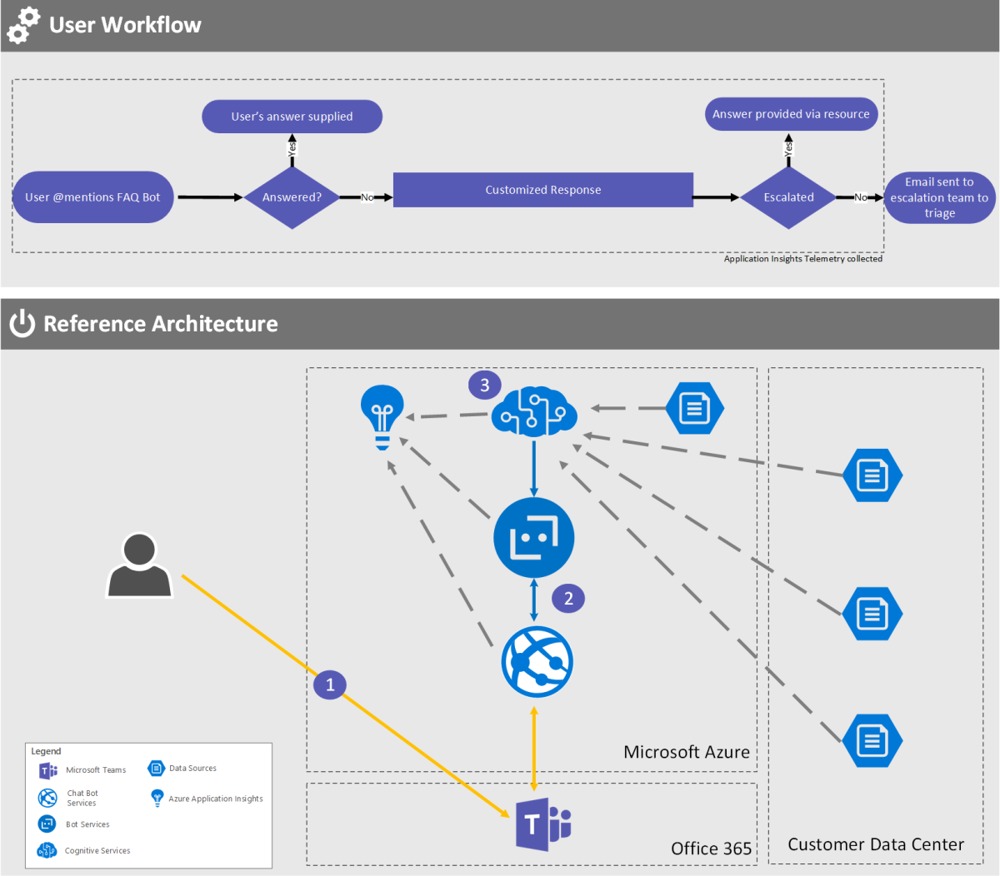

# FAQ bot in Microsoft Teams

## User story

As a member of your organization’s personnel department (human resources, or HR) you’re responsible for maintaining a frequently asked questions (FAQ) page to provide answers to questions that employees commonly ask. 

Your organization recently deployed Microsoft Teams and you see an opportunity to use a line-of-business app to improve how employees get answers to their questions. At the same time, you want to empower your organization to collect valuable information to improve these answers and the employee experience over time.

The Teams FAQ app would:

-   Respond to questions asked by employees via chat by providing the most appropriate answer.
-   Use natural language processing to reduce the dependency on the employee’s using exact terminology when asking a question.
-   Enable connecting the user to a live support team member in case the question can’t be answered, or the answer doesn’t meet the employee’s needs.
-   Allow employees to rate their satisfaction with the answer provided (or not provided).
-   Allow employees to rate their overall experience with the Teams FAQ app.
-   Capture telemetry, which can provide statistics on the most commonly asked questions and generate data to improve future employee training and information sharing.

Employees can interact easily with the Teams FAQ app to quickly get answers to their questions. This reduces context switching and saves them valuable time by focusing on simple, human-style interactions to get the information they need.

HR gets valuable information about how well the answers they’re providing are resonating with employees, and data on where they’re missing important information altogether. That data can be used to improve the overall employee experience.

|         |         |
|---------|---------|
| Decision point|<ul><li>Which internal FAQ resources would your organization want to include in such an app?</li></ul>|

## Architecture

The high-level architecture of this Teams app is:

-   [QnA Maker](https://azure.microsoft.com/services/cognitive-services/qna-maker/) powered by Microsoft Cognitive Services [QnA Maker](https://qnamaker.ai/) enables you to power a question-and-answer service from your semi-structured content like FAQs, URLs, and product manuals.
-   Bot services Build, connect, deploy, and manage intelligent bots to interact naturally with your users on websites, apps, Cortana, Microsoft Teams, Skype, Slack, Facebook Messenger, and more.
-   Language Understanding Intelligent Service ([LUIS](https://www.luis.ai/home)) A cloud-based API service that applies custom machine-learning intelligence to a user’s conversational, natural-language text to predict overall meaning and pull out relevant, detailed information.
-   Source FAQ content Information provided by the organization.
-   Application Insights
    -   Feedback on the value of answers that the bot provides.
    -   Feedback on what questions employees have.
    -   Data on the reduction of support incidents requiring HR engagement.
-   [Microsoft Teams Bot](https://docs.microsoft.com/microsoftteams/platform/concepts/bots/bots-overview) (personal context) Build and connect intelligent bots to interact with Microsoft Teams users naturally through chat.

## Resources

Links to bots, App Studio, Azure, etc.