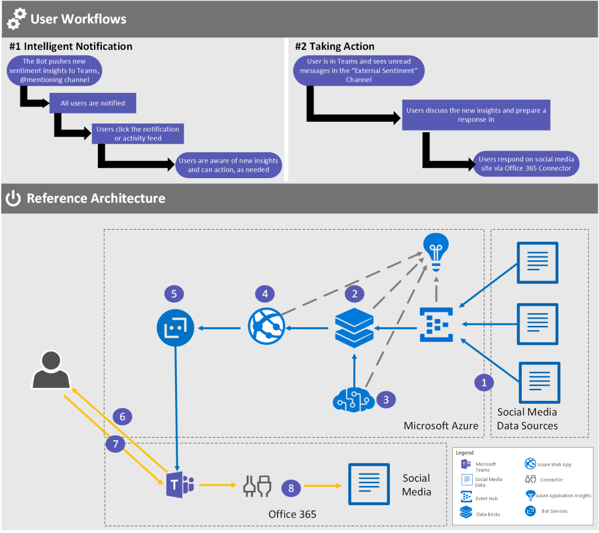

# Act on intelligent insights

## User story: Respond to user sentiment changes in Microsoft Teams

Your company is launching new products into the market. The marketing team is running social media campaigns to promote the launch and new events. The team wants to ensure that any trending negative comments on social media are quickly identified and an appropriately responded to, to help drive a wider positive attitude toward the new products.

Your organization deployed Microsoft Teams, and as part of this you see an opportunity to use a line-of-business Teams bot to support the marketing team:

- The marketing team creates a new channel in their team called Listening Channel.
- They add the Marketing Team Notification Bot to the channel.
- The bot leverages the social media sentiment analysis approach [described in this article](https://docs.microsoft.com/azure/azure-databricks/databricks-sentiment-analysis-cognitive-services) to provide notifications of negative trends in customer sentiment and identify the product the trend relates to.
- The marketing team collaborates in the channel to create an immediate response.
- The final response is posted directly from the Teams chat to the social media channels via a social media connector.

Marketing team members are now updated in real time, can respond simply and rapidly to negative trends in user sentiment, and work to improve perception of the product.

<<<<<<< HEAD
Marketing team members are now updated in real time, can respond simply and rapidly to negative trends in user sentiment, and work to improve perception of the product.

=======
>>>>>>> master
|         |         |
|---------|---------|
| Decision points|<ul><li>Which social media feeds would be of interest to your marketing team?</li><li>Would there need to be a formal sign-off for any outbound tweets that might need an authorization flow?</li></ul>|

## Architecture

The high-level architecture of the Marketing Team Notification Bot is as follows:

- [Bot services](https://azure.microsoft.com/services/bot-service/) The bot services and Teams bot extension are used to build, connect, deploy, and manage intelligent bots to interact naturally with your users on—and, in this scenario, connect your users to—information that’s provided by the social media sentiment analysis.
- [Azure social media sentiment analysis](https://docs.microsoft.com/azure/azure-databricks/databricks-sentiment-analysis-cognitive-services) Provides notifications of negative trends in customer sentiment and which product the trend relates to.
- [Microsoft Teams bot](https://docs.microsoft.com/microsoftteams/platform/concepts/bots/bots-overview) (channel scope) The users interact via the bot that’s added to the channel. The bot interacts with Microsoft Teams users naturally through chat, sharing the latest changes in customer sentiment.
- [Office 365 Connectors for Microsoft Teams](https://docs.microsoft.com/microsoftteams/platform/concepts/connectors/connectors) Any user can connect a team to services like Trello, GitHub, Bing News, or Twitter and be notified of the team’s activity in that service. From tracking a team’s progress in Trello to following important hashtags in Twitter, Office 365 Connectors help your team to stay in sync and get more done. The connectors are used to connect to the marketing social media accounts to post new information.

