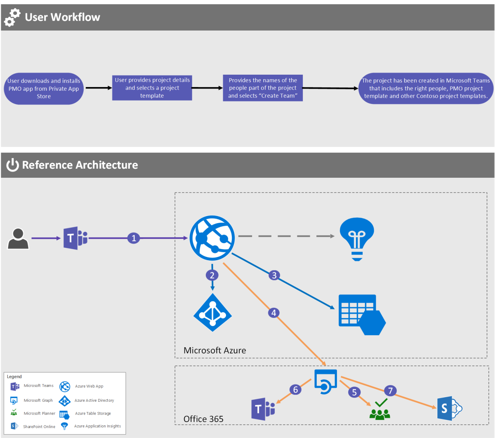

# Set up your teams for success

## User story: Bootstrap your projects

You run a successful project management organization (PMO) function in your organization, maintain Microsoft Planner and Word templates for your projects, and follow processes that have been proven to drive successful projects in your company. Now you want to make it easy to onboard new project teams to use these assets.

Your organization deployed Microsoft Teams and you see an opportunity to leverage a line-of-business Teams app to bring these assets together and kick-start collaboration on new projects.

The Teams PMO app would:

-   Ask simple setup questions to determine the base set of assets that the project should use (project, duration, budget, risk, members, name).
-   Create a new team with prepopulated channels and add the members you identified. 
-   Add a Project plans tab to the channel and highlight appropriate base project plans in Planner that are suitable for the project.
-   Add a Requirements templates tab and populate it with the key Word templates. 
-   Add a “Budget authorization” process (flow).

Project team leaders use the Teams PMO app to create a new team for the project and add the configured success assets directly in to the team. This way, they have everything they need to get started, using Teams as the collaboration hub to access internal resources in addition to Office 365 services.

The PMO manages the change control of the key assets published via the Teams app so that project teams have current and correct versions of templates and documents.

|         |         |
|---------|---------|
| Decision points|<ul><li>Which internal PMO resources does your PMO want to include in such an app?</li><li>Have you started to use Planner to manage your projects?</li></ul>|

## Architecture

The high-level architecture of this Teams app is as follows:

-   Azure web services are used to host the Teams PMO app UI. Key assets are stored in Azure Storage. The web services drive the creation of the teams and channels and addition of the key assets via the Graph API.
-   The approval is created in Flow and maintained by the PMO.

**_PMO Personal Teams App_**

Contoso has a PMO that requires all projects in the organization to adhere to specific project-management guidelines. Contoso recently deployed Microsoft Teams. The company is looking to streamline existing manual processes into an automated workflow that ensures that these guidelines are followed.

Contoso decided to create a Teams Personal App that they’ll publish to their tenant store. As new projects are kicked off, the app will create a team to be used by everyone involved in the project. It will also create predefined Microsoft Planner templates.

|             |           |
| ------------|-----------|
|  | The user opens the PMO Teams Personal Tenant App, which is back-ended by an Azure Web App. |
|  | The user is prompted for authentication. |
|  | The available Microsoft Planner templates that Contoso customized are retrieved and available for the user to select from. |
|  | The user selects a Microsoft Planner plan, supplies basic information about the project, and then selects **Create team**, which results in the Azure Web App making a call to the Microsoft Graph using the details the user supplied. |
|  | A Microsoft Planner plan is created from the template. |
|  | Customized project forms are uploaded to SharePoint on the **Files** tab of the new team’s General channel. |
|  | The team is created by using resources approved by the PMO. |
