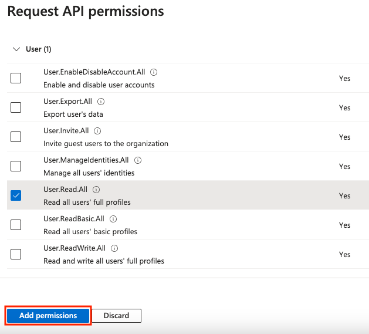
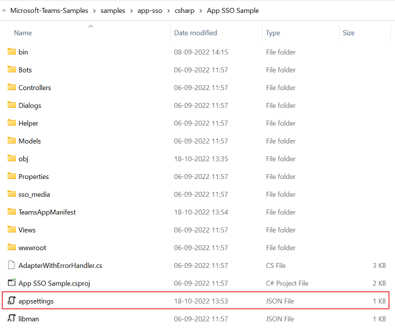
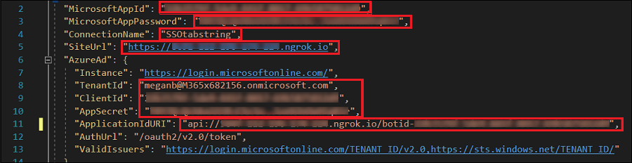
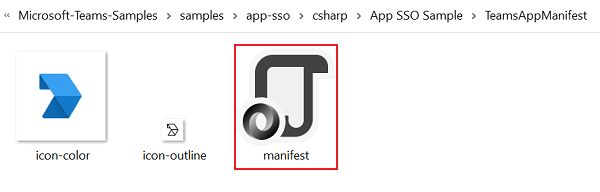
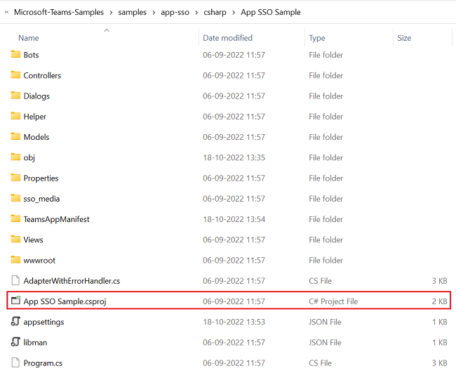
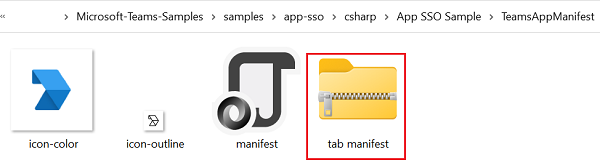
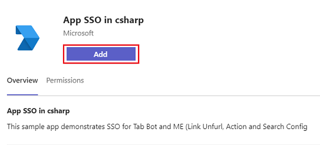
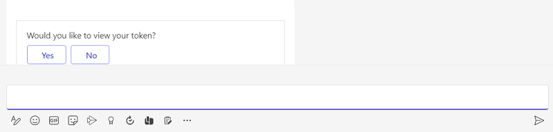
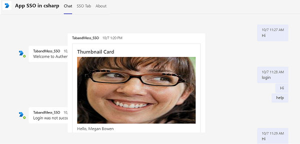
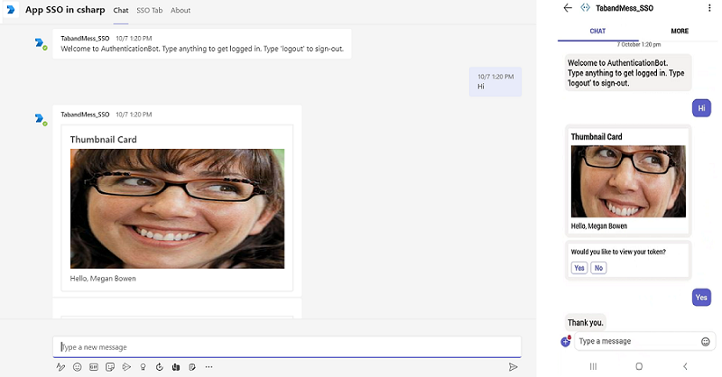

# SSO for Tabs and Message Extension

The  Microsoft Entra single sign-on (Microsoft Entra SSO) helps to authenticate users in Teams.
**Key aspects of Microsoft Entra SSO**:

* Allows the user to sign in automatically after the first sign in.
  * Allows the user to sign in to other devices without entering credentials again.
  * Obtains token for the signed in user.

   This step-by-step guide helps you to create tabs and message extensions enabling Microsoft Entra SSO authentication. You'll see the following output:


## Prerequisites

| Install | For using... |
|---|--------------------|
|[Microsoft Teams](https://www.microsoft.com/microsoft-teams/download-app) | Microsoft Teams to collaborate with everyone you work with through apps for chat, meetings, and calls all in one place.|
|[Microsoft 365 developer account](/microsoftteams/platform/concepts/build-and-test/prepare-your-o365-tenant) | Access to Teams account with the appropriate permissions to install an app. |
|[.NET Core SDK](https://dotnet.microsoft.com/en-us/download) | Customized bindings for local debugging and Azure Functions app deployments. If you haven't installed the latest version, install the portable version. |
|[Visual Studio 2022](https://visualstudio.microsoft.com) | You can install the enterprise version in Visual Studio 2022, and install the ASP.NET and web development workloads. Use the latest version. |
|Dev tunnel | Teams app features (conversational bots, message extensions, and incoming webhooks) need inbound connections. A tunnel connects your development system to Teams. Dev tunnel is a powerful tool to securely open your localhost to the internet and control who has access. Dev tunnel is available in Visual Studio 2022 version 17.7.0 or later. You can also use [ngrok](https://ngrok.com/downloads) as a tunnel to connect your development system to Teams. It isn't required for apps that only include tabs. This package is installed within the project directory (using npm `devDependencies`). |

> **Note:** After downloading ngrok, sign up and install [authtoken](https://ngrok.com/downloads).

## Set up Local Environment

1. Open Microsoft-Teams-Samples
2. Select **Code**.
3. From the dropdown menu, select Open with GitHub Desktop.
screenshot
4. Select Clone.
[I ran into an issue](https://github.com/MicrosoftDocs/msteams-docs/issues/new?template=Doc-Feedback.yaml&title=%5BI+ran+into+an+issue%5D+Set+up+local+environment)

## Register Microsoft Entra App

The following steps help you to create and register your bot in Azure portal:

* Create and register your Azure app.
* Create client secret to enable SSO authentication of the bot.
* Add Teams channel to deploy the bot.
* Create a tunnel to your web server's endpoints using dev tunnel (recommended) or ngrok.
* Add messaging endpoint to the dev tunnel that you created.

> [!INCLUDE [Azure app registration](includes/get-started/azure-app-registration.md)]

**Add App Registration**

1. Go to [Azure portal](https://ms.portal.azure.com/).

2. Select **App registrations**.

:::image type="content" source="../../assets/images/include-files/azure-app-registration.png" alt-text="Screenshot shows the Azure services to select App registrations.":::


3. Select **+ New registration**.

:::image type="content" source="../../assets/images/include-files/new-registration.png" alt-text="Screenshot shows the New registration page on Microsoft Entra admin center.":::


4. Enter the name of your app.

5. Select **Accounts in any organizational directory (Any Microsoft Entra ID tenant - Multitenant)**.

6. Select **Register**.

:::image type="content" source="../../assets/images/include-files/app-register.png" alt-text="Screenshot shows the option to register the bot in Microsoft Entra admin center.":::


Your app is registered in Microsoft Entra ID. The app overview page appears.

:::image type="content" source="../../assets/images/include-files/app-registration-overview.png" alt-text="Screenshot shows the app registration overview page.":::


 **Note:** Save the app ID from **Application (client) ID** and **Directory (tenant) ID** for further use.

> [I ran into an issue](https://github.com/MicrosoftDocs/msteams-docs/issues/new?template=Doc-Feedback.yaml&title=%5BI+ran+into+an+issue%5D+Add+App+registration)

**Create a tunnel**

#### [Dev Tunnel](#tab/dev)

[!INCLUDE [Tunnel](includes/get-started/dev-tunnel.md)]

> [!div class="nextstepaction"]
>
[I ran into an issue](https://github.com/MicrosoftDocs/msteams-docs/issues/new?template=Doc-Feedback.yaml&title=%5BI+ran+into+an+issue%5D+Create+a+tunnel+using+dev+tunnel)

#### [Ngrok](#tab/ngrok)

[!INCLUDE [Tunnel](includes/get-started/ngrok-tunnel.md)]

> [!div class="nextstepaction"]
> [I ran into an issue](https://github.com/MicrosoftDocs/msteams-docs/issues/new?template=Doc-Feedback.yaml&title=%5BI+ran+into+an+issue%5D+Create+a+tunnel+using+ngrok)
---
> [!INCLUDE [Azure web authentication](includes/get-started/azure-web-authentication.md)]

> [I ran into an issue](https://github.com/MicrosoftDocs/msteams-docs/issues/new?template=Doc-Feedback.yaml&title=%5BI+ran+into+an+issue%5D+Add+a+web+authentication)

> [!INCLUDE [Client secret](includes/get-started/create-client-secret.md)]

> [I ran into an issue](https://github.com/MicrosoftDocs/msteams-docs/issues/new?template=Doc-Feedback.yaml&title=%5BI+ran+into+an+issue%5D+Create+a+client+secret)

### Add API Permissions

1. In the left pane, select **API permissions**.
2. Select **+ Add a permission**.

   

3. Select **Microsoft Graph**.
4. Select **Delegated permissions**.
5. Select **User** > **User.Read**.
6. Select **Add permissions**.

   

> **Note:**
>
> * If an app isn't granted IT admin consent, users must provide consent the first time they use an app.
> * Users need to consent to the API permissions only if the Microsoft Entra app is registered in a different tenant.

> [I ran into an issue](https://github.com/MicrosoftDocs/msteams-docs/issues/new?template=Doc-Feedback.yaml&title=%5BI+ran+into+an+issue%5D+Add+API+permissions)

> [!INCLUDE [Application ID URI](includes/get-started/application-id-uri.md)]

> [I ran into an issue](https://github.com/MicrosoftDocs/msteams-docs/issues/new?template=Doc-Feedback.yaml&title=%5BI+ran+into+an+issue%5D+Add+Application+ID+URI)

> [!INCLUDE [Azure add scope](includes/get-started/azure-add-scope.md)]

> [I ran into an issue](https://github.com/MicrosoftDocs/msteams-docs/issues/new?template=Doc-Feedback.yaml&title=%5BI+ran+into+an+issue%5D+Add+a+scope)

> [I ran into an issue](https://github.com/MicrosoftDocs/msteams-docs/issues/new?template=Doc-Feedback.yaml&title=%5BI+ran+into+an+issue%5D+Add+API+permissions)

> [!INCLUDE [Azure client application](includes/get-started/azure-client-application.md)]

> [I ran into an issue](https://github.com/MicrosoftDocs/msteams-docs/issues/new?template=Doc-Feedback.yaml&title=%5BI+ran+into+an+issue%5D+Add+client+application)

> [!INCLUDE [Manifest](includes/get-started/azure-manifest.md)]

> [I ran into an issue](https://github.com/MicrosoftDocs/msteams-docs/issues/new?template=Doc-Feedback.yaml&title=%5BI+ran+into+an+issue%5D+Update+the+manifest)

### Create Your Bot

[!INCLUDE [Azure bot resource](includes/get-started/azure-bot-resource.md)]  

> [!div class="nextstepaction"]
> [I ran into an issue](https://github.com/MicrosoftDocs/msteams-docs/issues/new?template=Doc-Feedback.yaml&title=%5BI+ran+into+an+issue)  

[!INCLUDE [Teams channel](includes/get-started/add-teams-channel.md)]

> [!div class="nextstepaction"]
> [I ran into an issue](https://github.com/MicrosoftDocs/msteams-docs/issues/new?template=Doc-Feedback.yaml&title=%5BI+ran+into+an+issue%5D+Add+a+Teams+channel)

[!INCLUDE [Messaging endpoint](includes/get-started/messaging-endpoint.md)]

> [!div class="nextstepaction"]
> [I ran into an issue](https://github.com/MicrosoftDocs/msteams-docs/issues/new?template=Doc-Feedback.yaml&title=%5BI+ran+into+an+issue%5D+To+add+a+messaging+endpoint)

    [!INCLUDE [Service connection](includes/get-started/oauth-connection-settings.md)]

> [!div class="nextstepaction"]
> [I ran into an issue](https://github.com/MicrosoftDocs/msteams-docs/issues/new?template=Doc-Feedback.yaml&title=%5BI+ran+into+an+issue%5D+Add+an+OAuth+connection+settings)

## Set up App Settings

1. Go to the **appsettings.json** file in the cloned repository.

   

2. Open the **appsettings.json** file in Visual Studio.

3. Update the following information:
   * Replace `"MicrosoftAppId"` to your bot's **Microsoft App ID**.
   * Replace `"MicrosoftAppPassword"` to your bot's client secrets **Value**.
   * Replace `"SiteUrl"` to your ngrok URL.
   * Replace `"ConnectionName"` to the name of OAuth connection setting.
   * Replace `"TenantId"` to the tenant ID of the tenant where the app is used.
   * Replace `"ClientId"` to your bot's **Microsoft App ID**.
   * Replace `"AppSecret"` to your bot's client secrets **Value**.
   * Replace `"ApplicationIdURI"` in the form of `api://*******.ngrok.io/botid-{AppID}`.

   

---

## Set up Manifest File

1. Go to the **manifest.json** file in the cloned repository.

   

2. Open the **manifest.json** file in Visual Studio and make the following changes:
   * Replace `DOMAIN-NAME` with your ngrok URL.
   * Replace `YOUR-MICROSOFT-APP-ID` with your bot's **Microsoft App ID**.

     > **Note:** Depending on the scenario `[YOUR-MICROSOFT-APP-ID]` and `[DOMAIN-NAME]` may occur multiple times.

   * Replace `resource` as `api://*******.ngrok.io/botid-{AppID}`.

   

---

## Build and Run the Service

To build and run the service, use Visual Studio or Command line.

### Visual Studio

1. Open Visual Studio.
2. Select **File** > **Open** > **Project/Solution...**.

   

3. In the **csharp** folder, select **App SSO Sample.csproj** file.

   

4. Press **F5** to run the project.

5. Select **Yes** if the following dialog appears:

   

   A webpage appears with a message **Your bot is ready!**

   

> [I ran into an issue](https://github.com/MicrosoftDocs/msteams-docs/issues/new?template=Doc-Feedback.yaml&title=%5BI+ran+into+an+issue%5D+Build+and+run+service+using+Visual+Studio)

### Command Line

Go to the **csharp** folder in a Command Prompt window and enter the following command:

```bash
dotnet run
```


> [I ran into an issue](https://github.com/MicrosoftDocs/msteams-docs/issues/new?template=Doc-Feedback.yaml&title=%5BI+ran+into+an+issue%5D+Build+and+run+service+using+Command+line)

---

## Upload SSO App to Teams (Manual Steps)

1. In your cloned repository, go to **csharp** > **App SSO Sample** > **TeamsAppManifest**.
2. Create a .zip file with the following files that are present in the **Manifest** folder:
   * manifest.json
   * icon-outline.png
   * icon-color.png

   

3. In the Teams client, select the **Apps** icon.
4. Select **Manage your apps**.
5. Select **Upload an app**.
6. Look for the option to **Upload a custom app**. If you see the option, custom app upload is enabled.

   

   > **Note:** Contact your Teams administrator, if you don't find the option to upload a custom app.

7. Select **Open** to upload the .zip file that you created in the **Manifest** folder.

   

8. Select **Add**.

   

9. Select **Open** and send a message to the bot.

   

10. The bot performs SSO and displays profile card along with option prompt to view token.

    

11. Select **Yes** to view token or **No** to continue with chat.

    

12. If SSO isn't performed, then the bot performs default authentication method for your tab.

    

13. To sign in, if SSO isn't performed:
    1. In the left pane of the Teams, select More added apps (●●●).
    2. Select your new SSO application.

       

    3. Select **sign in**.

       

    4. Enter your credentials in **Sign in** window and select **Next**.

       

    5. Select **Accept**.

       

    6. Select your profile under search box. You'll see the following output:

       

14. Send `https://profile.botframework.com` to the application to get a profile card.

    

> [I ran into an issue](https://github.com/MicrosoftDocs/msteams-docs/issues/new?template=Doc-Feedback.yaml&title=%5BI+ran+into+an+issue%5D+Upload+SSO+app+to+Teams)

---

## Complete Challenge (Final Step)

Did you come up with output like this?



---

You've completed the tutorial to get started with SSO for tab and message extension app.

### Set up Manifest File

* Replace `DOMAIN-NAME` with your ngrok URL.
* Replace `YOUR-MICROSOFT-APP-ID` with your bot's **Microsoft App ID**.

> **Note:** Depending on the scenario `[YOUR-MICROSOFT-APP-ID]` and `[DOMAIN-NAME]` may occur multiple times.

* Replace `resource` as `api://*******.ngrok.io/botid-{AppID}`.


---

## Build and Run the Service Using Visual Studio

To build and run the service, use Visual Studio or Command line.

### Visual Studio

1. Open Visual Studio.
2. Select **File** > **Open** > **Project/Solution...**.

   

3. In the **csharp** folder, select **App SSO Sample.csproj** file.

   

4. Press **F5** to run the project.

5. Select **Yes** if the following dialog appears:

   

   A webpage appears with a message **Your bot is ready!**

   

> [I ran into an issue](https://github.com/MicrosoftDocs/msteams-docs/issues/new?template=Doc-Feedback.yaml&title=%5BI+ran+into+an+issue%5D+Build+and+run+service+using+Visual+Studio)

---

### Command Line

Go to the **csharp** folder in a Command Prompt window and enter the following command:

```bash
dotnet run
```


> [I ran into an issue](https://github.com/MicrosoftDocs/msteams-docs/issues/new?template=Doc-Feedback.yaml&title=%5BI+ran+into+an+issue%5D+Build+and+run+service+using+Command+line)

---

## Upload SSO App to Teams

1. In your cloned repository, go to **csharp** > **App SSO Sample** > **TeamsAppManifest**.
2. Create a .zip file with the following files that are present in the **Manifest** folder:
   * manifest.json
   * icon-outline.png
   * icon-color.png

   

3. In the Teams client, select the **Apps** icon.
4. Select **Manage your apps**.
5. Select **Upload an app**.
6. Look for the option to **Upload a custom app**. If you see the option, custom app upload is enabled.

   

   > **Note:** Contact your Teams administrator, if you don't find the option to upload a custom app.

7. Select **Open** to upload the .zip file that you created in the **Manifest** folder.

   

8. Select **Add**.

   

9. Select **Open** and send a message to the bot.

   

10. The bot performs SSO and displays profile card along with option prompt to view token.

    

11. Select **Yes** to view token or **No** to continue with chat.

    

12. If SSO isn't performed, then the bot performs default authentication method for your tab.

    

    ### To sign in, if SSO isn't performed

1. In the left pane of Teams, select **More added apps (●●●)**.
2. Select your new SSO application.

   

3. Select **sign in**.

   

4. Enter your credentials in the **Sign in** window and select **Next**.

   

5. Select **Accept**.

   

6. Select your profile under the search box. You'll see the following output:

   

7. Send `https://profile.botframework.com` to the application to get a profile card.

   

> [I ran into an issue](https://github.com/MicrosoftDocs/msteams-docs/issues/new?template=Doc-Feedback.yaml&title=%5BI+ran+into+an+issue%5D+Upload+SSO+app+to+Teams)

---

## Complete Challenge

Did you come up with output like this?


---

You've completed the tutorial to get started with SSO for tab and message extension app.
