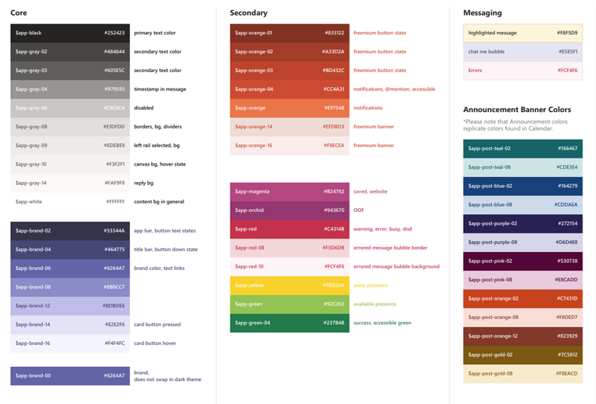
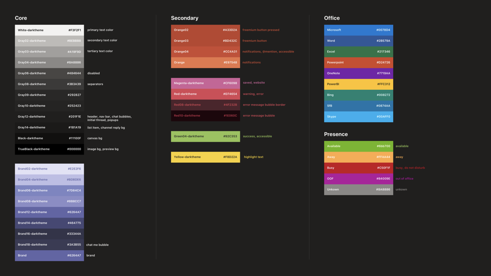
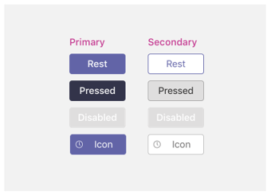
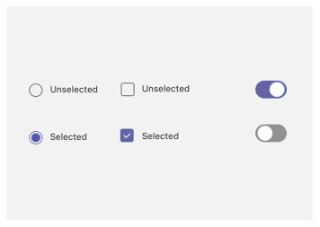
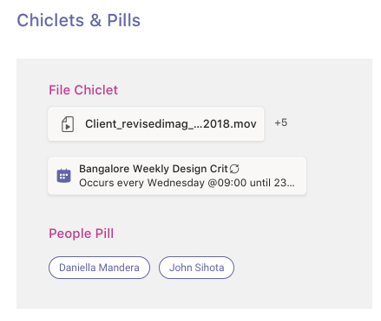
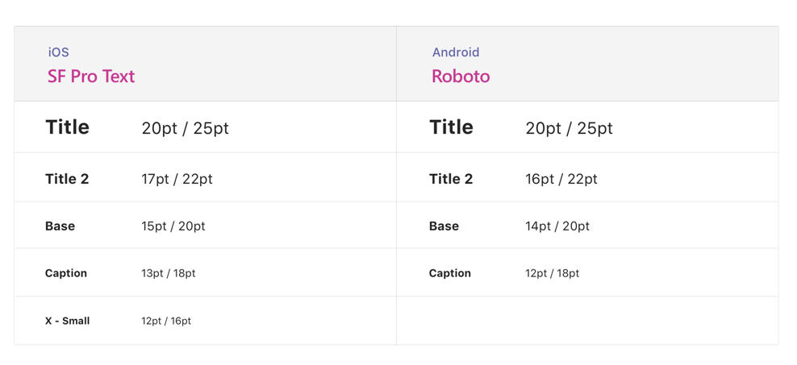
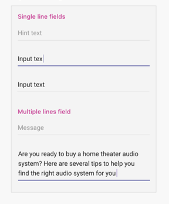

# Tabs on mobile

You can include tabs in Teams mobile channels, chats, and personal apps.

> [!NOTE]
> If you choose to have your channel/group tab appear on Teams mobile clients, the `setSettings()` configuration must have a value for the `websiteUrl` property (see below).

Personal apps are available on mobile clients in the app drawer. Personal Apps distributed through the [Appsource](~/concepts/deploy-and-publish/appsource/publish.md) need to be approved for mobile form factor before they show up in the app drawer. For more information, see [Custom Tabs page](~/tabs/what-are-tabs.md#mobile-clients). There is no approval process for personal apps that are either sideloaded or directly published to the organization's app catalog.

Configurable tabs are also available on mobile and are available under the **More** section of the Channels and Chats to which they have been added to. Tabs distributed through the [Appsource](~/concepts/deploy-and-publish/appsource/publish.md) need to be approved for the mobile form factor. The default behavior for unapproved apps is currently to use your `websiteUrl` to launch your tab in a browser window. However, they can be loaded on a mobile client by selecting the `...` overflow menu next to the tab and selecting **Open**, which will use your `contentUrl` to load the tab inside the Teams mobile client. For more information, see [Custom Tabs page](~/tabs/what-are-tabs.md#mobile-clients). There is no approval process for tabs that are either sideloaded or directly published to the organization's app catalog.

## Accessing personal tabs

You can access personal tabs in the app drawer.

:::image type="content" source="../../assets/images/tabs/mobile-app-drawer.png" alt-text="Illustration showing the Teams mobile app drawer." border="false":::

## Accessing channel tabs

You can access channel and group tabs by selecting the **More** button in the channel or chat in which they've been added.

:::image type="content" source="../../assets/images/tabs/mobile-tab.png" alt-text="Illustration showing a Teams mobile tab." border="false":::

## Design considerations

Our mobile platform allows apps to be an immersive experience with the app content taking up all of the screen apart from main Teams navigation. To create an immersive experience that fits with Teams, follow these guidelines.

### Responsive design

Because your tab can be opened on devices with a wide range of screen sizes, it needs to follow [responsive design](https://www.w3schools.com/html/html_responsive.asp) principles. All of the key constructs should be accessible on mobile devices, and the views should not be distorted. Ensure that when your tab is loaded on a mobile device, all buttons and links are easily accessible using finger-based navigation.

### Layouts

Choosing the correct layout for your tab is important. You should consider the kind of information you're presenting, and choose a layout that organizes it for easy consumption. Some potential options are outlined below.

#### Single canvas

This is one large area where work gets done. The Teams Wiki app follows this pattern. If you have an app that doesn’t separate content into smaller components this would be a good fit.

:::image type="content" source="../../assets/images/tabs/mobile-tab-single-canvas.png" alt-text="Illustration showing a Teams mobile single canvas tab." border="false":::

#### List

Lists are great for sorting and filtering large quantities of data and are great at keeping the most important things at the top. It is helpful to use sortable columns. Actions can be added to each list item under the ellipsis menu.

:::image type="content" source="../../assets/images/tabs/mobile-tab-list.png" alt-text="Illustration showing a Teams mobile list tab." border="false":::

#### Grid

Grids are useful for showing elements which are highly visual. It helps to include a filter or search control at the top.

:::image type="content" source="../../assets/images/tabs/mobile-tab-grid.png" alt-text="Illustration showing a Teams mobile tab with a grid layout." border="false":::

### Tabs with bots on mobile

The following example is a personal app that has tabs and a bot.

:::image type="content" source="../../assets/images/tabs/mobile-tab-with-bot.png" alt-text="Illustration showing how mobile Teams app that has tabs and a bot." border="false":::

## UI components

### Color palettes

Using our approved neutral palette for backgrounds, notifications, text, and buttons will help your app feel more at home in Teams. Since Teams mobile has two colour themes (light and dark), it’s a good idea to make sure your app looks great in both.

#### Light color

#### Dark color

### Buttons and controls

The way buttons are styled helps communicate what kind of action they trigger. We maintain a wide range of buttons that are formatted to show different levels of emphasis. Buttons can have text, an icon, or a combination of text and an icon. To communicate different levels in a hierarchy, we designed primary and secondary buttons within each category.

#### Buttons

Primary and secondary buttons.

#### Selection controls

Radio buttons, checkboxes, and toggles.

#### Chiclets and pills

### Typography

Typography should be clear and purposeful. Emphasize important information and avoid using multiple fonts and sizes to reduce confusion. We recommend using sentence case and avoiding the usage of all caps for localization and legibility.

### Fields and flyouts

Fields are areas where users can input text. Flyouts are more lightweight than dialogs and appear from the top pane.

#### List controls

#### Field controls

## Developer considerations

When you're building an app that includes a tab, you need to consider (and test) how your tab will function on both the Android and iOS Microsoft Teams clients. The sections below outline some of the key scenarios you need to consider.

### Authentication

For authentication to work on mobile clients, you must upgrade you Teams JavaScript SDK to at least version 1.4.1.

### Low bandwidth and intermittent connections

Mobile clients regularly need to function with low bandwidth and intermittent connections. Your app should handle any timeouts appropriately by providing a contextual message to the user. You should also user progress indicators to provide feedback to your users for any long-running processes.

> [!NOTE]
> Tabs are enabled on mobile only after the application is added to an allow list, based on the input of the approval team. 
> To check mobile responsiveness, reach out to teamsubm@microsoft.com.

### Testing on mobile clients

You need to validate that your tab functions properly on mobile devices of various sizes and qualities. For Android devices, you can use the [DevTools](~/tabs/how-to/developer-tools.md) to debug your tab while it is running. We recommend that you test on both high and low performing devices, as well as on a tablet.

## Distribution

If your app includes tabs and you plan to list it on the Teams store, your app must be approved for mobile use. Otherwise, the tabs won't be available on Teams mobile.

Your app doesn’t need mobile-specific approval to sideload or publish it to an org's app catalog. For channel and group tabs, by default the tab launches in a browser using your `websiteUrl` configuration. (You also must include the `websiteUrl` in the `setSettings()` function, which is part of the Teams JavaScript client SDK.) Users can still load an unapproved tab in Teams mobile by selecting the `...` more menu next to the app and **Open**. This triggers the `contentUrl` configuration.

For more information, see [tabs and mobile clients](~/tabs/what-are-tabs.md#mobile-clients).
