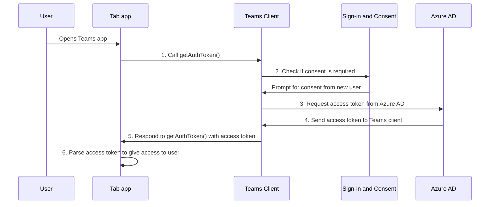

# Enable single sign-on in a tab application

Single sign-on (SSO) lets a user sign-in only once to access an application or a web service. Once a user signs in, they can access the app without going through authentication again.

With SSO in Teams, your app users have an added advantage. A user logged into Teams using their Microsoft or Microsoft 365 accounts doesn't need to sign in again to use your app. They can use your app within Teams environment based on access granted through Azure AD.

Here's what you'll learn in this section:

- SSO user experience in Teams, and why it's true SSO.
- SSO at runtime in Teams and how your app handles authenticating and authorizing the user.
- The steps you follow to enable SSO for your Teams app.

## SSO user experience in Teams

Users sign in to Microsoft Teams using either their personal Microsoft account or their Microsoft 365 account. Take advantage of this, and use SSO to authenticate and authorize a Teams user.

&nbsp;&nbsp;&nbsp;&nbsp; :::image type="content" source="../../../assets/images/authentication/teams-sso-tabs/teams-sso-ux.png" alt-text="Teams SSO user experience" border="false":::

- Teams authenticates and stores the identity of its user.
- When a Teams user attempts to access your app, the app uses the identity that's already validated by Teams.
- The user sees only a consent dialog where they let your app use their Teams identity to obtain access permission for using your app.

### Enhance user experience with SSO in Teams

- Teams gets the access token for the current user from Azure AD. This interaction with Azure AD is invisible to the user. It translates to app access for the user without having to leave Teams environment.
- After the user consents to the app the first time, they can use the app with no further need of consent, even on any other device. For this reason, it is true SSO and a better user experience.
- The access token is pre-fetched by Teams. This is done to improve performance and load time of the app in Teams environment.
- The user doesn't need to memorize or record several passwords to access and use apps in Teams environment.

Now, let's see what happens at the backend during runtime to achieve true SSO user experience within Teams.

## Obtain access for app users at runtime

You can achieve SSO in a tab by obtaining access token for the Teams user who's currently logged in. This process involves the tab app, Microsoft Teams, and Azure AD. During this interaction, the user must consent for use of their Teams identity to obtain access token.

The following image shows how SSO works when a Teams app user attempts to access the tab app:

:::image type="content" source="../../../assets/images/authentication/teams-sso-tabs/teams-runtime-seq.png" alt-text="Tab single sign-on SSO diagram" border="false" lightbox="../../../assets/images/authentication/teams-sso-tabs/teams-runtime-seq.png":::

| # | Interaction | What's going on |
| --- | --- | --- |
| 1 | Tab app -> Teams client | The tab app makes a JavaScript call to `getAuthToken()`, which tells Teams to obtain an access token for the tab application. |
| 2 | Teams client - > Consent form | If the current user is using your tab application for the first time, Teams displays request prompt to consent, if it's required. The user must provide their consent to Teams for using their Teams identity to obtain access token from Azure AD.   Alternately, there's a request prompt to handle step-up authentication such as two-factor authentication. |
| 3 | Teams client -> Azure AD | Teams requests Azure AD endpoint for the access token for the current user based on their Teams identity. |
| 4 | Azure AD -> Teams client | Azure AD sends the access token to the Teams client. The token is a JSON Web Token (JWT), and it's validation works just like token validation in most standard OAuth flows. Teams will cache the token on your behalf so that future calls to `getAuthToken()` simply return the cached token. |
| 5 | Teams client -> Tab app | Teams sends the access token to the tab as part of the result object returned by the `getAuthToken()` call. |
| 6 | Tab app | The tab app parses the token using JavaScript to extract required information, such as the user's email address. The token returned to the tab app is both an access token and an identity token. |

> [!IMPORTANT]
> The `getAuthToken()` is only valid for consenting to a limited set of user-level APIs that is email, profile, offline_access, and OpenId. It is not used for further Graph scopes such as `User.Read` or `Mail.Read`. For suggested workarounds, see [Extend your app with Microsoft Graph permissions](tab-sso-graph-api.md).

### Use cases for enabling SSO for tab

Here are some use cases where enabling SSO is beneficial. Call `getAuthToken()` in these scenarios to use Teams identity for obtaining access token for your app users:

1. To get user’s teams identity from Teams if you have an existing app that you want to be available within a tab app in Teams for your app users.

2. To authenticate a user by reusing the team’s identity inside your Tab application.

3. To authenticate and get user’s teams identity without having them to signing in again inside configurable tabs. This is applicable to some settings need to be configured at an config stage.

4. To obtain an access token inside a task module, when it's invoked from a tab, bots, messaging extension, or adaptive cards.

5. To authenticate a user in stage view.

The SSO API also works in [task modules](../../../task-modules-and-cards/what-are-task-modules.md) that embed web content.

> [!NOTE]
> Tabs are Teams-aware web pages. To enable SSO in a web-page hosted inside a tab, add [Teams Javascript client SDK](/javascript/api/overview/msteams-client?view=msteams-client-js-latest&preserve-view=true), and call `microsoftTeams.initialize()`. Once you've initialized Microsoft Teams, call `microsoftTeams.getAuthToken()` to get the access token for your app.

To achieve Teams SSO, you must configure your app to enable SSO for authenticating and authorizing your users.

## Enable SSO for a tab app

This section describes the tasks involved in implementing SSO for a tab app. These tasks are language- and framework-agnostic.

To build a tab app that uses Teams SSO to authenticate users:

&nbsp;&nbsp;&nbsp;&nbsp;&nbsp; :::image type="content" source="../../../assets/images/authentication/teams-sso-tabs/enable-sso.png" alt-text="Steps to enable SSO for tab" border="false":::

1. **Register with Azure AD**: Create an Azure AD app to generate an app ID and app ID URI. You also configure redirect URI where Azure AD would send the access token in exchange for identity token for the current user logged into Teams. For generating access token, you configure scopes and OBO flow.
2. **Configure code**: Update the code to handle access token, calling it when a user accesses your app and validating it when received.
3. **Teams manifest**: Update your Teams client manifest with the app ID generated on Azure AD and the app ID URI to ensure secure connection between Azure AD and your app.

## Best practices

Here's a list of best practices:

- **Don’t cache the access token**: Never cache or store the access token in your app's client-side code. Always call `getAuthToken()` when you need an access token. Teams Client caches the access token (or request a new one if it expires). This makes sure that there's no accidental leak of your token from your web app.

## Known limitations

- Currently, SSO only supports OAuth 2.0 token. It doesn't support SAML token.
- SSO in Teams works only with OAuth 2.0 protocol.  
- SSO works only with Azure AD. To extend it to other OAuth Identity providers, the flow needs to be implemented. For more information, please see, [Microsoft Teams authentication flow for tabs](/tabs/how-to/authentication/auth-flow-tab) and [Authenticate a user in a Microsoft Teams tab](/tabs/how-to/authentication/auth-tab-aad).
- Multiple domains per app is not supported. For this, please read about LOB apps. / Need a link to page. /
- Tenant admin consent: A simple way of [consenting on behalf of an organization as a tenant admin](/azure/active-directory/develop/v2-permissions-and-consent#requesting-consent-for-an-entire-tenant) is by getting [consent from admin](https://login.microsoftonline.com/common/adminconsent?client_id=<AAD_App_ID).
  - Ask for consent using the Auth API: Another approach for getting Graph scopes is to present a consent dialog using our existing [web-based Azure AD authentication approach](~/tabs/how-to/authentication/auth-tab-aad.md#navigate-to-the-authorization-page-from-your-pop-up-page). This approach involves popping up an Azure AD consent dialog box.

    To ask for additional consent using the Auth API, follow these steps:

    1. The token retrieved using `getAuthToken()` must be exchanged on the server-side using Azure AD [on-behalf-of flow](/azure/active-directory/develop/v2-oauth2-on-behalf-of-flow) to get access to those other Graph APIs. Ensure you use the v2 Graph endpoint for this exchange.
    2. If the exchange fails, Azure AD returns an invalid grant exception. There are usually one of the two error messages, `invalid_grant` or `interaction_required`.
    3. When the exchange fails, you must ask for consent. Use the app user interface (UI) to ask the user to grant other consent. This UI must include a button that triggers an Azure AD consent dialog using our [Azure AD authentication API](~/concepts/authentication/auth-silent-aad.md).
    4. When asking for more consent from Azure AD, you must include `prompt=consent` in your [query-string-parameter](~/tabs/how-to/authentication/auth-silent-aad.md#get-the-user-context) to Azure AD, otherwise Azure AD wouldn't ask for other scopes.

        - Instead of `?scope={scopes}`, use `?prompt=consent&scope={scopes}`
        - Ensure that `{scopes}` includes all the scopes you're prompting the user for, for example, Mail.Read or User.Read.
    1. Once the user has granted more permissions, retry the On-behalf-of flow to get access to these other APIs.

## Next step

> [!div class="nextstepaction"]
> [Register your tab application in Azure AD](tab-sso-register-aad.md)

## See also

- [Configure code to enable Teams SSO](tab-sso-code.md)

<!--
:::row:::
    :::column span="":::

      1. **Build your Teams tab app**
    
    :::column-end:::
    :::column span="2":::
        
      You can build a simple tab app and enable SSO for it.
      **Quickstart**: The simplest path to get started with Teams tab SSO is with the Teams toolkit for Microsoft Visual Studio Code. 
      You can also create a simple personal tab app. For more information, see [Create a personal tab](../create-personal-tab.md)
    
    :::column-end:::
:::row-end:::
:::row:::
    :::column span="":::

      2. **Register your app with Azure AD**

    :::column-end:::
    :::column span="2":::

      Your Teams client users are authenticated using their Teams user credentials and Azure AD provides an access token for them.
      You'll need to create a new tab app registration in Azure AD:

      - [Register your tab application in Azure AD](tab-sso-register-aad.md)
      - [Configure API permissions with Microsoft Graph](tab-sso-graph-api.md)
      - [Configure admin consent](tab-sso-admin-consent.md)

    :::column-end:::
:::row-end:::
:::row:::
    :::column span="":::

      3. **Configure code**

    :::column-end:::
    :::column span="2":::

      Next, you configure the code for acquiring access token from Azure AD:

      - [Code configuration for enabling Teams SSO for tabs](tab-sso-code.md)

    :::column-end:::
:::row-end:::
:::row:::
    :::column span="":::

      4. **Update Teams manifest**

    :::column-end:::
    :::column span="2":::

      Update the app properties in your app's manifest file:
      
      - [Update Teams client manifest and preview the app](tab-sso-manifest.md)
      
    :::column-end:::
:::row-end:::-->
