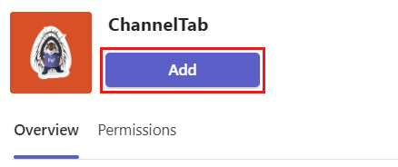
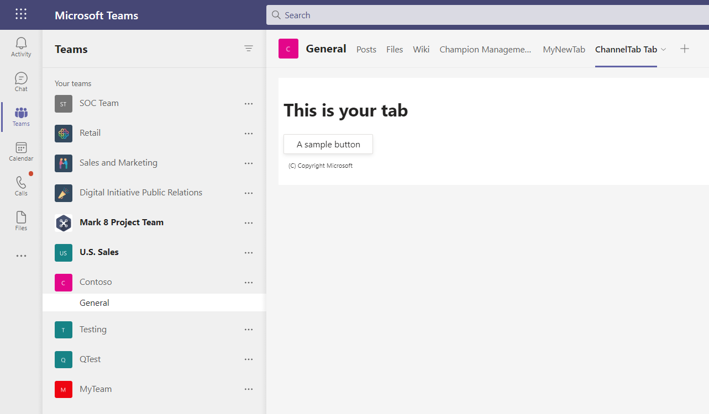
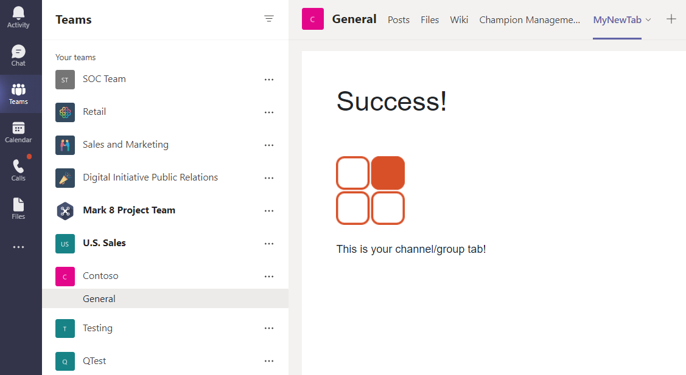

# Create a channel or group tab

Channel or group tabs deliver content to channels and group chats, and are a great way to create collaborative spaces around dedicated web-based content.

::: zone pivot="node-java-script"

### Create a custom channel or group tab with Node.js

To create custom channel and group tab with Node.js:

1. In a command prompt, install the [Yeoman](https://yeoman.io/) and [gulp-cli](https://www.npmjs.com/package/gulp-cli) packages by entering the following command after installing the **Node.js**:

    ```cmd
    npm install yo gulp-cli --global
    ```

2. Install the Microsoft Teams App generator by entering the following command in your command prompt:

    ```cmd
    npm install generator-teams --global
    ```

### Generate your channel or group tab

1. At a command prompt, create a new directory for your channel or group tab.

1. To start the Microsoft Teams App generator, enter the following command in your new directory.

    ```cmd
    yo teams
    ```

1. Microsoft Teams App generator will prompt a series of questions as folowing to which by providing your values you update your **manifest.json** file:

    

    **What is your solution name?**

    The solution name is your project name. You can accept the suggested name by selecting **Enter**.

    **Where do you want to place the files?**

    You're currently in your project directory. Select **Enter**.

    **Title of your Microsoft Teams app project?**

    The title is your app package name and is used in the app manifest and description. Enter a title or select **Enter** to accept the default name.

    **Your (company) name? (max 32 characters)**

    Your company name will be used in the app manifest. Enter a company name or select **Enter** to accept the default name.

    **Which manifest version would you like to use?**

    Select the default schema.

    **Quick scaffolding? (Y/n)**

    The default is yes; enter **n** to enter your Microsoft Partner ID.

    **Enter your Microsoft Partner Id, if you have one? (Leave blank to skip)**

    This field isn't required and must be used only if you're already part of the [Microsoft Partner Network](https://partner.microsoft.com).

    **What do you want to add to your project?**

    Select **( &ast; ) A Tab**.

    **The URL where you will host this solution?**

    By default, the generator suggests an Azure Web Sites URL. You're only testing your app locally, so a valid URL isn't necessary.

    **Would you like show a loading indicator when your app/tab loads?**

    Choose **not** to include a loading indicator when your app or tab loads. The default is no, enter **n**.

    **Would you like personal apps to be rendered without a tab header-bar?**

    Choose **not** to include personal apps to be rendered without a tab header-bar. Default is no, enter **n**.

    **Would you like to include Test framework and initial tests? (y/N)**

    Choose **not** to include a test framework for this project. The default is no, enter **n**.

    **Would you like to include ESLint support? (y/N)**

    Choose not to include ESLint support. The default is no, enter **n**.

    **Would you like to use Azure Applications Insights for telemetry? (y/N)**

    Choose **not** to include [Azure Application Insights](/azure/azure-monitor/app/app-insights-overview). The default is no; enter **n**.

    **Default Tab Name (max 16 characters)?**

    Name your tab. This tab name is used throughout your project as a file or URL path component.

    **What kind of Tab would you like to create?**

    Use the arrow keys to select **Configurable** tab.

    **What scopes do you intend to use for your Tab?**

    You can select a team or a group chat.

    **Do you require Microsoft Azure Active Directory (Azure AD) Single-Sign-On support for the tab?**

    Choose **not** to include Microsoft Azure Active Directory (Azure AD) Single-Sign-On support for the tab. The default is yes, enter **n**.

    **Do you want this tab to be available in SharePoint Online? (Y/n)**

    Enter **n**.

    > [!IMPORTANT]
    > The path component **yourDefaultTabNameTab** is the value that you entered in the generator for **Default Tab Name** plus the word **Tab**.
    >
    > For example: DefaultTabName is **MyTab** then **/MyTabTab/**

### Build and run your application

You must have an [app package](~/concepts/build-and-test/apps-package.md) to build and run your application in Teams.

#### Create the app package

The package is created through a gulp task that validates the **manifest.json** file and generates the zip folder in the **./package** directory. In the command prompt, enter the following command:

```cmd
gulp manifest
```

#### Build your application

The build command transpiles your solution into the **./dist** folder. Enter the following command in the command prompt:

```cmd
gulp build
```

#### Run your application

1. Start a local web server by entering the following in the command prompt:

    ```bash
    gulp serve
    ```

1. Enter `http://localhost:3007/<yourDefaultAppNameTab>/` in your browser, replace **yourDefaultAppNameTab** with your tab name, and view your application's home page as shown in the following image:

    

1. To view your tab configuration page, go to `https://localhost:3007/<yourDefaultAppNameTab>/config.html`. The following is shown:

    

### Establish a secure tunnel to your tab

To establish a secure tunnel to your tab, exit the localhost and enter the following command:

```cmd
gulp ngrok-serve
```

> [!IMPORTANT]
> After your tab has been uploaded to Microsoft Teams through **ngrok**, and successfully saved, you can view it in Teams until your tunnel session ends. If you restart your ngrok session, you must update your app with the new URL. 

### Upload your application to Teams

**To upload your application to Teams**

1. Go to Microsoft Teams. If you use the [web-based version](https://teams.microsoft.com) you can inspect your front-end code using your browser's [developer tools](~/tabs/how-to/developer-tools.md).
1. From your teams on the left pane, select the ellipses &#x25CF;&#x25CF;&#x25CF; next to the team that you are using to test your tab and choose **Manage team**.
1. In the main pane, select **Apps** from the tab bar and choose **Upload a custom app** located in the lower right corner of the page.
1. Go your project directory, browse to the **./package** folder, select the app package zip folder, and choose **Open**.

    

1. Select **Add** in the pop-up dialog box. Your tab uploads into Teams.
    
    > [!NOTE]
    > If  **Add** doesn't display in the dialog box then remove the following code from the manifest of the uploaded app package zip folder. Again zip the folder and upload it to Teams.
    >
    >```Json
    >"staticTabs": [],
    >"bots": [],
    >"connectors": [],
    >"composeExtensions": [],
    >```

1. Return to your team, choose the channel where you want to display the tab, select ➕ from the tab bar, and choose your tab from the gallery.
1. Follow the directions for adding a tab. There is a custom configuration dialog box for your channel or group tab.
1. Select **Save** and your tab is added to the channel's tab bar.

    

::: zone-end

::: zone pivot="razor-csharp"

### Create a custom channel or group tab with ASP.NET Core

You can create a custom channel or group tab using C# and ASP.NET Core Razor pages. To create a channel or group tab with ASP.NET Core Razor pages:

1. At a command prompt, create a new directory for your tab project.

1. Clone the sample repository into your new directory using the following command or you can download the [source code](https://github.com/OfficeDev/Microsoft-Teams-Samples) and extract the files:

    ```cmd
    git clone https://github.com/OfficeDev/Microsoft-Teams-Samples.git
    ```

### Generate your channel or group tab

1. Open Visual Studio and select **Open a project or solution**.

1. Navigate to **Microsoft-Teams-Samples** > **samples** > **tab-channel-group** > **razor-csharp** folder and open **channelGroupTab.sln**.

In Visual Studio, press **F5** or choose **Start Debugging** from your application's **Debug** menu to verify if the application has loaded properly. In a browser, go to the following URLs:

* https://localhost:3978/
* https://localhost:3978/privacy
* https://localhost:3978/tou

### Establish a secure tunnel to your tab for Teams

To establish a secure tunnel to your tab, at a command prompt in the root of your project directory run the following command:

```cmd
ngrok http 3978 --host-header=localhost
```

Ensure that you keep the command prompt with ngrok running and make a note of the URL.

### Update your application

1. Go to the **Pages** > **Shared** folder and open **_Layout.cshtml**, and add the following to the <head> tags section:

    ```html
    <script src="https://ajax.aspnetcdn.com/ajax/jQuery/jquery-3.4.1.min.js"></script>
    <script src="https://statics.teams.cdn.office.net/sdk/v1.6.0/js/MicrosoftTeams.min.js"></script>
    ```
    
    > [!IMPORTANT]
    > Do not copy and paste the `<script src="...">` URLs from this page, as they do not represent the latest version. To get the latest version of the SDK, always go to [Microsoft Teams JavaScript API](https://www.npmjs.com/package/@microsoft/teams-js).
    
1. At the top of the `script` tag, insert a call to `microsoftTeams.initialize();`.

1. Go to the **Pages** folder and open **Tab.cshtml**

    Within **Tab.cshtml** the application presents the user with two option buttons for displaying the tab with either a red or gray icon. Choosing the **Select Gray** or **Select Red** button triggers `saveGray()` or `saveRed()`, respectively, sets `settings.setValidityState(true)`, and enables the **Save** button on the configuration page. This code lets Teams know that you have completed the configuration requirements and the installation can proceed. The parameters of `settings.setSettings` are set. Finally, `saveEvent.notifySuccess()` is called to indicate that the content URL has been successfully resolved.

1. Update the `websiteUrl` and `contentUrl` values in each function with the HTTPS ngrok URL to your tab.

    Your code should now include the following with **y8rCgT2b** replaced with your ngrok URL:

    ```javascript
        
        let saveGray = () => {
            microsoftTeams.settings.registerOnSaveHandler(function (saveEvent) {
                microsoftTeams.settings.setSettings({
                    websiteUrl: `https://y8rCgT2b.ngrok.io`,
                    contentUrl: `https://y8rCgT2b.ngrok.io/gray/`,
                    entityId: "grayIconTab",
                    suggestedDisplayName: "MyNewTab"
                });
                saveEvent.notifySuccess();
            });
        }

        let saveRed = () => {
            microsoftTeams.settings.registerOnSaveHandler(function (saveEvent) {
                microsoftTeams.settings.setSettings({
                    websiteUrl: `https://y8rCgT2b.ngrok.io`,
                    contentUrl: `https://y8rCgT2b.ngrok.io/red/`,
                    entityId: "redIconTab",
                    suggestedDisplayName: "MyNewTab"
                });
                saveEvent.notifySuccess();
        });
        }
    ```

1. Save the updated **Tab.cshtml**.

### Build and run your application for Teams

1. In Visual Studio, press **F5** or choose **Start Debugging** from the **Debug** menu.

1. Verify that **ngrok** is running and working properly by opening your browser and going to your content page via the ngrok HTTPS URL that was provided in your command prompt window.

> [!TIP]
> You need to have both your application in Visual Studio and ngrok running to complete the steps provided in this article. If you need to stop running your application in Visual Studio to work on it, **keep ngrok running**. It listens and resumes routing your application's request when it restarts in Visual Studio. If you have to restart the ngrok service it returns a new URL and you have to update your application with the new URL.

### Update your app package with Developer Portal

1. Go to Microsoft Teams. If you use the [web-based version](https://teams.microsoft.com), you can inspect your front-end code using your browser's [developer tools](~/tabs/how-to/developer-tools.md).

1. Navigate to your **Developer portal** in Teams.

1. Open **Apps** and select **Import app**.

1. The name of your app package is **tab.zip**. It's available in the following path:

    ```bash
    /bin/Debug/netcoreapp3.1/tab.zip
    ```

1. Select **tab.zip** and open it in the Developer Portal.

1. A default **App ID** is created and populated in **Basic information** section.

1. Add the Short and Long description  for your app in **Descriptions**.

1. In **Developer Information**, add the required details and in **Website (must be a valid HTTPS URL)** give your ngrok HTTPS URL.

1. In **App URLs**, update the Privacy policy to `https://<yourngrokurl>/privacy` and Terms of use to `https://<yourngrokurl>/tou` and save.

1. In **App features**, select Personal app and enter the Name and update the **Content URL** with `https://<yourngrokurl>/personalTab`. Leave the Website URL field blank. 

1. Select Save.

1. In the Domains section, Domains from your tabs must contain your ngrok URL without the HTTPS prefix `<yourngrokurl>.ngrok.io`.

### Preview your app in Teams

1. Select **Preview in Teams** from the Developer Portal toolbar. The Developer Portal informs you that your app is sideloaded successfully.

1. Select **Manage your apps**. Your app is listed in the sideloaded apps.

1. Find your app using the search box, select the three-dots in its row

1. Select the **View** option. The **Add to team** page appears for your app.

1. Select **Add to team** to load the tab on Teams. Your tab is now available in Teams.

    

::: zone-end

::: zone pivot="mvc-csharp"

### Create a custom channel or group tab with ASP.NET Core MVC

You can create a custom channel or group tab using C# and ASP.Net Core MVC. 

1. At a command prompt, create a new directory for your tab project.

1. Clone the sample repository into your new directory using the following command or you can download the [source code](https://github.com/OfficeDev/Microsoft-Teams-Samples) and extract the files:

    ```cmd
    git clone https://github.com/OfficeDev/Microsoft-Teams-Samples.git
    ```

### Generate your channel or group tab

1. Open Visual Studio and select **Open a project or solution**.

1. Navigate to **Microsoft-Teams-Samples** > **samples** > **tab-channel-group** > **mvc-csharp** folder and open **ChannelGroupTabMVC.sln**.

In Visual Studio, press **F5** or choose **Start Debugging** from your application's **Debug** menu to verify if the application has loaded properly. In a browser, go to the following URLs:

* https://localhost:3978/
* https://localhost:3978/privacy
* https://localhost:3978/tou

### Establish a secure tunnel to your tab for Teams

To establish a secure tunnel to your tab, at a command prompt in the root of your project directory run the following command:

```cmd
ngrok http 3978 --host-header=localhost
```

Ensure that you keep the command prompt with ngrok running and make a note of the URL.

### Update your application

1. Go to the **Views** > **Shared** folder and open **_Layout.cshtml**, and add the following to the <head> tags section:

    ```html
    <script src="https://ajax.aspnetcdn.com/ajax/jQuery/jquery-3.4.1.min.js"></script>
    <script src="https://statics.teams.cdn.office.net/sdk/v1.6.0/js/MicrosoftTeams.min.js"></script>
    ```
    
    > [!IMPORTANT]
    > Do not copy and paste the `<script src="...">` URLs from this page, as they do not represent the latest version. To get the latest version of the SDK, always go to [Microsoft Teams JavaScript API](https://www.npmjs.com/package/@microsoft/teams-js).
    
1. At the top of the `script` tag, insert a call to `microsoftTeams.initialize();`.

1. Go to the **Tab** folder and open **Tab.cshtml**

    Within **Tab.cshtml** the application presents the user with two option buttons for displaying the tab with either a red or gray icon. Choosing the **Select Gray** or **Select Red** button triggers `saveGray()` or `saveRed()`, respectively, sets `settings.setValidityState(true)`, and enables the **Save** button on the configuration page. This code lets Teams know that you have completed the configuration requirements and the installation can proceed. The parameters of `settings.setSettings` are set. Finally, `saveEvent.notifySuccess()` is called to indicate that the content URL has been successfully resolved. 

1. Update the `websiteUrl` and `contentUrl` values in each function with the HTTPS ngrok URL to your tab.

    Your code should now include the following with **y8rCgT2b** replaced with your ngrok URL:

    ```javascript

        let saveGray = () => {
            microsoftTeams.settings.registerOnSaveHandler(function (saveEvent) {
                microsoftTeams.settings.setSettings({
                    websiteUrl: `https://y8rCgT2b.ngrok.io`,
                    contentUrl: `https://y8rCgT2b.ngrok.io/gray/`,
                    entityId: "grayIconTab",
                    suggestedDisplayName: "MyNewTab"
                });
                saveEvent.notifySuccess();
            });
        }
    
        let saveRed = () => {
            microsoftTeams.settings.registerOnSaveHandler(function (saveEvent) {
                microsoftTeams.settings.setSettings({
                    websiteUrl: `https://y8rCgT2b.ngrok.io`,
                    contentUrl: `https://y8rCgT2b.ngrok.io/red/`,
                    entityId: "redIconTab",
                    suggestedDisplayName: "MyNewTab"
                });
                saveEvent.notifySuccess();
            });
        }
    ```

1. Make sure to save the updated **Tab.cshtml**.

### Build and run your application for Teams

1. In Visual Studio, press **F5** or choose **Start Debugging** from the **Debug** menu.

1. Verify that **ngrok** is running and working properly by opening your browser and going to your content page via the ngrok HTTPS URL that was provided in your command prompt window.

> [!TIP]
> You need to have both your application in Visual Studio and ngrok running to complete the steps provided in this article. If you need to stop running your application in Visual Studio to work on it, **keep ngrok running**. It listens and resumes routing your application's request when it restarts in Visual Studio. If you have to restart the ngrok service it returns a new URL and you have to update your application with the new URL.

### Update your app package with Developer Portal

1. Go to Microsoft Teams. If you use the [web-based version](https://teams.microsoft.com), you can inspect your front-end code using your browser's [developer tools](~/tabs/how-to/developer-tools.md).

1. Navigate to your **Developer portal** in Teams.

1. Open **Apps** and select **Import app**.

1. The name of your app package is **tab.zip**. It's available in the following path:

    ```bash
    /bin/Debug/netcoreapp3.1/tab.zip
    ```

1. Select **tab.zip** and open it in the Developer Portal.

1. A default **App ID** is created and populated in **Basic information** section.

1. Add the Short and Long description  for your app in **Descriptions**.

1. In **Developer Information**, add the required details and in **Website (must be a valid HTTPS URL)** give your ngrok HTTPS URL.

1. In **App URLs**, update the Privacy policy to `https://<yourngrokurl>/privacy` and Terms of use to `https://<yourngrokurl>/tou` and save.

1. In **App features**, select Personal app and enter the Name and update the **Content URL** with `https://<yourngrokurl>/personalTab`. Leave the Website URL field blank. 

1. Select Save.

1. In the Domains section, Domains from your tabs must contain your ngrok URL without the HTTPS prefix `<yourngrokurl>.ngrok.io`.

### Preview your app in Teams

1. Select **Preview in Teams** from the Developer Portal toolbar. The Developer Portal informs you that your app is sideloaded successfully.

1. Select **Manage your apps**. Your app is listed in the sideloaded apps.

1. Find your app using the search box, select the three-dots in its row

1. Select the **View** option. The **Add to team** page appears for your app.

1. Select **Add to team** to load the tab on Teams. Your tab is now available in Teams.
    

::: zone-end

## Next step

> [!div class="nextstepaction"]
> [Create a content page](~/tabs/how-to/create-tab-pages/content-page.md)

## See also

* [Teams tabs](~/tabs/what-are-tabs.md)
* [Create a personal tab](~/tabs/how-to/create-personal-tab.md)
* [Tabs on mobile](~/tabs/design/tabs-mobile.md)
* [Build tabs with Adaptive Cards](~/tabs/how-to/build-adaptive-card-tabs.md)
* [Create a removal page](~/tabs/how-to/create-tab-pages/removal-page.md)
