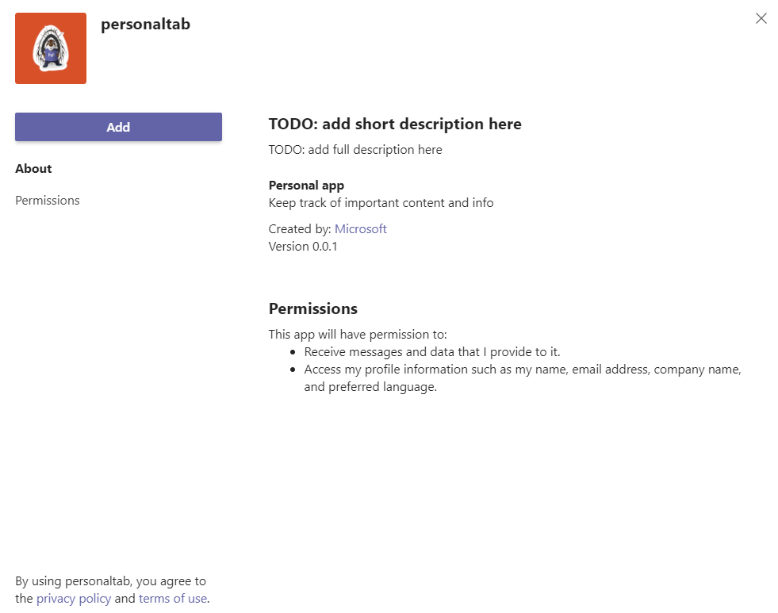
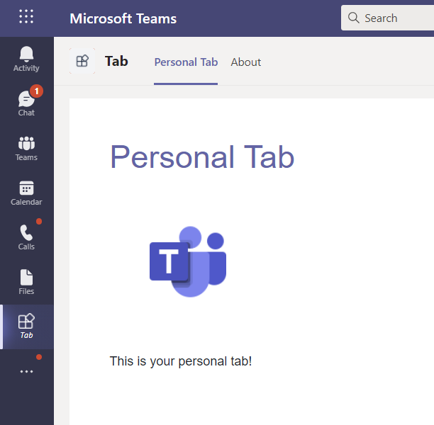
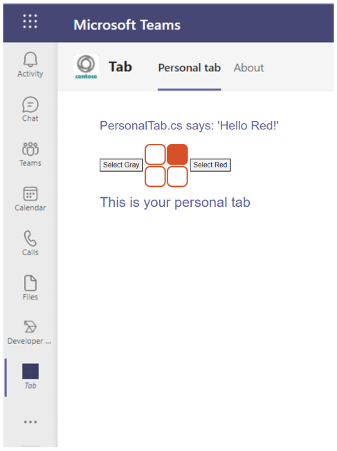

# Personal tab

Personal tabs, along with personally-scoped bots, are part of personal apps and are scoped to a single user. They can be pinned to the left navigation bar for easy access.

Choose your environment to build personal tab from **Node.js**, **ASP.NET Core**, or **ASP.NET Core MVC**.

## Create a personal tab

> [!div class="nextstepaction"]
> [Node.js](~/tabs/how-to/create-personal-tab-node-js.md)

# [Node.js](#tab/nodejs)

### Create a personal tab with Node.js

To create a personal tab with Node.js:

1. In a command prompt, install the [Yeoman](https://yeoman.io/) and [gulp-cli](https://www.npmjs.com/package/gulp-cli) packages by entering the following command after installing the Node.js:

    ```cmd
    npm install yo gulp-cli --global
    ```

2. Install the Microsoft Teams App generator by entering the following command in your command prompt:

    ```cmd
    npm install generator-teams --global
    ```

### Generate your personal tab

1. At a command prompt, create a new directory for your personal tab.

1. To start the Microsoft Teams App generator, enter the following command in your new directory.

    ```cmd
    yo teams
    ```

1. Microsoft Teams App generator will prompt a series of questions as folowing to which by providing your values you update your **manifest.json** file:

    

    **What is your solution name?**

    The solution name is your project name. You can accept the suggested name by selecting **Enter**.

    **Where do you want to place the files?**

    You're currently in your project directory. Select **Enter**.

    **Title of your Microsoft Teams app project?**

    The title is your app package name and is used in the app manifest and description. Enter a title or select **Enter** to accept the default name.

    **Your (company) name? (max 32 characters)**

    Your company name will be used in the app manifest. Enter a company name or select **Enter** to accept the default name.

    **Which manifest version would you like to use?**

    Select the default schema.

    **Quick scaffolding? (Y/n)**

    The default is yes; enter **n** to enter your Microsoft Partner ID.

    **Enter your Microsoft Partner Id, if you have one? (Leave blank to skip)**

    This field isn't required and must be used only if you're already part of the [Microsoft Partner Network](https://partner.microsoft.com).

    **What do you want to add to your project?**

    Select **( &ast; ) A Tab**.

    **The URL where you will host this solution?**

    By default, the generator suggests an Azure Web Sites URL. You're only testing your app locally, so a valid URL isn't necessary.

    **Would you like show a loading indicator when your app/tab loads?**

    Choose **not** to include a loading indicator when your app or tab loads. The default is no, enter **n**.

    **Would you like personal apps to be rendered without a tab header-bar?**

    Choose **not** to include personal apps to be rendered without a tab header-bar. Default is no, enter **n**.

    **Would you like to include Test framework and initial tests? (y/N)**

    Choose **not** to include a test framework for this project. The default is no, enter **n**.

    **Would you like to include ESLint support? (y/N)**

    Choose not to include ESLint support. The default is no, enter **n**.

    **Would you like to use Azure Applications Insights for telemetry? (y/N)**

    Choose **not** to include [Azure Application Insights](/azure/azure-monitor/app/app-insights-overview). The default is no; enter **n**.

    **Default Tab Name (max 16 characters)?**

    Name your tab. This tab name is used throughout your project as a file or URL path component.

    **What kind of Tab would you like to create?**

    Use the arrow keys to select **Personal (static)**.

    **Do you require Microsoft Azure Active Directory (Azure AD) Single-Sign-On support for the tab?**

    Choose **not** to include Azure AD Single-Sign-On support for the tab. The default is yes, enter **n**.

### Manifest update

To add a personal tab to this application, create a content page, and update existing files

1. In your code editor, create a new **personal.html** file with the following markup:

    ```html
    <!DOCTYPE html>
    <html>
        <head>
            <meta charset="UTF-8">
            <title>
                <!-- Todo: add your a title here -->
            </title>
            <meta name="viewport" content="width=device-width, initial-scale=1.0">
            <!-- inject:css -->
            <!-- endinject -->
        </head>
            <body>
                <h1>Personal Tab</h1>
                <p></p>
                <p>This is your personal tab!</p>
            </body>
    </html>
    ```

1. Save **personal.html** in your application's **public** folder in the following location:

    ```
    ./src/public/<yourDefaultTabNameTab>/personal.html
    ```

1. Open **manifest.json** from the following location in your code editor:

    ```
     ./src/manifest/manifest.json
    ```

1. Add the following to the empty `staticTabs` array (`staticTabs":[]`) and add the following JSON object:

    ```json
    {
        "entityId": "personalTab",
        "name": "Personal Tab ",
        "contentUrl": "https://{{HOSTNAME}}/<yourDefaultTabNameTab>/personal.html",
        "websiteUrl": "https://{{HOSTNAME}}",
        "scopes": ["personal"]
    }
    ```

    > [!IMPORTANT]
    > The path component **yourDefaultTabNameTab** is the value that you entered in the generator for **Default Tab Name** plus the word **Tab**.
    >
    > For example: DefaultTabName is **MyTab** then **/MyTabTab/**

1. Update the **contentURL** path component **yourDefaultTabNameTab** with your actual tab name.

1. Save the updated **manifest.json** file.

1. To provide your content page in an IFrame, open **Tab.ts** in your code editor from the following path:

    ```bash
    ./src/server/<yourDefaultTabNameTab>/<yourDefaultTabNameTab>.ts
    ```

1. Add the following to the list of IFrame decorators:

    ```typescript
     @PreventIframe("/<yourDefaultTabName Tab>/personal.html")
    ```

1. Save the updated file. Your tab code is complete.

### Build and run your application

You must have an [app package](~/concepts/build-and-test/apps-package.md) to build and run your application in Teams.

#### Create the app package

The package is created through a gulp task that validates the **manifest.json** file and generates the zip folder in the **./package** directory. In the command prompt, enter the following command:

```cmd
gulp manifest
```

#### Build your application

The build command transpiles your solution into the **./dist** folder. Enter the following command in the command prompt:

```cmd
gulp build
```

#### Run your application

1. Start a local web server by entering the following command in the command prompt:

    ```cmd
    gulp serve
    ```

1. Enter `http://localhost:3007/<yourDefaultAppNameTab>/` in your browser to view your application's home page as shown in the following image:

    

1. To view your personal tab, go to `http://localhost:3007/<yourDefaultAppNameTab>/personal.html`.

    

### Establish a secure tunnel to your tab

 To establish a secure tunnel to your tab, exit the localhost and enter the following command:

```cmd
gulp ngrok-serve
```

> [!IMPORTANT]
> After your tab has been uploaded to Microsoft Teams through **ngrok**, and successfully saved, you can view it in Teams until your tunnel session ends.

### Upload your application to Teams

To upload your application to Teams

1. Go to your Microsoft Teams.
1. From the lower left corner, select **Apps**.
1. From the lower left corner, choose **Upload a custom app**.
1. Go to your project directory, browse to the **./package** folder, select the zip folder, and choose **Open**.

    

1. Select **Add** in the pop-up dialog box. Your tab is uploaded to Teams.

    

### View your personal tab

In the navigation bar at the far left in Teams, select ellipses &#x25CF;&#x25CF;&#x25CF; and choose your app.

# [ASP.NET Core](#tab/aspnetcore)

### Create a personal tab with ASP.NET Core

You can create a custom personal tab using C# and ASP.NET Core Razor pages. To create a personal tab with ASP.NET Core Razor pages:

1. At a command prompt, create a new directory for your tab project.

1. Clone the sample repository into your new directory using the following command or you can download the [source code](https://github.com/OfficeDev/Microsoft-Teams-Samples) and extract the files:

    ```cmd
    git clone https://github.com/OfficeDev/Microsoft-Teams-Samples.git
    ```
### Generate your personal tab

1. Open Visual Studio and select **Open a project or solution**.

1. Navigate to **Microsoft-Teams-Samples** > **samples** > **tab-personal** > **razor-csharp** folder and open **PersonalTab.sln**.

In Visual Studio, press **F5** or choose **Start Debugging** from your application's **Debug** menu to verify if the application has loaded properly. In a browser, go to the following URLs:

* http://localhost:3978/
* http://localhost:3978/personalTab
* http://localhost:3978/privacy
* http://localhost:3978/tou

### Update your application

1. Go to the **Pages** > **Shared** folder and open **_Layout.cshtml**, and add the following to the `<head>` tags section:

    ```HTML
    <script src="https://ajax.aspnetcdn.com/ajax/jQuery/jquery-3.4.1.min.js"></script>
    <script src="https://statics.teams.cdn.office.net/sdk/v1.6.0/js/MicrosoftTeams.min.js"></script>
    ```

1. Open **PersonalTab.cshtml** from **Pages** folder and inside the `<script>` tags add `microsoftTeams.initialize()` and save.

### Run your application

In Visual Studio, press **F5** or choose **Start Debugging** from your application's **Debug** menu.

### Establish a secure tunnel to your tab for Teams

To establish a secure tunnel to your tab, at a command prompt in the root of your project directory run the following command:

```cmd
ngrok http 3978 --host-header=localhost
```

### Update your app package with Developer Portal

1. Navigate to your **Developer portal** in Teams.

1. Open **Apps** and select **Import app**.

1. The name of your app package is **tab.zip**. It's available in the following path:

    ```
    /bin/Debug/netcoreapp3.1/tab.zip
    ```

1. Select **tab.zip** and open it in the Developer Portal.

1. A default **App ID** is created and populated in **Basic information** section.

1. Add the Short and Long description  for your app in **Descriptions**.

1. In **Developer Information**, add the required details and in **Website (must be a valid HTTPS URL)** give your ngrok HTTPS URL.

1. In **App URLs**, update the Privacy policy to `https://<yourngrokurl>/privacy` and Terms of use to `https://<yourngrokurl>/tou` and save.

1. In **App features**, select Personal app and enter the Name and update the **Content URL** with `https://<yourngrokurl>/personalTab`. Leave the Website URL field blank. 

1. Select Save.

1. In the Domains section, Domains from your tabs must contain your ngrok URL without the HTTPS prefix `<yourngrokurl>.ngrok.io`.

### Preview your app in Teams

1. Select **Preview in Teams** from the Developer Portal toolbar. The Developer Portal informs you that your app is sideloaded successfully.

1. Select **Manage your apps**. Your app is listed in the sideloaded apps.

1. Find your app using the search box, select the three-dots in its row

1. Select the **View** option. The **Add** page appears for your app.

1. Select **Add** to load the tab on Teams. Your tab is now available in Teams. 



# [ASP.NET Core MVC](#tab/aspnetcoremvc)

### Create a personal tab with ASP.NET Core MVC

You can create a custom personal tab using C# and ASP.NET Core MVC. To create a personal tab with ASP.NET Core MVC:

1. At a command prompt, create a new directory for your tab project.

1. Clone the sample repository into your new directory using the following command or you can download the [source code](https://github.com/OfficeDev/Microsoft-Teams-Samples) and extract the files:

    ```cmd
    git clone https://github.com/OfficeDev/Microsoft-Teams-Samples.git
    ```

### Generate your personal tab

1. Open Visual Studio and select **Open a project or solution**.

1. Navigate to **Microsoft-Teams-Samples** > **samples** > **tab-personal** > **mvc-csharp** folder and open **PersonalTabMVC.sln** in Visual Studio.

In Visual Studio, press **F5** or choose **Start Debugging** from your application's **Debug** menu to verify if the application has loaded properly. In a browser, go to the following URLs:

* http://localhost:3978
* http://localhost:3978/personalTab
* http://localhost:3978/privacy
* http://localhost:3978/tou

### Update your application

1. Go to the **Views** > **Shared** folder and open **_Layout.cshtml**, and add the following to the `<head>` tags section:

    ```HTML
    <script src="https://ajax.aspnetcdn.com/ajax/jQuery/jquery-3.4.1.min.js"></script>
    <script src="https://statics.teams.cdn.office.net/sdk/v1.6.0/js/MicrosoftTeams.min.js"></script>
    ```

1. Open **PersonalTab.cshtml** from **Views** > **PersonalTab** folder and inside the `<script>` tags add `microsoftTeams.initialize()` and save.

### Run your application

In Visual Studio, press **F5** or choose **Start Debugging** from your application's **Debug** menu.

### Establish a secure tunnel to your tab for Teams

To establish a secure tunnel to your tab, at a command prompt in the root of your project directory run the following command:

```cmd
ngrok http 3978 --host-header=localhost
```

### Update your app package with Developer Portal

1. Navigate to your **Developer portal** in Teams.

1. Open **Apps** and select **Import app**.

1. The name of your app package is **tab.zip**. It's available in the following path:

    ```
    /bin/Debug/netcoreapp3.1/tab.zip
    ```

1. Select **tab.zip** and open it in the Developer Portal.

1. A default **App ID** is created and populated in **Basic information** section.

1. Add the Short and Long description  for your app in **Descriptions**.

1. In **Developer Information**, add the required details and in **Website (must be a valid HTTPS URL)** give your ngrok HTTPS URL.

1. In **App URLs**, update the Privacy policy to `https://<yourngrokurl>/privacy` and Terms of use to `https://<yourngrokurl>/tou` and save.

1. In **App features**, select Personal app and enter the Name and update the **Content URL** with `https://<yourngrokurl>/personalTab`. Leave the Website URL field blank. 

1. Select Save.

1. In the Domains section, Domains from your tabs must contain your ngrok URL without the HTTPS prefix `<yourngrokurl>.ngrok.io`.

### Preview your app in Teams

1. Select **Preview in Teams** from the Developer Portal toolbar. The Developer Portal informs you that your app is sideloaded successfully.

1. Select **Manage your apps**. Your app is listed in the sideloaded apps.

1. Find your app using the search box, select the three-dots in its row

1. Select the **View** option. The **Add** page appears for your app.

1. Select **Add** to load the tab on Teams. Your tab is now available in Teams. 



---
## Reorder static personal tabs

Starting with manifest version 1.7, developers can rearrange all tabs in their personal app. In particular, a developer can move the **bot chat** tab, which always defaults to the first position, anywhere in the personal app tab header. Two reserved tab `entityId` keywords are declared, **conversations** and **about**.

If you create a bot with a **personal** scope, it appears in the first tab position in a personal app by default. If you want to move it to another position, you must add a static tab object to your manifest with the reserved keyword, **conversations**. The **conversation** tab appears on web or desktop depending on where you add the **conversation** tab in the `staticTabs` array.

``` JSON

{
   "staticTabs":[
      {
         
      },
      {
         "entityId":"conversations",
         "scopes":[
            "personal"
         ]
      }
   ]
}

```

## Add `registerOnFocused` API for tabs or personal apps

The `registerOnFocused` SDK API allows you to use a keyboard on Teams. You can return to a personal app and maintain focus on a tab or personal app with the help of Ctrl, Shift, and F6 keys. For example, you can move away from the personal app to search for something, and then return to the personal app or use Ctrl+F6 to go around the required places.

The following code provides an example of handler definition on `registerFocusEnterHandler` SDK when the focus must be returned to the tab or personal app:

``` C#

export function registerFocusEnterHandler(handler: (navigateForward: boolean) => void): 
void {
  HandlersPrivate.focusEnterHandler = handler;
  handler && sendMessageToParent('registerHandler', ['focusEnter']);
}
function handleFocusEnter(navigateForward: boolean): void
 {
  if (HandlersPrivate.focusEnterHandler)
   {
    HandlersPrivate.focusEnterHandler(navigateForward);
  }
}

```

After the handler is triggered with the keyword `focusEnter`, the handler `registerFocusEnterHandler` is invoked with a callback function `focusEnterHandler` that takes in a parameter called `navigateForward`. The value of `navigateForward` determines the type of events. The `focusEnterHandler` is invoked only by Ctrl+F6 and not by the tab key.
The keys useful for move events within Teams are as follows:

* Forward event -> Ctrl+F6 keys
* Backward event -> Ctrl+Shift+F6 keys

``` C#

case 'focusEnter':     
this.registerFocusEnterHandler((navigateForward: boolean = true) => {
this.sdkWindowMessageHandler.sendRequestMessage(this.frame, this.constants.SdkMessageTypes.focusEnter, [navigateForward]);
// Set focus on iframe or webview
if (this.frame && this.frame.sourceElem) {
  this.frame.sourceElem.focus();
}
return true;
});
}

// callback function to be passed to the handler
private focusEnterHandler: (navigateForward: boolean) => boolean;

// function that gets invoked after handler is registered.
private registerFocusEnterHandler(focusEnterHandler: (navigateForward: boolean) => boolean): void {
this.focusEnterHandler = focusEnterHandler;
this.layoutService.registerAppFocusEnterCallback(this.focusEnterHandler);
}

```

### Personal app

:::image type="content" source="../../assets/images/personal-apps/registerfocus.png" alt-text="Example shows options for adding registerOnFocussed API" border="false":::

#### Personal app - Forward event

:::image type="content" source="../../assets/images/personal-apps/registerfocus-forward-event.png" alt-text="Example shows options for adding registerOnFocussed API forward move" border="false":::

#### Personal app - Backward event

:::image type="content" source="../../assets/images/personal-apps/registerfocus-backward-event.png" alt-text="Example shows options for adding registerOnFocussed API backward move" border="false":::

### Tab

:::image type="content" source="../../assets/images/personal-apps/registerfocus-tab.png" alt-text="Example shows options for adding registerOnFocussed API for tab" border="false":::

## Next step

> [!div class="nextstepaction"]
> [Create a channel or group tab](~/tabs/how-to/create-channel-group-tab.md)

## See also

* [Teams tabs](~/tabs/what-are-tabs.md)
* [Tabs on mobile](~/tabs/design/tabs-mobile.md)
* [Build tabs with Adaptive Cards](~/tabs/how-to/build-adaptive-card-tabs.md)
* [Create conversational tabs](~/tabs/how-to/conversational-tabs.md)