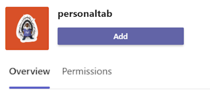

# Create a personal tab

## Create a custom personal tab

You can create a personal tab using Node.js and the Yeoman Generator, ASP.NET Core, or ASP.NET Core MVC.

# [Node.js](#tab/nodejs)

### Create a custom personal tab using Node.js and the Yeoman Generator

> [!NOTE]
> This article follows the steps outlined in the [build your first Microsoft Teams app](https://github.com/OfficeDev/generator-teams/wiki/Build-Your-First-Microsoft-Teams-App) Wiki found in the Microsoft OfficeDev GitHub repository.

You can create a custom personal tab using the [Teams Yeoman generator](https://github.com/OfficeDev/generator-teams/wiki/Build-Your-First-Microsoft-Teams-App). The application is also uploaded to Teams.

### Prerequisites for Teams apps

You must have an understanding of the following prerequisites:

- You must have an Office 365 tenant and a team configured with **Allow uploading custom apps** enabled. For more information, see [prepare your Office 365 tenant](~/concepts/build-and-test/prepare-your-o365-tenant.md).

    > [!NOTE]
    > If you do not have an Office 365 account, you can sign up for a free subscription through the Office 365 Developer Program. The subscription remains active as long as you are using it for ongoing development. See [welcome to the Office 365 Developer Program](/office/developer-program/microsoft-365-developer-program).

Also, this project requires that you have the following installed in your development environment:

- Any text editor or IDE. You can install and use [Microsoft Visual Studio Code](https://code.visualstudio.com/download) for free.

- [Node.js/npm](https://nodejs.org/en/). Use the latest LTS version. The Node Package Manager (npm) is installed in your system with the installation of Node.js.

- After you have successfully installed Node.js, install the [Yeoman](https://yeoman.io/) and [gulp-cli](https://www.npmjs.com/package/gulp-cli) packages by entering the following command in your command prompt:

    ```bash
    npm install yo gulp-cli --global
    ```

- Install the Microsoft Teams Apps generator by entering the following command in your command prompt:

    ```bash
    npm install generator-teams --global
    ```

### Generate your project

**To generate your project**

1. At a command prompt, create a new directory for your tab project.

1. To start the generator, go to your new directory and enter the following command:

    ```bash
    yo teams
    ```

1. Next, provide a series of values that are used in your application's **manifest.json** file:

    

    **What is your solution name?**

    The solution name is your project name. You can accept the suggested name by selecting **Enter**.

    **Where do you want to place the files?**

    You're currently in your project directory. Select **Enter**.

    **Title of your Microsoft Teams app project?**

    The title is your app package name and is used in the app manifest and description. Enter a title or select **Enter** to accept the default name.

    **Your (company) name? (max 32 characters)**

    Your company name will be used in the app manifest. Enter a company name or select **Enter** to accept the default name.

    **Which manifest version would you like to use?**

    Select the default schema.

    **Quick scaffolding? (Y/n)**

    The default is yes; enter **n** to enter your Microsoft Partner ID.

    **Enter your Microsoft Partner Id, if you have one? (Leave blank to skip)**

    This field isn't required and must be used only if you're already part of the [Microsoft Partner Network](https://partner.microsoft.com).

    **What do you want to add to your project?**

    Select **( &ast; ) A Tab**.

    **The URL where you will host this solution?**

    By default, the generator suggests an Azure Web Sites URL. You're only testing your app locally, so a valid URL isn't necessary.

    **Would you like show a loading indicator when your app/tab loads?**

    Choose **not** to include a loading indicator when your app or tab loads. The default is no, enter **n**.

    **Would you like personal apps to be rendered without a tab header-bar?**

    Choose **not** to include personal apps to be rendered without a tab header-bar. Default is no, enter **n**.

    **Would you like to include Test framework and initial tests? (y/N)**

    Choose **not** to include a test framework for this project. The default is no, enter **n**.

    **Would you like to include ESLint support? (y/N)**

    Choose not to include ESLint support. The default is no, enter **n**.

    **Would you like to use Azure Applications Insights for telemetry? (y/N)**

    Choose **not** to include [Azure Application Insights](/azure/azure-monitor/app/app-insights-overview). The default is no; enter **n**.

    **Default Tab Name (max 16 characters)?**

    Name your tab. This tab name is used throughout your project as a file or URL path component.

    **What kind of Tab would you like to create?**

    Use the arrow keys to select **Personal (static)**.

    **Do you require Microsoft Azure Active Directory (Azure AD) Single-Sign-On support for the tab?**

    Choose **not** to include Azure AD Single-Sign-On support for the tab. The default is yes, enter **n**.

    > [!IMPORTANT]
    > The path component **yourDefaultTabNameTab** is the value that you entered in the generator for **Default Tab Name** plus the word **Tab**.
    >
    > For example: DefaultTabName: **MyTab** > **/MyTabTab/**

### Add a personal tab

**To add a personal tab to this application, create a content page, and update existing files**

1. In your code editor, create a new HTML file **personal.html** and add the following markup:

    ```html
    <!DOCTYPE html>
    <html>
        <head>
            <meta charset="UTF-8">
            <title>
                <!-- Todo: add your a title here -->
            </title>
            <meta name="viewport" content="width=device-width, initial-scale=1.0">
            <!-- inject:css -->
            <!-- endinject -->
        </head>
            <body>
                <h1>Personal Tab</h1>
                <p></p>
                <p>This is your personal tab!</p>
            </body>
    </html>
    ```

1. Save **personal.html** in your application's **web** folder in the following location:

    ```bash
    ./src/app/web/<yourDefaultTabNameTab>/personal.html
    ```

1. Open **manifest.json** from the following location in your code editor:

    ```bash
    ./src/manifest/manifest.json/
    ```

1. Add the following to the empty `staticTabs` array (`staticTabs":[]`) and add the following JSON object:

    ```json
    {
        "entityId": "personalTab",
        "name": "Personal Tab ",
        "contentUrl": "https://{{HOSTNAME}}/<yourDefaultTabNameTab>/personal.html",
        "websiteUrl": "https://{{HOSTNAME}}",
        "scopes": ["personal"]
    }
    ```

1. Update the **contentURL** path component **yourDefaultTabNameTab** with your actual tab name.

1. Save the updated **manifest.json** file.

1. To provide your content page in an IFrame, open **Tab.ts** in your code editor from the following path:

    ```bash
    ./src/app/<yourDefaultTabNameTab>/<yourDefaultTabNameTab>.ts
    ```

1. Add the following to the list of IFrame decorators:

    ```typescript
     @PreventIframe("/<yourDefaultAppName>TabNameTab>/personal.html")
    ```

1. Save the updated **Tab.ts** file. Your tab code is complete.

### Build and run your application

At a command prompt, open your project directory to complete the next tasks.

#### Create the app package

You must have an app package to test your tab in Teams. It's a zip folder that contains the following required files:

- A **full color icon** measuring 192 x 192 pixels.
- A **transparent outline icon** measuring 32 x 32 pixels.
- A **manifest.json** file that specifies the attributes of your app.

The package is created through a gulp task that validates the manifest.json file and generates the zip folder in the **./package directory**. In the command prompt, enter the following command:

```bash
gulp manifest
```

#### Build your application

The build command transpiles your solution into the **./dist** folder. Enter the following command in the command prompt:

```bash
gulp build
```

#### Run your application in localhost

1. Start a local web server by entering the following command in the command prompt:

    ```bash
    gulp serve
    ```

1. Enter `http://localhost:3007/<yourDefaultAppNameTab>/` in your browser, replace `**<yourDefaultAppNameTab>**` with your tab name, and view your application's home page as shown in the following image:

    

1. To view your personal tab, go to `http://localhost:3007/<yourDefaultAppNameTab>/personal.html`.

    >

### Establish a secure tunnel to your tab

Microsoft Teams is a cloud-based product and requires that your tab content is available from the cloud using HTTPS endpoints. Teams doesn't allow local hosting. Publish your tab to a public URL or use a proxy that exposes your local port to an internet-facing URL.

To test your tab extension, use [ngrok](https://ngrok.com/docs), which is built into this application. Ngrok is a reverse proxy software tool. Ngrok creates a tunnel to your locally running web server's publicly available HTTPS endpoints. Your server's web endpoints are available during the current session on your computer. When the computer is shut down or goes to sleep, the service is no longer available.

In your command prompt, exit localhost and enter the following command:

```bash
gulp ngrok-serve
```

> [!IMPORTANT]
> After your tab has been uploaded to Microsoft Teams through **ngrok**, and successfully saved, you can view it in Teams until your tunnel session ends.

### Upload your application to Teams

**To upload your application to Teams**

1. Go to Microsoft Teams. If you use the [web-based version](https://teams.microsoft.com), you can inspect your front-end code using your browser's [developer tools](~/tabs/how-to/developer-tools.md).
1. From the lower left corner, select **Apps**.
1. From the lower left corner, choose **Upload a custom app**.
1. Go to your project directory, browse to the **./package** folder, select the zip folder, and choose **Open**.

    

1. Select **Add** in the pop-up dialog box. Your tab is uploaded to Teams.

    

### View your personal tab

In the navigation bar at the far left in Teams, select ellipses &#x25CF;&#x25CF;&#x25CF; and choose your app.

# [ASP.NET Core](#tab/aspnetcore)

### Create a custom personal tab using ASP.NET Core

You can create a custom personal tab using C# and ASP.NET Core Razor pages. [App Studio](~/concepts/build-and-test/app-studio-overview.md) is also used to complete your app manifest and deploy your tab to Teams.

### Prerequisites for personal tab

You must have an understanding of the following prerequisites:

- You must have an Office 365 tenant and a team configured with **Allow uploading custom apps** enabled. For more information, see [prepare your Office 365 tenant](~/concepts/build-and-test/prepare-your-o365-tenant.md).

    > [!NOTE]
    > If you do not have a Microsoft 365 account, you can sign up for a free subscription through the [Microsoft Developer Program](https://developer.microsoft.com/en-us/microsoft-365/dev-program). The subscription remains active as long as you are using it for ongoing development.

- Use App Studio to import your application to Teams. To install App Studio, select **Apps**  at the lower left corner of the Teams app, and search for **App Studio**. After you find the tile, select it and choose **Add** in the pop-up dialog box to install it.

Also, this project requires that you have the following installed in your development environment:

- The current version of the Visual Studio IDE with the **.NET CORE cross-platform development** workload installed. If you don't already have Visual Studio, you can download and install the latest [Microsoft Visual Studio Community](https://visualstudio.microsoft.com/downloads) version for free.

- The [ngrok](https://ngrok.com) reverse proxy tool. Use ngrok to create a tunnel to your locally running web server's publicly available HTTPS endpoints. You can [download ngrok](https://ngrok.com/download).

### Get the source code

At a command prompt, create a new directory for your tab project. A simple project is provided to get you started. Clone the sample repository into your new directory using the following command:

```bash
git clone https://github.com/OfficeDev/microsoft-teams-sample-tabs.git
```

Alternately, you can retrieve the source code by downloading the zip folder and extracting the files.

**To build and run the tab project**

1. After you get the source code, go to Visual Studio and select **Open a project or solution**.
1. Go to the tab application directory and open **PersonalTab.sln**.
1. To build and run your application, press **F5** or choose **Start Debugging** from the **Debug** menu.
1. In a browser, go to the following URLs to verify the application loaded properly:

    - `http://localhost:44325/`
    - `http://localhost:44325/personal`
    - `http://localhost:44325/privacy`
    - `http://localhost:44325/tou`

### Review the source code

#### Startup.cs

This project was created from an ASP.NET Core 2.2 Web Application empty template with the **Advanced - Configure for HTTPS** check box selected at setup. The MVC services are registered by the dependency injection framework's `ConfigureServices()` method. Additionally, the empty template doesn't enable serving static content by default, so the static files middleware is added to the `Configure()` method using the following code:

```csharp
public void ConfigureServices(IServiceCollection services)
  {
      services.AddMvc().SetCompatibilityVersion(CompatibilityVersion.Version_2_2);
  }
public void Configure(IApplicationBuilder app)
  {
    app.UseStaticFiles();
    app.UseMvc();
  }
```

#### wwwroot folder

In ASP.NET Core, the web root folder is where the application looks for static files.

#### Index.cshtml

ASP.NET Core treats files called **Index** as the default or home page for the site. When your browser URL points to the root of the site, **Index.cshtml** is displayed as the home page for your application.

#### AppManifest folder

This folder contains the following required app package files:

- A **full color icon** measuring 192 x 192 pixels.
- A **transparent outline icon** measuring 32 x 32 pixels.
- A **manifest.json** file that specifies the attributes of your app.

These files must be zipped in an app package for use in uploading your tab to Teams. Microsoft Teams loads the `contentUrl` specified in your manifest, embeds it in an <iframe\>, and renders it in your tab.

#### .csproj

In the Visual Studio Solution Explorer window, right-click on the project and select **Edit Project File**. At the end of the file, you see the following code that creates and updates your zip folder when the application builds:

```xml
<PropertyGroup>
    <PostBuildEvent>powershell.exe Compress-Archive -Path \"$(ProjectDir)AppManifest\*\" -DestinationPath \"$(TargetDir)tab.zip\" -Force</PostBuildEvent>
  </PropertyGroup>

  <ItemGroup>
    <EmbeddedResource Include="AppManifest\icon-outline.png">
      <CopyToOutputDirectory>Always</CopyToOutputDirectory>
    </EmbeddedResource>
    <EmbeddedResource Include="AppManifest\icon-color.png">
      <CopyToOutputDirectory>Always</CopyToOutputDirectory>
    </EmbeddedResource>
    <EmbeddedResource Include="AppManifest\manifest.json">
      <CopyToOutputDirectory>Always</CopyToOutputDirectory>
    </EmbeddedResource>
  </ItemGroup>
```

### Update your application for Teams

#### _Layout.cshtml

For your tab to display in Teams, you must include the **Microsoft Teams JavaScript client SDK** and include a call to `microsoftTeams.initialize()` after your page loads. Your tab and the Teams app communicate in this manner:

Go to the **Shared** folder, open **_Layout.cshtml**, and add the following to the `<head>` tags section:

```html
<script src="https://ajax.aspnetcdn.com/ajax/jQuery/jquery-3.4.1.min.js"></script>
<script src="https://statics.teams.cdn.office.net/sdk/v1.6.0/js/MicrosoftTeams.min.js"></script>
```

#### PersonalTab.cshtml

Open **PersonalTab.cshtml** and update the embedded `<script>` tags by calling `microsoftTeams.initialize()`.

Ensure you save your updated **PersonalTab.cshtml**.

### Establish a secure tunnel to your tab for Teams

Microsoft Teams is a cloud-based product and requires that your tab content is available from the cloud using HTTPS endpoints. Teams doesn't allow local hosting. Publish your tab to a public URL, or use a proxy that exposes your local port to an internet-facing URL.

To test your tab, use [ngrok](https://ngrok.com/docs). Your server's web endpoints are available while ngrok is running on your computer. In the free version of ngrok, if you close ngrok, the URLs are different the next time you start it.

**To establish a secure tunnel to your tab**

1. At a command prompt in the root of your project directory, run the following command:

    ```bash
    ngrok http https://localhost:44325 -host-header="localhost:44325"
    ```

    Ngrok listens to requests from the internet and routes them to your application when it's running on port 44325. It resembles `https://y8rPrT2b.ngrok.io/` where **y8rPrT2b** is replaced by your ngrok alpha-numeric HTTPS URL.

    Ensure that you keep the command prompt with ngrok running, and make a note of the URL.

2. Verify that **ngrok** is running and working properly by opening your browser and going to your content page through the ngrok HTTPS URL that was provided in your command prompt window.

> [!TIP]
> You need to have both your application in Visual Studio and ngrok running to complete the steps provided in this article. If you need to stop running your application in Visual Studio to work on it, **keep ngrok running**. It listens and resumes routing your application's request when it restarts in Visual Studio. If you have to restart the ngrok service, it returns a new URL and you have to update every place that uses that URL.

#### Run your application

In Visual Studio, press **F5** or choose **Start Debugging** from your application's **Debug** menu.

### Upload your tab with App Studio for Teams

> [!NOTE]
> **App Studio** can be used to edit your **manifest.json** file and upload the completed package to Teams. You can also manually edit **manifest.json**. If you do, ensure that you build the solution again to create the **Tab.zip** file to upload.

**To upload your tab with App Studio**

1. Go to Microsoft Teams. If you use the [web-based version](https://teams.microsoft.com), you can inspect your front-end code using your browser's [developer tools](~/tabs/how-to/developer-tools.md).

1. Go to **App Studio** and select the **Manifest editor** tab.

1. Select **Import an existing app** in the **Manifest editor** to begin updating the app package for your tab. The source code comes with its own partially complete manifest. The name of your app package is **tab.zip**. It's available from the following path:

    ```bash
    /bin/Debug/netcoreapp2.2/tab.zip
    ```

1. Upload **tab.zip** to **App Studio**.

#### Update your app package with Manifest editor

After you've uploaded your app package into App Studio, you must configure it.

Select the tile for your newly imported tab of the Manifest editor welcome page.

There's a list of steps on the left side of the Manifest editor. On the right side of the Manifest editor there's a list of properties that must have values for each of those steps. Much of the information has been provided by your **manifest.json** but there are fields that you must update.

##### Details: App details

In the **App details** section:

1. Under **Identification**, select **Generate** to generate a new App ID for your app.

1. Under **Developer information**, update **Website** with your **ngrok** HTTPS URL.

    

1. Under **App URLs**, update the **Privacy statement** to `https://<yourngrokurl>/privacy` and **Terms of use** to `https://<yourngrokurl>/tou`>.

##### Capabilities: Tabs

In the **Tabs** section:

1. Under **Add a personal tab**, select **Add**. A pop-up dialog box appears.

1. Enter a name for the personal tab in **Name**.

1. Enter the **Entity ID**.

1. Update **Content URL** with `https://<yourngrokurl>/personalTab`.

    Leave the **Website URL** field blank.

    

1. Select **Save**.

##### Finish: Domains and permissions

In the **Domains and permissions** section, **Domains from your tabs** must contain your ngrok URL without the HTTPS prefix `<yourngrokurl>.ngrok.io/`.

###### Finish: Test and distribute

> [!IMPORTANT]
> On the right, in **Description**, you see the following warning:
>
> &#9888; **The 'validDomains' array cannot contain a tunneling site...**
>
> This warning can be ignored while testing your tab.

1. In the **Test and Distribute** section, select **Install**.

1. In the pop-up dialog box, select **Add** and your tab is displayed.

    

### View your personal tab in Teams

1. In the navigation bar located at the far left of the Teams app, select the ellipses &#x25CF;&#x25CF;&#x25CF;. A list of personal apps is shown.

1. Select your tab from the list to view it.

# [ASP.NET Core MVC](#tab/aspnetcoremvc)

### Create a custom personal tab with ASP.NET Core MVC

You can create a custom personal tab using C# and ASP.NET Core MVC. [App Studio for Microsoft Teams](~/concepts/build-and-test/app-studio-overview.md) is also used to complete your app manifest and deploy your tab to Teams.

### Prerequisites for personal tab with ASP.NET Core MVC

- You must have a Microsoft 365 tenant and a team configured with **Allow uploading custom apps** enabled. For more information, see [prepare your Office 365 tenant](~/concepts/build-and-test/prepare-your-o365-tenant.md).

    > [!NOTE]
    > If you do not have a Microsoft 365 account, you can sign up for a free subscription through the [Microsoft Developer Program](https://developer.microsoft.com/en-us/microsoft-365/dev-program). The subscription remains active as long as you are using it for ongoing development.

- Use App Studio to import your application to Teams. To install App Studio, select **Apps**  at the lower left corner of the Teams app, and search for **App Studio**. After you find the tile, select it and choose **Add** in the pop-up dialog box to install it.

Also, this project requires that you have the following installed in your development environment:

- The current version of the Visual Studio IDE with the **.NET CORE cross-platform development** workload installed. If you don't already have Visual Studio, you can download and install the latest [Microsoft Visual Studio Community](https://visualstudio.microsoft.com/downloads) version for free.

- The [ngrok](https://ngrok.com) reverse proxy tool. Use ngrok to create a tunnel to your locally running web server's publicly available HTTPS endpoints. You can [download ngrok](https://ngrok.com/download).

### Get the source code

At a command prompt, create a new directory for your tab project. A simple project is provided to get you started. Clone the sample repository into your new directory using the following command:

``` bash
git clone https://github.com/OfficeDev/microsoft-teams-sample-tabs.git
```

Alternately, you can retrieve the source code by downloading the zip folder and extracting the files.

**To build and run the tab project**

1. After you have the source code, go to Visual Studio and select **Open a project or solution**.
1. Go to the tab application directory and open **PersonalTabMVC.sln**.
1. To build and run your application, press **F5** or choose **Start Debugging** from the **Debug** menu.
1. In a browser, go to the following URLs to verify that the application loaded properly:

    * `http://localhost:44335`
    * `http://localhost:44335/privacy`
    * `http://localhost:44335/tou`

### Review the source code

#### Startup.cs

This project was created from an ASP.NET Core 2.2 Web Application empty template with the **Advanced - Configure for HTTPS** check box selected at setup. The MVC services are registered by the dependency injection framework's `ConfigureServices()` method. Additionally, the empty template doesn't enable serving static content by default, so the static files middleware is added to the `Configure()` method using the following code:

``` csharp
public void ConfigureServices(IServiceCollection services)
  {
    services.AddMvc().SetCompatibilityVersion(CompatibilityVersion.Version_2_2);
  }
public void Configure(IApplicationBuilder app)
  {
    app.UseStaticFiles();
    app.UseMvc();
  }
```

#### wwwroot folder

In ASP.NET Core, the web root folder is where the application looks for static files.

#### AppManifest folder

This folder contains the following required app package files:

* A **full color icon** measuring 192 x 192 pixels.
* A **transparent outline icon** measuring 32 x 32 pixels.
* A **manifest.json** file that specifies the attributes of your app.

These files must be zipped in an app package for use in uploading your tab to Teams. Microsoft Teams loads the `contentUrl` specified in your manifest, embeds it in an IFrame, and renders it in your tab.

#### .csproj

In the Visual Studio Solution Explorer window, right-click on the project and select **Edit Project File**. At the end of the file, you see the following code that creates and updates your zip folder when the application builds:

``` xml
<PropertyGroup>
    <PostBuildEvent>powershell.exe Compress-Archive -Path \"$(ProjectDir)AppManifest\*\" -DestinationPath \"$(TargetDir)tab.zip\" -Force</PostBuildEvent>
  </PropertyGroup>

  <ItemGroup>
    <EmbeddedResource Include="AppManifest\icon-outline.png">
      <CopyToOutputDirectory>Always</CopyToOutputDirectory>
    </EmbeddedResource>
    <EmbeddedResource Include="AppManifest\icon-color.png">
      <CopyToOutputDirectory>Always</CopyToOutputDirectory>
    </EmbeddedResource>
    <EmbeddedResource Include="AppManifest\manifest.json">
      <CopyToOutputDirectory>Always</CopyToOutputDirectory>
    </EmbeddedResource>
  </ItemGroup>
```

#### Models

**PersonalTab.cs** presents a Message object and methods that are called from **PersonalTabController** when a user selects a button in the **PersonalTab** View.

#### Views

These views are the different views in ASP.NET Core MVC:

* Home: ASP.NET Core treats files called **Index** as the default or home page for the site. When your browser URL points to the root of the site, **Index.cshtml** is displayed as the home page for your application.

* Shared: The partial view markup **_Layout.cshtml** contains the application's overall page structure and shared visual elements. It also references the Teams Library.

#### Controllers

The controllers use the `ViewBag` property to transfer values dynamically to the Views.

[!INCLUDE [dotnet-update-personal-app](~/includes/tabs/dotnet-update-personal-app.md)]

[!INCLUDE [dotnet-ngrok-intro](~/includes/tabs/dotnet-ngrok-intro.md)]

**To run ngrok and verify the content page**

1. At a command prompt in the root of your project directory, run the following command:

    ``` bash
    ngrok http https://localhost:44345 -host-header="localhost:44345"
    ```

    Ngrok listens to requests from the internet and routes them to your application when it's running on port 44325. It resembles `https://y8rPrT2b.ngrok.io/` where **y8rPrT2b** is replaced by your ngrok alpha-numeric HTTPS URL.

    Ensure you keep the command prompt with ngrok running, and make a note of the URL.

1. Verify that **ngrok** is running and working properly by opening your browser and going to your content page through the ngrok HTTPS URL that was provided in your command prompt window.

> [!TIP]
> You need to have both your application in Visual Studio and ngrok running to complete the steps provided in this article. If you need to stop running your application in Visual Studio to work on it, **keep ngrok running**. It listens and resumes routing your application's request when it restarts in Visual Studio. If you have to restart the ngrok service it returns a new URL and you have to update every place that uses that URL.

#### Run your application

In Visual Studio, press **F5** or choose **Start Debugging** from your application's **Debug** menu.

[!INCLUDE [dotnet-personal-use-appstudio](~/includes/tabs/dotnet-personal-use-appstudio.md)]

---

## Reorder static personal tabs

Starting with manifest version 1.7, developers can rearrange all tabs in their personal app. In particular, a developer can move the **bot chat** tab, which always defaults to the first position, anywhere in the personal app tab header. Two reserved tab `entityId` keywords are declared, **conversations** and **about**.

If you create a bot with a **personal** scope, it appears in the first tab position in a personal app by default. If you want to move it to another position, you must add a static tab object to your manifest with the reserved keyword, **conversations**. The **conversation** tab appears on web or desktop depending on where you add the **conversation** tab in the `staticTabs` array.

```json
{
   "staticTabs":[
      {
         
      },
      {
         "entityId":"conversations",
         "scopes":[
            "personal"
         ]
      }
   ]
}
```

## Add `registerOnFocused` API for tabs or personal apps

The `registerOnFocused` SDK API allows you to use a keyboard on Teams. You can return to a personal app and maintain focus on a tab or personal app with the help of Ctrl, Shift, and F6 keys. For example, you can move away from the personal app to search for something, and then return to the personal app or use Ctrl+F6 to go around the required places. 

The following code provides an example of handler definition on `registerFocusEnterHandler` SDK when the focus must be returned to the tab or personal app:

```csharp
export function registerFocusEnterHandler(handler: (navigateForward: boolean) => void): 
void {
  HandlersPrivate.focusEnterHandler = handler;
  handler && sendMessageToParent('registerHandler', ['focusEnter']);
}
function handleFocusEnter(navigateForward: boolean): void
 {
  if (HandlersPrivate.focusEnterHandler)
   {
    HandlersPrivate.focusEnterHandler(navigateForward);
  }
}
```

After the handler is triggered with the keyword `focusEnter`, the handler `registerFocusEnterHandler` is invoked with a callback function `focusEnterHandler` that takes in a parameter called `navigateForward`. The value of `navigateForward` determines the type of events. The `focusEnterHandler` is invoked only by Ctrl+F6 and not by the tab key.   
The keys useful for move events within Teams are as follows:    
* Forward event -> Ctrl+F6 keys
* Backward event -> Ctrl+Shift+F6 keys

```csharp
case 'focusEnter':     
this.registerFocusEnterHandler((navigateForward: boolean = true) => {
this.sdkWindowMessageHandler.sendRequestMessage(this.frame, this.constants.SdkMessageTypes.focusEnter, [navigateForward]);
// Set focus on iframe or webview
if (this.frame && this.frame.sourceElem) {
  this.frame.sourceElem.focus();
}
return true;
});
}

// callback function to be passed to the handler
private focusEnterHandler: (navigateForward: boolean) => boolean;

// function that gets invoked after handler is registered.
private registerFocusEnterHandler(focusEnterHandler: (navigateForward: boolean) => boolean): void {
this.focusEnterHandler = focusEnterHandler;
this.layoutService.registerAppFocusEnterCallback(this.focusEnterHandler);
}
```

### Personal app

:::image type="content" source="../../assets/images/personal-apps/registerfocus.png" alt-text="Example shows options for adding registerOnFocussed API" border="false":::

#### Personal app - Forward event

:::image type="content" source="../../assets/images/personal-apps/registerfocus-forward-event.png" alt-text="Example shows options for adding registerOnFocussed API forward move" border="false":::

#### Personal app - Backward event

:::image type="content" source="../../assets/images/personal-apps/registerfocus-backward-event.png" alt-text="Example shows options for adding registerOnFocussed API backward move" border="false":::

### Tab

:::image type="content" source="../../assets/images/personal-apps/registerfocus-tab.png" alt-text="Example shows options for adding registerOnFocussed API for tab" border="false":::

## Next step

> [!div class="nextstepaction"]
> [Create a channel or group tab](~/tabs/how-to/create-channel-group-tab.md)

## See also

* [Teams tabs](~/tabs/what-are-tabs.md)
* [Tabs on mobile](~/tabs/design/tabs-mobile.md)
* [Build tabs with Adaptive Cards](~/tabs/how-to/build-adaptive-card-tabs.md)
* [Create conversational tabs](~/tabs/how-to/conversational-tabs.md)
* [Share-to-Teams from personal app or tab](../../concepts/build-and-test/share-to-teams%20from%20personal%20app%20or%20tab.md)