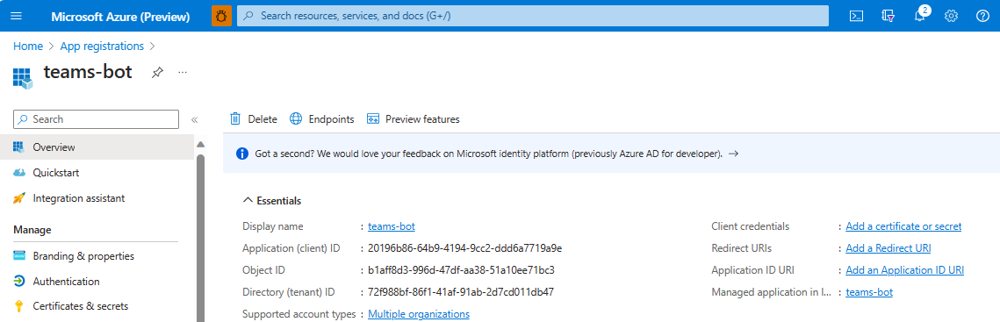
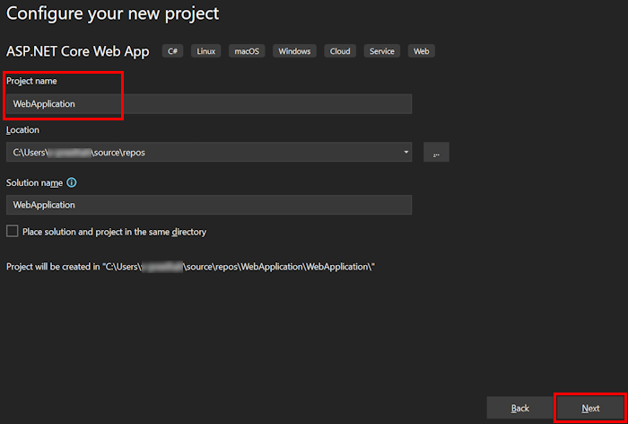
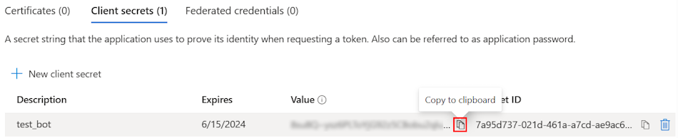
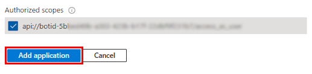
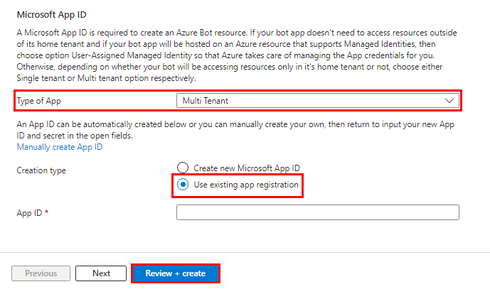
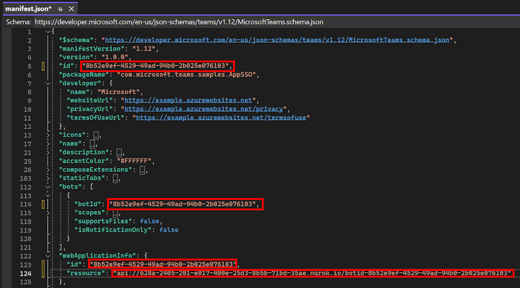
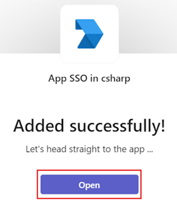

# SSO for Tabs and Message Extension

The  Microsoft Entra single sign-on (Microsoft Entra SSO) helps to authenticate users in Teams.
**Key aspects of Microsoft Entra SSO**:

* Allows the user to sign in automatically after the first sign in.
  * Allows the user to sign in to other devices without entering credentials again.
  * Obtains token for the signed in user.

This step-by-step guide helps you to create tabs and message extensions enabling Microsoft Entra SSO authentication. You'll see the following output:


## Prerequisites

| Install | For using... |
|---|--------------------|
|[Microsoft Teams](https://www.microsoft.com/microsoft-teams/download-app) | Microsoft Teams to collaborate with everyone you work with through apps for chat, meetings, and calls all in one place.|
|[Microsoft 365 developer account](/microsoftteams/platform/concepts/build-and-test/prepare-your-o365-tenant) | Access to Teams account with the appropriate permissions to install an app. |
|[.NET Core SDK](https://dotnet.microsoft.com/en-us/download) | Customized bindings for local debugging and Azure Functions app deployments. If you haven't installed the latest version, install the portable version. |
|[Visual Studio 2022](https://visualstudio.microsoft.com) | You can install the enterprise version in Visual Studio 2022, and install the ASP.NET and web development workloads. Use the latest version. |
|Dev tunnel | Teams app features (conversational bots, message extensions, and incoming webhooks) need inbound connections. A tunnel connects your development system to Teams. Dev tunnel is a powerful tool to securely open your localhost to the internet and control who has access. Dev tunnel is available in Visual Studio 2022 version 17.7.0 or later. You can also use [ngrok](https://ngrok.com/downloads) as a tunnel to connect your development system to Teams. It isn't required for apps that only include tabs. This package is installed within the project directory (using npm `devDependencies`). |

> [!NOTE]
>
> After downloading ngrok, sign up and install [authtoken](https://ngrok.com/downloads).

## Set up your Teams development tenant

A tenant is like a space or a container where you chat, share files, and run meetings for your organization in Teams. You can also upload and test the custom app.

### Check for custom app upload option

After creating the app, you must load your app in Teams without distributing it. This process is known as custom app upload. Sign in to your Microsoft 365 account to view this option.

> [!NOTE]
> Custom app upload is necessary for previewing and testing apps in Teams local environment. Enable app upload to preview and test your app in Teams locally.

Do you already have a tenant, and do you have the admin access? Let's check if you really do!

To verify custom upload apps in Teams:

1. In the Teams client, select the **Apps** icon.
2. Select **Manage your apps**.
3. Select **Upload an app**
4. Look for the option **Upload a custom app**. If you see the option, custom app upload is enabled.


> [!NOTE]
> Contact Teams administrator, if you don't have the option to upload a custom app.

### Create a free Teams developer tenant (optional)

If you don't have a Teams developer account, you can get it for free. Join the Microsoft 365 developer program!

1. Go to the [Microsoft 365 developer program](https://developer.microsoft.com/microsoft-365/dev-program).
2. Select **Join Now** and follow the onscreen instructions.
3. In the welcome screen, select **Setup E5 subscription**.
4. Set up an administrator account. After you finish, the following screen displays.


5. Sign in to Teams using the new administrator account you just set up. Verify that you have the **Upload a custom app** option in Teams.

> [!div class="button"]
> [I ran into an issue](https://github.com/MicrosoftDocs/msteams-docs/issues/new?template=Doc-Feedback.yaml&title=%5BI+ran+into+an+issue%5D+Create+a+free+Teams+developer+tenant+(optional)&pageUrl=https%3A%2F%2Flearn.microsoft.com%2Fen-us%2Fmicrosoftteams%2Fplatform%2Fsbs-bots-with-sso%3Ftabs%3Ddev%26tutorial-step%3D1&contentSourceUrl=https%3A%2F%2Fgithub.com%2FMicrosoftDocs%2Fmsteams-docs%2Fblob%2Fmain%2Fmsteams-platform%2Fsbs-bots-with-sso.yml&documentVersionIndependentId=b410630d-3624-e389-480f-ea3307a3b774&author=surbhigupta&platformId=4b2022ca-ee48-5c9a-b390-7ed303c02fd8&metadata=*%2BID%253A%2Be473e1f3-69f5-bcfa-bcab-54b098b59c80%2B%250A*%2BService%253A%2B**msteams**)

## Set up Local Environment

1. Open Microsoft-Teams-Samples
2. Select **Code**.
3. From the dropdown menu, select Open with GitHub Desktop.

()

4. Select **Clone**.

> [!div class="button"]
>[I ran into an issue](https://github.com/MicrosoftDocs/msteams-docs/issues/new?template=Doc-Feedback.yaml&title=%5BI+ran+into+an+issue%5D+Set+up+local+environment)

## Register Microsoft Entra App

The following steps help you to create and register your bot in Azure portal:

* Create and register your Azure app.
* Create client secret to enable SSO authentication of the bot.
* Add Teams channel to deploy the bot.
* Create a tunnel to your web server's endpoints using dev tunnel (recommended) or ngrok.
* Add messaging endpoint to the dev tunnel that you created.

[!INCLUDE [Azure app registration](../../includes/get-started/azure-app-registration.md)]()

### Add App Registration

1. Go to [Azure portal](https://ms.portal.azure.com/).

2. Select **App registrations**.


3. Select **+ New registration**.


4. Enter the name of your app.

5. Select **Accounts in any organizational directory (Any Microsoft Entra ID tenant - Multitenant)**.

6. Select **Register**.


Your app is registered in Microsoft Entra ID. The app overview page appears.



> **Note:**
>
> * Save the app ID from **Application (client) ID** and **Directory (tenant) ID** for further use.

> [!div class="button"]
> [I ran into an issue](https://github.com/MicrosoftDocs/msteams-docs/issues/new?template=Doc-Feedback.yaml&title=%5BI+ran+into+an+issue%5D+Add+App+Registration)

### Create a tunnel

#### [Dev Tunnel](#tab/dev)

1. Open Visual Studio.
2. Select **Create a new project**.


3. In the search box, enter **ASP.NET**. From the search results, select **ASP.NET Core Web App**.

4. Select **Next**.


5. Enter **Project name** and select **Next**.



6. Select **Create**.


An overview window appears.


7. In the debug dropdown list, select **Dev Tunnels (no active tunnel)** > **Create a Tunnel...**.


A pop-up window appears.

8. Update the following details in the pop-up window:

    a. **Account**: Enter a Microsoft or GitHub account.
    b. **Name**: Enter a name for your tunnel.
    c. **Tunnel Type**: From the dropdown list, select **Temporary**.
    d. **Access**: From the dropdown list, select **Public**.

9. Select **OK**.


A pop-up window appears showing that dev tunnel is successfully created.

10. Select **OK**.


You can find the tunnel you've created in the debug dropdown list as follows:


11. Select **F5** to run the application in the debug mode.

12. If a **Security Warning** dialog appears, select **Yes**.


A pop-up window appears.

13. Select **Continue**.


The dev tunnel home page opens in a new browser window and the dev tunnel is now active.


14. Go to Visual Studio, select **View > Output**.

15. From the **Output** console dropdown menu, select **Dev Tunnels**.

The **Output** console shows the dev tunnel URL.


> [!div class="button"]
> [I ran into an issue](https://github.com/MicrosoftDocs/msteams-docs/issues/new?template=Doc-Feedback.yaml&title=%5BI+ran+into+an+issue%5D+Add+App+Registration)

#### [Ngrok](#tab/ngrok)

Use ngrok or Command Prompt to create a tunnel to your locally running web server's publicly available HTTPS endpoints. Run the following command in ngrok:

```bash
ngrok http --host-header=localhost 3978
```

> [!TIP]
> If you encounter **ERR_NGROK_4018**, follow the steps provided in the Command Prompt to sign up and authenticate ngrok. Then run the `ngrok http --host-header=localhost 3978` command.

The window shows the HTTPS URL.


> [!div class="button"]
> [I ran into an issue](https://github.com/MicrosoftDocs/msteams-docs/issues/new?template=Doc-Feedback.yaml&title=%5BI+ran+into+an+issue%5D+Create+a+tunnel+using+ngrok)

---

### Add a web authentication

1. In the left pane, under **Manage**, select **Authentication**.

2. Select **Add a platform** > **Web**.


3. Enter the redirect URI for your app by appending `auth-end` to the fully qualified domain name. For example, `https://your-devtunnel-domain/auth-end` or `https://your-ngrok-domain/auth-end`.

4. Under **Implicit grant and hybrid flows**, select the **Access tokens** and **ID tokens** checkboxes.

5. Select **Configure**.


6. Under **Web**, select **Add URI**.

7. Enter `https://token.botframework.com/.auth/web/redirect`.

8. Select **Save**.


> [!div class="button"]
> [I ran into an issue](https://github.com/MicrosoftDocs/msteams-docs/issues/new?template=Doc-Feedback.yaml&title=%5BI+ran+into+an+issue%5D+Add+a+web+authentication)

### Create a client secret

> [!NOTE]
> If you encounter the error **Client secrets are blocked by tenant-wide policy. Contact your tenant administrator for more information.**, you can create a certificate instead. For step-by-step instructions, refer to [create a certificate for app registration.](/graph/auth-register-app-v2#add-credentials)

1. In the left pane, under **Manage**, select **Certificates & secrets**.

2. Under **Client secrets**, select **+ New client secret**.


The **Add a client secret** window appears.

3. Enter **Description**.

4. Select **Add**.


5. Under **Value**, select **Copy to clipboard** to save the client secret value for further use.



> [!div class="button"]
> [I ran into an issue](https://github.com/MicrosoftDocs/msteams-docs/issues/new?template=Doc-Feedback.yaml&title=%5BI+ran+into+an+issue%5D+Create+a+client+secret)

### Add API Permissions

1. In the left pane, select **API permissions**.
2. Select **+ Add a permission**.


1. Select **Microsoft Graph**.
2. Select **Delegated permissions**.
3. Select **User** > **User.Read**.
4. Select **Add permissions**.


> **Note:**
>
> * If an app isn't granted IT admin consent, users must provide consent the first time they use an app.
> * Users need to consent to the API permissions only if the Microsoft Entra app is registered in a different tenant.

> [!div class="button"]
> [I ran into an issue](https://github.com/MicrosoftDocs/msteams-docs/issues/new?template=Doc-Feedback.yaml&title=%5BI+ran+into+an+issue%5D+Add+API+permissions)

### Add Application ID URI

1. In the left pane, under **Manage**, select **Expose an API**.

2. Next to **Application ID URI**, select **Add**.


3. Update the **Application ID URI** in the `api://your-devtunnel-domain/botid-{AppID}` or `api://your-ngrok-domain/botid-{AppID}` format and select **Save**.


The following image shows the domain name:


> [!div class="button"]
> [I ran into an issue](https://github.com/MicrosoftDocs/msteams-docs/issues/new?template=Doc-Feedback.yaml&title=%5BI+ran+into+an+issue%5D+Add+Application+ID+URI)

### Add a scope

1. In the left pane, under **Manage**, select **Expose an API**.

2. Select **+ Add a scope**.


3. Enter **access_as_user** as the **Scope name**.

4. Under **Who can consent?**, select **Admins and users**.

5. Update the values for the rest of the fields as follows:

   * Enter **Teams can access the user’s profile** as **Admin consent display name**.

   * Enter **Allows Teams to call the app’s web APIs as the current user** as **Admin consent description**.

   * Enter **Teams can access the user profile and make requests on the user’s behalf** as **User consent display name**.

   * Enter **Enable Teams to call this app’s APIs with the same rights as the user** as **User consent description**.

6. Ensure that **State** is set to **Enabled**.

7. Select **Add scope**.

The following image shows the fields and the values:


> [!NOTE]
> The **Scope name** must match with the **Application ID** URI with `/access_as_user` appended at the end.


> [!div class="button"]
> [I ran into an issue](https://github.com/MicrosoftDocs/msteams-docs/issues/new?template=Doc-Feedback.yaml&title=%5BI+ran+into+an+issue%5D+Add+API+permissions)

### Add client application

1. In the left pane, under **Manage**, select **Expose an API**.

Under **Authorized client applications**, identify the applications that you want to authorize for your app’s web application.

2. Select **+ Add a client application**.


3. Add Teams mobile or desktop and Teams web application.

   a. For Teams mobile or desktop: Enter the **Client ID** as `1fec8e78-bce4-4aaf-ab1b-5451cc387264`.


   b. For Teams web: Enter the **Client ID** as `5e3ce6c0-2b1f-4285-8d4b-75ee78787346`.


4. Select the **Authorized scopes** checkbox.

5. Select **Add application**.



The following image displays the **Client Id**:


> [!div class="button"]
[I ran into an issue](https://github.com/MicrosoftDocs/msteams-docs/issues/new?template=Doc-Feedback.yaml&title=%5BI+ran+into+an+issue%5D+Add+client+application)

### Update the manifest

1. In the left pane, select **Manifest**.

2. Set the value for the `requestedAccessTokenVersion` to `2` and select **Save**.


> [!div class="button"]
[I ran into an issue](https://github.com/MicrosoftDocs/msteams-docs/issues/new?template=Doc-Feedback.yaml&title=%5BI+ran+into+an+issue%5D+Add+client+application)

## Create Your Bot

### Create an Azure bot resource

> [!NOTE]
> If you're already testing your bot in Teams, sign out of this app and Teams. To see this change, sign in again.

1. Go to **Home**.
2. Select **+ Create a resource**.
3. In the search box, enter **Azure Bot**.
4. Select **Enter**.
5. Select **Azure Bot**.
6. Select **Create**.


7. Enter the bot name in **Bot handle**.
8. Select your **Subscription** from the dropdown list.
9. Select your **Resource group** from the dropdown list.


If you don't have an existing resource group, you can create a new resource group. To create a new resource group, follow these steps:

a. Select **Create new**.
b. Enter the resource name and select **OK**.
c. Select a location from **New resource group location** dropdown list.


10. Under **Pricing**, select **Change plan**.


11. Select **FO Free** > **Select**.


12. Under **Microsoft App ID**, select **Type of App** as **Multi Tenant**.

13. In the **Creation type**, select **Use existing app registration**.

14. Enter the **App ID**.

> [!NOTE]
> You can't create more than one bot with the same **Microsoft App ID**.

15. Select **Review + create**.



16. After the validation passes, select **Create**.

The bot takes a few minutes to provision.

17. Select **Go to resource**.


You've successfully created your Azure bot.


> [!div class="button"]
> [I ran into an issue](https://github.com/MicrosoftDocs/msteams-docs/issues/new?template=Doc-Feedback.yaml&title=%5BI+ran+into+an+issue%5D+Create+an+Azure+bot+resource&&author=%40surbhigupta&pageUrl=https%3A%2F%2Flearn.microsoft.com%2Fen-us%2Fmicrosoftteams%2Fplatform%2Fsbs-tabs-and-messaging-extensions-with-sso%3Ftabs%3Ddev%252Cvs2019%26tutorial-step%3D4&contentSourceUrl=https%3A%2F%2Fgithub.com%2FMicrosoftDocs%2Fmsteams-docs%2Fblob%2Fmain%2Fmsteams-platform%2Fsbs-tabs-and-messaging-extensions-with-sso.yml&documentVersionIndependentId=7a0eb8f0-586e-b698-b21b-10cfb522de93&platformId=2dca5192-9fed-4178-313c-e97c647db0e3&metadata=*%2BID%253A%2Be473e1f3-69f5-bcfa-bcab-54b098b59c80%2B%250A*%2BService%253A%2B%2A%2Amsteams%2A%2A)  

### Add a Teams channel

1. In the left pane, select **Channels**.
2. Under **Available Channels**, select **Microsoft Teams**.


3. Select the checkbox to accept the **Terms of Service**.

4. Select **Agree**.


5. Select **Apply**.


## To add a messaging endpoint

# [dev tunnel](#tab/dev2)

1. Use the dev tunnel URL in the **Output** console as the messaging endpoint.


2. In the left pane, under **Settings**, select **Configuration**.

3. Update the **Messaging endpoint** in the format `https://your-devtunnel-domain/api/messages`.

 

4. Select **Apply**.

You've successfully set up a bot in Azure Bot service.

> [!NOTE]
> If the **Application Insights Instrumentation key** shows an error, update with **App ID**.

# [ngrok](#tab/ngrok2)

1. From ngrok, copy the HTTPS URL.


> [!NOTE]
> The HTTPS URL in your ngrok is a fully qualified domain name.
> The `WebAppDomain` is a fully qualified domain name that doesn't include `https://` in it.

2. In the left pane, under **Settings**, select **Configuration**.

3. Update the **Messaging endpoint** in the format `https://your-ngrok-domain/api/messages`.


4. Select **Apply**.

You have successfully set up a bot in Azure Bot service.

> [!NOTE]
> If the **Application Insights Instrumentation key** shows an error update with **App ID**.

> [!div class="button"]
> [I ran into an issue](https://github.com/MicrosoftDocs/msteams-docs/issues/new?template=Doc-Feedback.yaml&title=%5BI+ran+into+an+issue%5D+Add+App+Registration)

---

### Add an OAuth connection settings

1. In the left pane, select **Configuration**.

2. Select **Add OAuth Connection Settings**.

3. Under **New Connection Setting**, update the following details:

    * **Name**: Enter a name for your new connection setting. You can use the name in the settings of your bot service code.
    * **Service Provider**: From the dropdown list, select **Azure Active Directory v2**.
    * **Client id**: Update your **Microsoft App ID**.
    * **Client secret**: Update the client secrets **Value**.
    * **Token Exchange URL**: Update the **Application ID URI**.
    * **Tenant ID**: Enter **Common**.
    * **Scopes**: Enter **User.Read**.

4. Select **Save**.


> [!div class="button"]
> [I ran into an issue](https://github.com/MicrosoftDocs/msteams-docs/issues/new?template=Doc-Feedback.yaml&title=%5BI+ran+into+an+issue%5D+Add+an+OAuth+connection+settings)

## Set up App Settings

1. Go to the **appsettings.json** file in the cloned repository.


1. Open the **appsettings.json** file in Visual Studio.

2. Update the following information:
   * Replace `"MicrosoftAppId"` to your bot's **Microsoft App ID**.
   * Replace `"MicrosoftAppPassword"` to your bot's client secrets **Value**.
   * Replace `"SiteUrl"` to your ngrok URL.
   * Replace `"ConnectionName"` to the name of OAuth connection setting.
   * Replace `"TenantId"` to the tenant ID of the tenant where the app is used.
   * Replace `"ClientId"` to your bot's **Microsoft App ID**.
   * Replace `"AppSecret"` to your bot's client secrets **Value**.
   * Replace `"ApplicationIdURI"` in the form of `api://*******.ngrok.io/botid-{AppID}`.


## Set up Manifest File

1. Go to the **manifest.json** file in the cloned repository.


1. Open the **manifest.json** file in Visual Studio and make the following changes:

   * Replace `DOMAIN-NAME` with your ngrok URL.
   * Replace `YOUR-MICROSOFT-APP-ID` with your bot's **Microsoft App ID**.

> [!NOTE]
> Depending on the scenario `[YOUR-MICROSOFT-APP-ID]` and `[DOMAIN-NAME]` may occur multiple times.

* Replace `resource` as `api://*******.ngrok.io/botid-{AppID}`.



## Build and Run the Service Using Visual Studio

To build and run the service, use Visual Studio or Command line.

### [Visual Studio](#tab/Visual-Studio)

1. Open Visual Studio.
2. Select **File** > **Open** > **Project/Solution...**.


2. In the **csharp** folder, select **App SSO Sample.csproj** file.


3. Press **F5** to run the project.

4. Select **Yes** if the following dialog appears:


A webpage appears with a message **Your bot is ready!**


> [!div class="button"]
> [I ran into an issue](https://github.com/MicrosoftDocs/msteams-docs/issues/new?template=Doc-Feedback.yaml&title=%5BI+ran+into+an+issue%5D+Build+and+run+service+using+Visual+Studio)

### [Command Line](#tab/command-line)

Go to the **csharp** folder in a Command Prompt window and enter the following command:

```bash
dotnet run
```


> [!div class="button"]
> [I ran into an issue](https://github.com/MicrosoftDocs/msteams-docs/issues/new?template=Doc-Feedback.yaml&title=%5BI+ran+into+an+issue%5D+Build+and+run+service+using+Command+line)

---

## Upload SSO App to Teams

1. In your cloned repository, go to **csharp** > **App SSO Sample** > **TeamsAppManifest**.
2. Create a .zip file with the following files that are present in the **Manifest** folder:
   * manifest.json
   * icon-outline.png
   * icon-color.png


3. In the Teams client, select the **Apps** icon.
4. Select **Manage your apps**.
5. Select **Upload an app**.
6. Look for the option to **Upload a custom app**. If you see the option, custom app upload is enabled.


> [!NOTE]
>
> Contact your Teams administrator, if you don't find the option to upload a custom app.

7. Select **Open** to upload the .zip file that you created in the **Manifest** folder.


1. Select **Add**.


9. Select **Open** and send a message to the bot.



10. The bot performs SSO and displays profile card along with option prompt to view token.


11. Select **Yes** to view token or **No** to continue with chat.


12. If SSO isn't performed, then the bot performs default authentication method for your tab.


13. To sign in, if SSO isn't performed

   a. In the left pane of Teams, select **More added apps (●●●)**.
   b. Select your new SSO application.


   c. Select **sign in**.


   d. Enter your credentials in the **Sign in** window and select **Next**.


   e. Select **Accept**.


   f. Select your profile under the search box. You'll see the following output:


14. Send `https://profile.botframework.com` to the application to get a profile card.


> [!div class="button"]
> [I ran into an issue](https://github.com/MicrosoftDocs/msteams-docs/issues/new?template=Doc-Feedback.yaml&title=%5BI+ran+into+an+issue%5D+Upload+SSO+app+to+Teams)

## Complete Challenge

Did you come up with output like this?


## Congratulations

You've completed the tutorial to get started with SSO for tab and message extension app.
