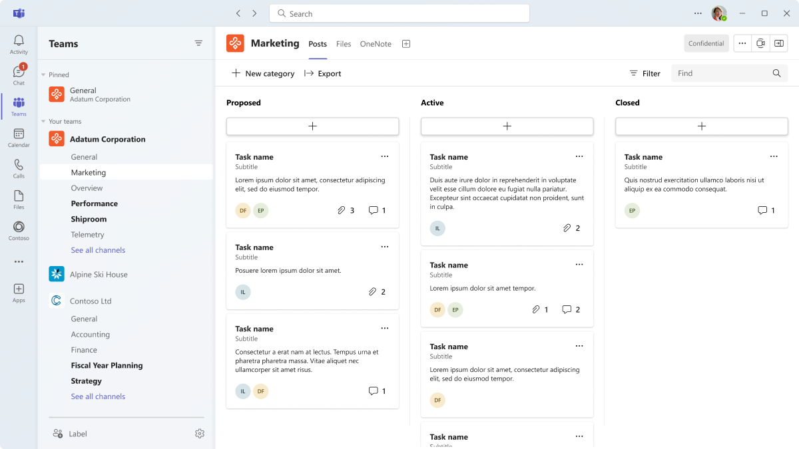

# Microsoft Teams tabs

Tabs are Teams-aware webpages embedded in Microsoft Teams. They are simple HTML <iframe\> tags that point to domains declared in the app manifest and can be added as part of a channel inside a team, group chat, or personal app for an individual user. You can include custom tabs with your app to embed your own web content in Teams or add Teams-specific functionality to your web content. For more information, see [Teams JavaScript client SDK](/javascript/api/overview/msteams-client).

The following image shows Contoso channel tabs:

There are few prerequisites that you must go through before working on tabs.

> [!VIDEO https://www.youtube-nocookie.com/embed/Jw6i7Mkt0dg]  

> [!VIDEO https://www.youtube-nocookie.com/embed/T2a8yJC3VcQ]

There are two types of tabs available in Teams, personal and channel or group. Personal tabs, along with personally-scoped bots, are part of personal apps and are scoped to a single user. They can be pinned to the left navigation bar for easy access. Channel or group tabs deliver content to channels and group chats, and are a great way to create collaborative spaces around dedicated web-based content.

You can create a content page as part of a personal tab, channel or group tab, or task module. You can create a configuration page that enables users to configure Microsoft Teams app and use it to configure a channel or group chat tab, a messaging extension, or an Office 365 connector. You can permit users to reconfigure your tab after installation and create a tab removal page for your application. When you build a Teams app that includes a tab, you must test how your tab functions on both the Android and iOS Teams clients. Your tab must get context through basic information, locale and theme information, and `entityId` or `subEntityId` that identifies what is in the tab.

You can build tabs with Adaptive Cards and centralize all Teams app capabilities by eliminating the need for a different backend for your bots and tabs. Stage View is a new UI component that allows you to render the content opened in full screen in Teams and pinned as a tab. The existing link unfurling service is updated so that it is used to turn URLs into a tab using an Adaptive Card and Chat Services. You can create conversational tabs using conversational sub-entities that allow users to have conversations about sub-entities in your tab, such as specific task, patient, and sales opportunity, instead of discussing the entire tab.

## Tab features

The tab features are as follows:

* If a tab is added to an app that also has a bot, the bot is also added to the team.
* Awareness of Azure Active Directory (AAD) ID of the current user.
* Locale awareness for the user to indicate language that is `en-us`.
* Single sign-on (SSO) capability, if supported.
* Ability to use bots or app notifications to deep link to the tab or to a sub-entity within the service, for example an individual work item.
* The ability to open a task module from links within a tab.
* Reuse of SharePoint web parts within the tab.

## Tabs user scenarios

**Scenario:** Bring an existing web-based resource inside Teams. \
**Example:** You create a personal tab in your Teams app that presents an informational corporate website to users.

**Scenario:** Add support pages to a Teams bot or messaging extension. \
**Example:** You create personal tabs that provide **about** and **help** webpage content to users.

**Scenario:** Provide access to items that your users interact with regularly for cooperative dialogue and collaboration. \
**Example:** You create a channel or group tab with deep linking to individual items.

## Understand how tabs work

You can use one of the following methods to create tabs:

* [Declare custom tab in app manifest](#declare-custom-tab-in-app-manifest)
* [Use Adaptive Card to build tabs](#use-adaptive-card-to-build-tabs)

### Declare custom tab in app manifest

A custom tab is declared in the app manifest of your app package. For each webpage you want included as a tab in your app, you define a URL and a scope. Additionally, you can add the [Teams JavaScript client SDK](/javascript/api/overview/msteams-client) to your page, and call `microsoftTeams.initialize()` after your page loads. Teams displays your page, provides access to Teams-specific information, for example the Teams client is running the dark theme.

Whether you choose to expose your tab within the channel or group, or personal scope, you must present an <iframe\> HTML [content page](~/tabs/how-to/create-tab-pages/content-page.md) in your tab. For personal tabs, the content URL is set directly in your Teams app manifest by the `contentUrl` property in the `staticTabs` array. Your tab's content is the same for all users.

For channel or group tabs, you can also create an additional configuration page. This page allows you to configure content page URL, typically by using URL query string parameters to load the appropriate content for that context. This is because your channel or group tab can be added to multiple teams or group chats. On each subsequent install, your users can configure the tab, allowing you to tailor the experience as required. When users add or configure a tab, a URL is being associated with the tab that is presented in the Teams user interface (UI). Configuring a tab simply adds additional parameters to that URL. For example, when you add the Azure Boards tab, the configuration page allows you to choose, which board the tab loads. The configuration page URL is specified by the  `configurationUrl` property in the `configurableTabs` array in your app manifest.

You can have multiple channels or group tabs, and up to 16 personal tabs per app.

### Use Adaptive Card to build tabs

When developing a tab using the traditional method, you must consider these issues, such as HTML and Cascading Style Sheets (CSS) considerations, slow load times, iFrame constraints, server maintenance and costs, and so on. Adaptive Card tabs is a new way to build tabs in Teams. Instead of embedding web content in an iframe, you can render Adaptive Card to a tab. While the front-end is rendered as Adaptive Card, the backend is powered by a bot. The bot is responsible for accepting requests and responding appropriately with the Adaptive Card that is rendered.

## Mobile clients

If you choose to have your channel or group tab appear on Teams mobile clients, the `setSettings()` configuration must have a value for the `websiteUrl` property. To ensure optimal user experience, you must follow the [guidance for tabs on mobile](~/tabs/design/tabs-mobile.md) when creating your tabs.

Apps [distributed through the Teams store](~/concepts/deploy-and-publish/appsource/publish.md) have a separate approval process for mobile clients. The default behavior of such apps is as follows:

| **App capability** | **Behavior if app is approved** | **Behavior if app is not approved** |
| --- | --- | --- |
| **Personal tabs** | App appears in the bottom bar of the mobile clients. Tabs open in the Teams client. | App does not appear in the bottom bar of the mobile clients. |
| **Channel and group tabs** | The tab opens in the Teams client using `contentUrl`. | The tab opens in a browser outside the Teams client using `websiteUrl`. |

> [!NOTE]
> * [Apps submitted to the AppSource for publishing on Teams ](../concepts/deploy-and-publish/overview.md#publish-to-appsource) are evaluated automatically for mobile responsiveness. For any queries, reach out to teamsubm@microsoft.com.
> * For all [apps that are not distributed through the AppSource](../concepts/deploy-and-publish/overview.md), the tabs open in an in-app webview within the Teams clients by default and there is no separate approval process required.
> * The default behavior of apps is only applicable if distributed through the Teams store. By default, all tabs open in the Teams client.
> * To initiate an evaluation of your app for mobile-friendliness, reach out to teamsubm@microsoft.com with your app details.

## See also

* [Request device permissions](../concepts/device-capabilities/native-device-permissions.md)
* [Integrate media capabilities](../concepts/device-capabilities/mobile-camera-image-permissions.md)
* [Integrate a QR or barcode scanner](../concepts/device-capabilities/qr-barcode-scanner-capability.md)
* [Integrate location capabilities](../concepts/device-capabilities/location-capability.md)

## Next step

> [!div class="nextstepaction"]
> [Prerequisites](~/tabs/how-to/tab-requirements.md)
