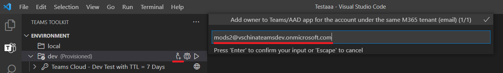

# Collaborate on Teams project using Teams Toolkit

Multiple developers can work together to debug, provision and deploy for the same TeamsFx project, but it requires manually setting the right permissions of Teams App and AAD App.Teams Toolkit now supports collaboration feature to allow a developer (project owner) to invite other developers (collaborators) to the TeamsFx project to debug, provision and deploy the same TeamsFx project.

## Prerequisites

* Account prerequisites

    To provision cloud resources, you must have the following accounts. For more information, see, [prepare accounts to build Teams app](accounts.md).

    * Microsoft 365 subscription
    * Azure with valid subscription

* [Install Teams Toolkit](https://marketplace.visualstudio.com/items?itemName=TeamsDevApp.ms-teams-vscode-extension) version v3.0.0+.

> [!TIP]
> Ensure you have a Teams app project opened in VS code.

## Collaborate with other developers

### As a project owner

> [!NOTE]
> Before adding collaborators for an environment, project owner needs to [provision](provision.md) the project first.

* In **ENVIRONMENT** section on Teams Toolkit, select **Collaborators**. It displays the options **Add M365 Teams App (with AAD App) Owners** and **List M365 Teams App (with AAD App) Owners** as shown in the following image:

  

* Select **Add M365 Teams App (with AAD App) Owners** and add other M365 account email address as collaborator. The account to be added **must be on the same tenant as project owner for remote debug** as shown in the image:

  

* To view collaborators in current environment, select **List M365 Teams App (with AAD App) Owners**, then collaborators will be listed in the output channel as shown in following image:

  

* Push the project to GitHub.

> [!NOTE]
> Newly added collaborator will not receive any notification. Project owner needs to notify collaborator.

### As a project collaborator

* Clone the project from GitHub
* Login to M365 account
* Login to Azure account which has contributor permission for all the Azure resources being used in this project.
* To preview your Teams app, deploy the project to remote.
* Launch remote to have a preview of the Teams app. 
For more information, see [build and run your Teams app in remote environment](/microsoftteams/platform/sbs-gs-javascript?tabs=vscode%2Cvsc%2Cviscode%2Cvcode&tutorial-step=3&branch).

> [!NOTE]
> Collaborators should login using the account added by project owner which is **under the same tenant with project owner**.

### Limitation

You can't remove collaborators directly from Teams Toolkit extension. Follow the steps to remove collaborators manually:

      1. Go to [Teams Developer Portal](https://dev.teams.microsoft.com/apps), and select your Teams App by name or app id.
      2. Select **Owners** from left panel.
      3. Select and remove the collaborator.
      4. Go to [Azure Active Directory](https://ms.portal.azure.com/#blade/Microsoft_AAD_IAM/ActiveDirectoryMenuBlade/RegisteredApps), select **App registration** from left panel, and find your AAD App.
      5. Select **Owners** from left panel in AAD App management page.
      6. Select and remove the collaborator.

Collaborator added to your project will not receive any notification. Project owner needs to notify collaborator offline.

> [!NOTE]
> Azure related permissions should be set manually by Azure subscription administrator on Azure portal. Azure account should have contributor role for the subscription so that developers can work together to provision and deploy TeamsFx project.

## See also

> [!div class="nextstepaction"]
> [Provision cloud resources](provision.md)

> [!div class="nextstepaction"]
> [Deploy Teams app to the cloud](deploy.md)

> [!div class="nextstepaction"]
> [Manage multiple environments](TeamsFx-multi-env.md)
