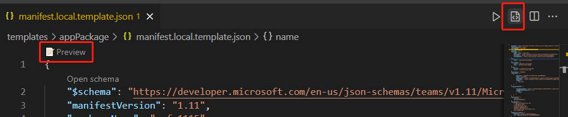
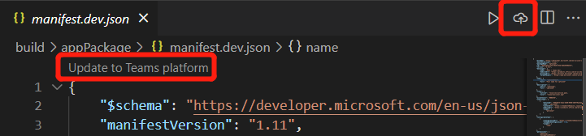

# Preview Teams app Manifest in Teams Toolkit

After scaffolding, you get two manifest template files under `templates/appPackage` folder.

- `manifest.local.template.json` - local debug teams app.
- `manifest.remote.template.json` - shared between all remote environments.

These template files containing some placeholders, and the actual values from Teams Toolkit will be resolved in files under `.fx/configs` and `.fx/states`.

## Prerequisite

* [Install Teams Toolkit](https://marketplace.visualstudio.com/items?itemName=TeamsDevApp.ms-teams-vscode-extension) version v3.0.0+.

> [!TIP]
> You should already have a Teams app project opened in VS code.

## Preview Manifest

To preview manifest with real content, Teams Toolkit will generate preview manifest files under `build/appPackage` folder:

```text
└───build
    └───appPackage
        ├───appPackage.{env}.zip - Zipped app package of remote teams app
        ├───appPackage.local.zip - Zipped app package of local team app
        ├───manifest.{env}.json  - Previewed manifest of remote teams app
        └───manifest.local.json  - Previewed manifest of local teams app
```

### Local debug Teams app

To preview manifest file of local teams app, you need to press **F5** to run local debug first. This step will generate default local settings for you, then the app package and preview manifest will be built under `build/appPackage` folder.

The other ways are:

- Select `Preview` in the codelens of `manifest.local.template.json` file
- Select `Preview manifest file` at the menu bar of `manifest.local.template.json` file
- Select `Zip Teams metadata package` in Treeview and select `local`
The preview local appears as shown in the following image:



### Remote environment

To preview manifest file of remote teams app, you need to select `Provision in the cloud` in DEVELOPMENT panel of Teams Toolkit extension Treeview, or trigger `Teams: Provision in the cloud` from command palette first. This step will generate configurations for remote teams app, then the app package and preview manifest will be built under `build/appPackage` folder.

The other ways are:

- Select `Preview` in the codelens of `manifest.remote.template.json` file.
- Select `Preview manifest file` at the menu bar of `manifest.remote.template.json` file.
- Select `Zip Teams metadata package` in Treeview and select your environment.


> If there are more than one environment, you need to select the env you want to preview as shown in the image:


## Sync local changes to Dev Portal

After previewing the manifest file, you can sync your local changes to Dev Portal by the following ways:

- Select `Update to Teams platform` at the top left corner of `manifest.{env}.json`
- Select `Teams: Update manifest to Teams platform` at the menu bar of `manifest.{env}.json`
- Trigger `Teams: update manifest to Teams platform` from command palette




> [!NOTE]
> Trigger from editor codelens or title button will update current manifest file to Teams platform. Trigger from command palette will require selecting target environment.

If the manifest file is outdated due to configuration file change or template change, user will be asked to confirm their action:


- `Preview only`: local manifest file will be overwritten according to current configuration
- `Preview and update`: local manifest file will be overwritten according to current configuration and also updated to Teams platform at the same time
- `Cancel`: do nothing

> [!NOTE]
> The changes will be updated to dev portal. If you have some manual updates in dev portal, it will be overwritten.

## See also

> [!div class="nextstepaction"]
> [Customize Teams App Manifest in Teams Toolkit](TeamsFx-manifest-customization.md)
