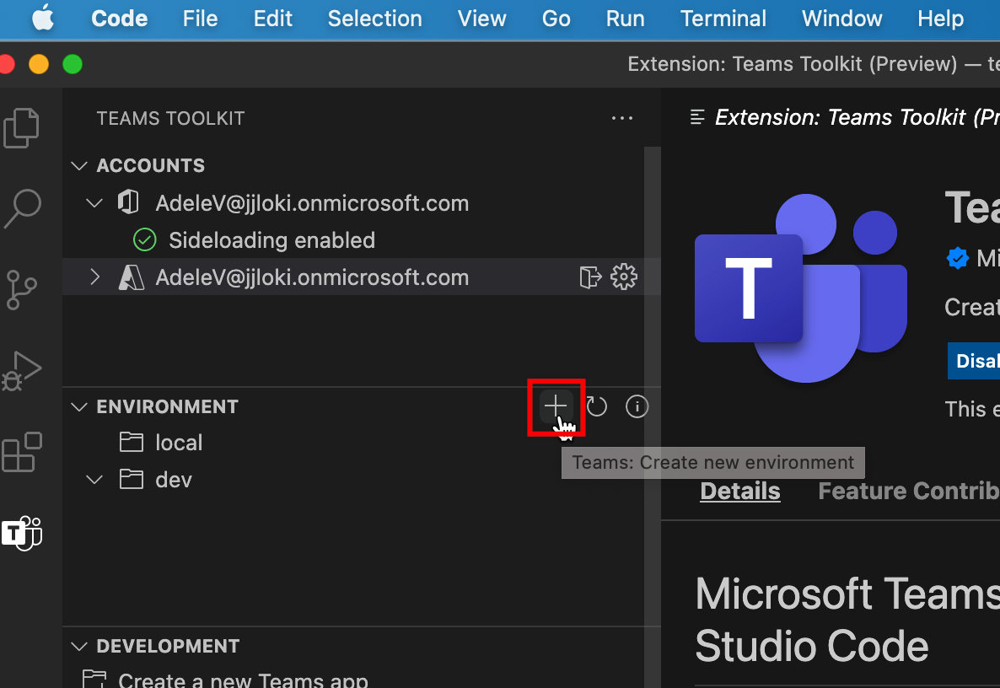
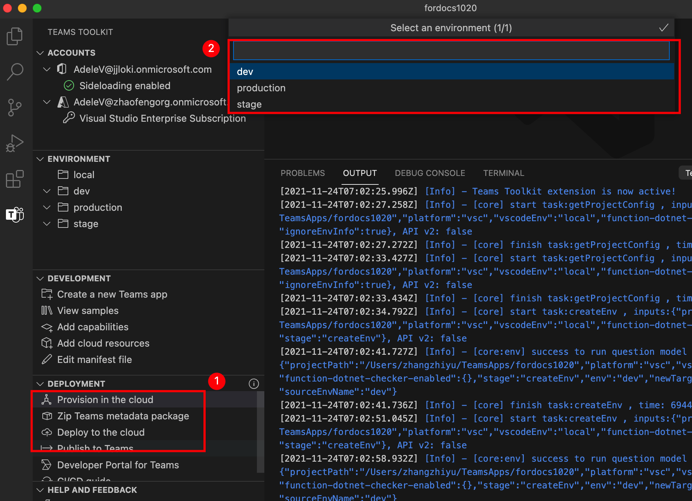

# Manage multiple environments in Teams Toolkit

 Teams Toolkit provides a simple way for developers to create and manage multiple environments, provision and deploy artifacts to the target environment for Teams App.

 With multiple environments, developers can:

1. Test before production: It is a common practice to setup multiple environments (e.g., dev, test, staging) before publishing a Teams App to production environment in modern app development lifecycle.

2. Manage app behaviors in different environments: Developers can set different behaviors for different environments. E.g., developers may want to enable telemetry in production environment but disable it in development environment.

## Prerequisites

* [Install Teams Toolkit](https://marketplace.visualstudio.com/items?itemName=TeamsDevApp.ms-teams-vscode-extension) version v3.0.0+.
* You should already have a Teams app project opened in VS code.

## Create a new environment

After creating new project, Teams Toolkit by default creates:

- One `local` environment to represent the local machine environment configurations.
- One `dev` environment to represent the remote/cloud environment configurations.

> [!NOTE]
> Each project can have only one `local` environment but multiple remote environments.

To add another remote environment, select the Teams icon in the sidebar, click the Plus button under Environment section, and follow the questions to create.



> [!NOTE]
> If you have more than one existing environments, you will need to select an existing environment to create the environment. The command will copy file contents of `config.<newEnv>.json` and `azure.parameters.<newEnv>.json` from the existing environment you selected to the new environment being created.

## Select target environment for provision, deploy, publish and preview

With environment concept introduced in Teams Toolkit, for all environment related operations, you can select the target environment to perform the operations against. The toolkit will prompt and ask for a target environment when you have multiple remote environments.



## Take a tour of project folder structure for multiple environment

After creating the project, you can view the project folders and files in the Explorer area of Visual Studio Code. Besides the custom codes, some files are used by Teams Toolkit to maintain the config, state and template of the app. Following list those files and outlines their relationship with multiple environments.

- `.fx/configs`: config files that user can customize for the Teams app.
  - `config.<envName>.json`: per-environment configuration file.
  - `azure.parameters.<envName>.json`: per-environment parameters file for Azure BICEP provision.
  - `projectSettings.json`: global project settings which apply to all environments.
  - `localSettings.json`: local debug configuration file.
- `.fx/states`: provision result that is generated by the Toolkit.
  - `state.<envName>.json`: per-environment provision output file.
  - `<env>.userdata`: per-environment sensitive user data for the provision output.
- `templates`
  - `appPackage`: app manifest template files.
  - `azure`: BICEP template files.

## Customize the provision for multiple environments

Teams Toolkit allows you to change the config files and template files to customize the resource provision in each environment.

The table below lists the common scenarios supported for customized provision and where to customize:

| Scenarios | Where to customize | How to customize |
| --- | --- | --- |
| Customize Azure Resource | <ul> <li>BICEP files under `templates/azure`.</li> <li>`.fx/azure.parameters.<envName>.json`.</li></ul> | refer to [customize ARM parameters and templates](provision.md#customize-arm-parameters-and-templates) for more details. |
| Reusing existing AAD app for Teams app | <ul> <li>`auth` section in`.fx/config.<envName>.json`.</li> </ul> | refer to [use an existing AAD app for your Teams app](provision.md#use-an-existing-aad-app-for-your-teams-app) for more details. |
| Reusing existing AAD app for bot | <ul> <li>`bot` section in`.fx/config.<envName>.json`.</li> </ul> | refer to [use an existing AAD app for your bot](provision.md#use-an-existing-aad-app-for-your-bot) for more details. |
| Skip adding user when provisioning SQL | <ul> <li>`skipAddingSqlUser` property in`.fx/config.<envName>.json`.</li> </ul> | refer to [skip adding user for SQL database](provision.md#skip-adding-user-for-sql-database) for more details. |
| Customize App Manifest | <ul> <li>`templates/manifest.remote.template.json`.</li> <li>`manifest` section in`.fx/config.<envName>.json`.</li>  </ul> | refer to [customize Teams App Manifest in Teams Toolkit](TeamsFx-manifest-customization.md) for more details. |

## Examples of provision customization

### Example 1: customize Teams App name for different environment

In this example, you will learn how to set the Teams app name to `myapp(dev)` for the default environment `dev`  and `myapp(staging)` for the staging environment `staging`.

Steps to do the customization:

- Step 1: open config file `.fx/configs/config.dev.json`.
- Step 2: update the property of *manifest > appName > short* to `myapp(dev)`

  Updates to `.fx/configs/config.dev.json`:

  ```json
  {
      "$schema": "https://aka.ms/teamsfx-env-config-schema",
      "description": "You can customize the TeamsFx config for different environments.   Visit https://aka.ms/teamsfx-env-config to learn more about this.",
      "manifest": {
          "appName": {
              "short": "myapp(dev)"
              ...
          }
      }
      ...
  }
  ```

- Step 3: create new environment named `staging` if it doesn't exist.
- Step 4: open config file `.fx/configs/config.staging.json`.
- Step 5: update the same property of step 2 to `myapp(staging)`.

### Example 2: customize Teams App description for different environment

In this example, you will learn how to set different Teams App description for different environments:

- For the default environment `dev`, the description will be `my app description for dev`;
- For the staging environment `staging`, the description will be `my app description for staging`;

Steps to do the customization:

- Step 1: open config file `.fx/configs/config.dev.json`.
- Step 2: update the property of *manifest > description > short* to `my app description for dev`.

  Updates to `.fx/configs/config.dev.json`

  ```json
  {
      "$schema": "https://aka.ms/teamsfx-env-config-schema",
      "description": "You can customize the TeamsFx config for different environments.   Visit https://aka.ms/teamsfx-env-config to learn more about this.",
      "manifest": {
          ...
          "description": {
              "short": "`my app description for dev"
              ...
          }
      }
      ...
  }
  ```

- Step 3: create a new environment named `staging` if it doesn't exist.
- Step 4: open config file `.fx/configs/config.staging.json`.
- Step 5: update the same property of step 2 to `my app description for staging`.
- **Step 6**: open Teams app manifest template for remote `templates/appPackage/manifest.remote.template.json`.
- **Step 7**: update the property `description > short` to use the **variable** defined in config files with mustache syntax `{{config.manifest.description.short}}`.
  
  Updates to `manifest.remote.template.json`:

  ```json
  {
    "$schema": "https://developer.microsoft.com/en-us/json-schemas/teams/v1.11/MicrosoftTeams.schema.json",
    "manifestVersion": "1.11",
    "version": "1.0.0",
    ...
    "description": {
      "short": "{{config.manifest.description.short}}",
      ...
    },
    ...
  }
  ```

### Example 3: customize Teams App description for all environments

In this example, you will learn how to set the description of Teams app to `my app description` for all environments.

As the Teams app manifest template is shared across all environments, we can update the description value in it for our target.

- Step 1: open Teams app manifest template for remote `templates/appPackage/manifest.remote.template.json`.
- Step 2: update the property `description > short` with **hard-coded string** `my app description`.
  
  Updates to `manifest.remote.template.json`:

  ```json
  {
    "$schema": "https://developer.microsoft.com/en-us/json-schemas/teams/v1.11/MicrosoftTeams.schema.json",
    "manifestVersion": "1.11",
    "version": "1.0.0",
    ...
    "description": {
      "short": "my app description",
      ...
    },
    ...
  }

### Example 4: customize Azure resources for different environment

You can customize Azure resources for each environment, for example specifying Azure Function name, by editing the environment corresponding `.fx/configs/azure.parameters.{env}.json` file. Click [here](provision.md#example-specifying-the-name-of-function-app-instance) to see detail steps.

For more details about BICEP template and parameter files, please refer to [Provision cloud resources](provision.md)

## See also

> [!div class="nextstepaction"]
> [Provision cloud resources](provision.md)

> [!div class="nextstepaction"]
> [Add more cloud resources](add-resource.md)

> [!div class="nextstepaction"]
> [Collaborate with other developers on Teams project](TeamsFx-collaboration.md)
