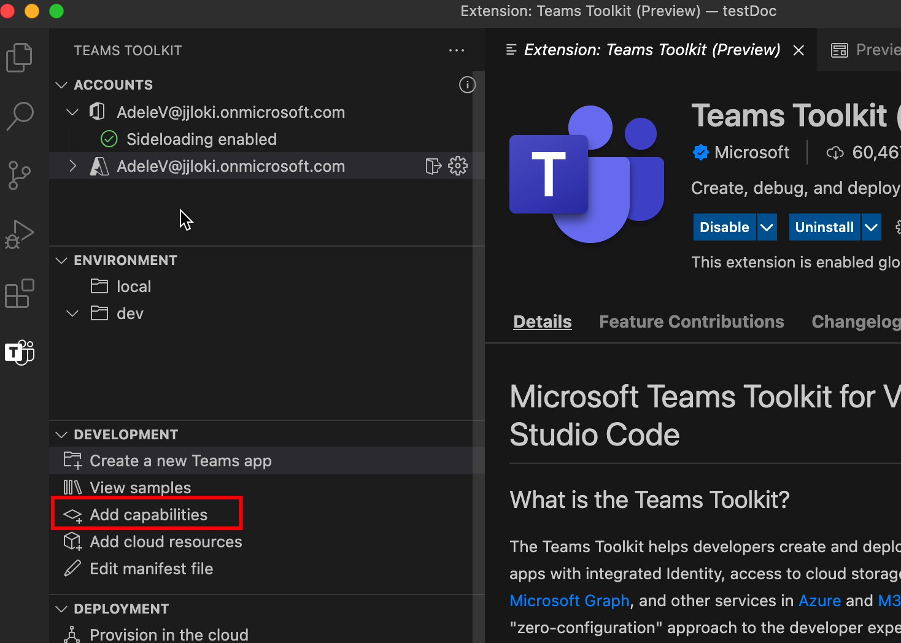
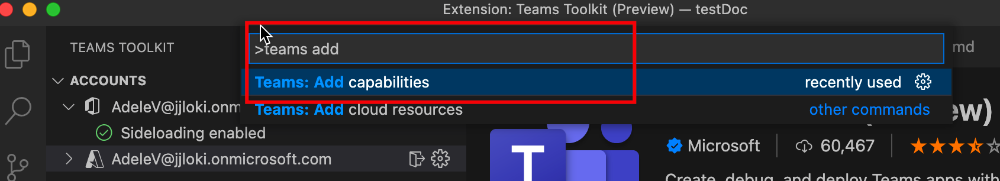
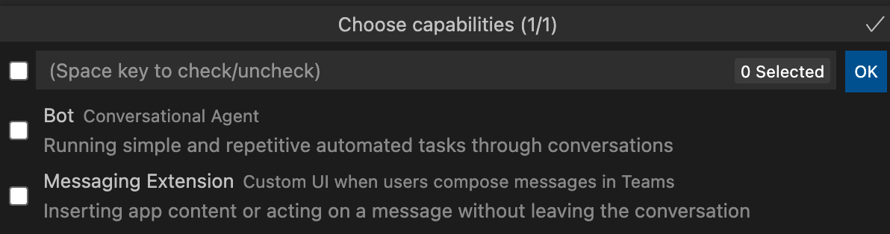

# Add capabilities to your Teams apps

You can create a new Teams app with one of the Teams app capabilities. During app development, you can use Teams Toolkit to flexibly add more capabilities to your Teams app. The following table describes the Teams app capabilities:

|**Capability**|**Description**|
|--------|-------------|
| Tabs |  Tabs are simple HTML tags that point to domains declared in the app manifest. You can add tabs as a part of channel inside a team, group chat, or personal app for an individual user.|
| Bots |  Bots help to interact with your web service through text, interactive cards, and task modules.|
| Messaging extensions | Messaging extensions help to interact with your web service through buttons and forms in the Microsoft Teams client.|

## Prerequisite

* [Install Teams Toolkit](https://marketplace.visualstudio.com/items?itemName=TeamsDevApp.ms-teams-vscode-extension) version v3.0.0+.

> [!TIP]
> You should already have a Teams app project opened in VS code.

## Add capabilities using Teams Toolkit

> [!IMPORTANT]
> You need to perform provision for each environment after you successfully add capabilities to your Teams app.

1. Select **Teams Toolkit** from left panel:

    
  
1. Select **Add capabilities**:

    

      You can also open the command palette and enter **Teams: Add Capabilities**: 
      
    

1. From the pop-up, select the capabilities to include into your project:

    

1. Select **OK**.

The selected capabilities are succesfully added to your project. The Teams Toolkit generate source code for newly added capabilities.

## Add capabilities Using TeamsFx CLI in Command Window

1. Change directory to your **project directory**.
1. Execute the following command to add different capabilities to your project:

   |Capability and Scenario| Command|
   |-----------------------|----------|
   |To add a tab|`teamsfx capability add tab`|
   |To add a bot|`teamsfx capability add bot`|
   |To add a messaging extension|`teamsfx capability add messaging-extension`|

## Supported capabilities matrix

Apart from the capabilities your Teams app already have, you can choose to add different capabilities to your Teams app.The following table gives various supported Teams app capabilities: 

|Existing capabilities|Other capabilities can be added|
|--------------------|--------------------|
|Tabs with SPFx|None|
|Tabs with Azure|Bots and messaging extensions|
|Bots|Tabs|
|Messaging extensions|Tabs|
|Tabs and bots|None|
|Tabs and messaging extensions|None|
|Tabs, bots, and messaging extensions|None|

## What happens when you add capabilities

After adding bot and messaging extension, the following changes in your project are:

- A bot template code is added into a subfolder with path `yourProjectFolder/bot`. This includes a "hello world" bot application template into your project.
- `launch.json` and `task.json` under `.vscode` folder are updated. This includes necessary scripts for Visual Studio Code is executed when you want to debug your application locally. 
- `manifest.remote.template.json` and `manifest.local.template.json` file under `templates/appPackage` folder are updated. This includes bot related information in the manifest file that represents your application in the Teams Platform. The change includes:
  - The ID of your bot.
  - The scopes of your bot.
  - The commands that hello world bot application can respond to.
- Files under `templates/azure/teamsfx` will be updated, and templates/azure/provision/xxx.bicep 	file will be regenerated.
- File under `.fx/config` are regenerated. This ensures your project set with right configurations for newly added capability.

After added tab, the following changes in your project are:

- A frontend tab template code is added into a subfolder with path `yourProjectFolder/tab`. This includes a "hello world" tab application template into your project.
- `launch.json` and `task.json` under `.vscode` folder are updated. This includes necessary scripts for Visual Studio Code is executed when you want to debug your application locally. 
- `manifest.remote.template.json` and `manifest.local.template.json` file under `templates/appPackage` folder are updated. This includes tab-related information in the manifest file that represents your application in the Teams Platform, the changes include:
  - The configurable and static tabs.
  - The scopes of the tabs.
- Files under `templates/azure/teamsfx` will be updated, and templates/azure/provision/xxx.bicep 	file will be regenerated.
- File under `.fx/config` are regenerated. This ensures your project set with right configurations for newly added capability.

## Limitations

The following are the limitations with TeamsFx when adding more capabilities:

- Each project capability cannot be added more than once
- Cannot add bot capabilities if your project contains messaging extension
- Cannot add messaging extension if your project contains a bot.

> [!NOTE]
> If you want to include both bot and messaging extension capabilities, then select them at the same time. You can only add them either when you create a new project or a tab application.

## See also

> [!div class="nextstepaction"]
> [Provision cloud resources](provision.md)

> [!div class="nextstepaction"]
> [Create new Teams project](create-new-project.md)
