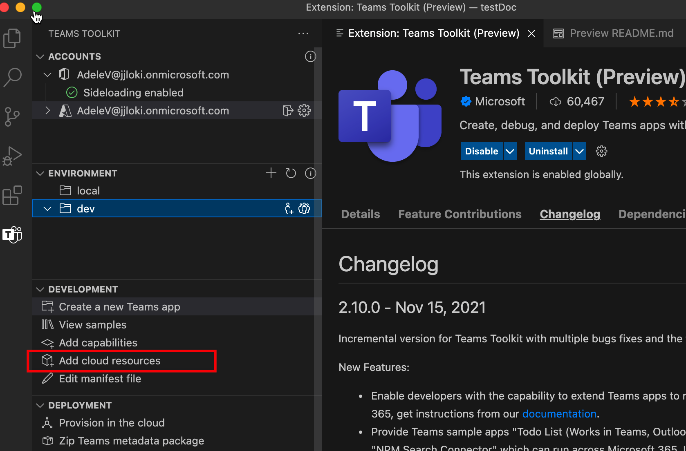
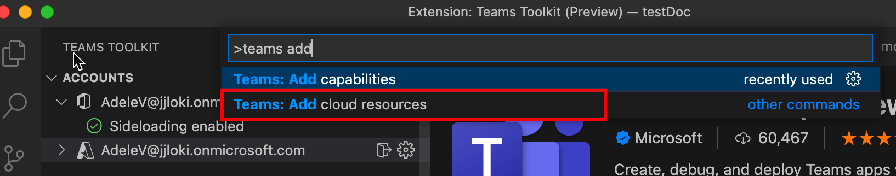

# Add Cloud Resources to Your Teams App

TeamsFx can help to provision cloud resources for your application hosting. You can also optionally add more cloud resources that fits your development needs.

## Prerequisite

- [Install Teams Toolkit](https://marketplace.visualstudio.com/items?itemName=TeamsDevApp.ms-teams-vscode-extension) version v3.0.0+.
- You should already have a Teams app project.

## Add cloud resources using Teams Toolkit

> [!IMPORTANT]
> You need to provision each environment again after you added resource.

1. Open **Visual Studio Code**.
1. Select **Teams Toolkit** from left panel.

    

1. In the Teams Toolkit side bar panel, select `Add cloud resources` option.

    

    You can also open the command palette and enter **Teams: Add cloud resources**. Follow the same process as it’s triggered from Tree View.

    

1. From the pop-up, select any cloud resources you want to add to your Teams app project.

     

1. Select **OK** and you are done.

## Add cloud resources using TeamsFx CLI in Command Window

1. Change directory to your project directory.
1. Execute command to add different capabilities.

The following table describes cloud resources and the corresponding commands to add them:

|Cloud Resources|Command|
|---------------|----------|
| Azure functions|`teamsfx resource add azure-function --function-name your-func-name`|
| Azure SQL database|`teamsfx resource add --function-name your-func-name`|
| Azure API management|`teamsfx resource add azure-apim`|

## What cloud resources can be added

TeamsFx provides seamless integrations with Azure services that are common for the following application scenarios:

- [Azure functions](/azure/azure-functions/functions-overview): A serverless solution to meet your on-demand requirements, such as creating web APIs for your Teams applications’ backend.
- [Azure SQL database](/azure/azure-sql/database/sql-database-paas-overview): A fully managed platform as a service (PaaS) database engine to serve as your Teams applications’ data store.
- [Azure API management](/azure/azure-sql/database/sql-database-paas-overview): An API gateway that can be used to administer APIs created for Teams applications’ and publish them to consume on other applications, such as Power Apps.

## What happens when add resources

Following changes will happen to your project when you add any resources:

- New parameters may be added to azure.parameter.{env}.json to provide required information for provision.
- New content are appended to ARM template under `templates/azure` folder (except files under `templates/azure/teamsfx` folder) to create the added Azure resources.
- Files under `templates/azure/teamsfx` folder are regenerated to ensure TeamsFx required configuration are up-to-date for added Azure resources.
- `.fx/projectSettings.json` is updated to track the resources present in your project.

In the meanwhile, there're some additional changes for each kind of resource:

|Resources Added|What changed|Why these changes are made|
|---------------|---------------|-----------------------------|
|Azure Functions|An Azure Functions template code are added into a subfolder with path `yourProjectFolder/api`  `launch.json` and `task.json` updated under `.vscode` folder.| Include a hello world http trigger template into your project.   To include necessary scripts for Visual Studio Code is executed when you want to debug your application locally.|
|Azure API Management|An Open API Specification file added into a subfolder with path `yourProjectFolder/openapi`|This is the API specification file defines your API after publishing.|

## Limitation / Notes

Following limitations are present in current TeamsFx tooling:

- You can only add 1 Function App / Azure SQL Database / APIM Service to your project
- You cannot add resources if your project does not contain tab app

## See Also

> [!div class="nextstepaction"]
> [Provision cloud resources](provision.md)
