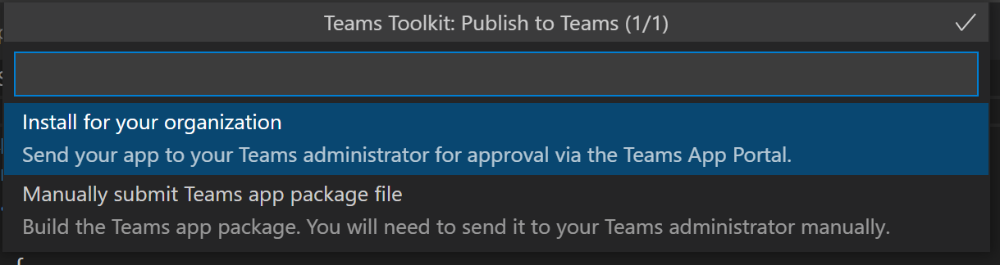

# Publish Teams apps using Teams Toolkit

After creating the app, you can distribute your app to different scope, such as individual, team, organization, or anyone. The distribution depends on multiple factors, including needs, business and technical requirements, and your goal for the app. Distribution to different scope may need different review process. In general, the bigger the scope, the more review the app needs to go through for security and compliance concerns.

## Prerequisite

* [Install Teams Toolkit](https://marketplace.visualstudio.com/items?itemName=TeamsDevApp.ms-teams-vscode-extension) version v3.0.0+.

> [!TIP]
> Ensure you have Teams app project in VS code.

## Publish to individual scope or sideload permission

The users can add custom app to Teams by uploading an app package in a *.zip file directly to a team or in personal context. Adding a custom app by uploading an app package is known as sideloading and allows you to test app while being developed, before the app is ready to be widely distributed as mentioned in the following scenarios:

* Test and debug an app locally.
* Build an app for yourself, such as to automate a workflow.
* Build an app for small set of users, such as, your work group.

You can build an app for internal use only and share it with your team without submitting it to the Teams app catalog in the Teams app store.

**To build your app to *.zip app package file**

You can build the app package by selecting `Zip Teams metadata package` from **DEPLOYMENT** in Treeview of Teams Toolkit. You need to run `Provision in the cloud` first. The generated app package will be located in `{your project folder}/build/appPackage/appPackage.{env}.zip`.

Perform the following steps to upload app package:

1. In the Teams client, select **Apps** in left bar.
2. Select **Manage your apps**.
3. Select **publish an app**

   :::image type="content" source="../assets/images/teams-toolkit-v2/teams toolkit fundamentals/pub.png" alt-text="publish":::

4. Select **Upload a custom app**:

   :::image type="content" source="../assets/images/teams-toolkit-v2/teams toolkit fundamentals/uplo.png" alt-text="upload":::

## Publish to your organization

When the app is ready for use in production, you can submit the app using the Teams app submission API, called from Graph API, an integrated development environment (IDE) such as Microsoft Visual Studio Code installed with Teams toolkit. You can either select **Publish to Teams** from **DEPLOYMENT** in TreeView of Teams Toolkit, or trigger **Teams: Publish to Teams** from command palette. Then select **Install for your organization**:

The app is available on the **Manage apps** of Microsoft Teams admin center, where you, and the admin, can review and approve it.

As an admin, **Manage apps** in the [Microsoft Teams admin center](https://admin.teams.microsoft.com/policies/manage-apps) is where you can view and manage all Teams apps for your organization. You can see the org level status and properties of apps, approve or upload new custom apps to your organization's app store, block or allow apps at the org level, add apps to teams, purchase services for third-party apps, view permissions requested by apps, grant admin consent to apps, and [manage org wide app settings](https://admin.teams.microsoft.com/policies/manage-apps).

Teams toolkit for Visual Studio Code built on top of the Teams App Submission API and it allows you to automates the submission-to-approval process for custom apps on Teams.

> [!NOTE]
> The app doesn't publish to your organization's app store yet. The step submits the app to the Microsoft Teams admin center where you can approve it for publishing to your organization's app store.

## Admin approval for Teams apps

The admin of your Teams tenant can then go to the **Manage apps** in the Microsoft Teams admin center, in the left navigation, go to Teams apps > Manage apps. You can view into all Teams apps for your organization. In the Pending approval widget at the top of the page lets you know when a custom app is submitted for approval.
In the table, a newly submitted app automatically publish the status of submitted and blocked apps. You can sort the publishing status column in descending order to find the app:

 :::image type="content" source="../assets/images/teams-toolkit-v2/teams toolkit fundamentals/admin-approval-for-teams-app-1.png" alt-text="approval":::

Select the app name to go to the app details page. On the About tab, you can view details about the app, including description, status, and app ID:

 :::image type="content" source="../assets/images/teams-toolkit-v2/teams toolkit fundamentals/about-submitted-app-1.png" alt-text="submitted app":::

Perform the following steps to publish the app :

1. In the left navigation of the Microsoft Teams admin center, go to Teams apps > **Manage apps**.
2. Select the app name to go to the app details page, and then in the status box, select **Publish**.
After you publish the app, the publishing status changes to published and the status automatically changes to allowed.

## Publish to Microsoft store

You can distribute your app directly to the store inside Microsoft Teams and reach millions of users around the world. If your app is also featured in the store, you can instantly reach potential customers. The apps published to the Teams store also automatically list on Microsoft AppSource, which is the official marketplace for Microsoft 365 apps and solutions.

For more information, see ([Publish your app to the Microsoft Teams store](../concepts/deploy-and-publish/appsource/publish.md#publish-your-app-to-the-microsoft-teams-store)).

## See also

* [Manage multiple environments](TeamsFx-multi-env.md)
* [Collaborate with other developers on Teams project](TeamsFx-collaboration.md)
