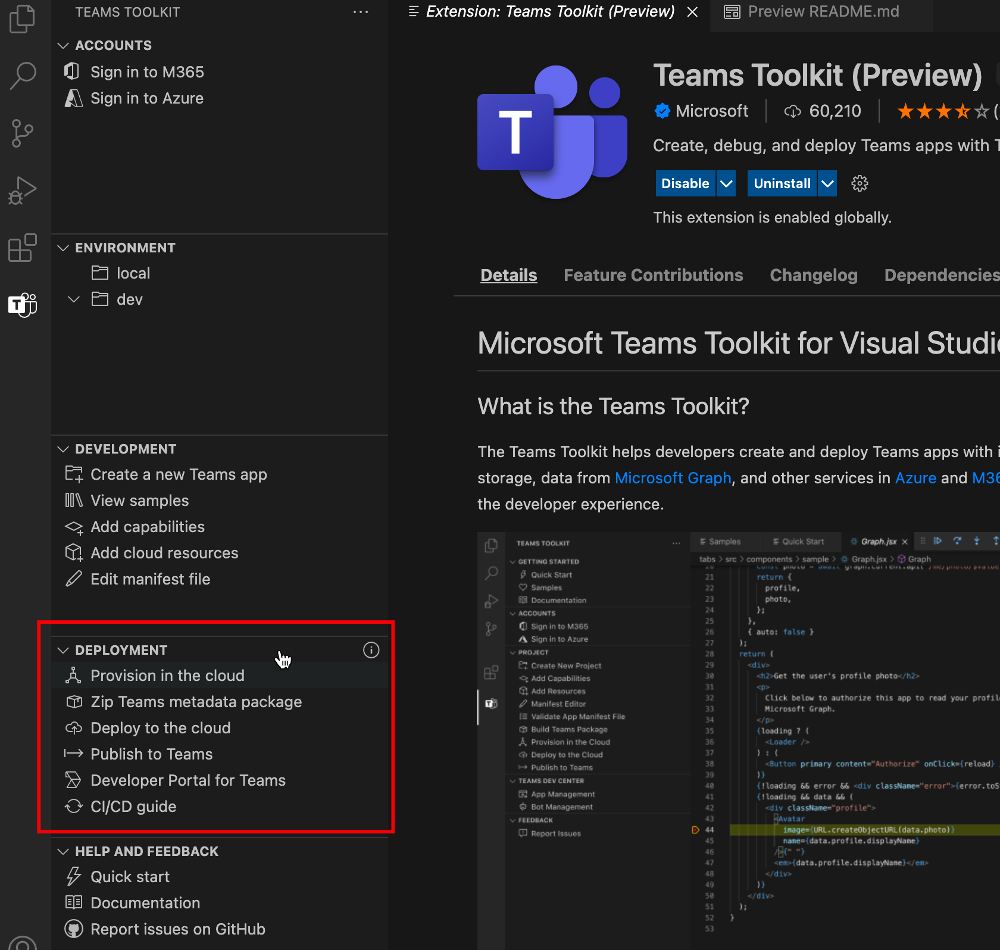

# Teams Toolkit

> [!NOTE]
> Currently, this feature is available in **public developer preview** only.

Teams Toolkit for Visual Studio Code helps you to create and deploy Teams apps with integrated identity, access to cloud storage, data from Microsoft Graph, and other services in Azure and Microsoft 365 with zero-configuration approach. For Teams app development, similar to Teams Toolkit for Visual Studio, you can use [CLI tool](https://github.com/OfficeDev/TeamsFx/blob/dev/docs/cli/user-manual.md), which consists of Toolkit `teamsfx`.

## Install Teams Toolkit for Visual Studio Code

1. Open **Visual Studio Code.**
1. Select the Extensions view (**Ctrl+Shift+X** / **⌘⇧-X** or **View > Extensions**):

   :::image type="content" source="../assets/images/teams-toolkit-v2/teams toolkit fundamentals/install toolkit-1.png" alt-text="Select Extensions View":::

1. Enter **Teams Toolkit** in the search box:

   :::image type="content" source="../assets/images/teams-toolkit-v2/teams toolkit fundamentals/install toolkit-2.png" alt-text="Teams Toolkit":::
   
1. Select **install**:
  
   :::image type="content" source="../assets/images/teams-toolkit-v2/teams toolkit fundamentals/install.png" alt-text="install toolkit":::

> [!TIP]
> You can install Teams Toolkit from [Visual Studio Code Marketplace](https://marketplace.visualstudio.com/items?itemName=TeamsDevApp.ms-teams-vscode-extension).

## Teams apps capabilities

[Microsoft Teams app capabilities](../concepts/capabilities-overview.md) are Teams extensibility points. Teams Toolkit for Visual Studio Code supports you to work on project with the following Teams app capabilities:

* [Tabs](../tabs/what-are-tabs.md#build-tabs-for-microsoft-teams)
* [Bots](../bots/what-are-bots.md#bots-in-microsoft-teams)
* [Messaging extensions](../messaging-extensions/what-are-messaging-extensions.md#messaging-extensions) 

You can select required capabilities to create Teams app. Your Teams project can contain either one of the capabilities or all three capabilities from above. You can select any of the required capability when you create the Teams Project:

:::image type="content" source="../assets/images/teams-toolkit-v2/teams toolkit fundamentals/select capabilities.png" alt-text="select":::

You can add more capabilities if required for Teams app development by selecting **Add capabilities**:

:::image type="content" source="../assets/images/teams-toolkit-v2/teams toolkit fundamentals/add capabilities.png" alt-text="add":::

## User journey of Teams Toolkit

Teams Toolkit provides features of Teams app development to make it easy to debug, deploy, and publish. It automates manual work and provides great integration of Teams and Azure resources. The following image shows Teams Toolkit user journey:

## Take a tour of Teams Toolkit for Visual Studio Code

After Toolkit installation, you will see the Teams Toolkit UI with limited functionalities as shown in following image:

:::image type="content" source="./images/teams-toolkit-beforestart.png" alt-text="Before start Teams Toolkit":::

You can select **Quick Start** to explore the Teams Toolkit, or select **Create a new Teams App** to create one Teams project. If you have a Teams Project created by Teams Toolkit v2.+ opened in VS Code, you will see Teams Toolkit UI with all functionalities as shown in the following image:

:::image type="content" source="./images/teams-toolkit-overview.png" alt-text="Take a tour to Teams Toolkit":::

Let's take a tour of the topics covered in this document:

* [Accounts](#accounts)

* [Environment](#environment)

* [Development](#development)

* [Deployment](#deployment)

* [Help and Feedback](#help-and-feedback)

### Accounts

Developers must have a Microsoft 365 account to build Teams app. If you don't have one, you can get free Teams developer account by joining the [Microsoft 365 developer program](https://developer.microsoft.com/microsoft-365/dev-program):

:::image type="content" source="../assets/images/teams-toolkit-v2/manual/accounts.png" alt-text="Account in toolkit":::

Azure account is commonly used in Teams app development. If you wish to host your Teams app or access resources on Azure, you must have an Azure account. Teams Toolkit support integrated experience to sign in, provision and deployment for Azure resources. You can [create a free Azure account](https://azure.microsoft.com/free/) before you start.

 For more information, see  [prepare accounts to build Teams app](accounts.md)

### Environment

Teams Toolkit helps you to manage multiple environments. You can add, configure, and customize environments. You can choose to add collaborators for each environment:

:::image type="content" source="../assets/images/teams-toolkit-v2/manual/environment.png" alt-text="Environment in toolkit":::

For more information, see [manage multiple environments](TeamsFx-multi-env.md) and [collaborate with other developers on Teams project](TeamsFx-collaboration.md).

### Development

Teams Toolkit provides convenience for you to create and customize your Teams app project that makes the Teams app development work easily and quickly: 

:::image type="content" source="../assets/images/teams-toolkit-v2/manual/development.png" alt-text="Development in tookit":::

1. **Create a new Teams app**, helps to start Teams app development work with either a "hello world" template project or a sample project. For more information, see [create new Teams project](create-new-project.md)
1. **View samples**, shows a set of Teams sample apps for you to explore, refer, and develop.
1. **Add capabilities**, helps to add another Teams capabilities to Teams app at any time during development process. For more information, see [add capabilities to your Teams app](add-capability.md)
1. **Add cloud resources**, helps you add additional cloud resources according to the requirement change. For more information, see [add cloud resources for your Teams app](add-resource.md)
1. **Edit manifest file**, helps you to easily edit how the Teams app integrates with Teams client. For more information, see [preview Teams manifest file](TeamsFx-manifest-preview.md) and [edit Teams manifest file](TeamsFx-manifest-customization.md).

### Deployment

During or after the development, you should follow the process to do provision, deployment, and publish Teams app before it is accessible to your users:

1. If you want to host your Teams app on Azure or you need to use Azure resources, **Provision in the cloud** helps you automate the process to create Azure resources. For more information, see [provision cloud resources](provision.md).

1. Before publishing your app or sharing, you can build your Teams app into packages by selecting **Zip Teams metadata package**.

1. **Deploy to the cloud**, helps you to deploy the source code to Azure. The prerequisite to run deploy is to have provisioned resources by running **Provision in the cloud** or you have to create the Azure resources manually and specify the resource parameter in your project environment settings. For more information, see [deploy Teams app to the cloud](deploy.md).

1. Instead of publishing your custom Teams app manually, you can use **Publish to Teams** function to call Teams api to publish Teams app. You need the permission to upload Teams app. For more information, see [publish your app to Teams](publish.md).

1. Developer Portal for Teams is where you can manage and distribute your Teams app. For more information, see [developer portal](/microsoftteams/platform/concepts/build-and-test/teams-developer-portal)

1. Teams Toolkit also provides CI/CD template for CI/CD tools like GitHub workflow, Azure Devops and Jenkins. For more information, see [build CI/CD pipelines for Teams application](use-CICD-template.md)

### Help and Feedback

In this section, you can easily find the documentation and resources you need. You can select **Report issues on GitHub** in the Teams Toolkit to get **Quick support** from product expert. Browse the issue before you create a new one, or visit [StackOverflow tag `teams-toolkit`](https://stackoverflow.com/questions/tagged/teams-toolkit) to browse and ask questions:

:::image type="content" source="../assets/images/teams-toolkit-v2/manual/help and feedback.png" alt-text="Help":::

## See also

> [!div class="nextstepaction"]
> [Create new project use Teams Toolkit](create-new-project.md)

> [!div class="nextstepaction"]
>[Prepare accounts to build Teams apps](accounts.md)
