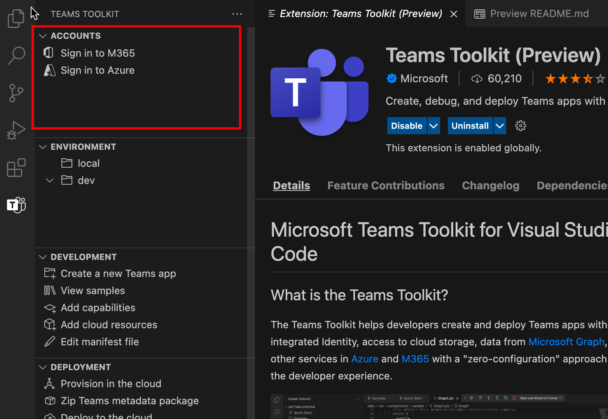

# Teams Toolkit

The Teams Toolkit for Visual Studio Code helps developers create and deploy Teams apps with integrated identity, access to cloud storage, data from Microsoft Graph, and other services in Azure and M365 with a zero-configuration approach to the developer experience.  

There is a Teams Toolkit for Visual Studio and a [CLI tool](https://github.com/OfficeDev/TeamsFx/blob/dev/docs/cli/user-manual.md) for Teams app development (called `teamsfx`).

## Install the Teams Toolkit for Visual Studio Code

1. Open **Visual Studio Code.**

1. Select the Extensions view (**Ctrl+Shift+X** / **⌘⇧-X** or **View > Extensions**).

1. In the search box, enter _Teams Toolkit_.

1. Select install button next to the Teams Toolkit.

Or you can find the Teams Toolkit on the [Visual Studio Code Marketplace](https://marketplace.visualstudio.com/items?itemName=TeamsDevApp.ms-teams-vscode-extension).

## Supported Teams Apps Capabilities

[Understand Microsoft Teams app capabilities](../concepts/capabilities-overview.md) are Teams extensibility points. Your Teams app can contain one or more Teams App Capabilities. Teams Toolkit for Visual Studio Code supports developers to work on project with the following Teams App Capabilities:

* [Tabs](../tabs/what-are-tabs.md#microsoft-teams-tabs)

* [Bots](../bots/what-are-bots.md#bots-in-microsoft-teams)

* [Messaging extensions](../messaging-extensions/what-are-messaging-extensions.md#messaging-extensions)

Your Teams project can contain either one of the capabilities or all three capabilities from above.

You can select any capability when you create the Teams Project.

Teams Toolkit provides flexibility to add more capabilities in further process of Teams app development.

## Typical User Journey of Teams Toolkit

Teams Toolkit provides features of Teams app development to make it easy to debug, deploy and publish. Teams Toolkit automates manual work and provides great integration of Teams and Azure resources. The following picture shows Teams Toolkit user journey:

## Take a Tour of Teams Toolkit for Visual Studio Code

* [ACCOUNTS](#accounts)

* [ENVIRONMENT](#environment)

* [DEVELOPMENT](#development)

* [DEPLOYMENT](#deployment)

* [HELP AND FEEDBACK](#help-and-feedback)

:::image type="content" source="./images/teams-toolkit-overview.png" alt-text="Take a tour to Teams Toolkit":::

### ACCOUNTS

Developers must have a Microsoft 365 account before they start to build Teams app. If you do not have, you can get a free Teams developer account by joining the [M365 developer program](https://developer.microsoft.com/microsoft-365/dev-program).

Azure account is commonly used in Teams app development. If you wish to host your Teams app or access resources on Azure, you must have an Azure account. Teams Toolkit support integrated experience to sign in, provision and deployment for Azure resources. You can [create a free Azure account](https://azure.microsoft.com/free/) before you start.

 More information please refer to [Prepare accounts to build Teams app](accounts.md)

### ENVIRONMENT

Teams Toolkit helps developers to manage multiple environments. Developers can add environments, config and customize environments. And for each environment, you can choose to add collaborators in that environment.

 More information please refer to [Manage multiple environments](TeamsFx-multi-env.md) and [Collaborate with other developers on Teams project](TeamsFx-collaboration.md).

### DEVELOPMENT

Teams Toolkit provides convenience for you to create and customize your Teams app project in the `DEVELOPMENT` section, which makes the Teams app development work easily and quickly.  

1. `Create a new Teams app` lets you to start Teams app development work with either a ""hello world" template project or a sample project. More information please refer to [Create new Teams project](create-new-project.md)
1. `View samples` shows a set of Teams sample apps for you to explore, reference and start development work with.
1. `Add capabilities` lets you to add additional Teams capabilities to Teams app at any time during development process. More information please refer to [Add capabilities to your Teams app](add-capability.md)
1. `Add cloud resources` lets you to add additional cloud resources according to the requirement change.More information please refer to [Add cloud resources for your Teams app](add-resource.md)
1. `Edit manifest file` lets you to easily edit how the Teams app integrate with Teams client. More information please refer to [Preview Teams manifest file](TeamsFx-manifest-preview.md) and [Edit Teams manifest file](TeamsFx-manifest-customization.md).

### DEPLOYMENT

During or after the development, you should follow the process to do provision, deployment and publish Teams app before it is accessible to your users. There is a set of options in `DEPLOYMENT` section which can help you to accomplish the process.

1. If you want to host your Teams app on Azure or you need to use Azure resources, `Provision in the cloud` helps you automate the process to create Azure resources. To use it you must have an Azure Subscription which you can use to provision new resources. More information please refer to [Provision cloud resources](provision.md)

1. Before publishing your app or share it with someone else, you can build your Teams app into packages by clicking `Zip Teams metadata package`.

1. `Deploy to the cloud` helps you to deploy their source code to Azure. The prerequisite to run deploy is you have provisioned resources by running `Provision in the cloud` or you have to create the Azure resources manually and specify the resource parameter in your project environment settings. More information please refer to [Deploy Teams app to the cloud](deploy.md).

1. Instead of manually publishing your custom Teams app, you can use `Publish to Teams` function to call Teams api to publish Teams app. You need the permission to upload Teams app. For more information refer to [Publish your app to Teams](publish.md).

1. Developer Portal for Teams is where you can manage and distribute your Teams app.  

1. Teams Toolkit also provides CI/CD template for CI/CD tools like GitHub Workflow, Azure DevOps and Jenkins. For tools on how to build CI/CD pipeline, see [Build CI/CD pipelines for Teams application](use-CICD-template.md)

### HELP AND FEEDBACK

In this section you can easily find the documentation and resources you need. You can select `Report issue on GitHub` in the Teams Toolkit to get quick support from product expert. Browse the issue before you create a new one, or visit [StackOverflow tag `teams-toolkit`](https://stackoverflow.com/questions/tagged/teams-toolkit) to browse and ask questions.

## See also

> [!div class="nextstepaction"]
> [Create new project use Teams Toolkit](create-new-project.md)

> [!div class="nextstepaction"]
>[Prepare accounts to build Teams apps](accounts.md)
