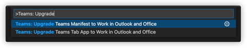
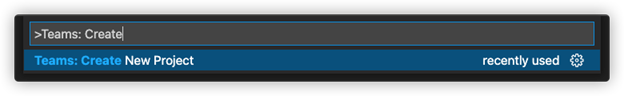
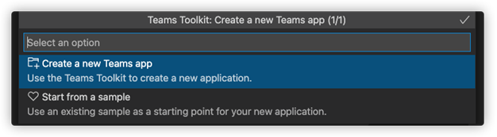
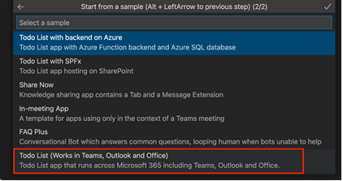

# Upgrade Teams application to work with Outlook and Office.com

Teams Toolkit helps you to upgrade Teams applications to work with Outlook and Office.com. You must upgrade the manifest and `TeamsJS` SDK to the latest version to run the application on Outlook and Office.com:

To extend your Teams applications in Outlook and Office.com, the migration commands in Teams are as follows:

1. Select the command **Teams manifest to extend in Outlook and Office.com** to upgrade manifest and communicate with Office and Outlook:

1. Select the command **Teams JS SDK to extend in Outlook and Office** to upgrade `TeamsJS` to the latest version.

> [!NOTE]

> * Upgrading manifest file is required, but upgrading `TeamsJS` to latest version is optional, if you have already installed `TeamsJS` SDK in your application.
> * If you have both `TeamsFx` and `TeamsJS` SDK packages in your Teams application,`TeamsFx` SDK is not currently compatible with the latest version (beta version) of `TeamsJS` SDK package. It can cause functional damage to your application when running in Outlook and Office.com.
> * If some functions are not working in Outlook or Office.com, remove `TeamsFx` packages from your application or don't upgrade `TeamsJS` SDK to latest version.

## Prerequisite

Install the latest version of Teams Toolkit from Visual Studio Code extension in [Teams Toolkit (Preview) - Visual Studio Marketplace](https://marketplace.visualstudio.com/items?itemName=TeamsDevApp.ms-teams-vscode-extension).

The following are the prerequisites to upgrade manifest and `TeamsJS` client SDK:

### Upgrade manifest

Run the command `upgrade Teams manifest` to work in Outlook and Office.com and select Teams Tab app manifest file to migrate:

1. `update manifest` version to use the latest `m365DevPreview` schema.
1. `update manifest` file to use the latest `DevPreview` schema.

To know more about the required manifest schema and version, see [Developer Preview manifest schema](/microsoftteams/platform/resources/schema/manifest-schema-dev-preview)

### Upgrade Teams JavaScript Client SDK

Run the command `Teams: Upgrade Teams JS SDK to extend in Outlook and Office` and select Teams app project to migrate:

1. Update `TeamsJS SDK` to the latest beta version.
1. Update function references, `Enum` and interface references.
1. Add `TODO` comments to finish change callbacks manually.

    > [!TIP]

    > * Changing callbacks alters control flow. This code will have `TODO` comments for your review. 
    > * The typical solution is to make parent function `async` and use `await`.

1. Add `TODO` in places where you get changes to the context schema.

## Run your Teams application in Outlook and Office.com

After upgrading you can run Teams application in Outlook and Office.com.

### Prerequisites

The following are the steps to Test your application in Outlook and Office.com by uploading your application through Teams client:

1. Push code changes to the server to host your application.
1. Move application to a zip folder.
1. Go to Teams client and select **Apps**.
1. Select **Upload a custom app** and select your application's zip folder.
1. Select **Add** on app details to install the application.

Teams install and launch your app. You can find your app in **More apps**.

 

## Run Teams application in Outlook

Perform the following steps to preview personal tab apps in Outlook web app and desktop clients:

### Outlook web application

1. Go to https://outlook.office.com 
1. Select the three dots on the bottom left bar.

    

1. Select the name of your app to preview in Outlook web application.

    

### Outlook desktop client

1. Open Outlook desktop client.
1. Select the three dots on the bottom left bar.
1. Select the name of your app to preview it in Outlook Desktop Client.

## Run Teams application in Office.com

Perform the following steps to preview your apps in Outlook web client:

1. Go to www.office.com/m365apps
1. Find apps listed below “M365 Apps”

    

1. Select the name of your app to preview it in office.com

    

## Create a sample application with Teams Toolkit and Run it in Outlook and Office.com

Perform the following steps to create a new tab app using Teams Toolkit and run it in Outlook and Office.com:

1. Create a new Teams app in Visual Studio Code with Teams Toolkit, use command palette and run `create new project` and select **Create a new Teams app**.

    

    

1. Select **Todo List (Works in Teams, Outlook and Office)** in the next window and click **OK**. 

    

This step will create a sample application. Once the project has been successfully created:

1. Select **Provision in the cloud**.

    

1. Select **Deploy to the cloud**.

    

1. Select **Teams:Zip Teams metadata package**.

    
