# Upgrade Teams application to work with Outlook and Office.com

> [!NOTE]
> This feature is currently available in Developer preview only.

Teams Toolkit helps you to upgrade Teams applications to work with Outlook and Office.com. To extend your Teams applications in Outlook and Office.com, the migration commands in Teams are as follows:

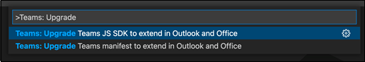

1. Use the command **Teams: Upgrade Teams manifest to support Outlook and Office apps** to upgrade manifest to the latest version.

1. Use the command **Teams: Upgrade Teams JS SDK references to support Outlook and Office apps** to upgrade `TeamsJS` SDK to the latest version.

> [!NOTE]
> To extend your Teams application in Outlook and Office.com, upgrading manifest file is required. However, it's optional for you to upgrade the `TeamsJS` SDK, as the old version continues to work.

> [!IMPORTANT]
> If you have both `TeamsFx` and `TeamsJS` SDK packages in your Teams application and you have upgraded `TeamsJS` SDK to `2.0.0-beta.0` or higher, you need to change `TeamsFx` version to `0.3.1-beta.0` or higher in your `package.json` file to avoid version conflicts.

## Prerequisites

1. Install `2.10.0` or a higher version of Teams Toolkit from Visual Studio Code extension in [Teams Toolkit (Preview) - Visual Studio Marketplace](https://marketplace.visualstudio.com/items?itemName=TeamsDevApp.ms-teams-vscode-extension).
1. [Set up your dev environment](msteams-platform/m365-apps/prerequisites.md)

The following are the steps to upgrade manifest and `TeamsJS` client SDK:

## Upgrade manifest

1. From Visual Studio Code, open command platte (Ctrl+Shift+P / ⌘⇧-P).
1. Type: `Teams: Upgrade Teams manifest to support Outlook and Office apps` in the search box.
1. Select Teams app manifest file.

This command will:

* Update manifest version to use the latest `m365DevPreview` version.
* Update manifest file to use the latest `DevPreview` schema.

To know more about the required manifest schema and version, see [Developer Preview manifest schema](/microsoftteams/platform/resources/schema/manifest-schema-dev-preview)

## Upgrade Teams JavaScript Client SDK

1. From Visual Studio Code, open command platte (Ctrl+Shift+P / ⌘⇧-P).
1. Type: `Teams: Upgrade Teams JS SDK references to support Outlook and Office apps` in the search box.
1. Select Teams app project folder.

This command will:

[!div class="checklist"]
* `package.json` references to TeamsJS SDK Preview
* Import statements for TeamsJS SDK Preview
* [Function](msteams-platform/m365-apps/using-teams-client-sdk-preview.md#functions) references for TeamsJS SDK Preview
* [Enum](msteams-platform/m365-apps/using-teams-client-sdk-preview.md#enums) and [Interface](msteams-platform/m365-apps/using-teams-client-sdk-preview.md#interfaces) references for TeamsJS SDK Preview
* `TODO` comment reminders to review areas that might be impacted by [Context](msteams-platform/m365-apps/using-teams-client-sdk-preview.md#context-interface) interface changes
* `TODO` comment reminders to ensure [conversion to promises functions from callback style functions](msteams-platform/m365-apps/using-teams-client-sdk-preview.md#callbacks-converted-to-promises) has gone well at every call site the tool found

> [!IMPORTANT]
> Be sure to review any of the `TODO` items deposited by the tool.

## Run your Teams application in Outlook and Office.com

After upgrading you can run Teams application in Outlook and Office.com.

### Upload and run your application in Teams

The following are the steps to Test your application in Outlook and Office.com by uploading your application through Teams client:

1. Push code changes to the server to host your application.
1. Move application to a zip folder.
1. Go to Teams client and select **Apps**.
1. Select **Upload a custom app** and select your application's zip folder.
1. Select **Add** on app details to install the application.

Teams install and launch your app. You can find your app in **More apps**.

 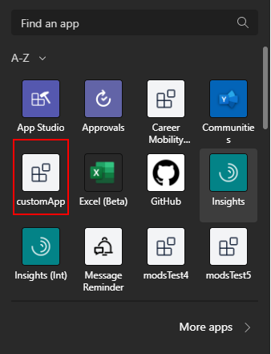

## Run Teams application in Outlook

Perform the following steps to preview personal tab apps in Outlook web app and desktop clients:

### Outlook web application

1. Go to https://outlook.office.com
1. Select the three dots on the bottom left bar.

    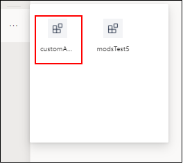

1. Select the name of your app to preview in Outlook web application.

    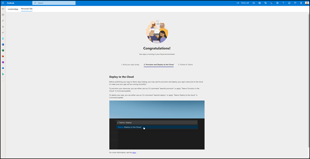

### Outlook desktop client

1. Open Outlook desktop client.
1. Select the three dots on the bottom left bar.

     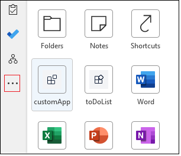

1. Select the name of your app to preview it in Outlook Desktop Client.

     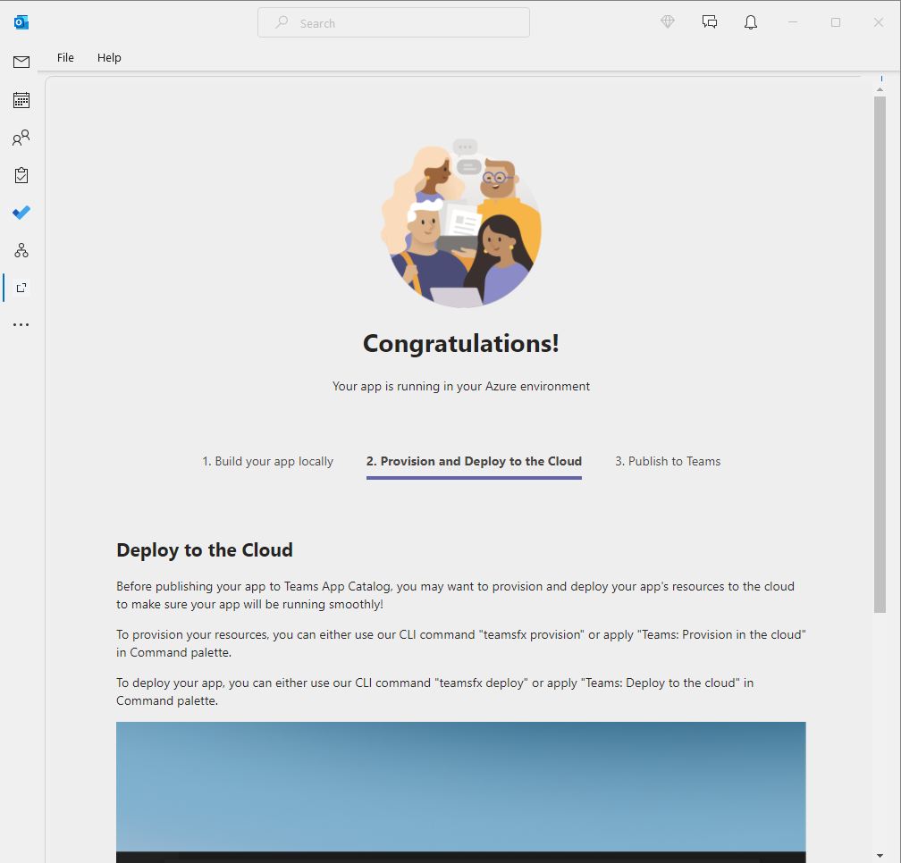

## Run Teams application in Office.com

Perform the following steps to preview your apps in Outlook web client:

1. Go to www.office.com
1. Select the three dots on the bottom left bar.

    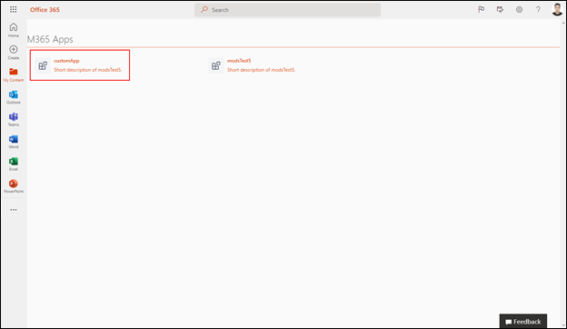

1. Select the name of your app to preview it in office.com

    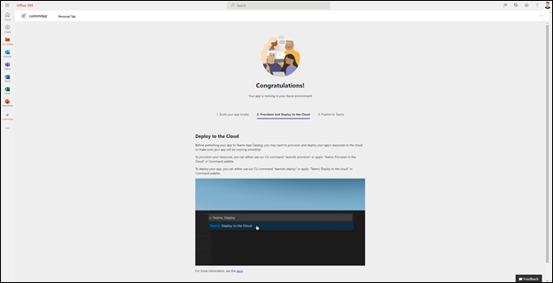

## Create a sample application with Teams Toolkit and Run it in Outlook and Office.com

Perform the following steps to create a new tab app using Teams Toolkit and run it in Outlook and Office.com:

1. Create a new sample Teams app in Visual Studio Code with Teams Toolkit, use command palette and run `Teams: Create a new Teams app` and select **Start from a sample**.

    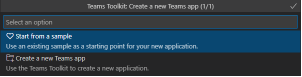

1. Select **Todo List (Works in Teams, Outlook and Office)** or **NPM Search Connector** in the next window and click **OK**.

    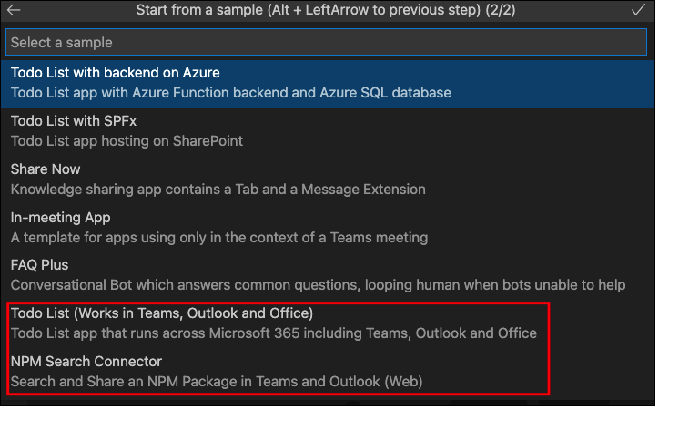

    This step will create a sample application. Once the project has been successfully created:

1. Select **Provision in the cloud**.

    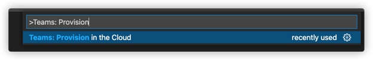

1. Select **Deploy to the cloud**.

    

1. Select **Teams:Zip Teams metadata package**.

    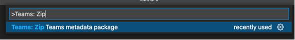
1. Follow the `README` file in the sample application project to run the application in Outlook and Office.com.

## See also

[Placeholder for see also links]