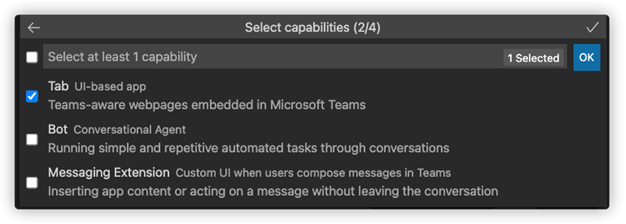
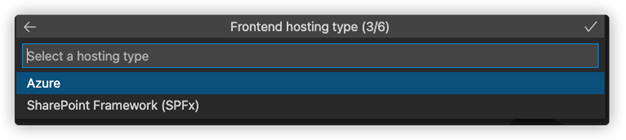
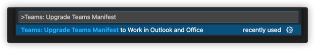
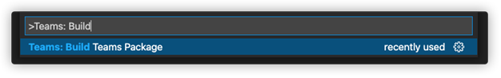

# Upgrade Teams application to work with Outlook and Office.com

Teams Toolkit helps you to upgrade Teams applications to work with Outlook and Office.com. You must upgrade the manifest and `Teams-js` SDK to the latest version to run application on Outlook and Office.com.

## Prerequisite

Install the latest version of Teams Toolkit from Visual Studio Code extension in marketplace: [Teams Toolkit (Preview) - Visual Studio Marketplace](https://marketplace.visualstudio.com/items?itemName=TeamsDevApp.ms-teams-vscode-extension).

### Upgrade manifest and SDK

In the Visual Studio Code command palette find following commands:

1. `upgrade Teams manifest` to work in Outlook and Office
1. `upgrade Teams tab` app to work in Outlook and Office

### Upgrade manifest

Run the command `upgrade Teams manifest` to work in Outlook and Office.com and select Teams Tab app manifest file to migrate:

1. `update manifest` version to use the latest `m365DevPreview` schema.
1. `update manifest` file to use the latest `DevPreview` schema.

### Upgrade custom tab

Run the command `upgrade Teams tab` app to work in Outlook and Office.com and select Teams tab app project to migrate:

1. Update `Teams-js` SDK to the latest beta version.
1. Update function references, `Enum` and interface references.
1. Add `TODO` comments to finish change callbacks manually.
1. Add `TODO` in places where you get changes to the context schema.

    > [!TIP]
    > Changing from callbacks alters control flow and cannot be fully automated. This code will have `TODO` comments for developers review. The typical solution is to make parent function `async` and use `await` next to each promise.

1. Add `TODO` in places where get changes to the context schema.

    > [!TIP]
    > Transforming JavaScript inline within HTML is not supported.

## Run your Teams application in Outlook and Office.com

After upgrading your Teams application, you can run them in Outlook and Office.com.

### Prerequisites

The following are the steps to Test your application in Outlook and Office.com by uploading your application through Teams client:

1. Push code changes to the server to host your application.
1. Move application to a zip folder.
1. Go to Teams client and select **Apps**.
1. Select **Upload a custom app** and select your application's zip folder.
1. Select **Add** on app details to install the application.

Teams install and launch your app. You can find your app in **More apps**.

## Run Teams application in Outlook

Perform the following steps to preview personal tab apps in Outlook web app and desktop clients:

### Outlook web application

1. Go to https://outlook.office.com 
1. Select the three dots on the bottom left bar.

    

1. Select the name of your app to preview in Outlook web application.

    

### Outlook desktop client

1. Open Outlook desktop client.
1. Select the three dots on the bottom left bar.
1. Select the name of your app to preview it in Outlook Desktop Client.

## Run Teams application in Office.com

Perform the following steps to preview your apps in Outlook web client:

1. Go to www.office.com/m365apps
1. Find apps listed below “M365 Apps”

    

1. Select the name of your app to preview it in office.com

    

## Create a custom tab app with Teams Toolkit and run it in Outlook and Office.com

The following steps to create a new tab app using Teams Toolkit and run it in Outlook and Office.com:

1. Create a new Teams app in Visual Studio Code with Teams Toolkit, use command palette and run create new project and select **Create a new Teams app**.

    

    

1. Select **Tab** in the next window and click **OK**.

    

1. Select **Azure** as hosting type.

    

1. Choose any cloud resource, programming language, project location and a name to create your project.

Once the project is created perform the following steps:

1. Open command palette and run: `Teams: Upgrade Teams Manifest to Work in Outlook and Office`.

    

1. Provision your app in the cloud.

    

1. Deploy your app to cloud.

    

1. Create a zip folder for your app package.

    

Follow steps in Run your Teams application in Outlook and Office.com.
