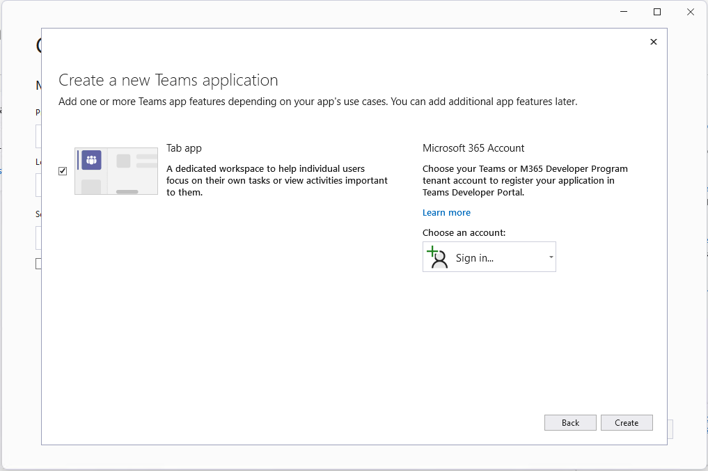

# Teams Toolkit for Visual Studio

Teams Toolkit in Visual Studio allows you to build, test, and develop Teams app in the integrated development environment (IDE). The Teams Toolkit's extension for Visual Studio also allows you to do the following:

* Create new projects for Teams
* Set up apps in the Teams developer portal
* Run and debug app in Teams
* Configure cloud hosting, and use [TeamsFx](https://github.com/OfficeDev/teamsfx) in your Integrated Development Environment (IDE).

## Install Teams Toolkit for Visual Studio

> [!NOTE]
> As a prerequisite, install Visual Studio 2022 17.1 Preview 2 or latest version.

1. Install Visual Studio 2022 17.1 Preview 2 or latest version. For more information see, [Install Visual Studio 2022 Preview](https://visualstudio.microsoft.com/vs/preview/).
2. Open the Visual Studio Installer.
3. Select **Modify** for your existing VS 2022 Preview installation.
4. Select the **ASP.NET and web development** workload.
5. On the right, expand the **ASP.NET and web development** section and select **Microsoft Teams development tools** in the Optional list of components.
6. Select **Install** or **Modify** in the Visual Studio Installer to complete the installation process.

The following image displays the options you must select in the Visual Studio installer:

:::image type="content" source="images/teams-development-tools-vs-installer.png" alt-text="Teams development VS installer" border="true":::

## Create a new project using Visual Studio

Teams Toolkit project templates provide all code, files, and configuration you need to get started with a Teams app project.

The Microsoft Teams App project template allows you to specify a Microsoft 365 account that is required to automatically register and configure your new Teams app.

> [!NOTE]
> If you do not have a Microsoft 365 account, you can sign up for a [Microsoft 365 Developer Program](https://developer.microsoft.com/microsoft-365/dev-program) subscription. It's free for 90 days and renews as long as you are using it for development activity. If you have a Visual Studio Enterprise or Professional subscription, both programs include a free Microsoft 365 [developer subscription](https://aka.ms/MyVisualStudioBenefits), active for the life of your Visual Studio subscription. For more information, see [set up a Microsoft 365 developer subscription](/office/developer-program/office-365-developer-program-get-started).

1. Launch latest version of Visual Studio.
1. Select **Create a new project**.
1. In the **Search for templates** dialog box, select the **Microsoft Teams App** template and select **Next**.
1. Select **Configure your new project** window, add **HelloTeams** in the **Project name** box and select **Create**.
1. In the **Create a new Teams application** window, select or sign in to Microsoft 365 account using the **Choose an account** selector.
1. Select **Create**.

7. Visual Studio opens the new project and Teams Toolkit sets up the new project in Teams Developer Portal. The project is added to  Teams organization, which is linked to the Microsoft 365 account credentials provided by the user.
1. Create a new Azure Active Directory (AD) registration to run the app in Teams.

## Run and debug your app

You can launch your app project running locally from Visual Studio.

1. Open or [create a Teams app project](#create-a-new-project-using-visual-studio).
2. Press **F5** or select **Debug > Start Debugging** in Visual Studio.

Visual Studio will launch your Teams app project in a browser and start debugging.

## Provision your app in cloud

Teams Toolkit allows you to create and configure cloud resources for hosting the app in Azure.

1. Select **Project > Teams Toolkit > Provision in the Cloud**.
2. Select Azure subscription you want to use to create resources with.

## Provision your app in cloud

Teams Toolkit creates Azure resources in the subscription but no code is deployed during this stage. To deploy your project to these new resources:

1. Select the **Project > Teams Toolkit > Deploy in the Cloud** menu.

## Preview your app running from cloud resources

You can run your app in a browser using the remote resources to verify that everything works. It's not possible to debug during in this scenario yet.

1. Select the **Project > Teams Toolkit > Preview Teams app** menu.

Your app will open in a browser and use the resources created by the Provision and Deploy steps.

## Publish your app to Teams

To [Teams Developer Portal](https://dev.teams.microsoft.com/home), you can upload your app to a team, submit your app to your company custom app store for users in your organization, or submit your app to App Source for all Teams users.

* Your IT admin will review these submissions.
* You can return to the **Publish** page to check on your submission status and learn if your app was approved or rejected by your IT admin. This is also where you can submit updates to your app or cancel any currently active submissions.
