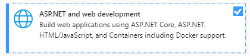
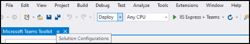

# Build apps with the Teams Toolkit and Visual Studio

The Microsoft Teams Toolkit enables you to create custom Teams apps directly within the Visual Studio integrated development environment (IDE). The Microsoft Teams toolkit guides you through the process and provides everything you need to build, debug, and launch your Teams app.

## Prerequisites

1. [Enable developer preview](../resources/dev-preview/developer-preview-intro.md#enable-developer-preview)

1. Make sure that the **ASP.NET and web development module** has been added to your Visual Studio instance. You can check by following the steps in the [Modify Visual Studio by adding or removing workloads and component](/visualstudio/install/modify-visual-studio?view=vs-2019&preserve-view=true) documentation.

3. If you would like test your app by deploying it from Visual Studio, you'll need to have IIS (Internet Information Services) installed in your development environment. Visual Studio does not include IIS and it isn't included in the default Windows 10, Windows 8, or Windows 7 configuration; however, you can download the latest version from the [Microsoft download center](https://www.microsoft.com/download/details.aspx?id=48264).

## Install the Teams Toolkit

The Microsoft Teams Toolkit for Visual Studio is available for download from the [Visual Studio Marketplace](https://marketplace.visualstudio.com/items?itemName=TeamsDevApp.vsteamstemplate) or directly from the **Extensions** menu within Visual Studio.

## Using the toolkit

- [Set up a new project](#set-up-a-new-teams-project)
- [Configure your app](#configure-your-app)
- [Package your app](#package-your-app)
- [Run your app in Teams](#install-and-run-your-app-locally)
- [Validate your app](#validate-your-app)
- [Publish your app](#publish-your-app-to-teams)

## Set up a new Teams project

1. Select **Create a new project**.
1. Choose **Microsoft Teams App** and select **Next**.
1. You will arrive at the **Configure your new project** screen where you can choose the **Project name**, **Location**, and **Solution name**.
1. Check the box labeled **Place solution and project in the same directory**.
1. A pop-up window labeled **Add Capabilities** will allow you to choose one or more capabilities for your project setup.
1. Select the **Next** button to complete the configuration process.
1. A pop-up window labeled **Add Capabilities** will allow you to choose the properties for each selected capability.
1. Select **Finish** and you will  land on the **Microsoft Teams Toolkit** landing page.

## Configure your app

At its core, the Teams app embraces three components:

  1. The Microsoft Teams client (web, desktop or mobile) where users interact with your app.
  1. A server that responds to requests for content that will be displayed in Teams, e.g., HTML tab content or a bot adaptive card .
  1. A Teams [app package](/concepts/build-and-test/apps-package.md) consisting of three files:

  > [!div class="checklist"]
  >
  > - The manifest.json
  > - A [color icon](../resources/schema/manifest-schema.md#icons) for your app to display in the public or organization app catalog
 > - An [outline icon](../resources/schema/manifest-schema.md#icons) for display on the Teams activity bar.

When an app is installed, the Teams client parses the manifest file to determine needed information like the name of your app and the URL where the services are located.

> [!NOTE]
>If you haven't done so already, you will need to sign in to your Microsoft 365  or account to continue with the development process.
>
> If you don't have a Microsoft 365 account, you can sign up for a [Microsoft 365 Developer Program](https://developer.microsoft.com/microsoft-365/dev-program) subscription. It's *free* for 90 days and will continually renew as long as you're using it for development activity. If you have a Visual Studio *Enterprise* or *Professional* subscription, both programs include a free Microsoft 365 [developer subscription](https://aka.ms/MyVisualStudioBenefits), active for the life of your Visual Studio subscription. *See* [Set up a Microsoft 365 developer subscription](https://docs.microsoft.com/office/developer-program/office-365-developer-program-get-started).
>

### Configuration steps

1. To configure your app, on the **Microsoft Teams Toolkit** landing page, select **Edit app package** .
1. From the **My Environments** drop-down menu, select **development**.
1. You will land on the **App details** page where you can edit your app's property fields.
1. Editing the fields in the App details page updates the contents of the manifest.json file that will ultimately ship as part of the app package. [Learn more](https://aka.ms/teams-toolkit-manifest)

## Package your app

Modifying the **app details** page or updating the **manifest**, or **.env** files in your app's  **.publish** folder will automatically generate your **Development.zip** file. The Development.zip file includes three required files — the **manifest.json** and [two icons](../concepts/build-and-test/apps-package.md#app-icons).

## Install and run your app locally

1. From the **Solution Configurations** dropdown menu, select **Deploy**.

2. Select the **IIS Express + Teams** button.

1. Teams will launch and the app installation dialogue should appear in the Teams client.

## Validate your app

The **Validate** page allows you to check your app package before submitting your app to AppSource. Simply upload the manifest package and the validation tool will check your app against all manifest related test cases. For each failed tests, the description provides a documentation link to help you fix the error. For the tests that are hard to automate, the **Preliminary checklist** details 7 of the most common failed test cases as well as link to a complete submission checklist.

## Publish your app to Teams

✔ On your project home page, you can upload your app to a team, submit your app to your company custom app store for users in your organization, or submit your app to App Source for all Teams users.

✔ Your IT admin will review these submissions.

✔  You can return to the **Publish** page to check on your submission status and learn if your app was approved or rejected by your IT admin. This is also where you'll come to submit updates to your app or cancel any currently active submissions.

> [!div class="nextstepaction"]
> [Next step: Maintaining and supporting your published app](../concepts/deploy-and-publish/appsource/post-publish/overview.md)
>
